# Kompletter MQTT Message Flow - ORBIS Modellfabrik

## Überblick
Vollständige Analyse des MQTT Message-Flows in der ORBIS Modellfabrik mit allen Modulen, Hardware-Komponenten und Verarbeitungslogik.

## Zeitabschnitt
- **Datum**: 17. September 2025
- **Zeitraum**: 10:05 - 10:30 Uhr (Auftrag-Rot Periode)
- **Log-Datei**: `mosquitto_1005_1030.log` (4.997 Zeilen)

---

## 1. **Hardware-Komponenten und IP-Zuordnung**

### 🏭 **TXT-Controller (statische IP-Adressen)**
| Controller | IP-Adresse | Funktion |
|------------|------------|----------|
| **CGW** | 192.168.0.101 | Central Gateway |
| **DPS** | 192.168.0.102 | Drill Processing Station + NFC-Reader |
| **AIQS** | 192.168.0.103 | AI Quality Station |
| **FTS** | 192.168.0.104 | Fischertechnik Transport System |

### 🏭 **Produktionsmodule (dynamische IP-Adressen)**
| Modul | Serial-ID | IP-Adresse | Funktion |
|-------|-----------|------------|----------|
| **HBW** | SVR3QA0022 | DHCP | Hochregallager |
| **MILL** | SVR3QA2098 | DHCP | Fräsen |
| **DRILL** | SVR4H76449 | DHCP | Bohren |
| **DPS** | SVR4H73275 | DHCP | Drehmaschine |
| **AIQS** | SVR4H76530 | DHCP | Qualitätsprüfung |
### 🎛️ **Zentrale Verarbeitung**
| Komponente | IP-Adresse | Funktion |
|------------|------------|----------|
| **Node-RED (CCU)** | 172.18.0.3 | Zentrale Verarbeitung |
| **MQTT Broker** | 192.168.0.100 | Message Routing |

### 💻 **Dashboards (dynamische IP-Adressen)**
| Komponente | IP-Adresse | Funktion |
|------------|------------|----------|
| **OMF Dashboard** | DHCP | Haupt-Dashboard |
| **MQTT.js Dashboard** | 172.18.0.5 | MQTT-Monitoring |
| **Logger/Recorder** | DHCP | Aufzeichnung |

**Hinweis**: Client-IDs sind temporär und nur für Log-Analyse relevant.

---

## 2. **Message Flow Patterns**

### 🔄 **Pattern 1: Direkter Hardware-Flow**
```
Hardware → MQTT Broker → Dashboard
```

### 🔄 **Pattern 2: Node-RED Verarbeitung**
```
Hardware → MQTT Broker → Node-RED → MQTT Broker → Dashboard
```

### 🔄 **Pattern 3: Command Flow**
```
Dashboard → MQTT Broker → Node-RED → MQTT Broker → Hardware
```

---

## 3. **Kompletter Message Flow Diagram**

```mermaid
graph TB
    subgraph "TXT CONTROLLER (statische IPs)"
        CGW["CGW<br/>192.168.0.101"]
        DPS["DPS + NFC-Reader<br/>192.168.0.102"]
        AIQS["AIQS<br/>192.168.0.103"]
        FTS["FTS<br/>192.168.0.104"]
    end
    
    subgraph "PRODUKTIONSMODULE (dynamische IPs)"
        HBW["HBW<br/>Serial: SVR3QA0022<br/>IP: DHCP"]
        MILL["MILL<br/>Serial: SVR3QA2098<br/>IP: DHCP"]
        DRILL["DRILL<br/>Serial: SVR4H76449<br/>IP: DHCP"]
        DPS["DPS<br/>Serial: SVR4H73275<br/>IP: DHCP"]
        AIQS["AIQS<br/>Serial: SVR4H76530<br/>IP: DHCP"]
    end
    
    subgraph "MQTT BROKER"
        BROKER["Mosquitto<br/>192.168.0.100:1883<br/>Retained Messages"]
    end
    
    subgraph "NODE-RED PROCESSING"
        NR["Node-RED (CCU)<br/>172.18.0.3<br/>nodered_686f9b8f3f8dbcc7"]
    end
    
    subgraph "DASHBOARDS (dynamische IPs)"
        OMF["OMF Dashboard<br/>IP: DHCP"]
        MQTTJS["MQTT.js Dashboard<br/>172.18.0.5"]
        LOGGER["Logger/Recorder<br/>IP: DHCP"]
    end
    
    %% TXT Controller Status Updates
    CGW -->|"CGW Status Topics"| BROKER
    DPS -->|"DPS + NFC Status Topics"| BROKER
    AIQS -->|"AIQS Status Topics"| BROKER
    FTS -->|"FTS Status Topics"| BROKER
    
    %% Produktionsmodule Status Updates
    HBW -->|"module/v1/ff/SVR3QA0022/state<br/>module/v1/ff/SVR3QA0022/connection"| BROKER
    MILL -->|"module/v1/ff/SVR3QA2098/state<br/>module/v1/ff/SVR3QA2098/connection"| BROKER
    DRILL -->|"module/v1/ff/SVR4H76449/state<br/>module/v1/ff/SVR4H76449/connection"| BROKER
    DPS -->|"module/v1/ff/SVR4H73275/state<br/>module/v1/ff/SVR4H73275/connection"| BROKER
    AIQS -->|"module/v1/ff/SVR4H76530/state<br/>module/v1/ff/SVR4H76530/connection"| BROKER
    
    %% Node-RED Processing
    BROKER -->|"module/v1/ff/+/state<br/>module/v1/ff/+/connection<br/>fts/v1/ff/+/state"| NR
    BROKER -->|"ccu/order/request<br/>/j1/txt/1/f/o/order"| NR
    
    %% Node-RED Output
    NR -->|"module/v1/ff/+/connection<br/>module/v1/ff/+/state<br/>ccu/order/active<br/>ccu/order/response"| BROKER
    
    %% Command Flow
    OMF -->|"ccu/order/request"| BROKER
    MQTTJS -->|"module/v1/ff/+/instantAction<br/>ccu/order/request"| BROKER
    
    %% Dashboard Updates
    BROKER -->|"module/v1/ff/+/state<br/>module/v1/ff/+/connection<br/>ccu/order/active<br/>ccu/order/response"| OMF
    BROKER -->|"module/v1/ff/+/state<br/>ccu/order/active<br/>ccu/order/response"| MQTTJS
    BROKER -->|"ALLE Topics<br/>(Vollständige Aufzeichnung)"| LOGGER
    
    %% Styling
    classDef txtcontroller fill:#e8f5e8,stroke:#2e7d32,stroke-width:2px
    classDef hardware fill:#e1f5fe,stroke:#01579b,stroke-width:2px
    classDef broker fill:#fff3e0,stroke:#e65100,stroke-width:3px
    classDef processing fill:#e3f2fd,stroke:#1565c0,stroke-width:2px
    classDef dashboard fill:#f3e5f5,stroke:#4a148c,stroke-width:2px
    
    class CGW,DPS,AIQS,FTS txtcontroller
    class HBW,MILL,DRILL,DPS,AIQS hardware
    class BROKER broker
    class NR processing
    class OMF,MQTTJS,LOGGER dashboard
```



---

## 4. **Module-spezifische Message Flows**

### 🏭 **MILL (SVR4H76530) - Fräsen**

#### **Status-Updates (Hardware → Dashboard)**
```
MILL → Broker: module/v1/ff/SVR4H76530/state
Broker → Node-RED: module/v1/ff/SVR4H76530/state
Node-RED → Broker: module/v1/ff/SVR4H76530/connection (verarbeitet)
Broker → OMF Dashboard: module/v1/ff/SVR4H76530/connection
```

#### **Command Flow (Dashboard → Hardware)**
```
OMF Dashboard → Broker: ccu/order/request
Broker → Node-RED: ccu/order/request
Node-RED → Broker: module/v1/ff/SVR4H76530/instantAction
Broker → MILL: module/v1/ff/SVR4H76530/instantAction
```

### 🔨 **DRILL (SVR4H73275) - Bohren**

#### **Status-Updates**
```
DRILL → Broker: module/v1/ff/SVR4H73275/state
Broker → Node-RED: module/v1/ff/SVR4H73275/state
Node-RED → Broker: module/v1/ff/SVR4H73275/connection (verarbeitet)
Broker → OMF Dashboard: module/v1/ff/SVR4H73275/connection
```

#### **Command Flow**
```
OMF Dashboard → Broker: ccu/order/request
Broker → Node-RED: ccu/order/request
Node-RED → Broker: module/v1/ff/SVR4H73275/instantAction
Broker → DRILL: module/v1/ff/SVR4H73275/instantAction
```

### 🏗️ **HBW Module (Hochregallager)**

#### **Status-Updates**
```
HBW1/2/3 → Broker: module/v1/ff/SVR3QA2098/state
Broker → Node-RED: module/v1/ff/SVR3QA2098/state
Node-RED → Broker: module/v1/ff/SVR3QA2098/connection (verarbeitet)
Broker → OMF Dashboard: module/v1/ff/SVR3QA2098/connection
```

---

## 5. **Topic-Struktur und Message-Typen**

### 📋 **Module Topics**
| Topic Pattern | Publisher | Subscriber | Funktion |
|---------------|-----------|------------|----------|
| `module/v1/ff/{ID}/state` | Hardware | Node-RED, Dashboard | Status-Updates |
| `module/v1/ff/{ID}/connection` | Node-RED | Dashboard | Verbindungsstatus |
| `module/v1/ff/{ID}/instantAction` | Node-RED | Hardware | Sofortige Befehle |
| `module/v1/ff/{ID}/order` | Node-RED | Hardware | Auftragsbefehle |

### 📋 **FTS Topics**
| Topic Pattern | Publisher | Subscriber | Funktion |
|---------------|-----------|------------|----------|
| `fts/v1/ff/5iO4/state` | FTS Hardware | Node-RED, Dashboard | FTS Status |
| `fts/v1/ff/5iO4/connection` | FTS Hardware | Dashboard | FTS Verbindung |

### 📋 **CCU Topics**
| Topic Pattern | Publisher | Subscriber | Funktion |
|---------------|-----------|------------|----------|
| `ccu/order/request` | Dashboard | Node-RED | Auftragsanfrage |
| `ccu/order/active` | Node-RED | Dashboard | Aktiver Auftrag |
| `ccu/order/response` | Node-RED | Dashboard | Auftragsantwort |

---

## 6. **Empirische Verifikation**

### ✅ **MILL (PICK MILL DROP) - Erfolgreich verifiziert**
- **OMF Dashboard** → `ccu/order/request`
- **Node-RED** verarbeitet Auftrag
- **Node-RED** → `module/v1/ff/SVR4H76530/instantAction`
- **MILL Hardware** führt PICK MILL DROP aus
- **Status-Update** zurück an Dashboard

### ✅ **Message Flow bestätigt**
```
Dashboard → MQTT → Node-RED → MQTT → Hardware → MQTT → Dashboard
```

---

## 7. **Wichtige Erkenntnisse**

### 🔄 **Node-RED als zentrale Verarbeitung**
- **Empfängt**: Alle Hardware-Status-Updates
- **Verarbeitet**: Business Logic, Auftragsverarbeitung
- **Sendet**: Module-Befehle, Status-Updates

### 📊 **Retained Messages**
- **Hardware-Status**: Sofortige Zustellung an neue Clients
- **Connection-Status**: Letzter bekannter Zustand
- **Broker-Logik**: Automatische Weiterleitung

### 🎯 **Command Flow**
- **Dashboard** → **Node-RED** → **Hardware**
- **Node-RED** übersetzt Business Logic in Hardware-Befehle
- **Hardware** führt Befehle aus und sendet Status zurück

### 📈 **Skalierbarkeit**
- **Modulare Struktur**: Jedes Modul hat eigene Topics
- **Wildcard-Subscriptions**: `module/v1/ff/+/state`
- **Zentrale Verarbeitung**: Node-RED als Single Point of Control

---

## 8. **Zusammenfassung**

Die ORBIS Modellfabrik verwendet ein **hybrides MQTT-Architektur-Pattern**:

1. **Hardware-Module** senden Status-Updates
2. **Node-RED** verarbeitet alle Messages zentral
3. **MQTT Broker** routet mit Retained Messages
4. **Dashboards** erhalten verarbeitete Informationen
5. **Commands** fließen über Node-RED an Hardware

**Erfolgreiche Verifikation**: MILL (PICK MILL DROP) funktioniert end-to-end!
