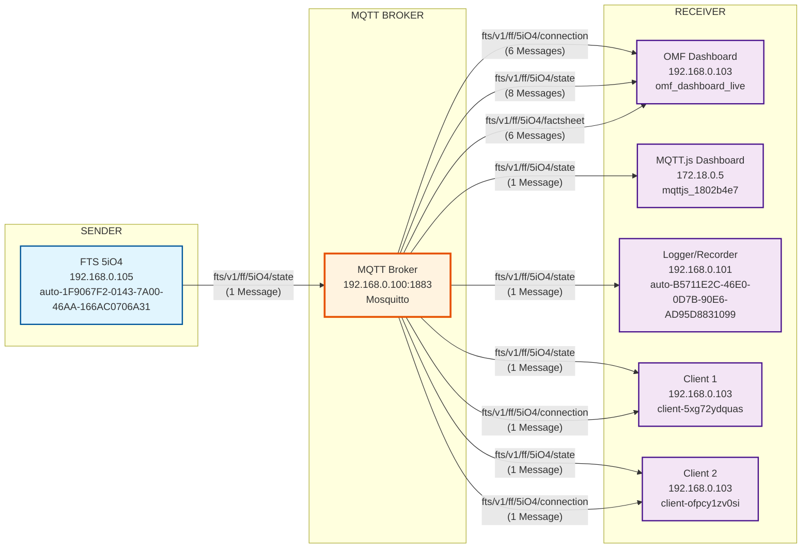

# FTS 5iO4 Topic Analysis (10:05-10:30 Uhr)

## Überblick
Analyse des `fts/v1/ff/5iO4/*` Topics für den Zeitbereich 10:05-10:30 Uhr (Auftrag-Rot Periode).

## Zeitabschnitt
- **Datum**: 17. September 2025
- **Zeitraum**: 10:05 - 10:30 Uhr
- **Log-Datei**: `mosquitto_1005_1030.log` (4.997 Zeilen)
- **FTS 5iO4 Messages**: 20 (keine `instantAction` Messages)

## Message-Statistiken
- **Gesamt FTS 5iO4 Messages**: 20
- **Connection Messages**: 6
- **State Messages**: 8
- **Factsheet Messages**: 6
- **InstantAction Messages**: 0 ❌

## FTS 5iO4 Flow Diagram

## Topic-Varianten

### 1. Connection Topic
- **Topic**: `fts/v1/ff/5iO4/connection`
- **Publisher**: Broker (Status-Updates)
- **Subscriber**: OMF Dashboard, Client 1, Client 2
- **Messages**: 6

### 2. State Topic
- **Topic**: `fts/v1/ff/5iO4/state`
- **Publisher**: FTS 5iO4 (auto-1F9067F2-0143-7A00-46AA-166AC0706A31)
- **Subscriber**: OMF Dashboard, MQTT.js Dashboard, Logger, Client 1, Client 2
- **Messages**: 8

### 3. Factsheet Topic
- **Topic**: `fts/v1/ff/5iO4/factsheet`
- **Publisher**: Broker (Status-Updates)
- **Subscriber**: OMF Dashboard
- **Messages**: 6

### 4. InstantAction Topic
- **Topic**: `fts/v1/ff/5iO4/instantAction`
- **Status**: ❌ **NICHT VERWENDET** in diesem Zeitbereich
- **Messages**: 0

## Message-Flow-Analyse

### Publikationen (Received PUBLISH) - 1 Message
1. **FTS 5iO4** → Broker: `fts/v1/ff/5iO4/state` (1x)

### Weiterleitungen (Sending PUBLISH) - 19 Messages
1. **Broker** → OMF Dashboard: `fts/v1/ff/5iO4/connection` (6x)
2. **Broker** → OMF Dashboard: `fts/v1/ff/5iO4/state` (8x)
3. **Broker** → OMF Dashboard: `fts/v1/ff/5iO4/factsheet` (6x)
4. **Broker** → MQTT.js Dashboard: `fts/v1/ff/5iO4/state` (1x)
5. **Broker** → Logger: `fts/v1/ff/5iO4/state` (1x)
6. **Broker** → Client 1: `fts/v1/ff/5iO4/state` + `connection` (2x)
7. **Broker** → Client 2: `fts/v1/ff/5iO4/state` + `connection` (2x)

## Hardware-Zuordnung
- **FTS 5iO4**: Fischertechnik Transport System (Hardware-ID: 5iO4)
- **IP-Adresse**: 192.168.0.105
- **Client-ID**: auto-1F9067F2-0143-7A00-46AA-166AC0706A31
- **Funktion**: Status-Updates, keine InstantAction-Befehle

## QoS-Level
- **QoS 1**: FTS → Broker (zuverlässige Übertragung)
- **QoS 2**: FTS → Broker (höchste Zuverlässigkeit für State-Updates)

## Wichtige Erkenntnisse

### ✅ **Status-Updates funktionieren**
- FTS 5iO4 sendet regelmäßig Status-Updates
- Connection, State und Factsheet Topics werden verwendet

### ❌ **InstantAction nicht verwendet**
- Keine `fts/v1/ff/5iO4/instantAction` Messages im Zeitbereich
- FTS 5iO4 reagiert nicht auf InstantAction-Befehle
- Möglicherweise deaktiviert oder nicht implementiert

### 📊 **Verteilungsmuster**
- **OMF Dashboard**: Erhält alle FTS-Updates (20/20 Messages)
- **Andere Clients**: Erhalten nur State-Updates
- **Logger**: Erfasst alle FTS-Aktivitäten

## Vergleich mit SVR4H73275
- **SVR4H73275**: 183 InstantAction Messages (aktiv)
- **FTS 5iO4**: 0 InstantAction Messages (inaktiv)
- **Unterschied**: FTS 5iO4 sendet nur Status, keine Befehle

