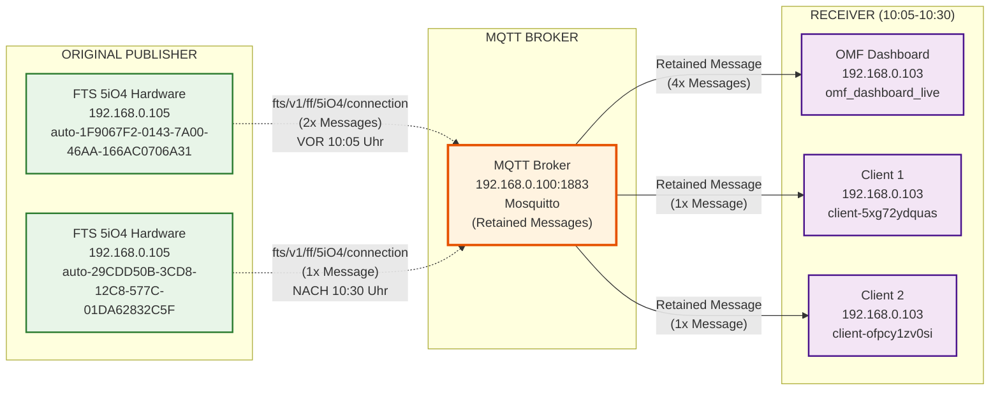

# FTS 5iO4 Connection Topic - Quellenanalyse

## Überblick
Analyse der Quellen für `fts/v1/ff/5iO4/connection` Messages im Zeitbereich 10:05-10:30 Uhr.

## Wichtige Erkenntnis
**Der Broker sendet die Messages, aber sie kommen ursprünglich von FTS 5iO4 Hardware!**

## Ursprüngliche Publisher (Received PUBLISH)

### 1. FTS 5iO4 Hardware (Hauptquelle)
- **Client-ID**: `auto-1F9067F2-0143-7A00-46AA-166AC0706A31`
- **IP-Adresse**: `192.168.0.105:40649`
- **Messages**: 2x `fts/v1/ff/5iO4/connection`
- **Zeitpunkte**: 
  - 1758096367 (vor 10:05 Uhr)
  - 1758098406 (nach 10:30 Uhr)

### 2. FTS 5iO4 Hardware (Zweite Instanz)
- **Client-ID**: `auto-29CDD50B-3CD8-12C8-577C-01DA62832C5F`
- **IP-Adresse**: `192.168.0.105:41763`
- **Messages**: 1x `fts/v1/ff/5iO4/connection`
- **Zeitpunkt**: 1758098417 (nach 10:30 Uhr)

## Broker-Weiterleitungen (Sending PUBLISH)

### Im Zeitbereich 10:05-10:30 Uhr
Der Broker sendet **6 Messages** an verschiedene Clients:

1. **OMF Dashboard** (4x): `omf_dashboard_live`
2. **Client 1** (1x): `client-5xg72ydquas`
3. **Client 2** (1x): `client-ofpcy1zv0si`

## Korrigiertes FTS 5iO4 Connection Flow

## Wichtige Erkenntnisse

### ✅ **FTS 5iO4 Hardware ist der ursprüngliche Publisher**
- **IP-Adresse**: 192.168.0.105 (FTS 5iO4 Hardware)
- **Client-IDs**: Zwei verschiedene Auto-Generated IDs
- **Connection Messages**: Werden von der Hardware selbst erstellt

### 🔄 **Retained Messages Pattern**
- FTS 5iO4 sendet Connection-Status
- Broker speichert als **Retained Message**
- Neue Clients erhalten sofort den letzten Status
- **6 Weiterleitungen** im Zeitbereich 10:05-10:30 Uhr

### 📊 **Message-Flow**
1. **FTS Hardware** → Broker: `fts/v1/ff/5iO4/connection` (retained)
2. **Broker** → OMF Dashboard: Retained Message (4x)
3. **Broker** → Client 1: Retained Message (1x)
4. **Broker** → Client 2: Retained Message (1x)

### 🎯 **Warum keine neuen Messages im Zeitbereich?**
- FTS 5iO4 sendet Connection-Status nur bei Verbindungsänderungen
- Im Zeitbereich 10:05-10:30 Uhr war die Verbindung stabil
- Broker verwendet **Retained Messages** für neue Subscriber

## Vergleich mit State Messages
- **State Messages**: 1x im Zeitbereich (Live-Update)
- **Connection Messages**: 0x im Zeitbereich (nur Retained)
- **Unterschied**: State ändert sich häufiger, Connection nur bei Verbindungsänderungen

