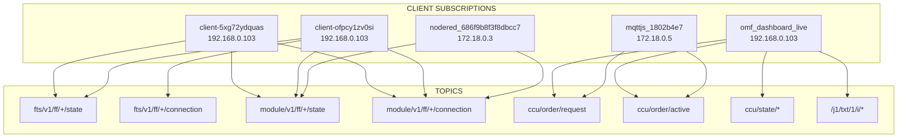
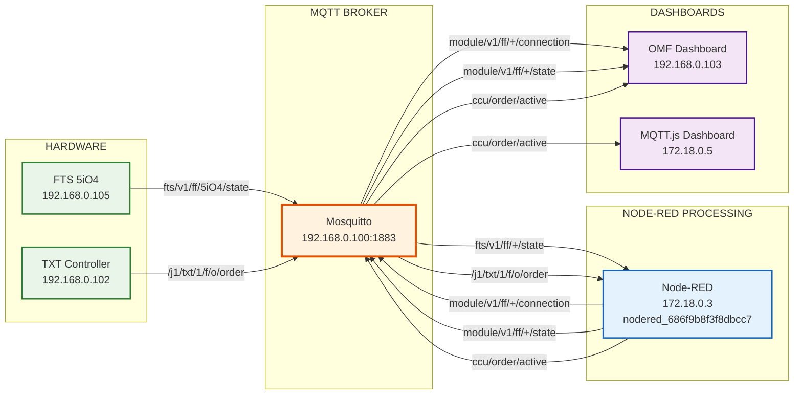

# MQTT Broker Logik und Message Flow Analyse

## 1. **Retained Messages Logik**

### ✅ **Broker speichert Retained Messages**
- **Flag**: `r1` in Message-Headern
- **Beispiel**: `Sending PUBLISH to omf_dashboard_live (d0, q1, r1, m245, 'ccu/state/version-mismatch', ...)`
- **Funktion**: Neue Subscriber erhalten sofort den letzten Status

### 📊 **Retained Message Pattern**
```
FTS Hardware → Broker (retained) → Neue Clients erhalten sofort Status
```

## 2. **Client Subscription Liste bei Anmeldung**

### 🔍 **Analyse der neuen Clients (10:05-10:30 Uhr)**

#### Client 1: `client-5xg72ydquas`
- **IP**: `::ffff:192.168.0.103:60106`
- **Subscriptions**:
  - `fts/v1/ff/+/state` (QoS 1)
  - `module/v1/ff/+/state` (QoS 1)
  - `module/v1/ff/+/connection` (QoS 1)

#### Client 2: `client-ofpcy1zv0si`
- **IP**: `::ffff:192.168.0.103:60109`
- **Subscriptions**:
  - `fts/v1/ff/+/state` (QoS 1)
  - `module/v1/ff/+/state` (QoS 1)
  - `module/v1/ff/+/connection` (QoS 1)
  - `fts/v1/ff/+/connection` (QoS 1)

### 📋 **Vollständige Subscription Liste**



## 3. **Message Publisher Detection**

### ❌ **Problem: Publisher-Info nur beim Senden verfügbar**
- **Logik**: `Received PUBLISH from <client-id>`
- **Erkenntnis**: Publisher-Info wird nur registriert, wenn tatsächlich gesendet wird
- **Keine Vorab-Registrierung**: Clients melden nur Subscriptions an, nicht Publications

### 📊 **Publisher Pattern**
```
Client → Broker: SUBSCRIBE (bei Anmeldung)
Client → Broker: PUBLISH (bei Bedarf)
Broker → Subscriber: Weiterleitung
```

## 4. **Node-RED Message Processing Pattern**

### 🔄 **Message Flow: Sender → MQTT → Node-RED → MQTT → Empfänger**

#### Beispiel aus den Logs:
```
1. FTS Hardware → Broker: fts/v1/ff/5iO4/state
2. Broker → Node-RED: fts/v1/ff/5iO4/state
3. Node-RED verarbeitet: State-Änderung erkannt
4. Node-RED → Broker: module/v1/ff/SVR4H73275/connection
5. Broker → Subscriber: module/v1/ff/SVR4H73275/connection
```

### 📋 **Node-RED Processing Topics**

#### **Empfängt** (Input):
- `fts/v1/ff/+/state`
- `fts/v1/ff/+/connection`
- `ccu/order/request`
- `/j1/txt/1/f/o/order`

#### **Sendet** (Output):
- `module/v1/ff/+/connection`
- `module/v1/ff/+/state`
- `ccu/order/active`
- `ccu/order/response`

### 🔄 **Node-RED Message Flow Diagram**



## 5. **Wichtige Erkenntnisse**

### ✅ **Retained Messages funktionieren**
- Broker speichert letzte Messages mit `r1` Flag
- Neue Subscriber erhalten sofort Status-Updates

### ✅ **Subscription-Liste bei Anmeldung**
- Clients melden Subscriptions bei Anmeldung an
- Broker weiß sofort, wohin Messages weiterleiten

### ❌ **Publisher-Info nur beim Senden**
- Keine Vorab-Registrierung von Publishers
- Publisher-Info nur in `Received PUBLISH` Logs

### 🔄 **Node-RED als Message Processor**
- Empfängt Hardware-Messages
- Verarbeitet und transformiert
- Sendet verarbeitete Messages weiter
- **Pattern**: Hardware → MQTT → Node-RED → MQTT → Dashboard

### 📊 **Message Flow Komplexität**
- **Einfach**: Hardware → MQTT → Dashboard
- **Komplex**: Hardware → MQTT → Node-RED → MQTT → Dashboard
- **Node-RED**: Zentrale Verarbeitungslogik für alle Hardware-Messages

