# MQTT Flow Diagramme

## CCU Order Request Flow

## Kompletter MQTT Flow

```mermaid
graph LR
    subgraph "SENDER"
        TXT["TXT-Controller<br/>192.168.0.102<br/>auto-84E1E526..."]
        CCU["Node-RED (CCU)<br/>172.18.0.3<br/>nodered_686f9b8f3f8dbcc7"]
        OMF["OMF Dashboard<br/>192.168.0.103<br/>omf_dashboard_live"]
        MQTTJS["MQTT.js Dashboard<br/>172.18.0.5<br/>mqttjs_1802b4e7"]
    end
    
    subgraph "MQTT BROKER"
        BROKER["MQTT Broker<br/>192.168.0.100:1883<br/>Mosquitto"]
    end
    
    subgraph "RECEIVER"
        LOGGER["Logger/Recorder<br/>192.168.0.101<br/>auto-B5711E2C..."]
        OMF_RECV["OMF Dashboard<br/>192.168.0.103<br/>omf_dashboard_live"]
        MQTTJS_RECV["MQTT.js Dashboard<br/>172.18.0.5<br/>mqttjs_1802b4e7"]
        CCU_RECV["Node-RED (CCU)<br/>172.18.0.3<br/>nodered_686f9b8f3f8dbcc7"]
    end
    
    %% Sender to Broker
    TXT -->|"/j1/txt/1/i/cam<br/>/j1/txt/1/i/bme680<br/>/j1/txt/1/i/ldr"| BROKER
    CCU -->|"module/v1/ff/*/connection<br/>(Module Status)"| BROKER
    OMF -->|"ccu/order/request<br/>(2x Messages)"| BROKER
    MQTTJS -->|"ccu/order/request<br/>ccu/pairing/state<br/>module/v1/ff/*/instantAction"| BROKER
    
    %% Broker to Receiver
    BROKER -->|"ALLE Topics<br/>(Vollständige Aufzeichnung)"| LOGGER
    BROKER -->|"ccu/order/request<br/>ccu/pairing/state<br/>module/v1/ff/*/connection<br/>/j1/txt/1/i/cam"| OMF_RECV
    BROKER -->|"module/v1/ff/*/connection<br/>ccu/order/request"| MQTTJS_RECV
    BROKER -->|"module/v1/ff/*/instantAction"| CCU_RECV
    
    %% Styling
    classDef sender fill:#e1f5fe,stroke:#01579b,stroke-width:2px
    classDef broker fill:#fff3e0,stroke:#e65100,stroke-width:3px
    classDef receiver fill:#f3e5f5,stroke:#4a148c,stroke-width:2px
    
    class TXT,CCU,OMF,MQTTJS sender
    class BROKER broker
    class LOGGER,OMF_RECV,MQTTJS_RECV,CCU_RECV receiver
```

## Legende

- **Blau (Sender)**: Komponenten, die MQTT-Nachrichten senden
- **Orange (Broker)**: Zentraler MQTT-Broker (Mosquitto)
- **Lila (Receiver)**: Komponenten, die MQTT-Nachrichten empfangen
- **Pfeile**: Zeigen Topic-Namen und Message-Anzahl
- **IP-Adressen**: Netzwerk-Adressen der Komponenten

## Analyse-Zeitraum

- **Datum**: 17. September 2025
- **Zeitraum**: 08:00 - 10:30 Uhr
- **Log-Datei**: `mosquitto_today_8am.log` (8.5 MB, 91.375 Zeilen)

