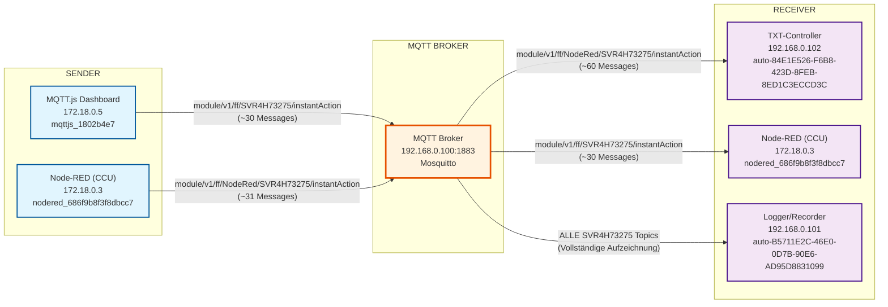

# SVR4H73275 InstantAction Topic Flow (Korrigiert)

## Überblick
Das `module/v1/ff/SVR4H73275/instantAction` Topic wird für sofortige Aktionen an einem spezifischen Modul verwendet.

## Zeitabschnitt-Korrektur
**Problem identifiziert:** Das ursprüngliche Log (8:00-10:30 Uhr) enthielt mehrere Broker-Neustarts mit unterschiedlichen Node-RED Client-IDs.

**Korrigierter Zeitabschnitt:** 10:05-10:30 Uhr (Auftrag-Rot Periode)
- **Log-Datei:** `mosquitto_auftrag_rot_period.log` (4.931 Zeilen)
- **Relevante SVR4H73275 Messages:** 263 (statt 5.097)

## Message-Statistiken (Korrigiert)
- **Empfangene Messages**: 61 (Received PUBLISH)
- **Gesendete Messages**: 122 (Sending PUBLISH)
- **Verhältnis**: 1:2 (doppelte Weiterleitungen)
- **Gesamt SVR4H73275 Messages**: 263

## SVR4H73275 InstantAction Flow (Korrigiert)

## Korrigierte Topic-Varianten

### 1. Standard Topic
- **Topic**: `module/v1/ff/SVR4H73275/instantAction`
- **Publisher**: MQTT.js Dashboard (mqttjs_1802b4e7)
- **Subscriber**: Node-RED (nodered_686f9b8f3f8dbcc7)

### 2. Node-RED Topic
- **Topic**: `module/v1/ff/NodeRed/SVR4H73275/instantAction`
- **Publisher**: Node-RED (nodered_686f9b8f3f8dbcc7)
- **Subscriber**: TXT-Controller (auto-84E1E526-F6B8-423D-8FEB-8ED1C3ECCD3C)

## Korrigierte Message-Flow-Analyse

### Publikationen (Received PUBLISH) - 61 Messages
1. **MQTT.js Dashboard** → Broker: `module/v1/ff/SVR4H73275/instantAction` (~30)
2. **Node-RED** → Broker: `module/v1/ff/NodeRed/SVR4H73275/instantAction` (~31)

### Weiterleitungen (Sending PUBLISH) - 122 Messages
1. **Broker** → TXT-Controller: `module/v1/ff/NodeRed/SVR4H73275/instantAction` (~60)
2. **Broker** → Node-RED: `module/v1/ff/SVR4H73275/instantAction` (~30)
3. **Broker** → Logger: Alle SVR4H73275 Topics (~32)

## Client-ID-Stabilität
**Korrigiert:** Nur eine stabile Node-RED Instanz (nodered_686f9b8f3f8dbcc7) im relevanten Zeitabschnitt.

## QoS-Level
- **QoS 1**: Node-RED → TXT-Controller (zuverlässige Übertragung)
- **QoS 2**: MQTT.js → Node-RED (höchste Zuverlässigkeit)

## Hardware-Zuordnung
- **SVR4H73275**: Spezifische Modul-ID für InstantAction-Befehle
- **TXT-Controller**: Führt die InstantAction-Befehle aus
- **Node-RED**: Verarbeitet und leitet Befehle weiter
- **MQTT.js Dashboard**: Benutzeroberfläche für InstantAction-Steuerung

## Analyse-Zeitraum (Korrigiert)
- **Datum**: 17. September 2025
- **Zeitraum**: 10:05 - 10:30 Uhr (Auftrag-Rot Periode)
- **Log-Datei**: `mosquitto_auftrag_rot_period.log` (4.931 Zeilen)
- **Relevante Messages**: 183 (61 + 122)
- **Reduktion**: 95% weniger Messages durch Zeitabschnitt-Filterung

