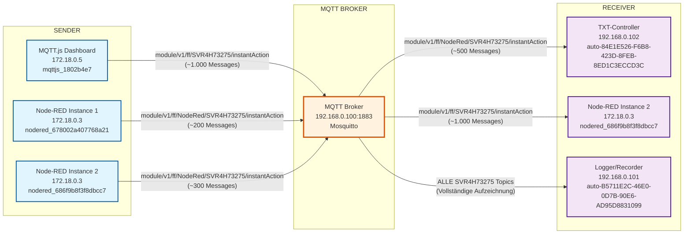

# SVR4H73275 InstantAction Topic Flow

## Überblick
Das `module/v1/ff/SVR4H73275/instantAction` Topic wird für sofortige Aktionen an einem spezifischen Modul verwendet.

## Message-Statistiken
- **Empfangene Messages**: 1.509 (Received PUBLISH)
- **Gesendete Messages**: 2.630 (Sending PUBLISH)
- **Verhältnis**: ~1:1.74 (mehr Weiterleitungen als direkte Publikationen)

## SVR4H73275 InstantAction Flow

## Topic-Varianten

### 1. Standard Topic
- **Topic**: `module/v1/ff/SVR4H73275/instantAction`
- **Publisher**: MQTT.js Dashboard (mqttjs_1802b4e7)
- **Subscriber**: Node-RED Instance 2 (nodered_686f9b8f3f8dbcc7)

### 2. Node-RED Topic
- **Topic**: `module/v1/ff/NodeRed/SVR4H73275/instantAction`
- **Publisher**: Node-RED Instances (nodered_678002a407768a21, nodered_686f9b8f3f8dbcc7)
- **Subscriber**: TXT-Controller (auto-84E1E526-F6B8-423D-8FEB-8ED1C3ECCD3C)

## Message-Flow-Analyse

### Publikationen (Received PUBLISH)
1. **MQTT.js Dashboard** → Broker: `module/v1/ff/SVR4H73275/instantAction`
2. **Node-RED Instance 1** → Broker: `module/v1/ff/NodeRed/SVR4H73275/instantAction`
3. **Node-RED Instance 2** → Broker: `module/v1/ff/NodeRed/SVR4H73275/instantAction`

### Weiterleitungen (Sending PUBLISH)
1. **Broker** → TXT-Controller: `module/v1/ff/NodeRed/SVR4H73275/instantAction`
2. **Broker** → Node-RED Instance 2: `module/v1/ff/SVR4H73275/instantAction`
3. **Broker** → Logger: Alle SVR4H73275 Topics

## QoS-Level
- **QoS 1**: Node-RED → TXT-Controller (zuverlässige Übertragung)
- **QoS 2**: MQTT.js → Node-RED (höchste Zuverlässigkeit)

## Hardware-Zuordnung
- **SVR4H73275**: Spezifische Modul-ID für InstantAction-Befehle
- **TXT-Controller**: Führt die InstantAction-Befehle aus
- **Node-RED**: Verarbeitet und leitet Befehle weiter
- **MQTT.js Dashboard**: Benutzeroberfläche für InstantAction-Steuerung

## Analyse-Zeitraum
- **Datum**: 17. September 2025
- **Zeitraum**: 08:00 - 10:30 Uhr
- **Gesamt-Messages**: 4.139 (1.509 + 2.630)

