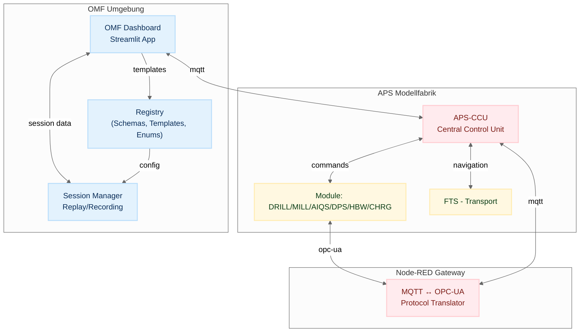

# Architecture Documentation Index

Version: 0.1 (Draft)  
Last updated: 2025-09-14  
Author: OMF Development Team  

---

## 📑 Overview
Dieses Verzeichnis enthält die Architektur-Dokumentation der ORBIS Modellfabrik (OMF).  
Die Dokumente beschreiben den Systemkontext, die Message Flows, das Registry-Modell und die Namenskonventionen.  

---

## 🔗 Dokumente

### Legacy Architecture (archiviert)
- [OMF Dashboard Architecture](../archive/02-architecture_omf_legacy/omf-dashboard-architecture.md) – Legacy Dashboard-Architektur
- [Per-Topic-Buffer Pattern](../archive/02-architecture_omf_legacy/per-topic-buffer-pattern.md) – Legacy MQTT-Pattern
- [Singleton Pattern Compliance](../archive/02-architecture_omf_legacy/singleton-pattern-compliance.md) – Legacy Singleton Pattern
- [System Context](../archive/02-architecture_omf_legacy/system-context.md) – Legacy System-Überblick
- [Message Flow](../archive/02-architecture_omf_legacy/message-flow.md) – Legacy Message-Flows

### Implemented Architecture (omf2)
- [OMF2 Architecture](omf2-architecture.md) – Implementierte Architektur
- [Project Structure](project-structure.md) – Implementierte Projektstruktur
- [Implementation Status](implementation-status.md) – Aktueller Implementierungsstatus
- [Message Processing Pattern](message-processing-pattern.md) – Implementiertes Message-Pattern

### Core Architecture
- [OMF2 Registry System](omf2-registry-system.md) – **KRITISCH** - RegistryManager, OMF-Entitäten, API
- [Naming Conventions](naming-conventions.md) – Topics, Template-Keys, IDs

### APS Physical Architecture
- [APS Physical Architecture](../../06-integrations/APS-Ecosystem/system-overview.md) – Fischertechnik Netzwerk & Hardware
- [APS Data Flow](aps-data-flow.md) – Datenverarbeitung & Storage

### Implementierungs-Details
- [Module State Manager](implementation/module-state-manager.md) – Modul-Status-Management Implementierung
- [CCU Module Manager](implementation/ccu-module-manager.md) – CCU Module-Status-Verarbeitung mit 5-Spalten-Architektur

---

## 📌 Hinweise
- Alle Dokumente sind Work-in-Progress und werden sprintweise erweitert.  
- Änderungen an Registry und Templates sollen **immer auch hier dokumentiert** werden.  
- Ziel: Architektur bleibt konsistent mit Implementierung und CI-Validierungen.

## 📊 Top-Level Architekturdiagramm

