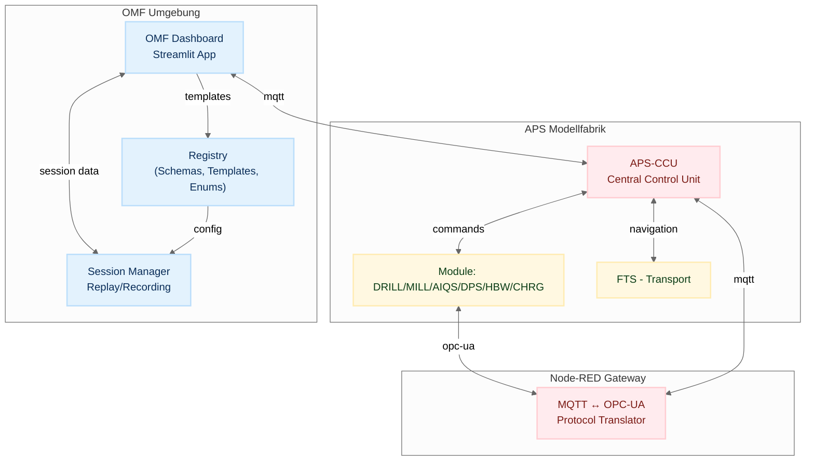

# Architecture Documentation Index

Version: 0.1 (Draft)  
Last updated: 2025-09-14  
Author: OMF Development Team  

---

## 📑 Overview
Dieses Verzeichnis enthält die Architektur-Dokumentation der ORBIS Modellfabrik (OMF).  
Die Dokumente beschreiben den Systemkontext, die Message Flows, das Registry-Modell und die Namenskonventionen.  

---

## 🔗 Dokumente

### Core Architecture
- [System Context](system-context.md) – Überblick über Hauptkomponenten (CCU, Module, Node-RED, OMF)
- [Message Flow](message-flow.md) – End-to-End-Flows (Order → Module, State → Dashboard)
- [Registry Model](registry-model.md) – Registry-Prinzipien & Versionierung
- [Message Template System](message-template-system.md) – Template-Manager, Validierung, Topic-Resolution
- [Naming Conventions](naming-conventions.md) – Topics, Template-Keys, IDs

### APS Physical Architecture
- [APS Physical Architecture](../../06-integrations/APS-Ecosystem/system-overview.md) – Fischertechnik Netzwerk & Hardware
- [APS Data Flow](aps-data-flow.md) – Datenverarbeitung & Storage

### Dashboard Architecture
- [OMF Dashboard Architecture](omf-dashboard-architecture.md) – Dashboard-Architektur, MQTT-Patterns, Komponenten-Struktur

### Architektur-Pattern
- [Singleton Pattern Compliance](singleton-pattern-compliance.md) – MQTT-Singleton Pattern Richtlinien
- [Per-Topic-Buffer Pattern](per-topic-buffer-pattern.md) – Effiziente MQTT-Nachrichtenverarbeitung

### Implementierungs-Details
- [Module State Manager](implementation/module-state-manager.md) – Modul-Status-Management Implementierung

---

## 📌 Hinweise
- Alle Dokumente sind Work-in-Progress und werden sprintweise erweitert.  
- Änderungen an Registry und Templates sollen **immer auch hier dokumentiert** werden.  
- Ziel: Architektur bleibt konsistent mit Implementierung und CI-Validierungen.

## 📊 Top-Level Architekturdiagramm

