# Architecture Documentation Index

Version: 0.2  
Last updated: 2025-11-15  
Author: OMF Development Team  

---

## 📑 Overview

Dieses Verzeichnis enthält die Architektur-Dokumentation der ORBIS Modellfabrik (OMF).  
Die Dokumente beschreiben den Systemkontext, die Message Flows, und die Namenskonventionen.  

---

## 🔗 Dokumente

### OSF Architecture (aktuell)
- [OSF Project Structure](project-structure.md) – Nx Workspace Struktur und OSF Architektur
- [Naming Conventions](naming-conventions.md) – Topics, Template-Keys, IDs
- [DSP Architecture Component Spec](dsp-architecture-component-spec.md) – DSP Architecture Component Specification
- [DSP SVG Inventory](dsp-svg-inventory.md) – Übersicht aller verfügbaren SVG-Assets für die DSP-Architektur

### APS Physical Architecture
- [APS Physical Architecture](../../06-integrations/APS-Ecosystem/system-overview.md) – Fischertechnik Netzwerk & Hardware
- [APS Data Flow](aps-data-flow.md) – Datenverarbeitung & Storage

### Legacy Architecture (archiviert)
- [OMF Dashboard Architecture](../archive/02-architecture_omf_legacy/omf-dashboard-architecture.md) – Legacy Dashboard-Architektur
- [Per-Topic-Buffer Pattern](../archive/02-architecture_omf_legacy/per-topic-buffer-pattern.md) – Legacy MQTT-Pattern
- [Singleton Pattern Compliance](../archive/02-architecture_omf_legacy/singleton-pattern-compliance.md) – Legacy Singleton Pattern
- [System Context](../archive/02-architecture_omf_legacy/system-context.md) – Legacy System-Überblick
- [Message Flow](../archive/02-architecture_omf_legacy/message-flow.md) – Legacy Message-Flows

---

## 📌 Hinweise

- Alle Dokumente sind Work-in-Progress und werden sprintweise erweitert.  
- Änderungen an Architektur sollen **immer auch hier dokumentiert** werden.  
- Ziel: Architektur bleibt konsistent mit Implementierung und CI-Validierungen.

---

## 📊 Top-Level Architekturdiagramm

```mermaid
%%{init: {'theme':'neutral'}}%%
flowchart TD
classDef orbis fill:#e3f2fd,stroke:#bbdefb,stroke-width:2px,color:#0b2e59;
classDef fthardware fill:#fff8e1,stroke:#ffecb3,stroke-width:2px,color:#0b3d16;
classDef ftsoftware fill:#ffebee,stroke:#ffcdd2,stroke-width:2px,color:#7a1a14;
classDef external fill:#f5f5f5,stroke:#e0e0e0,stroke-width:2px,color:#333;

  subgraph APS [APS Modellfabrik]
    CCU[APS-CCU<br/>Central Control Unit]:::ftsoftware
    MOD["Module: DRILL/MILL/AIQS/DPS/HBW/CHRG"]:::fthardware
    FTS["FTS - Transport"]:::fthardware
  end

  subgraph NodeRED [Node-RED Gateway]
    NR["MQTT ↔ OPC-UA<br/>Protocol Translator"]:::ftsoftware
  end

  subgraph OMF [OMF Umgebung]
    DASH["OSF Dashboard<br/>Angular App"]:::orbis
    SM["Session Manager<br/>Replay/Recording"]:::orbis
  end

  CCU <-->|commands| MOD
  CCU <-->|navigation| FTS
  MOD <-->|opc-ua| NR
  CCU <-->|mqtt| NR
  DASH <-->|mqtt| CCU
  DASH <-->|session data| SM
```

