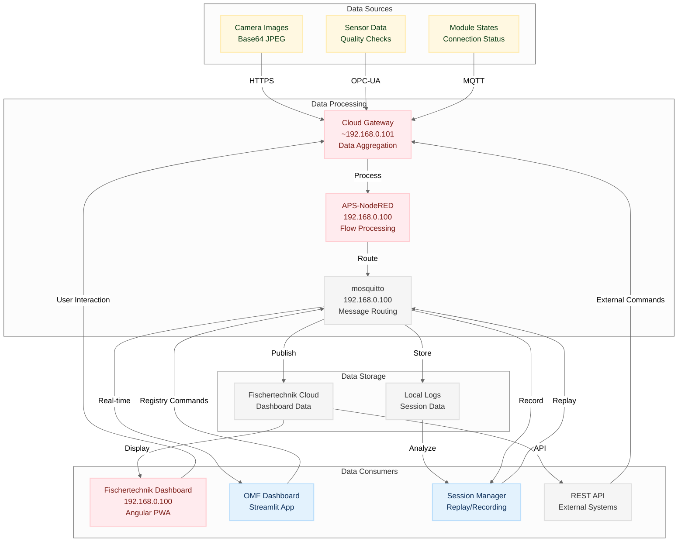
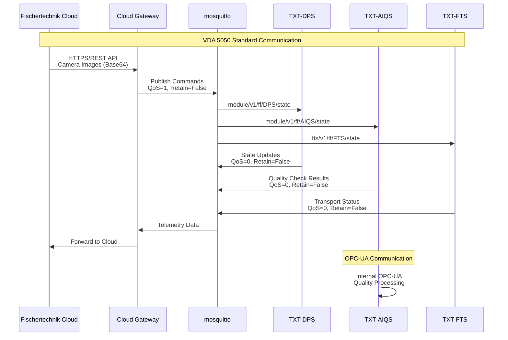
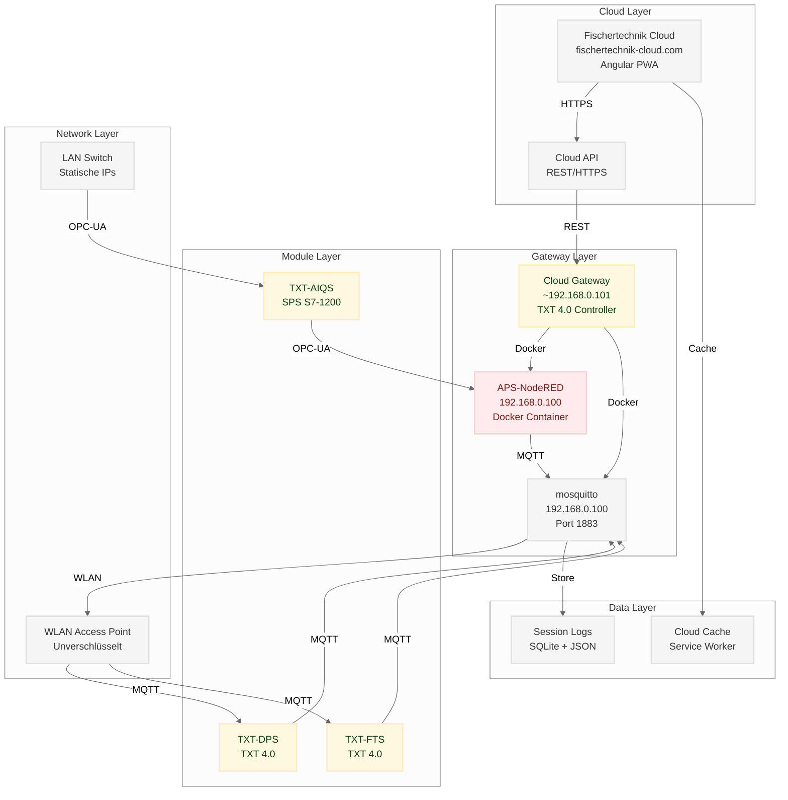
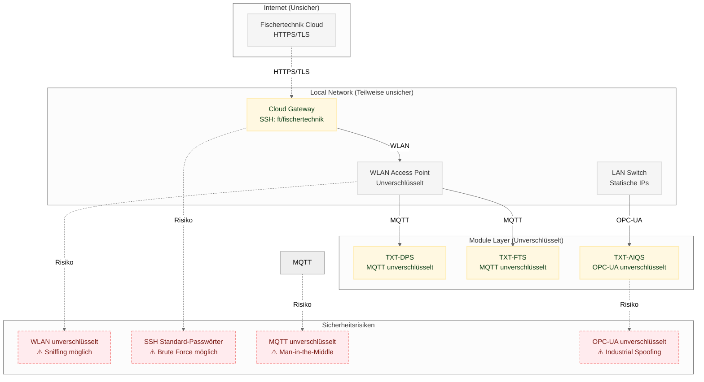

# APS Data Flow Architecture - Chat-A Version

> **Chat-A Bearbeitung:** Formale Bereinigung mit korrekten Phasen-Informationen  
> **Datum:** 2025-09-25  
> **Status:** Neue Version mit OMF-Style-Guide und korrekten Phasen

---

## 📋 Architektur-Phasen (Korrekte Definition)

### **Phase 0: APS "as IS" - Fischertechnik-System verstehen**
- **Status:** ✅ Abgeschlossen
- **Ziel:** Das bestehende Fischertechnik APS-System vollständig verstehen
- **Erreicht:** APS-Ecosystem dokumentiert, Mosquitto-Analyse, APS-NodeRED Flows analysiert

### **Phase 1: OMF-Dashboard mit APS-CCU Frontend-Funktionalität**
- **Status:** 🔄 In Bearbeitung
- **Ziel:** APS-Dashboard Funktionalität im OMF-Dashboard nachbauen
- **Erreicht:** APS Overview Tab, APS Control Tab, APS Steering Tab, APS Orders Tab
- **Aktuell:** Sensor-Daten Integration testen, APS Configuration Tab implementieren

### **Phase 2: OMF-Dashboard mit APS-NodeRED Funktionalität**
- **Status:** ⏳ Geplant
- **Ziel:** APS-NodeRED Gateway-Funktionalität im OMF-Dashboard integrieren
- **Geplant:** MQTT ↔ OPC-UA Gateway, VDA 5050 FTS-Standard, Registry-basierte Konfiguration

### **Phase 3: Erweiterungen (Zukünftige Entwicklung)**
- **Status:** ⏳ Geplant
- **Ziel:** OMF-System um erweiterte Funktionalitäten ausbauen
- **Geplant:** DSP-Anbindung, ORBIS Cloud, SAP/ERP, KI-Use-cases, erweiterte Analytics

---

## 📊 Datenfluss-Diagramm (Phase 1: OMF-Dashboard Integration)



## 🔄 Kommunikations-Protokoll-Diagramm (VDA 5050 Standard)



## 🏗️ System-Komponenten-Diagramm (Phase 1)



## 🔐 Sicherheits-Architektur-Diagramm



## 📈 Datenverarbeitungs-Pipeline

### 1. **Datenaufnahme**
- **Camera Images**: Base64-kodierte JPEG-Daten
- **Sensor Data**: Qualitätsprüfungen, Temperatur, Druck
- **Module States**: Verbindungsstatus, Fehlerzustände

### 2. **Datenverarbeitung**
- **Cloud Gateway**: Aggregation und Routing
- **APS-NodeRED**: Flow-basierte Verarbeitung
- **mosquitto**: Message Queuing und Distribution

### 3. **Datenspeicherung**
- **Fischertechnik Cloud**: Dashboard-Daten, Caching
- **Local Logs**: Session-Daten, Debug-Informationen

### 4. **Datenverbrauch**
- **Dashboard UI**: Echtzeit-Visualisierung
- **REST API**: Externe System-Integration
- **Log Analysis**: Debugging und Optimierung

## 🔄 Message Flow Patterns

### **Command Flow (Outbound)**
```
Cloud → Gateway → MQTT → Module
```

### **Telemetry Flow (Inbound)**
```
Module → MQTT → Gateway → Cloud
```

### **Local Processing Flow**
```
Module → MQTT → Session Manager → Logs
```

---

## 📋 Chat-A Änderungen

### ✅ **Formale Bereinigung:**
- **Phasen-Definition korrigiert** - Phase 0/1/2/3 statt Phase 1/2
- **OMF-Style-Guide angewendet** - Konsistente Farben (Blau=ORBIS, Gelb=FT-Hardware, Rot=FT-Software, Grau=External)
- **Namenskonventionen standardisiert** - APS-NodeRED, TXT-DPS, TXT-AIQS, TXT-FTS, mosquitto
- **Mermaid-Diagramme standardisiert** - classDef-Definitionen, konsistente Farbzuordnung

### ❌ **NICHT geändert (Chat-B Aufgabe):**
- Inhaltliche Architektur-Updates
- Aktuelle Implementierungsdetails
- Technische Korrekturen

---

**"Daten fließen über MQTT, werden in APS-NodeRED verarbeitet und in der Cloud visualisiert."** 🚀
