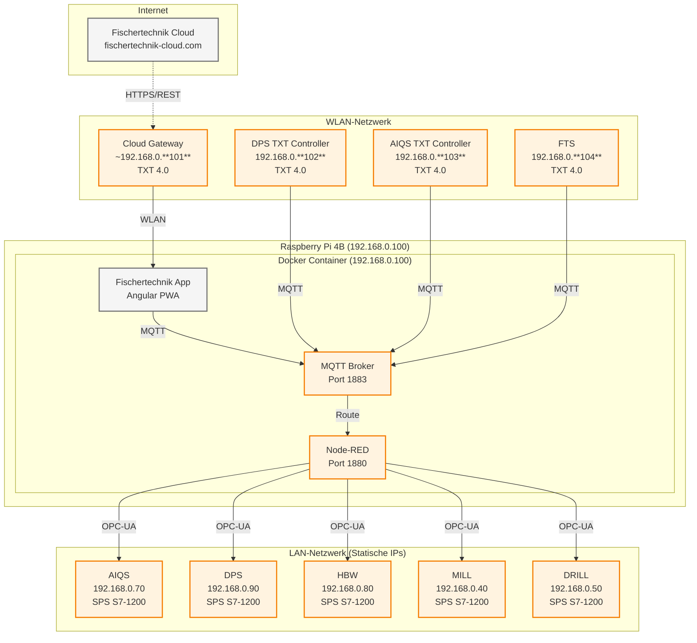
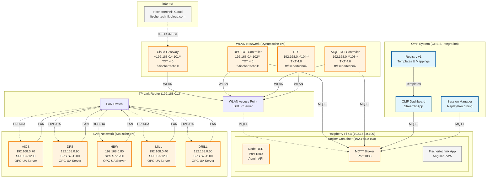

# APS Physical Architecture - Fischertechnik System

## 📋 Architektur-Phasen

### Phase 1: Ausgangssituation (Fischertechnik Standard)
- **Fischertechnik Cloud** → **Cloud Gateway** → **Module**
- **Zentrale Steuerung** über Fischertechnik Dashboard
- **Keine OMF-Integration**



### Phase 2: ORBIS-Integration (Aktuell)
- **OMF Dashboard** ergänzt **Fischertechnik Dashboard**
- **Session Manager** für Replay/Recording
- **Registry-basierte** Steuerung
- **DPS-Modul** bereits vorhanden (nicht hinzugefügt)

#### 🔄 Was wird ersetzt/erweitert:
- **Fischertechnik Dashboard** → **OMF Dashboard** (Streamlit) - **Ersetzt**
- **Manuelle Steuerung** → **Registry-basierte** Steuerung - **Erweitert**
- **Keine Replay-Funktion** → **Session Manager** für Tests - **Hinzugefügt**
- **Cloud-only** → **Lokale + Cloud** Steuerung - **Erweitert**

---

## 🏭 Netzwerk-Architektur (Phase 2: ORBIS-Integration)



## 🔐 Zugangsdaten & Sicherheit

### SSH-Zugang (alle TXT Controller)
- **Username**: `ft`
- **Password**: `fischertechnik`

### Node-RED Admin API
- **URL**: `http://192.168.0.101:1880`
- **Backup-Endpoint**: `/flows` (JSON-Export)

### MQTT-Broker
- **Host**: `192.168.0.101` (Cloud Gateway)
- **Port**: `1883`

## ⚠️ Sicherheitshinweise
- WLAN ist unverschlüsselt
- SSH-Passwörter sind Standard
- MQTT läuft unverschlüsselt
- Keine Firewall-Regeln konfiguriert

## 📡 Kommunikations-Protokolle

### MQTT (Message Queuing Telemetry Transport)
- **Port**: 1883 (unverschlüsselt)
- **QoS**: 0 für Telemetrie, 1 für Befehle
- **Retain**: False (keine persistenten Nachrichten)

### OPC-UA (Open Platform Communications Unified Architecture)
- **Port**: 4840 (Standard)
- **Sicherheit**: Keine Verschlüsselung
- **Verwendung**: Modul-spezifische Steuerung

### HTTPS/REST
- **Port**: 443 (verschlüsselt)
- **Verwendung**: Cloud-Kommunikation, API-Zugriff

## 🏗️ Hardware-Übersicht

### TXT 4.0 Controller
- **Betriebssystem**: Linux
- **SSH**: Port 22
- **Web-Interface**: Port 80
- **Verwendung**: Cloud Gateway, DPS, FTS

### SPS S7-1200 Controller
- **Betriebssystem**: Siemens TIA Portal
- **OPC-UA Server**: Port 4840
- **Verwendung**: AIQS-Module (6x)

### TP-Link TL-WR902AC Router
- **WLAN**: Unverschlüsselt
- **LAN**: Statische IPs für Module
- **DHCP**: Dynamische IPs für TXT Controller

## 🔄 IP-Adress-Management

### Raspberry Pi 4B (Zentral)
```
Raspberry Pi: 192.168.0.100 (statisch)
├── Docker Container: 192.168.0.100
│   ├── Node-RED: Port 1880
│   ├── MQTT Broker: Port 1883
│   └── Fischertechnik App: Angular PWA
└── TP-Link Router: 192.168.0.1 (Gateway)
```

### Statische IPs (LAN)
```
AIQS: 192.168.0.70 (1 Modul)
DPS: 192.168.0.90 (1 Modul)
HBW: 192.168.0.80 (1 Modul)
MILL: 192.168.0.40 (1 Modul)
DRILL: 192.168.0.50 (1 Modul)
```

### Dynamische IPs (WLAN)
```
Cloud Gateway: ~192.168.0.101 (normalerweise, kann sich ändern)
DPS TXT Controller: 192.168.0.102 (normalerweise, wenn kein anderer Client)
AIQS TXT Controller: 192.168.0.103 (normalerweise, wenn kein anderer Client)
FTS: 192.168.0.104 (normalerweise, wenn kein anderer Client)
```

**Hinweis**: 
- **Statische IPs** sind fest zugewiesen und ändern sich nicht
- **Dynamische IPs** können sich durch DHCP und Race Conditions ändern
- **`~`** bedeutet "normalerweise" oder "häufig"
- **TXT Controller** bekommen normalerweise 192.168.0.102-104, wenn kein anderer Client sich anmeldet

---

**"Alle Steuerung läuft über MQTT, Node-RED ist der intelligente Vermittler zur Hardware."**
