# DSP Architecture Inventory

**Zweck:** Dokumentation der DSP-Referenzarchitektur mit allen View-Modi (Architecture, Components, Deployment-Pipeline). Unterstützt die Einbindung in Artikel, Wiki und technische Spezifikationen.

**Aktualisierung:** Manuell bei Änderungen an der DSP-Animation oder nach Layout-Anpassungen. SVGs per Export-Script aktualisieren.

**Vollständige Objekt-Referenz:** [DSP Architecture Objects Reference](../../osf/apps/osf-ui/src/app/components/dsp-animation/configs/DSP_Architecture_Objects_Reference.md)

---

## Grafische Übersicht

Die DSP-Architektur-Diagramme werden zur Laufzeit generiert. Export per `node scripts/export-dsp-architecture-svgs.js`.

Verwendet FMF (Fischertechnik Modellfabrik) als Standard-Kundenkonfiguration. Alle Elemente (inkl. Functional Elements in der DSP Edge Box) werden im letzten Step angezeigt (`step=-1`).

<table>
<tr>
<td style="vertical-align: top; padding: 12px; border: 1px solid #ddd; border-radius: 8px; width: 100%;">
<strong>1. Architecture (Functional View)</strong><br/>
<br/>
<small>Full overview: Business Process Layer, DSP Layer (UX, Edge mit 9 Function Icons, MC), Shopfloor Layer</small>
</td>
</tr>
<tr>
<td style="vertical-align: top; padding: 12px; border: 1px solid #ddd; border-radius: 8px;">
<strong>2. Components (DSP Edge intern)</strong><br/>
<br/>
<small>8 Komponenten im Edge: Router, App Server, Agent, Event Bus, Database, DISC, Log Server, DISI</small>
</td>
</tr>
<tr>
<td style="vertical-align: top; padding: 12px; border: 1px solid #ddd; border-radius: 8px;">
<strong>3. Deployment Pipeline</strong><br/>
<br/>
<small>4 Pipeline-Steps: Integration → Transformation → Consolidation → Provisioning</small>
</td>
</tr>
</table>

**Export:** `node scripts/export-dsp-architecture-svgs.js` – baut osf-ui, startet Server (Port 4211), navigiert zur FMF-Seite mit `?viewMode=functional|component|deployment&step=-1`, exportiert SVGs nach `docs/assets/architecture/`.

**Voraussetzung:** Puppeteer benötigt Chrome. Falls Fehler „Could not find Chrome“:
```bash
npx puppeteer browsers install chrome
```

---

## Übersichtstabelle

| View | Route (FMF) | Steps | Beschreibung |
|------|-------------|-------|--------------|
| **Functional** | `dsp/customer/fmf?viewMode=functional&step=-1` | 20 | Architektur mit Edge Functions, MC Functions, Shopfloor |
| **Component** | `dsp/customer/fmf?viewMode=component&step=-1` | 8 | DSP Edge 3×3 Grid (8 Komponenten) + Full-Overview |
| **Deployment** | `dsp/customer/fmf?viewMode=deployment&step=-1` | 6 | Deployment-Pipeline im Edge + Full-Overview |

---

## 1. Architecture (Functional View)

### Layer-Struktur

- **Business Process Layer** (oben) – ERP, MES, Cloud, Analytics, Data Lake, etc.
- **DSP Layer** (Mitte) – SmartFactory Dashboard (UX), DSP Edge, Management Cockpit
- **Shopfloor Layer** (unten) – Systeme (FTS, MES/SCADA, Lager), Geräte (MILL, DRILL, AIQS, HBW, DPS, CHRG)

### DSP Edge – Functional Elements (in der Edge-Box)

9 Edge Function Icons im Functional View (letzter Step):

| Icon Key | SVG | Beschreibung |
|----------|-----|--------------|
| `edge-interoperability` | edge-interoperability.svg | Interoperabilität zwischen Systemen |
| `edge-connectivity` | edge-connectivity.svg | Netzwerk / Connectivity |
| `edge-event-driven` | edge-event-driven.svg | Event-Driven Processing |
| `edge-choreography` | edge-choreography.svg | Process Choreography |
| `edge-digital-twin` | edge-digital-twin.svg | Digital Twin |
| `edge-best-of-breed` | edge-best-of-breed.svg | Best-of-Breed Integration |
| `edge-analytics` | edge-analytics.svg | Analytics |
| `edge-ai-enablement` | edge-ai-enablement.svg | AI Enablement |
| `edge-autonomous-enterprise` | edge-autonomous-enterprise.svg | Autonomous Enterprise |

### Management Cockpit – MC Function Icons

| Icon Key | SVG | Beschreibung |
|----------|-----|--------------|
| `mc-hierarchical-structure` | mc-hierarchical-structure.svg | Hierarchische Struktur |
| `mc-orchestration` | mc-orchestration.svg | Orchestrierung |
| `mc-governance` | mc-governance.svg | Governance |

---

## 2. Components (Component View)

### DSP Edge – 8 interne Komponenten (3×3 Grid)

| Container ID | Label | Beschreibung |
|--------------|-------|---------------|
| `edge-comp-router` | Router | Routing und Netzwerk |
| `edge-comp-app-server` | App Server | Anwendungslogik |
| `edge-comp-agent` | Agent | Agentenbasierte Steuerung |
| `edge-comp-event-bus` | Event Bus | Ereignisverteilung |
| `edge-comp-database` | Database | Persistenz |
| `edge-comp-disi` | DISI | Data Integration |
| `edge-comp-log-server` | Log Server | Logging |
| `edge-comp-disc` | DISC | Discovery |

---

## 3. Deployment Pipeline (Deployment View)

### Pipeline-Steps im DSP Edge

| Step | ID | Beschreibung |
|------|-----|--------------|
| 1 | Integration | Datenintegration aus Quellsystemen |
| 2 | Transformation | Normalisierung und Kontextanreicherung |
| 3 | Consolidation | Konsolidierung und Korrelation |
| 4 | Provisioning | Auslieferung an Zielsysteme |

---

## Referenzen

- **Objects Reference:** [DSP_Architecture_Objects_Reference.md](../../osf/apps/osf-ui/src/app/components/dsp-animation/configs/DSP_Architecture_Objects_Reference.md) – Container-IDs, Icon-Keys, Connections
- **Component Spec:** [dsp-architecture-component-spec.md](dsp-architecture-component-spec.md) – Spezifikation der Architektur-Komponente
- **SVG Assets:** [dsp-svg-inventory.md](dsp-svg-inventory.md) – Übersicht der SVG-Assets
- **Use-Case Inventory:** [use-case-inventory.md](use-case-inventory.md) – Use-Case-Diagramme

---

*Erstellt: 18.02.2026 | Aktualisiert: 19.02.2026*
