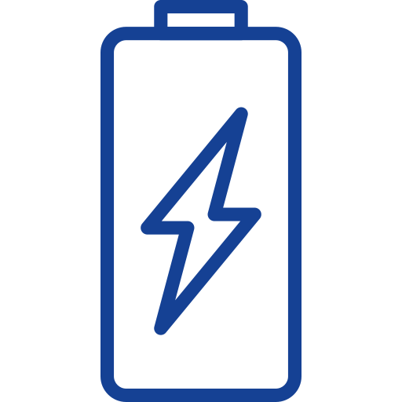

# DSP SVG Inventory

_Generated: 2026-02-13T14:36:34.266Z_

Diese Übersicht zeigt alle SVG-Assets, die **nicht** bereits in der [DSP Architecture Objects Reference](../../osf/apps/osf-ui/src/app/components/dsp-animation/configs/DSP_Architecture_Objects_Reference.md) dokumentiert sind.

**Hinweis:** SVGs die bereits in der DSP Architecture Objects Reference dokumentiert sind, werden hier nicht angezeigt, um Redundanz zu vermeiden.

## Verfügbare SVG-Assets (nach Verzeichnissen gruppiert)

### svg/brand

`aws-logo`

aws-logo.svg

`azure-logo`

azure-logo.svg

`docker-logo`

docker-logo.svg

`dsp-logo`

dsp-logo.svg

`google-cloud-logo`

google-cloud-logo.svg

`grafana-logo`

grafana-logo.svg

`kubernetes-logo`

kubernetes-logo.svg

`orbis-dsp-logo_2`

orbis-dsp-logo_2.svg

`orbis-dsp-logo`

orbis-dsp-logo.svg

`orbis-logo`

orbis-logo.svg

`sap-logo`

sap-logo.svg

### svg/dsp/architecture

`dsp-mc-box`

dsp-mc-box.svg

`dsp-ux-box`

dsp-ux-box.svg

### svg/dsp/extra

`dashboard`

dashboard.svg

`data-lake`

data-lake.svg

`database-cloud`

database-cloud.svg

`database-storage`

database-storage.svg

`database`

database.svg

`digital-twin`

digital-twin.svg

`network`

network.svg

`process`

process.svg

`storage-device`

storage-device.svg

`technology-iot`

technology-iot.svg

`topology`

topology.svg

`workflow`

workflow.svg

### svg/dsp/functions

`edge-buffering`

edge-buffering.svg

`edge-data-storage`

edge-data-storage.svg

`edge-process-logic`

edge-process-logic.svg

### svg/dsp/methodology

`phase1-data-foundation`

phase1-data-foundation.svg

`phase2-data-integration`

phase2-data-integration.svg

`phase3-advanced-analytics`

phase3-advanced-analytics.svg

`phase4-automation-orchestration`

phase4-automation-orchestration.svg

`phase5-autonomous-enterprise`

phase5-autonomous-enterprise.svg

### svg/dsp/use-cases

`use-case-data-aggregation`

use-case-data-aggregation.svg

`use-case-predictive-maintenance`

use-case-predictive-maintenance.svg

`use-case-process-optimization`

use-case-process-optimization.svg

`use-case-track-trace`

use-case-track-trace.svg

### svg/shopfloor/intersections

`intersection-1`

intersection-1.svg

`intersection-2`

intersection-2.svg

`intersection-3`

intersection-3.svg

`intersection-4`

intersection-4.svg

### svg/shopfloor/shared

`agv-vehicle`

agv-vehicle.svg

`alarm`

alarm.svg

`battery`

battery.svg

`bell-alarm`

bell-alarm.svg

`charging-active`

charging-active.svg

`customer`

customer.svg

`dock-event`

dock-event.svg

`driving-status`

driving-status.svg

`drop-event`

drop-event.svg

`location-marker`

location-marker.svg

`order-tracking`

order-tracking.svg

`pass-event`

pass-event.svg

`paused-status`

paused-status.svg

`pick-event`

pick-event.svg

`pressure-sensor`

pressure-sensor.svg

`process-event`

process-event.svg

`question`

question.svg

`stopped-status`

stopped-status.svg

`temperature-sensor`

temperature-sensor.svg

`tilt-sensor`

tilt-sensor.svg

`tuning-fork`

tuning-fork.svg

`turn-event`

turn-event.svg

`turn-left-event`

turn-left-event.svg

`turn-right-event`

turn-right-event.svg

`vibration-sensor`

vibration-sensor.svg

### svg/shopfloor/stations

`mixer`

mixer.svg

`opc-ua-server`

opc-ua-server.svg

`txt-controller`

txt-controller.svg

### svg/shopfloor/systems

`assembly-line-system`

assembly-line-system.svg

`bp-system`

bp-system.svg

`mass-production-system`

mass-production-system.svg

### svg/shopfloor/workpieces

`wp-blue-3dim`

wp-blue-3dim.svg

`wp-blue-instock-processed`

wp-blue-instock-processed.svg

`wp-blue-instock-reserved`

wp-blue-instock-reserved.svg

`wp-blue-instock-unprocessed`

wp-blue-instock-unprocessed.svg

`wp-blue-product`

wp-blue-product.svg

`wp-red-3dim`

wp-red-3dim.svg

`wp-red-instock-processed`

wp-red-instock-processed.svg

`wp-red-instock-reserved`

wp-red-instock-reserved.svg

`wp-red-instock-unprocessed`

wp-red-instock-unprocessed.svg

`wp-red-product`

wp-red-product.svg

`wp-slot-empty`

wp-slot-empty.svg

`wp-white-3dim`

wp-white-3dim.svg

`wp-white-instock-processed`

wp-white-instock-processed.svg

`wp-white-instock-reserved`

wp-white-instock-reserved.svg

`wp-white-instock-unprocessed`

wp-white-instock-unprocessed.svg

`wp-white-product`

wp-white-product.svg

### svg/ui

`heading-camera`

heading-camera.svg

`heading-ccu`

heading-ccu.svg

`heading-customer-orders`

heading-customer-orders.svg

`heading-factory-configuration`

heading-factory-configuration.svg

`heading-info`

heading-info.svg

`heading-inventory`

heading-inventory.svg

`heading-message-monitor`

heading-message-monitor.svg

`heading-modules-1`

heading-modules-1.svg

`heading-modules`

heading-modules.svg

`heading-production`

heading-production.svg

`heading-purchase-orders`

heading-purchase-orders.svg

`heading-route`

heading-route.svg

`heading-sensors`

heading-sensors.svg

`heading-shopfloor-layout`

heading-shopfloor-layout.svg

`heading-storage`

heading-storage.svg

`heading-track-trace`

heading-track-trace.svg

`order-production`

order-production.svg

`order-storage`

order-storage.svg

`process-flow`

process-flow.svg

### svg/use-cases

`uc-06-event-to-process-map-DE`

uc-06-event-to-process-map-DE.svg

`uc-06-event-to-process-map-EN`

uc-06-event-to-process-map-EN.svg

