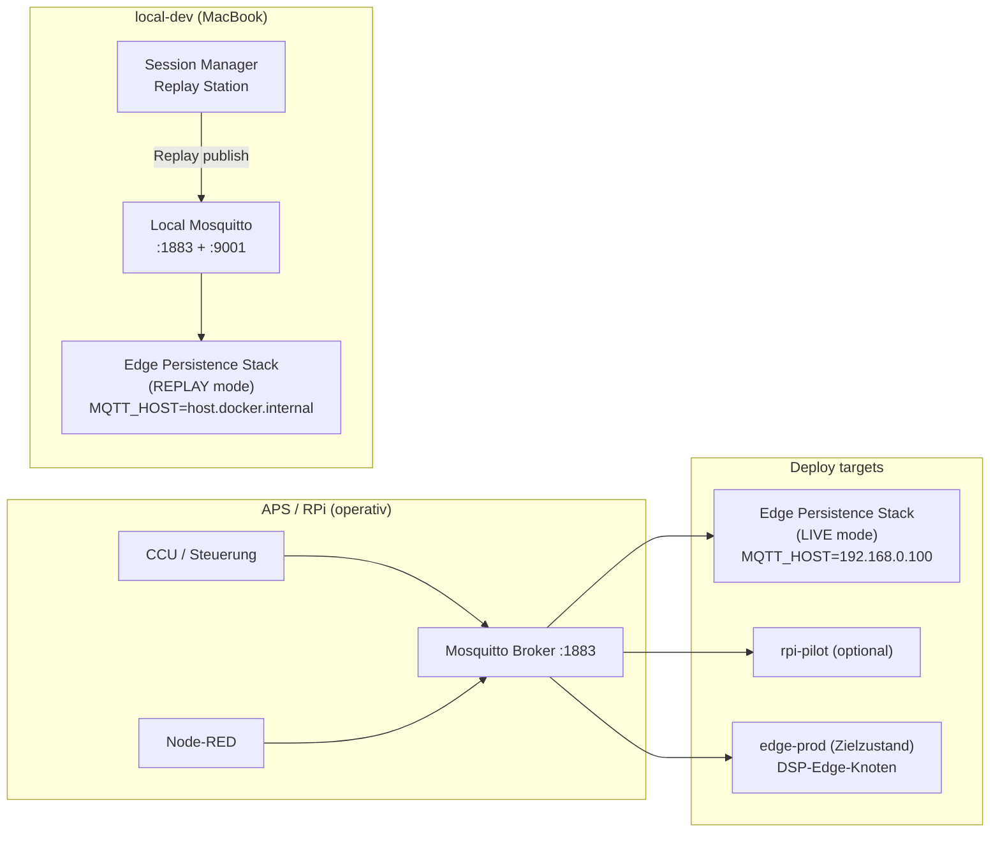
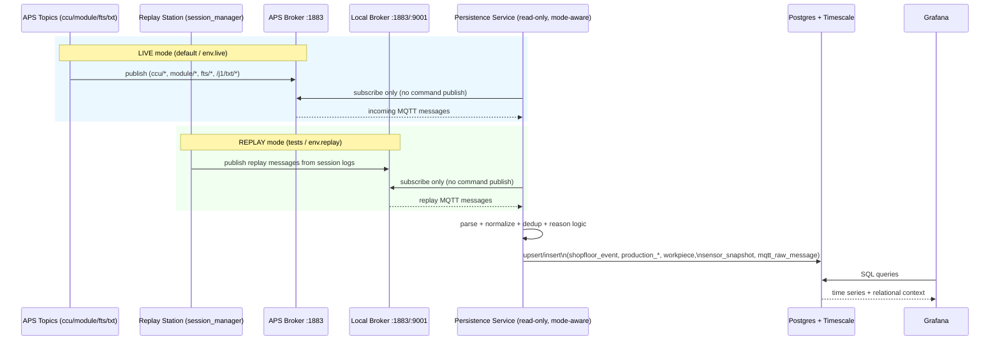
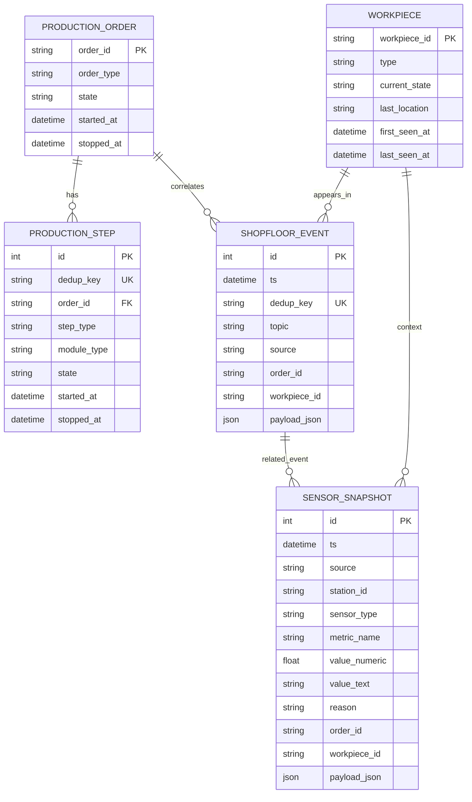

# Edge Persistence Stack - Architekturueberblick (Mermaid)

Diese Seite gibt einen kompakten Ueberblick ueber den neuen OSF Edge Persistence Stack aus [DR-28](../03-decision-records/28-edge-persistence-stack-and-metrics-model.md).

---

## 1) Deployment-Topologie (Modi + Zielplattformen)

Hinweis:
- Default-Profil ist **LIVE** (`env.live`): Persistence-Service liest vom APS-Broker.
- Test-Profil ist **REPLAY** (`env.replay`): Replay-Station publisht auf lokalen Broker; Persistence-Service liest lokal.
- Zielzustand bleibt **edge-prod**.

---

## 2) Datenfluss (Live und Replay)

Kernprinzipien:
- Persistence Service ist **read-only** auf MQTT.
- Moduswahl erfolgt ueber Profil (`env.live` vs `env.replay`) und damit ueber `MQTT_HOST`.
- Kamera-Topic (`/j1/txt/1/i/cam`) wird standardmaessig nicht in Kernpersistenz uebernommen.
- Sensorik nutzt ein generisches Metrikmodell (`sensor_snapshot`).

---

## 3) Logisches Datenmodell (vereinfacht)

---

## 4) Topic-Familien im Stack

- Process/Shopfloor:
  - `ccu/order/active`, `ccu/order/completed`
  - `ccu/state/*`, `ccu/pairing/state`
  - `module/v1/ff/+/state|connection`
  - `fts/v1/ff/+/state|connection`
- Sensorik:
  - `/j1/txt/1/i/bme680`, `/j1/txt/1/i/ldr`
  - `osf/arduino/<sensorType>/<deviceId>/<action>` (DR-18 kompatibel)
- Ausschluss (default):
  - `/j1/txt/1/i/cam`
