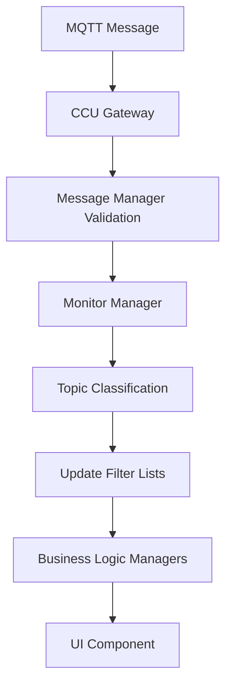
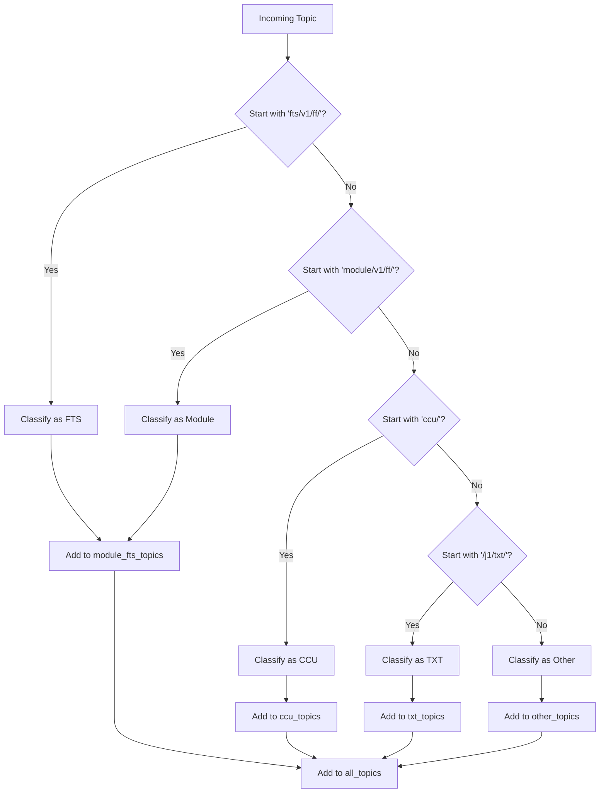

# Monitor Manager - Architecture Implementation

## Overview

The **Monitor Manager** is a business logic component responsible for classifying and managing MQTT topics for the CCU Message Monitor. It provides topic classification, filter list management, and serves as the central hub for message monitoring functionality.

## Architecture Position

```
MQTT Client → CCU Gateway → Message Manager (Validation) → Monitor Manager (Business Logic) → UI Component
```

The Monitor Manager receives validated messages from the CCU Gateway and processes them for topic classification and filter management.

## Key Responsibilities

### 1. Topic Classification
- **FTS Topics:** `fts/v1/ff/...`
- **Module Topics:** `module/v1/ff/...`
- **CCU Topics:** `ccu/...`
- **TXT Topics:** `/j1/txt/...`
- **Other Topics:** All other patterns

### 2. Filter List Management
- Maintains categorized topic lists
- Provides filter options for UI components
- Supports dynamic topic discovery

### 3. Message Processing
- Processes incoming messages from CCU Gateway
- Updates topic lists automatically
- Maintains topic statistics

## Implementation Details

### Core Components

#### MonitorManager Class
```python
class MonitorManager:
    def __init__(self, registry_manager: Optional[RegistryManager] = None)
    def classify_topic(self, topic: str) -> str
    def process_message(self, topic: str, message: Any, meta: Optional[Dict] = None)
    def get_filter_lists(self) -> Dict[str, List[str]]
    def get_topic_count(self, topic_type: str = "all") -> int
    def clear_topics(self)
```

#### Singleton Pattern
```python
def get_monitor_manager(registry_manager: Optional[RegistryManager] = None) -> MonitorManager
```

### Integration Points

#### CCU Gateway Integration
- **Position 0:** Monitor Manager receives ALL messages first
- **Routing Logic:** Messages are routed to Monitor Manager before business logic managers
- **Message Flow:** `_route_ccu_message()` calls `monitor_manager.process_message()`

#### Registry Manager Integration
- **Topic Classification:** Uses Registry Manager for module definitions
- **Filter Lists:** Dynamically builds filter options based on registry data

#### UI Component Integration
- **Filter Lists:** Provides categorized topic lists for filter UI
- **Topic Counts:** Supplies topic counts for UI statistics
- **Real-time Updates:** Automatically updates as new topics are discovered

## Data Flow

### Message Processing Flow


### Topic Classification Logic


## Filter Management

### Filter Categories
- **All Topics:** Complete list of all discovered topics
- **Module/FTS Topics:** Combined list of module and FTS topics
- **CCU Topics:** CCU-related topics
- **TXT Topics:** TXT sensor topics
- **Other Topics:** Miscellaneous topics

### Filter List Structure
```python
{
    "all_topics": ["topic1", "topic2", ...],
    "module_fts_topics": ["module/topic1", "fts/topic1", ...],
    "ccu_topics": ["ccu/topic1", ...],
    "txt_topics": ["/j1/txt/topic1", ...],
    "other_topics": ["other/topic1", ...]
}
```

## Usage Examples

### Basic Usage
```python
from omf2.ccu.monitor_manager import get_monitor_manager

# Get Monitor Manager instance
monitor_manager = get_monitor_manager()

# Process a message
monitor_manager.process_message("module/v1/ff/SVR3QA0022/state", {"state": "active"})

# Get filter lists
filter_lists = monitor_manager.get_filter_lists()
module_fts_topics = filter_lists["module_fts_topics"]
```

### Integration with CCU Gateway
```python
# In CCU Gateway _route_ccu_message method
def _route_ccu_message(self, topic: str, message: Any, meta: Optional[Dict] = None) -> bool:
    # Position 0: Monitor Manager processes ALL messages first
    self.monitor_manager.process_message(topic, message, meta)
    
    # Then route to business logic managers
    # ... rest of routing logic
```

## Configuration

### Registry Integration
- **Module Definitions:** Loaded from `omf2/registry/modules/`
- **Topic Schemas:** Used for message validation
- **Dynamic Discovery:** Topics are discovered automatically during runtime

### Filter Configuration
- **Topic Scope:** "All Topics" vs "Modules & FTS"
- **Filter Persistence:** Filter settings maintained in session state
- **Real-time Updates:** Filter lists update as new topics are discovered

## Performance Considerations

### Topic List Management
- **Sorted Lists:** All topic lists are maintained in sorted order
- **Duplicate Prevention:** Topics are only added once to each list
- **Memory Efficiency:** Lists are cleared when needed

### Message Processing
- **Error Handling:** Robust error handling for malformed messages
- **Logging:** Comprehensive debug logging for troubleshooting
- **Performance:** Efficient topic classification using string operations

## Testing

### Unit Tests
- **Topic Classification:** Tests for all topic types
- **Message Processing:** Tests for message handling
- **Filter Management:** Tests for filter list operations
- **Error Handling:** Tests for edge cases

### Integration Tests
- **CCU Gateway Integration:** End-to-end message flow testing
- **Registry Integration:** Tests with real registry data
- **UI Integration:** Tests for filter UI functionality

## Maintenance

### Adding New Topic Types
1. Update `classify_topic()` method
2. Add new topic list to `get_filter_lists()`
3. Update UI components to handle new topic type
4. Add corresponding unit tests

### Performance Monitoring
- **Topic Count Monitoring:** Track growth of topic lists
- **Message Processing Time:** Monitor processing performance
- **Memory Usage:** Monitor memory consumption of topic lists

## Related Components

- **CCU Gateway:** Message routing and validation
- **Message Manager:** Message validation and schema checking
- **Registry Manager:** Module and topic definitions
- **UI Components:** CCU Message Monitor interface
- **UISymbols:** Icon and symbol management for UI display

## Future Enhancements

### Planned Features
- **Topic Statistics:** Detailed statistics per topic type
- **Message History:** Track message frequency and patterns
- **Advanced Filtering:** More sophisticated filter options
- **Performance Metrics:** Detailed performance monitoring

### Potential Improvements
- **Caching:** Implement caching for frequently accessed data
- **Persistence:** Save topic lists to disk for faster startup
- **Analytics:** Advanced analytics for message patterns
- **API Integration:** REST API for external access to monitoring data
