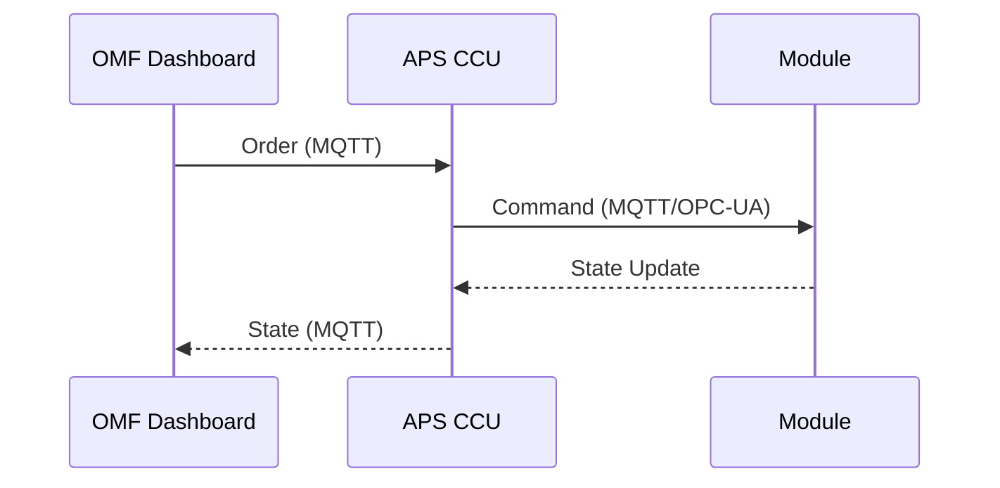
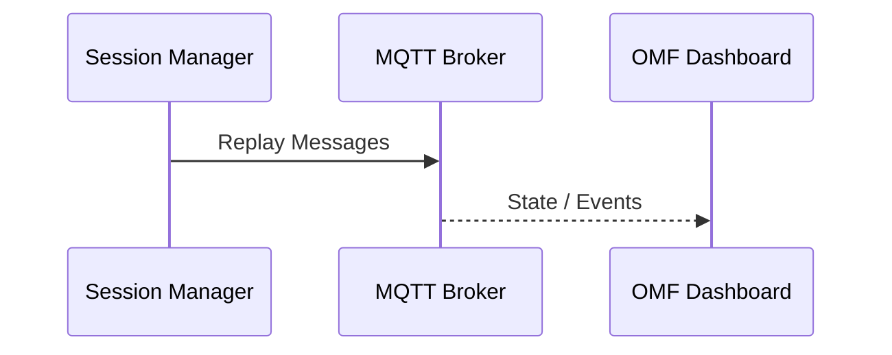

```mermaid
sequenceDiagram
    participant FTC as Fischertechnik Cloud<br/>fischertechnik-cloud.com
    participant FT_DASH as FT Dashboard<br/>192.168.0.100
    participant MQTT as MQTT Broker<br/>192.168.0.100
    participant NR as Node-RED<br/>192.168.0.100
    participant AIQS as AIQS Module<br/>192.168.0.70
    participant HBW as HBW Module<br/>192.168.0.80
    participant MILL as MILL Module<br/>192.168.0.40
    participant DRILL as DRILL Module<br/>192.168.0.50
    participant FTS as FTS Module<br/>192.168.0.**104**
    
    Note over FTC,FTS: Phase 1: Fischertechnik Standard<br/>🔸 Hellgrau: Fischertechnik-Komponenten<br/>🔸 Gelb: Module (unverändert)
    
    FTC->>FT_DASH: HTTPS/REST API<br/>Camera Images (Base64)
    FT_DASH->>MQTT: Publish Commands<br/>QoS=1, Retain=False
    
    MQTT->>NR: Route Commands
    NR->>AIQS: OPC-UA Commands<br/>Quality Processing
    NR->>HBW: OPC-UA Commands<br/>Warehouse Management
    NR->>MILL: OPC-UA Commands<br/>Milling Operations
    NR->>DRILL: OPC-UA Commands<br/>Drilling Operations
    
    AIQS->>NR: OPC-UA State Updates
    HBW->>NR: OPC-UA State Updates
    MILL->>NR: OPC-UA State Updates
    DRILL->>NR: OPC-UA State Updates
    
    NR->>MQTT: Convert to MQTT<br/>State Updates
    MQTT->>FT_DASH: Telemetry Data
    FT_DASH->>FTC: Forward to Cloud
    
    Note over FTS: VDA5050 Standard Communication
    FTS->>MQTT: Transport Status<br/>QoS=0, Retain=False
    MQTT->>FT_DASH: FTS Telemetry
    FT_DASH->>FTC: FTS Data to Cloud
```

```mermaid
sequenceDiagram
    participant FTC as Fischertechnik Cloud<br/>fischertechnik-cloud.com
    participant FT_DASH as FT Dashboard<br/>192.168.0.100
    participant OMF_DASH as OMF Dashboard<br/>Streamlit App
    participant SESSION as Session Manager<br/>Replay/Recording
    participant MQTT as MQTT Broker<br/>192.168.0.100
    participant NR as Node-RED<br/>192.168.0.100
    participant AIQS as AIQS Module<br/>192.168.0.70
    participant DPS as DPS Module<br/>192.168.0.90
    participant HBW as HBW Module<br/>192.168.0.80
    participant MILL as MILL Module<br/>192.168.0.40
    participant DRILL as DRILL Module<br/>192.168.0.50
    participant FTS as FTS Module<br/>192.168.0.**104**
    
    Note over FTC,FTS: Phase 2: ORBIS-Integration<br/>🔸 Hellgrau: Fischertechnik-Komponenten<br/>🔸 Hellblau: ORBIS-Komponenten (OMF, Session)<br/>🔸 Gelb: Module (unverändert)
    
    FTC->>FT_DASH: HTTPS/REST API<br/>Camera Images (Base64)
    FT_DASH->>MQTT: Publish Commands<br/>QoS=1, Retain=False
    
    OMF_DASH->>MQTT: Registry-based Commands<br/>QoS=1, Retain=False
    SESSION->>MQTT: Replay Messages<br/>QoS=1, Retain=False
    
    MQTT->>NR: Route Commands
    NR->>AIQS: OPC-UA Commands<br/>Quality Processing
    NR->>DPS: OPC-UA Commands<br/>Distribution
    NR->>HBW: OPC-UA Commands<br/>Warehouse Management
    NR->>MILL: OPC-UA Commands<br/>Milling Operations
    NR->>DRILL: OPC-UA Commands<br/>Drilling Operations
    
    AIQS->>NR: OPC-UA State Updates
    DPS->>NR: OPC-UA State Updates
    HBW->>NR: OPC-UA State Updates
    MILL->>NR: OPC-UA State Updates
    DRILL->>NR: OPC-UA State Updates
    
    NR->>MQTT: Convert to MQTT<br/>State Updates
    MQTT->>FT_DASH: Telemetry Data
    MQTT->>OMF_DASH: State Updates
    MQTT->>SESSION: Record Messages
    FT_DASH->>FTC: Forward to Cloud
    
    Note over FTS: VDA5050 Standard Communication
    FTS->>MQTT: Transport Status<br/>QoS=0, Retain=False
    MQTT->>FT_DASH: FTS Telemetry
    MQTT->>OMF_DASH: FTS State Updates
    FT_DASH->>FTC: FTS Data to Cloud
```

```mermaid
sequenceDiagram
    participant FTC as Fischertechnik Cloud<br/>fischertechnik-cloud.com
    participant FT_DASH as FT Dashboard<br/>192.168.0.100
    participant MQTT as MQTT Broker<br/>192.168.0.100
    participant NR as Node-RED<br/>192.168.0.100
    participant AIQS as AIQS Module<br/>192.168.0.70
    participant HBW as HBW Module<br/>192.168.0.80
    participant MILL as MILL Module<br/>192.168.0.40
    participant DRILL as DRILL Module<br/>192.168.0.50
    participant FTS as FTS Module<br/>192.168.0.**104**
    
    Note over FTC,FTS: Phase 1: Fischertechnik Standard<br/>🔸 Hellgrau: Fischertechnik-Komponenten<br/>🔸 Gelb: Module (unverändert)
    
    FTC->>FT_DASH: Order Request<br/>{"orderType": "PRODUCTION", "orderId": "123"}
    FT_DASH->>MQTT: Publish Order<br/>ccu/order/request
    
    MQTT->>NR: Route Order
    NR->>HBW: OPC-UA Command<br/>Pick Workpiece
    HBW->>NR: OPC-UA State<br/>Workpiece Picked
    NR->>MQTT: Convert to MQTT<br/>HBW State Update
    
    NR->>FTS: OPC-UA Command<br/>Transport to MILL
    FTS->>MQTT: MQTT Status<br/>Transport Started
    MQTT->>NR: Forward FTS Status
    NR->>MILL: OPC-UA Command<br/>Process Workpiece
    MILL->>NR: OPC-UA State<br/>Processing Complete
    NR->>MQTT: Convert to MQTT<br/>MILL State Update
    
    NR->>FTS: OPC-UA Command<br/>Transport to AIQS
    FTS->>MQTT: MQTT Status<br/>Transport Complete
    MQTT->>NR: Forward FTS Status
    NR->>AIQS: OPC-UA Command<br/>Quality Check
    AIQS->>NR: OPC-UA State<br/>Quality Check Complete
    NR->>MQTT: Convert to MQTT<br/>AIQS State Update
    
    MQTT->>FT_DASH: All State Updates
    FT_DASH->>FTC: Order Complete<br/>{"status": "COMPLETED"}
```

```mermaid
sequenceDiagram
    participant FTC as Fischertechnik Cloud<br/>fischertechnik-cloud.com
    participant FT_DASH as FT Dashboard<br/>192.168.0.100
    participant OMF_DASH as OMF Dashboard<br/>Streamlit App
    participant SESSION as Session Manager<br/>Replay/Recording
    participant MQTT as MQTT Broker<br/>192.168.0.100
    participant NR as Node-RED<br/>192.168.0.100
    participant AIQS as AIQS Module<br/>192.168.0.70
    participant DPS as DPS Module<br/>192.168.0.90
    participant HBW as HBW Module<br/>192.168.0.80
    participant MILL as MILL Module<br/>192.168.0.40
    participant DRILL as DRILL Module<br/>192.168.0.50
    participant FTS as FTS Module<br/>192.168.0.**104**
    
    Note over FTC,FTS: Phase 2: ORBIS-Integration<br/>🔸 Hellgrau: Fischertechnik-Komponenten<br/>🔸 Hellblau: ORBIS-Komponenten (OMF, Session)<br/>🔸 Gelb: Module (unverändert)
    
    FTC->>FT_DASH: Order Request<br/>{"orderType": "PRODUCTION", "orderId": "123"}
    FT_DASH->>MQTT: Publish Order<br/>ccu/order/request
    
    OMF_DASH->>MQTT: Registry-based Order<br/>{"orderType": "PRODUCTION", "orderId": "456"}
    SESSION->>MQTT: Record Order Messages
    
    MQTT->>NR: Route Order
    NR->>HBW: OPC-UA Command<br/>Pick Workpiece
    HBW->>NR: OPC-UA State<br/>Workpiece Picked
    NR->>MQTT: Convert to MQTT<br/>HBW State Update
    
    NR->>FTS: OPC-UA Command<br/>Transport to MILL
    FTS->>MQTT: MQTT Status<br/>Transport Started
    MQTT->>NR: Forward FTS Status
    MQTT->>OMF_DASH: FTS State Update
    MQTT->>SESSION: Record FTS Status
    NR->>MILL: OPC-UA Command<br/>Process Workpiece
    MILL->>NR: OPC-UA State<br/>Processing Complete
    NR->>MQTT: Convert to MQTT<br/>MILL State Update
    
    NR->>FTS: OPC-UA Command<br/>Transport to AIQS
    FTS->>MQTT: MQTT Status<br/>Transport Complete
    MQTT->>NR: Forward FTS Status
    MQTT->>OMF_DASH: FTS State Update
    MQTT->>SESSION: Record FTS Status
    NR->>AIQS: OPC-UA Command<br/>Quality Check
    AIQS->>NR: OPC-UA State<br/>Quality Check Complete
    NR->>MQTT: Convert to MQTT<br/>AIQS State Update
    
    NR->>DPS: OPC-UA Command<br/>Distribute Workpiece
    DPS->>NR: OPC-UA State<br/>Distribution Complete
    NR->>MQTT: Convert to MQTT<br/>DPS State Update
    
    MQTT->>FT_DASH: All State Updates
    MQTT->>OMF_DASH: All State Updates
    MQTT->>SESSION: Record All Updates
    FT_DASH->>FTC: Order Complete<br/>{"status": "COMPLETED"}
```

# Message Flow

Version: 0.1 (Draft)  
Last updated: 2025-09-14  
Author: OMF Development Team  

---

## 📑 Overview
Dieses Dokument beschreibt die End-to-End Message Flows im OMF System.  

---

## 🔄 Order Flow

---

## 📊 Replay Flow

---

## 📡 APS Communication Flow

### 🎨 Farbkodierung
- **🔸 Hellgrau**: Fischertechnik-Komponenten (werden ersetzt)
- **🔸 Hellblau**: ORBIS-Komponenten (OMF Dashboard, Session Manager)
- **🔸 Gelb**: Module (bleiben unverändert)

### Phase 1: Ausgangssituation (Fischertechnik Standard)

### Phase 2: ORBIS-Integration (Aktuell)

---

## 🔄 APS Order Processing Flow

### Phase 1: Ausgangssituation (Fischertechnik Standard)

### Phase 2: ORBIS-Integration (Aktuell)

