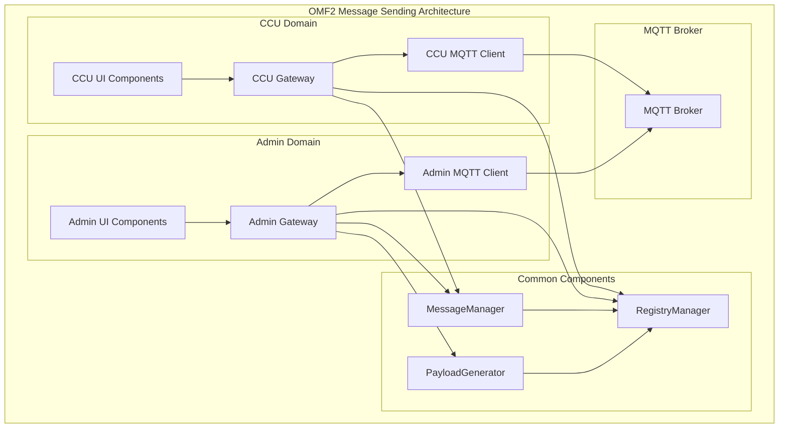
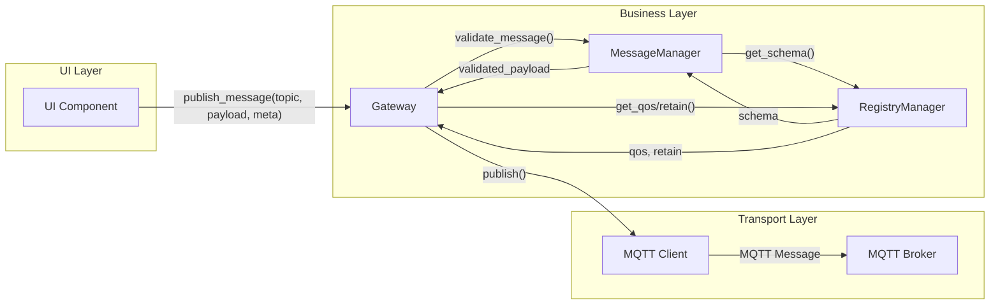
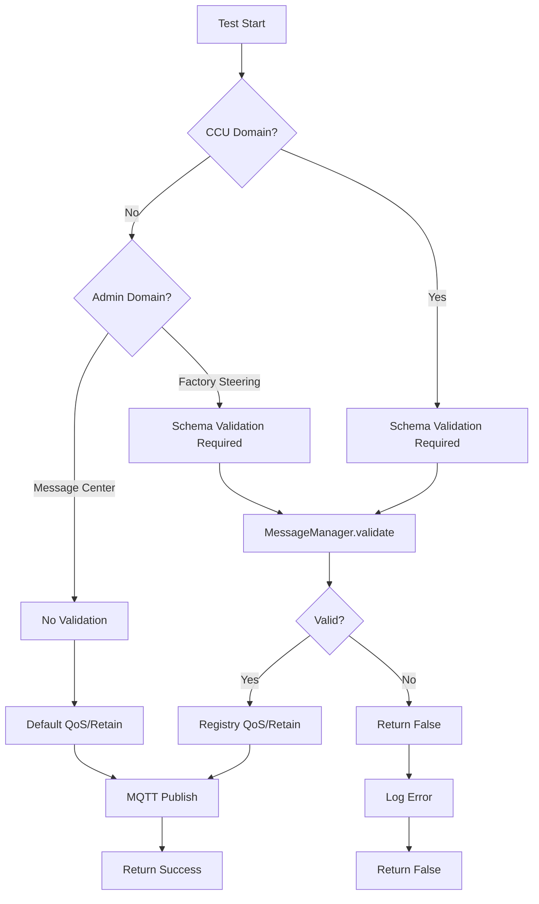

# Message Sending Architecture - OMF2

**Status:** ✅ **IMPLEMENTIERT**  
**Datum:** 2025-10-19  
**Kontext:** Architektur-Prinzipien für MQTT Message Sending in OMF2

---

## 🎯 Übersicht

**Ziel:** Einheitliche, schema-validierte MQTT Message Sending Architektur für alle OMF2 Domänen.

**Prinzip:** Command-Versende-Pattern mit Schema-Validation und Registry-basierten Parametern.

## 📊 Architektur-Übersicht



---

## 🏗️ Architektur-Prinzipien

### **1. Domain-spezifische Validierung**

#### **CCU Domain (Produktionssteuerung):**
- **Rolle:** Subset der APS-Funktionalität nachbauen
- **Topics:** Spezifische CCU-Topics aus `mqtt_clients.yml`
- **Validierung:** **IMMER** durch MessageManager (Schema-Validation)
- **Zweck:** Produktionssteuerung, Module-Management

#### **Admin Domain (System-Administration):**
- **Rolle:** Übergeordnete Instanz, alle Topics empfangen/versenden
- **Topics:** Wildcard `"#"` (alle Topics) - keine Business-Logic
- **Validierung:** **BEDINGT** - je nach Kontext
- **Zweck:** System-Verwaltung, Factory Steering, Message Monitoring

### **2. Validierungs-Regeln**

#### **A) CCU Domain - IMMER validieren:**
```python
# ✅ KORREKT: CCU publiziert → MessageManager.validate() ZWINGEND
success = ccu_gateway.publish_message("ccu/order/request", payload)
# → MessageManager.validate(payload, schema) wird automatisch aufgerufen
```

#### **B) Admin Domain - BEDINGT validieren:**

**Factory Steering (CCU-ähnliche Commands):**
```python
# ✅ KORREKT: Factory Steering → Schema-Validation (wie CCU)
payload = payload_generator.generate_example_payload("ccu/set/reset")
success = admin_gateway.publish_message("ccu/set/reset", payload)
# → MessageManager.validate() wird aufgerufen
```

**Topic Steering (3 Modi):**
- **Topic-driven:** Schema-Validation
- **Schema-driven:** Schema-Validation  
- **Schema-Test:** Administrative Validierung

**Message Center - EINZIGE AUSNAHME:**
```python
# ✅ KORREKT: Message Center → KEINE Schema-Validation
success = admin_gateway.publish_message(topic, payload, validate=False)
# → Freie Topic/Payload-Wahl, keine Validierung
```

---

## 🔧 Command-Versende-Pattern

### **Architektur-Compliant Pattern:**



### **Meta-Parameter-Trennung:**

```python
# ✅ KORREKT: Meta-Parameter nur in Buffer, nicht in Payload
def publish_message(self, topic, payload, meta=None):
    # 1. Schema-Validation
    validated_payload = self.message_manager.validate_message(topic, payload)
    
    # 2. Registry-basierte QoS/Retain
    qos = self.registry_manager.get_topic_qos(topic)
    retain = self.registry_manager.get_topic_retain(topic)
    
    # 3. MQTT Publish (ohne Meta-Parameter)
    success = self.mqtt_client.publish(topic, validated_payload, qos, retain)
    
    # 4. Meta-Parameter in Buffer (für Monitoring)
    if meta:
        self.message_buffer.add_meta(topic, meta)
```

---

## 📋 Domain-spezifische Implementierung

### **CCU Domain Implementation:**

```python
# omf2/ccu/ccu_gateway.py
from omf2.common.logging_config import get_logger

logger = get_logger("omf2.ccu.gateway")

class CcuGateway:
    def publish_message(self, topic, payload, meta=None):
        """CCU Domain - IMMER Schema-Validation"""
        try:
            # 1. Schema-Validation (ZWINGEND)
            validated_payload = self.message_manager.validate_message(topic, payload)
            if not validated_payload:
                logger.error(f"Schema validation failed for {topic}")
                return False
            
            # 2. Registry-basierte QoS/Retain
            qos = self.registry_manager.get_topic_qos(topic)
            retain = self.registry_manager.get_topic_retain(topic)
            
            # 3. MQTT Publish
            success = self.mqtt_client.publish(topic, validated_payload, qos, retain)
            
            if success:
                logger.info(f"CCU Message sent: {topic}")
                return True
            else:
                logger.error(f"CCU Message failed: {topic}")
                return False
                
        except Exception as e:
            logger.error(f"CCU Gateway error: {e}")
            return False
```

### **Admin Domain Implementation:**

```python
# omf2/admin/admin_gateway.py
from omf2.common.logging_config import get_logger

logger = get_logger("omf2.admin.gateway")

class AdminGateway:
    def publish_message(self, topic, payload, meta=None, validate=True):
        """Admin Domain - BEDINGT Schema-Validation"""
        try:
            # 1. Bedingte Schema-Validation
            if validate:
                validated_payload = self.message_manager.validate_message(topic, payload)
                if not validated_payload:
                    logger.error(f"Schema validation failed for {topic}")
                    return False
            else:
                # Message Center Ausnahme - keine Validation
                validated_payload = payload
                logger.info(f"Admin Message without validation: {topic}")
            
            # 2. Registry-basierte QoS/Retain (oder Default)
            qos = self.registry_manager.get_topic_qos(topic) if validate else 1
            retain = self.registry_manager.get_topic_retain(topic) if validate else False
            
            # 3. MQTT Publish
            success = self.mqtt_client.publish(topic, validated_payload, qos, retain)
            
            if success:
                logger.info(f"Admin Message sent: {topic}")
                return True
            else:
                logger.error(f"Admin Message failed: {topic}")
                return False
                
        except Exception as e:
            logger.error(f"Admin Gateway error: {e}")
            return False
```

---

## 🎯 Schema-driven Approach

### **PayloadGenerator Integration:**

```python
# Factory Steering - Schema-driven Approach
from omf2.common.logging_config import get_logger

logger = get_logger("omf2.admin.factory_steering")

def _send_factory_reset(admin_gateway):
    """Schema-driven Factory Reset"""
    try:
        # 1. PayloadGenerator verwenden
        payload_generator = PayloadGenerator(registry_manager)
        payload = payload_generator.generate_example_payload("ccu/set/reset")
        
        # 2. Admin Gateway mit Schema-Validation
        success = admin_gateway.publish_message("ccu/set/reset", payload, validate=True)
        
        if success:
            logger.info("Factory Reset sent successfully")
            return True
        else:
            logger.error("Factory Reset failed")
            return False
            
    except Exception as e:
        logger.error(f"Factory Reset error: {e}")
        return False
```

### **Registry-basierte Parameter:**

```yaml
# omf2/registry/mqtt_clients.yml
mqtt_clients:
  ccu_mqtt_client:
    published_topics:
      - "ccu/set/reset"          # QoS: 1, Retain: False
      - "ccu/order/request"       # QoS: 1, Retain: False
      - "ccu/control"             # QoS: 2, Retain: False
```

---

## 🧪 Testing Strategy

### **Domain-Validierung Flow:**



### **Unit Tests:**

```python
def test_ccu_gateway_schema_validation():
    """Test CCU Gateway Schema-Validation"""
    ccu_gateway = get_ccu_gateway()
    
    # Valid payload
    payload = {"timestamp": "2024-01-01T00:00:00Z", "withStorage": False}
    success = ccu_gateway.publish_message("ccu/set/reset", payload)
    assert success == True
    
    # Invalid payload
    payload = {"invalid": "data"}
    success = ccu_gateway.publish_message("ccu/set/reset", payload)
    assert success == False

def test_admin_gateway_conditional_validation():
    """Test Admin Gateway Conditional Validation"""
    admin_gateway = get_admin_gateway()
    
    # With validation (Factory Steering)
    payload = {"timestamp": "2024-01-01T00:00:00Z", "withStorage": False}
    success = admin_gateway.publish_message("ccu/set/reset", payload, validate=True)
    assert success == True
    
    # Without validation (Message Center)
    payload = {"any": "data"}
    success = admin_gateway.publish_message("custom/topic", payload, validate=False)
    assert success == True
```

### **Integration Tests:**

```python
def test_end_to_end_message_sending():
    """Test End-to-End Message Sending"""
    # 1. CCU Domain
    ccu_gateway = get_ccu_gateway()
    success = ccu_gateway.publish_message("ccu/order/request", {"type": "BLUE"})
    assert success == True
    
    # 2. Admin Domain - Factory Steering
    admin_gateway = get_admin_gateway()
    payload = payload_generator.generate_example_payload("ccu/set/reset")
    success = admin_gateway.publish_message("ccu/set/reset", payload, validate=True)
    assert success == True
    
    # 3. Admin Domain - Message Center
    success = admin_gateway.publish_message("custom/topic", {"test": "data"}, validate=False)
    assert success == True
```

---

## 📊 Vorteile

### **Architektur-Compliance:**
- ✅ **Einheitliches Pattern:** Alle Domänen verwenden gleiche Architektur
- ✅ **Schema-Validation:** Zentrale Validierung über MessageManager
- ✅ **Registry-basiert:** QoS/Retain aus Registry, nicht hardcodiert
- ✅ **Meta-Parameter-Trennung:** Transport-Details ≠ Payload-Daten

### **Domain-spezifische Flexibilität:**
- ✅ **CCU Domain:** Strikte Schema-Validation für Produktionssteuerung
- ✅ **Admin Domain:** Flexible Validation je nach Kontext
- ✅ **Message Center:** Einzige Ausnahme für freie Topic/Payload-Wahl

### **Wartbarkeit:**
- ✅ **Zentrale Validierung:** MessageManager als Single Source of Truth
- ✅ **Registry-basiert:** Konfiguration in YAML, nicht im Code
- ✅ **Testbarkeit:** Isolierte Komponenten, klare Verantwortlichkeiten

---

## 🚀 Nächste Schritte

### **Task 2.9 Implementation:**
1. **Task 2.9-A:** Schema-Validierung Analyse
2. **Task 2.9-B:** Registry-Parameter prüfen
3. **Task 2.9-C:** Topic Steering testen
4. **Task 2.9-D:** CCU Domain publish_message
5. **Task 2.9-E:** Live-Modus Test
6. **Task 2.9-F:** Factory Steering umstellen

### **Architektur-Validierung:**
- ✅ **MessageManager:** Zentrale Schema-Validation
- ✅ **Registry:** QoS/Retain-Parameter verfügbar
- ✅ **Gateway-Pattern:** Domain-spezifische Implementierung
- ✅ **Testing:** Unit und Integration Tests

---

**Status:** ✅ **ARCHITEKTUR DOKUMENTIERT**  
**Nächster Schritt:** Task 2.9-A - Schema-Validierung Analyse
