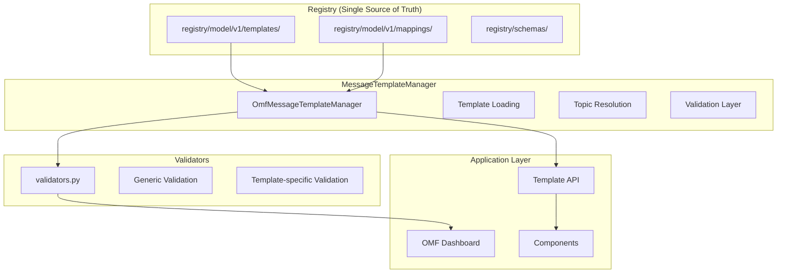

# Message Template System - Architektur & Verwendung

Version: 1.0  
Last updated: 2025-01-15  
Author: OMF Development Team  

---

## 📋 Overview

Das **Message Template System** ist das Herzstück der OMF-Architektur. Es verwaltet MQTT-Nachrichtenstrukturen, validiert Payloads und stellt eine einheitliche API für Template-basierte Nachrichtenverarbeitung bereit.

## 🏗️ System-Architektur



## 🔧 Kern-Komponenten

### 1. **OmfMessageTemplateManager** (Singleton)

**Datei:** `omf/omf/tools/message_template_manager.py`

**Zweck:** Zentrale Verwaltung aller Message-Templates

**Kern-Funktionen:**
```python
class OmfMessageTemplateManager:
    def __init__(self, templates_dir: str = None):
        # Lädt Registry v1 Templates (primary)
        # Fallback zu legacy config (deprecated)
    
    def get_topic_template(self, topic: str) -> Dict:
        # Resolves Topic → Template Key → Template Content
    
    def validate_payload(self, key: str, payload: Dict) -> Dict:
        # Kombiniert Template-Checks + Custom Validation
        # Returns: {"errors": [...], "warnings": [...]}
    
    def get_all_templates(self) -> Dict:
        # Alle geladenen Templates
```

**Template-Loading:**
- **Primary:** `registry/model/v1/templates/` (Registry v1)
- **Fallback:** `omf/omf/config/message_templates/` (Legacy)
- **Automatisch:** Lädt alle `.yml` Dateien beim Start

### 2. **Topic-Resolution-System**

**Datei:** `registry/model/v1/mappings/topic_template.yml`

**Prinzip:** Exact Mappings vor Pattern Mappings

**Exact Mappings (höchste Priorität):**
```yaml
- { topic: "module/v1/ff/SVR4H76449/state", template: "module.state.drill" }
- { topic: "ccu/pairing/state", template: "ccu.state.pairing" }
```

**Pattern Mappings (Fallback):**
```yaml
- { pattern: "module/v1/ff/{module_id}/state", template: "module.state" }
- { pattern: "module/v1/ff/{module_id}/order", template: "module.order" }
```

**Resolution-Logik:**
1. **Exact Match:** Suche nach exakter Topic-Übereinstimmung
2. **Pattern Match:** Fallback zu Pattern-basierten Mappings
3. **Template Key:** Auflösung zu Template-Inhalt
4. **Validation:** Template-spezifische Validierung

### 3. **Validierungs-Layer**

**Datei:** `omf/omf/tools/validators.py`

**Zweck:** Template-spezifische Payload-Validierung

**Validierungs-Typen:**
- **Generic:** Timestamp, UUID, NFC-Code-Format
- **Template-spezifisch:** Modul-spezifische Regeln
- **Enum-Validierung:** Erlaubte Werte prüfen
- **Range-Checks:** Min/Max-Werte validieren
- **Struktur-Validierung:** Required Fields, Typen

**Validierungs-Router:**
```python
def validate(template_key: str, payload: Dict) -> ValidationResult:
    # Router für template-spezifische Checks
    if template_key == "module.state.drill":
        _drill_state(res, payload)
    elif template_key == "module.state.hbw_inventory":
        _hbw_inventory(res, payload)
    # ... weitere Template-spezifische Validierungen
```

## 📄 Template-Struktur (YAML)

### **Standard-Template-Format**

**Beispiel: `module.state.drill.yml`**
```yaml
version: 1.0.0
metadata: 
  category: MODULE
  sub_category: State
  description: "DRILL State"

templates:
  module.state.drill:
    description: "Bohrstation Status + aktuelle Aktion"
    match:
      required_fields: [timestamp, serialNumber]
    template_structure:
      serialNumber: { type: string }
      actionState:
        type: object
        properties:
          command: { type: string, enum: ["PICK","DRILL","DROP"] }
          state: { type: string, enum: ["RUNNING","FINISHED"] }
          duration: { type: integer, minimum: 1, maximum: 3600 }
      loads:
        type: array
        items:
          type: object
          properties:
            loadType: { type: string, enum: ["RED","WHITE","BLUE"] }
      timestamp: { type: string, format: date-time }
      orderId: { type: string }
      orderUpdateId: { type: integer, minimum: 0 }
```

### **Template-Kategorien**

**Modul-Templates:**
- `module.state.{module}` - Modul-Status (HBW, DRILL, MILL, DPS, AIQS)
- `module.connection.{module}` - Verbindungs-Status
- `module.order.{module}` - Befehle an Module
- `module.factsheet.{module}` - Modul-Informationen

**System-Templates:**
- `ccu.state.*` - CCU-Status (Pairing, Layout, Stock)
- `ccu.control` - CCU-Befehle
- `txt.controller1.*` - TXT-Controller-Daten
- `nodered.*` - Node-RED-Integration
- `fts.*` - FTS-Transport-System

## 🔄 Verwendung im Code

### **1. Template Manager initialisieren**

```python
from omf.omf.tools.message_template_manager import get_omf_message_template_manager

# Singleton Manager
manager = get_omf_message_template_manager()
```

### **2. Template für Topic abrufen**

```python
# Template für spezifischen Topic
template = manager.get_topic_template("module/v1/ff/SVR4H76449/state")
print(f"Template: {template}")

# Alle Templates
all_templates = manager.get_all_templates()
```

### **3. Payload validieren**

```python
# Payload validieren
payload = {
    "serialNumber": "SVR4H76449",
    "actionState": {
        "command": "DRILL",
        "state": "RUNNING"
    },
    "timestamp": "2025-01-15T10:30:00Z"
}

validation = manager.validate_payload("module.state.drill", payload)

if validation["errors"]:
    print(f"❌ Errors: {validation['errors']}")
if validation["warnings"]:
    print(f"⚠️ Warnings: {validation['warnings']}")
```

### **4. Integration in Dashboard-Komponenten**

```python
def show_module_status():
    # MQTT-Nachrichten empfangen
    messages = client.get_buffer("module/v1/ff/+/state")
    
    for message in messages:
        topic = message["topic"]
        payload = message["payload"]
        
        # Template für Topic abrufen
        template = manager.get_topic_template(topic)
        
        # Payload validieren
        validation = manager.validate_payload(template["key"], payload)
        
        # UI basierend auf Validation
        if validation["errors"]:
            st.error(f"❌ Invalid message: {validation['errors']}")
        else:
            st.success("✅ Valid message")
```

## 🎯 Best Practices

### **1. Template-Erstellung**

**✅ Richtig:**
```yaml
templates:
  module.state.drill:
    description: "DRILL State"
    match:
      required_fields: [timestamp, serialNumber]
    template_structure:
      command: { type: string, enum: ["PICK","DRILL","DROP"] }
```

**❌ Falsch:**
```yaml
templates:
  module/v1/ff/SVR4H76449/state:  # Topic im Template
    description: "DRILL State"
```

### **2. Validierung verwenden**

**✅ Richtig:**
```python
# Immer validieren vor Verarbeitung
validation = manager.validate_payload(template_key, payload)
if validation["errors"]:
    handle_errors(validation["errors"])
```

**❌ Falsch:**
```python
# Payload ohne Validierung verarbeiten
process_payload(payload)  # Gefährlich!
```

### **3. Template-Keys verwenden**

**✅ Richtig:**
```python
# Semantische Template-Keys
template_key = "module.state.drill"
validation = manager.validate_payload(template_key, payload)
```

**❌ Falsch:**
```python
# Topic-Strings als Template-Keys
template_key = "module/v1/ff/SVR4H76449/state"
```

## 🔧 Erweiterte Features

### **1. Custom Validators hinzufügen**

```python
# In validators.py
def _custom_module_state(res, payload):
    """Custom Validator für spezifisches Modul"""
    if t(payload, "customField") not in ["VALUE1", "VALUE2"]:
        push(res, "errors", "Invalid customField value")
    
    if t(payload, "numericField") < 0:
        push(res, "warnings", "Negative numericField value")
```

### **2. Template-Metadaten nutzen**

```python
# Template-Metadaten abrufen
template = manager.get_topic_template(topic)
metadata = template.get("metadata", {})
category = metadata.get("category")
description = metadata.get("description")
```

### **3. Required Fields prüfen**

```python
# Required Fields aus Template
template = manager.get_topic_template(topic)
required_fields = template.get("match", {}).get("required_fields", [])

for field in required_fields:
    if field not in payload:
        print(f"❌ Missing required field: {field}")
```

## 📊 Performance & Monitoring

### **1. Template-Loading-Performance**

- **Lazy Loading:** Templates werden bei Bedarf geladen
- **Caching:** Geladene Templates werden gecacht
- **Singleton Pattern:** Eine Instanz pro Session

### **2. Validierungs-Performance**

- **Template-spezifisch:** Nur relevante Validierungen
- **Early Exit:** Bei ersten Fehlern stoppen
- **Efficient Checks:** Regex-basierte Validierung

### **3. Monitoring**

```python
# Template-Usage-Statistiken
all_templates = manager.get_all_templates()
print(f"Loaded templates: {len(all_templates)}")

# Validation-Statistiken
validation_stats = {
    "total_validations": 0,
    "errors": 0,
    "warnings": 0
}
```

## 🚨 Troubleshooting

### **Problem: Template nicht gefunden**

```python
# Debug: Template-Loading prüfen
template = manager.get_topic_template(topic)
if not template:
    print(f"❌ Template not found for topic: {topic}")
    print(f"Available templates: {list(manager.get_all_templates().keys())}")
```

### **Problem: Validierung schlägt fehl**

```python
# Debug: Payload-Struktur prüfen
validation = manager.validate_payload(template_key, payload)
if validation["errors"]:
    print(f"❌ Validation errors: {validation['errors']}")
    print(f"Payload: {payload}")
    print(f"Template: {manager.get_topic_template(topic)}")
```

### **Problem: Topic-Resolution funktioniert nicht**

```python
# Debug: Topic-Mapping prüfen
# 1. Exact Match prüfen
# 2. Pattern Match prüfen
# 3. Template-Key-Resolution prüfen
```

## 🔗 Verwandte Dokumentation

- [Registry Model](registry-model.md) - Registry-Prinzipien & Versionierung
- [System Context](system-context.md) - Überblick über Hauptkomponenten
- [Template Reference](../05-reference/templates.md) - Template-Index & Migration Mapping
- [How-To: Add a New Module](../04-howto/development/add-a-new-module.md) - Template → Mapping → Tests

---

**"Message Templates sind das Herzstück der OMF-Architektur - sie definieren, validieren und verwalten alle MQTT-Nachrichtenstrukturen."**
