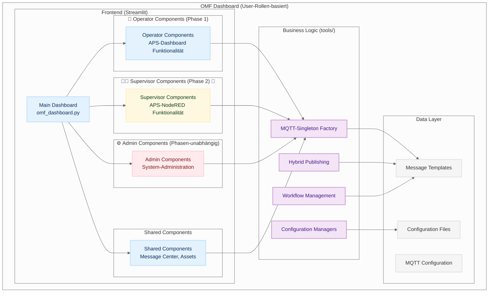
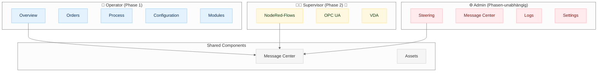

# OMF (ORBIS Modellfabrik) Dashboard Architecture

## Overview

Das OMF Dashboard ist eine moderne, modulare Web-Anwendung zur Steuerung und Überwachung der ORBIS Modellfabrik. Es basiert auf Streamlit und implementiert die **Per-Topic-Buffer Architektur** mit **MQTT-Singleton Pattern** für optimale Performance und Einfachheit.

## 👥 User-Rollen-System

### **Rollen-basierte Architektur**
Das OMF Dashboard implementiert ein **User-Rollen-System** mit drei Hauptrollen:

#### **🔧 Operator (Phase 1)**
- **Zugriff:** APS-Funktionalität (APS-Dashboard nachgebaut)
- **Tabs:** Overview, Control, Steering, Orders
- **Zweck:** Standard-Bedienung der Modellfabrik
- **Status:** ✅ Implementiert

#### **👨‍💼 Supervisor (Phase 2)**
- **Zugriff:** APS-NodeRED Funktionalität
- **Tabs:** Node-RED Flows, OPC-UA Gateway, VDA 5050
- **Zweck:** Erweiterte Steuerung und Monitoring
- **Status:** 🔄 In Entwicklung (Platzhalter-Tabs)

#### **⚙️ Admin (Phasen-unabhängig)**
- **Zugriff:** System-Konfiguration, Registry, MQTT-Settings
- **Tabs:** Settings, Configuration, System-Status
- **Zweck:** System-Administration und Wartung
- **Status:** ✅ Implementiert

## Architecture Overview

### **1. High-Level Architektur (User-Rollen)**




### **3. Architektur-Übersicht/Struktur**

```
OMF Dashboard (User-Rollen-basiert)
├── Frontend (Streamlit)
│   ├── Main Dashboard (omf_dashboard.py)
│   └── Components (Rollen-basiert)
│       ├── 🔧 Operator Components (Phase 1)
│       ├── 👨‍💼 Supervisor Components (Phase 2) 🔄
│       ├── ⚙️ Admin Components (Phasen-unabhängig)
│       └── Shared Components
├── Business Logic (tools/)
│   ├── MQTT-Singleton Factory ✨ NEW
│   ├── Hybrid Publishing ✨ NEW
│   ├── Workflow Management ✨ ENHANCED
│   └── Configuration Managers
└── Data Layer
    ├── Message Templates
    ├── MQTT Configuration ✨ NEW
    └── Configuration Files
```

### **4. Component-Struktur**

```
Components (Rollen-basiert)
├── 🔧 Operator Components (Phase 1)
│   ├── aps_overview → "Overview"
│   ├── aps_orders → "Orders"
│   ├── aps_processes → "Process"
│   ├── aps_configuration → "Configuration"
│   └── aps_modules → "Modules"
├── 👨‍💼 Supervisor Components (Phase 2) 🔄
│   ├── NodeRed-Flows (ToDo)
│   ├── OPC UA (ToDo)
│   └── VDA (ToDo)
├── ⚙️ Admin Components (Phasen-unabhängig)
│   ├── steering → "Steering"
│   ├── message_center → "Message Center"
│   ├── logs → "Logs"
│   └── settings → "Settings"
└── Shared Components
```

## Core Architecture Patterns

### 1. **MQTT-Singleton Pattern** ✨ NEW
- **Eine MQTT-Client-Instanz** pro Streamlit-Session
- **Zentraler Zugriff** über `st.session_state["mqtt_client"]`
- **Stabile Verbindungen** ohne Verletzung des Singleton-Patterns
- **Umgebungswechsel** (live/mock/replay) ohne Probleme
- **📖 Detaillierte Dokumentation:** [Singleton-Pattern Compliance](docs/singleton-pattern-compliance.md)

### 2. **Per-Topic-Buffer Pattern** ✨ NEW
- **Topic-spezifische Buffer** für jede MQTT-Subscription
- **Automatische Nachrichtensammlung** in separaten Buffers
- **Effiziente Verarbeitung** ohne Message-Processor Overhead
- **Direkte Buffer-Zugriffe** für optimale Performance
- **📖 Detaillierte Dokumentation:** [Per-Topic-Buffer Pattern](docs/per-topic-buffer-pattern.md)

### 3. **Hybrid-Architektur für Publishing** ✨ NEW
- **MessageGenerator** für Payload-Erstellung
- **Session State** für Preview/Edit-Funktionalität
- **MessageGateway** für finales Publishing
- **WorkflowOrderManager** für orderId/orderUpdateId Verwaltung

### 4. **User-Rollen-System** ✨ NEW
- **Rollen-basierte Komponenten-Struktur** für verschiedene Benutzertypen
- **Operator (Phase 1):** APS-Dashboard Funktionalität nachgebaut
- **Supervisor (Phase 2):** APS-NodeRED Funktionalität (Platzhalter-Tabs)
- **Admin (Phasen-unabhängig):** System-Konfiguration und Wartung
- **Flexible Tab-Struktur** für rollenspezifische Zugriffe

## Core Components

### 1. Dashboard Frontend (User-Rollen-basiert)

**Main Entry Point:** `omf/dashboard/omf_dashboard.py`

#### User-Rollen-basierte Tab-Struktur:

**🔧 Operator (Phase 1):**
- **Overview** - Systemübersicht und Modul-Status
- **Orders** - Auftragsverwaltung und -steuerung
- **Process** - Prozesssteuerung und -überwachung
- **Configuration** - Systemkonfiguration
- **Modules** - Modulstatus und -steuerung

**👨‍💼 Supervisor (Phase 2):**
- **NodeRed-Flows** (ToDo) - Flow-Editor und -Management
- **OPC UA** (ToDo) - OPC-UA Verbindungen und Gateway-Status
- **VDA** (ToDo) - FTS-Standard und Transport-Orders

**⚙️ Admin (Phasen-unabhängig):**
- **Steering** - Factory-Steuerung und -überwachung
- **Message Center** - MQTT-Nachrichten-Zentrale
- **Logs** - System-Logs und Debugging
- **Settings** - System-Einstellungen und Konfiguration

### 2. MQTT-Singleton Factory ✨ NEW

#### OMF MQTT Factory
**File:** `omf/tools/omf_mqtt_factory.py`

**Purpose:** Verwaltet MQTT-Client-Instanzen nach Singleton-Pattern

**Features:**
- **Singleton Pattern:** Eine Client-Instanz pro Session
- **Environment Support:** live/mock/replay Umgebungen
- **Automatic Connection:** Automatische Verbindung beim Start
- **Session Management:** Persistente Client-Instanzen

```python
def ensure_dashboard_client(environment: str, config: dict) -> OMFMqttClient:
    """Erstellt oder gibt existierenden MQTT-Client zurück (Singleton)"""
    if "mqtt_client" not in st.session_state:
        st.session_state["mqtt_client"] = OMFMqttClient(environment, config)
    return st.session_state["mqtt_client"]
```

#### OMF MQTT Client
**File:** `omf/tools/omf_mqtt_client.py`

**Purpose:** Per-Topic-Buffer MQTT-Client

**Features:**
- **Per-Topic-Buffer:** Topic-spezifische Nachrichtensammlung
- **Automatic Subscription:** Automatische Topic-Subscriptions
- **Buffer Management:** Effiziente Buffer-Verwaltung
- **Connection Management:** Robuste Verbindungsverwaltung

```python
class OMFMqttClient:
    def __init__(self, environment: str, config: dict):
        self._buffers = {}  # Per-Topic-Buffer
        self._connected = False
        
    def subscribe_many(self, topics: list):
        """Subscribe zu mehreren Topics"""
        for topic in topics:
            self.subscribe(topic)
            
    def get_buffer(self, topic_filter: str) -> list:
        """Gibt Buffer für Topic-Filter zurück"""
        return self._buffers.get(topic_filter, [])
```

### 3. Hybrid Publishing Architecture ✨ NEW

#### Message Gateway
**File:** `omf/tools/message_gateway.py`

**Purpose:** Einheitliche API für MQTT-Publishing

**Features:**
- **Payload Enrichment:** Automatische Anreicherung von Payloads
- **Order-ID Management:** Automatische orderId/orderUpdateId Verwaltung
- **Error Handling:** Robuste Fehlerbehandlung
- **QoS Management:** Quality of Service Level Verwaltung

```python
class MessageGateway:
    def __init__(self, mqtt_client: OMFMqttClient):
        self.mqtt_client = mqtt_client
        
    def send(self, topic: str, builder: callable, ensure_order_id: bool = False) -> bool:
        """Sendet Nachricht über MQTT-Client"""
        payload = builder()
        
        if ensure_order_id:
            payload = self._ensure_order_id(payload)
            
        return self.mqtt_client.publish_json(topic, payload, qos=1, retain=False)
```

#### Message Generator
**File:** `omf/omf/tools/message_generator.py`

**Purpose:** Generiert semantisch korrekte MQTT-Nachrichten

**Features:**
- **Template-based:** YAML-basierte Template-Definitionen
- **FTS Navigation:** Spezielle FTS-Navigations-Nachrichten
- **Module Commands:** Modul-spezifische Befehle
- **Route Definitions:** Vordefinierte FTS-Routen

```python
def generate_fts_navigation_message(self, route_type: str, load_type: str) -> dict:
    """Generiert FTS-Navigations-Nachricht"""
    route_def = self.route_definitions.get(route_type)
    if not route_def:
        return None
        
    return {
        "topic": "fts/v1/ff/5iO4/navigation",
        "payload": {
            "timestamp": datetime.now(timezone.utc).isoformat(),
            "serialNumber": "5iO4",
            "route": route_def,
            "loadType": load_type
        }
    }
```

## 👥 User-Rollen-System Details

### **Rollen-basierte Komponenten-Struktur**

Das OMF Dashboard implementiert ein **hierarchisches User-Rollen-System** mit spezifischen Komponenten für jede Rolle:

#### **🔧 Operator (Phase 1) - APS-Dashboard Funktionalität**

**Zweck:** Standard-Bedienung der Modellfabrik (APS-Dashboard nachgebaut)

**Tabs:**
- **Overview** (aps_overview) - Systemübersicht und Status
- **Orders** (aps_orders) - Auftragsverwaltung und -steuerung
- **Process** (aps_processes) - Prozesssteuerung und -überwachung
- **Configuration** (aps_configuration) - Systemkonfiguration
- **Modules** (aps_modules) - Modulstatus und -steuerung

**Status:** 🔄 **In Entwicklung** - Orders noch nicht implementiert, andere nur als Hüllen

#### **👨‍💼 Supervisor (Phase 2) - APS-NodeRED Funktionalität**

**Zweck:** Erweiterte Steuerung und Monitoring über Node-RED

**Tabs:**
- **NodeRed-Flows** (ToDo) - Flow-Editor, Flow-Management, Flow-Monitoring
- **OPC UA** (ToDo) - OPC-UA Verbindungen, Gateway-Status, Protocol-Translation
- **VDA** (ToDo) - FTS-Standard, Transport-Orders, Vehicle-Management

**Status:** 🔄 **In Entwicklung** - Alle Tabs noch zu implementieren

#### **⚙️ Admin (Phasen-unabhängig) - System-Administration**

**Zweck:** System-Konfiguration, Registry-Management, Wartung

**Tabs:**
- **Steering** (steering) - Factory-Steuerung und -überwachung
- **Message Center** (message_center) - MQTT-Nachrichten-Zentrale
- **Logs** (logs) - System-Logs und Debugging
- **Settings** (settings) - System-Einstellungen und Konfiguration

**Status:** ✅ **Implementiert** - System-Administration funktionsfähig

### **Tab-Struktur pro Rolle**



### **Implementierungs-Status**

| Rolle | Phase | Status | Tabs | Implementierung |
|-------|-------|--------|------|-----------------|
| **Operator** | Phase 1 | 🔄 In Entwicklung | Overview, Orders, Process, Configuration, Modules | Orders nicht implementiert, andere nur Hüllen |
| **Supervisor** | Phase 2 | 🔄 In Entwicklung | NodeRed-Flows, OPC UA, VDA | Alle Tabs noch zu implementieren |
| **Admin** | Phasen-unabhängig | ✅ Implementiert | Steering, Message Center, Logs, Settings | Alle Tabs funktionsfähig |


## Data Flow

### 1. Per-Topic-Buffer Flow

```
MQTT Broker → OMFMqttClient → Per-Topic-Buffer → Component Processing
```

### 2. Hybrid Publishing Flow

```
User Action → MessageGenerator → Session State → MessageGateway → MQTT Broker
```

### 3. Module Control Flow

```
User clicks PICK → _prepare_module_sequence → Session State → _send_sequence_message → MessageGateway → MQTT → Module
```

### 4. FTS Navigation Flow

```
User clicks DPS-HBW → _prepare_navigation_message → MessageGenerator → Session State → _send_pending_message → MQTT → FTS
```

## Key Design Principles

### 1. **MQTT-Singleton Pattern**
- **Eine Client-Instanz** pro Streamlit-Session
- **Zentraler Zugriff** über `st.session_state["mqtt_client"]`
- **Keine Verletzung** des Singleton-Patterns
- **Stabile Verbindungen** ohne Probleme
- **📖 Detaillierte Dokumentation:** [Singleton-Pattern Compliance](docs/singleton-pattern-compliance.md)

### 2. **Per-Topic-Buffer Pattern**
- **Topic-spezifische Buffer** für jede Subscription
- **Automatische Nachrichtensammlung** in separaten Buffers
- **Effiziente Verarbeitung** ohne Message-Processor Overhead
- **Direkte Buffer-Zugriffe** für optimale Performance
- **📖 Detaillierte Dokumentation:** [Per-Topic-Buffer Pattern](docs/per-topic-buffer-pattern.md)

### 3. **Hybrid-Architektur**
- **MessageGenerator** für Payload-Erstellung
- **Session State** für Preview/Edit-Funktionalität
- **MessageGateway** für finales Publishing
- **WorkflowOrderManager** für ID-Management

### 4. **Separation of Concerns**
- **UI Layer:** Streamlit Components für Benutzerinteraktion
- **Business Logic:** Tools für Message-Generierung und Workflow-Management
- **Data Layer:** YAML-Konfigurationen und Templates
- **MQTT Layer:** Per-Topic-Buffer und Singleton-Pattern

## Technology Stack

### Frontend
- **Streamlit:** Web-Framework für Python
- **Streamlit Components:** Custom UI-Komponenten
- **Session State:** UI-State-Management

### Backend
- **Python 3.9+:** Hauptprogrammiersprache
- **Paho-MQTT:** MQTT-Client für Kommunikation
- **PyYAML:** YAML-Konfiguration
- **Pathlib:** Robuste Pfad-Behandlung

### MQTT Architecture ✨ NEW
- **OMFMqttClient:** Per-Topic-Buffer Client
- **OMFMqttFactory:** Singleton-Pattern Factory
- **MessageGateway:** Publishing Gateway
- **MessageGenerator:** Payload Generation

### Development Tools
- **Black:** Code-Formatierung (line-length: 120)
- **Ruff:** Linting (ignores E501, E402)
- **Isort:** Import-Sortierung
- **Pre-commit:** Git-Hooks für Code-Qualität

### Testing
- **unittest:** Unit-Testing-Framework
- **tempfile:** Temporäre Test-Dateien
- **Mocking:** Komponenten-Isolation

## Configuration Management

### MQTT Configuration ✨ NEW
- **mqtt_config.py:** MQTT-Konfiguration für verschiedene Umgebungen
- **mqtt_topics.py:** Topic-Definitionen und Priority-Filter
- **Environment Support:** live/mock/replay Konfigurationen

### Template System
- **Semantic Templates:** Strukturierte Template-Definitionen
- **Variable Support:** Dynamische Parameter
- **Validation Rules:** Template-Validierung
- **Usage Examples:** Mehrere Beispiele pro Template

### Priority-based Subscriptions ✨ NEW
- **PRIO 1:** Module-spezifische Topics
- **PRIO 2:** FTS-spezifische Topics
- **PRIO 3:** Order-spezifische Topics
- **PRIO 4:** System-spezifische Topics
- **PRIO 5:** Erweiterte Topics
- **PRIO 6:** Alle Topics (`#`)

## Performance Considerations

### Per-Topic-Buffer Vorteile ✨ NEW
- **Keine Message-Processor Overhead**
- **Direkte Buffer-Zugriffe**
- **Effiziente Topic-Filterung**
- **Einfache Erweiterung**

### MQTT-Singleton Vorteile ✨ NEW
- **Eine Client-Instanz** pro Session
- **Stabile Verbindungen**
- **Umgebungswechsel** ohne Probleme
- **Konsistente Architektur**

### Caching
- **Template Caching:** Templates werden einmal geladen
- **Configuration Caching:** Konfigurationen werden gecacht
- **Singleton Pattern:** Globale Instanzen für Performance

### Memory Management
- **Lazy Loading:** Komponenten werden bei Bedarf geladen
- **Resource Cleanup:** Automatische Ressourcen-Bereinigung
- **Efficient Data Structures:** Optimierte Datenstrukturen

## Security Considerations

### MQTT-Singleton Security ✨ NEW
- **Eine Client-Instanz** pro Session
- **Keine Verletzung** des Singleton-Patterns
- **Stabile Verbindungen**
- **Konsistente Architektur**

### Per-Topic-Buffer Security ✨ NEW
- **Topic-spezifische Buffer**
- **Automatische Nachrichtensammlung**
- **Effiziente Verarbeitung**
- **Robuste Error-Handling**

### MQTT Security
- **Connection Validation:** MQTT-Verbindung wird vor Senden geprüft
- **Message Validation:** JSON-Validierung vor Senden
- **Error Handling:** Sichere Fehlerbehandlung

### Configuration Security
- **YAML Validation:** Konfigurationsdateien werden validiert
- **Path Security:** Sichere Pfad-Behandlung
- **Import Security:** Sichere Import-Mechanismen

## Deployment

### Local Development
```bash
# Setup
python -m venv .venv
source .venv/bin/activate
pip install -r requirements.txt

# Run
streamlit run omf/omf/dashboard/omf_dashboard.py --server.port 8506
```

### Production Considerations
- **Environment Variables:** Konfiguration über Umgebungsvariablen
- **Logging:** Detailliertes Logging für Debugging
- **Monitoring:** System-Monitoring und Health-Checks
- **Backup:** Konfigurations-Backup-Strategien

## Future Enhancements

### Planned Features
- **Real-time Status:** Live-Updates von Modul-Status (bereits implementiert)
- **Advanced Workflows:** Komplexe Workflow-Definitionen
- **History Tracking:** Nachrichten-Historie und Logs
- **Performance Monitoring:** System-Performance-Überwachung
- **User Management:** Benutzer-Rollen und Berechtigungen

### Technical Improvements
- **WebSocket Support:** Real-time Kommunikation
- **Database Integration:** Persistente Daten-Speicherung
- **API Endpoints:** REST-API für externe Integration
- **Containerization:** Docker-Support für Deployment
- **CI/CD Pipeline:** Automatisierte Tests und Deployment

## Conclusion

Das OMF Dashboard implementiert eine moderne **Per-Topic-Buffer Architektur** mit **MQTT-Singleton Pattern** für optimale Performance und Einfachheit. Die neue Architektur kombiniert die Vorteile des MQTT-Singleton Patterns mit effizienten Per-Topic-Buffers und einer Hybrid-Architektur für Publishing.

**Key Achievements:**
- ✅ **MQTT-Singleton Pattern** für stabile Verbindungen
- ✅ **Per-Topic-Buffer System** für effiziente Nachrichtenverarbeitung
- ✅ **Hybrid-Architektur** für Publishing (MessageGenerator + Session State + MessageGateway)
- ✅ **Priority-based Subscriptions** für flexible Topic-Filterung
- ✅ **Umfassende Unit Tests** für alle neuen Komponenten
- ✅ **Robuste Fehlerbehandlung** mit Graceful Degradation
- ✅ **Modulare Architektur** für einfache Erweiterungen

**Architecture Patterns:**
- **Per-Topic-Buffer Pattern:** Effiziente MQTT-Nachrichtenverarbeitung
- **MQTT-Singleton Pattern:** Stabile Client-Verwaltung
- **Hybrid-Architektur:** Optimale Publishing-Strategie

## 📚 Architecture Documentation

### Pattern-Spezifische Dokumentation
- **[Singleton-Pattern Compliance](docs/singleton-pattern-compliance.md)** - MQTT-Singleton Pattern Richtlinien und Best Practices
- **[Per-Topic-Buffer Pattern](docs/per-topic-buffer-pattern.md)** - Effiziente MQTT-Nachrichtenverarbeitung

### Integration Dokumentation
- **[MQTT Integration](../04-howto/communication/mqtt/dashboard-mqtt-integration.md)** - Dashboard MQTT-Integration
- **[Topic Configuration](../04-howto/configuration/topic-configuration-guide.md)** - Topic-Konfiguration und Priority-Filter
- **[Module Configuration](../04-howto/configuration/module-configuration-guide.md)** - Modul-Konfiguration und Icons

### Replay-Workflow (Unabhängige Systeme)
- **[Session Manager](../04-howto/helper_apps/session-manager/README.md)** - Unabhängige Helper-App für Session-Analyse
- **[Replay Station](../04-howto/helper_apps/session-manager/replay-station.md)** - Replay-Funktionalität über lokalen MQTT-Broker
- **[MQTT Replay Pattern](../04-howto/communication/mqtt-replay-pattern.md)** - Replay-Workflow-Dokumentation