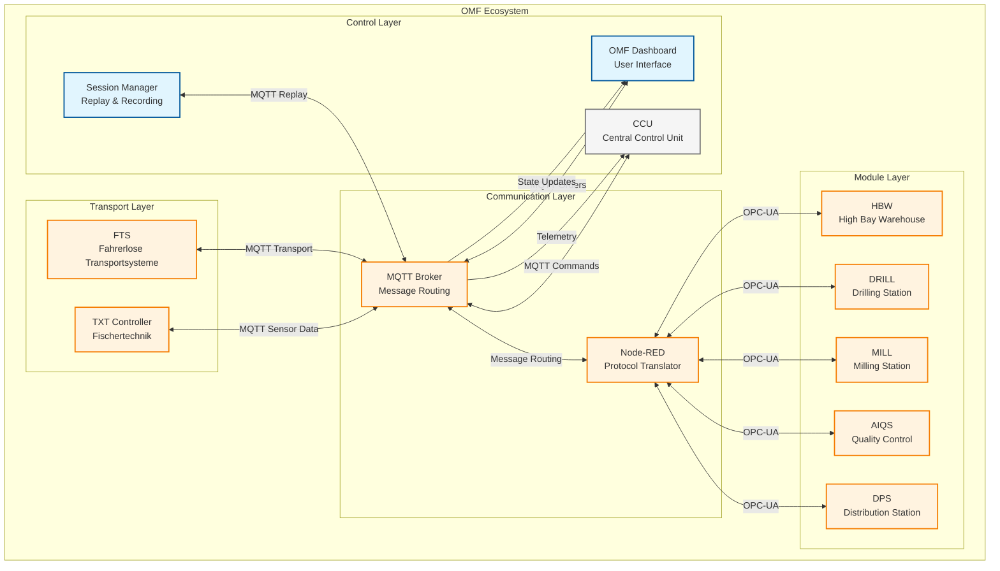

# System Context - OMF Architecture

## 🏗️ System-Kontextdiagramm

> **🔗 Integration Details:**
> - **[APS Overview](../../06-integrations/aps/README.md)** - Fischertechnik Agile Production Simulation
> - **[Node-RED Integration](../../06-integrations/node-red/README.md)** - Gateway zwischen OPC-UA und MQTT
> - **[FTS VDA 5050](../../06-integrations/fts/README.md)** - Fahrerloses Transportsystem

### ASCII-Art (Legacy)
```
┌─────────────────────────────────────────────────────────────────────────────┐
│                           OMF Ecosystem                                    │
├─────────────────────────────────────────────────────────────────────────────┤
│                                                                             │
│  ┌─────────────┐    MQTT     ┌─────────────┐    OPC-UA    ┌─────────────┐  │
│  │    CCU      │◄───────────►│  Node-RED   │◄────────────►│   Module    │  │
│  │ (Central    │             │ (Vermittler)│              │  (HBW/      │  │
│  │  Control    │             │             │              │   DRILL/    │  │
│  │  Unit)      │             │             │              │   MILL/     │  │
│  └─────────────┘             └─────────────┘              │   AIQS/     │  │
│         │                           │                     │   DPS)      │  │
│         │                           │                     └─────────────┘  │
│         │                           │                            │         │
│         │                           │                            │         │
│         ▼                           ▼                            ▼         │
│  ┌─────────────┐             ┌─────────────┐              ┌─────────────┐  │
│  │   FTS       │             │   TXT       │              │   OMF       │  │
│  │ (Fahrerlose │             │ (Controller)│              │ Dashboard   │  │
│  │  Transport) │             │             │              │             │  │
│  └─────────────┘             └─────────────┘              └─────────────┘  │
│         │                           │                            │         │
│         │                           │                            │         │
│         └───────────────────────────┼────────────────────────────┘         │
│                                     │                                      │
│                                     ▼                                      │
│                            ┌─────────────┐                                │
│                            │ Session-     │                                │
│                            │ Manager      │                                │
│                            │ (Replay &    │                                │
│                            │  Recording)  │                                │
│                            └─────────────┘                                │
└─────────────────────────────────────────────────────────────────────────────┘
```

### Mermaid-Diagramm (Modern)


## 🔄 Message-Flow-Übersicht

### 1. Order-Flow (Outbound)
```
OMF Dashboard → MQTT Order → Node-RED → OPC-UA → Module
```

**Beispiel: DRILL-Befehl**
- **Topic:** `module/v1/ff/SVR4H76449/order`
- **Payload:** `{"command": "DRILL", "type": "WHITE", "orderId": "123"}`
- **Node-RED:** Übersetzt zu OPC-UA-Call
- **Module:** Führt DRILL-Aktion aus

### 2. State-Flow (Inbound)
```
Module → OPC-UA → Node-RED → MQTT State → OMF Dashboard
```

**Beispiel: DRILL-Status**
- **Topic:** `module/v1/ff/SVR4H76449/state`
- **Payload:** `{"actionState": {"command": "DRILL", "state": "RUNNING"}}`
- **Dashboard:** Zeigt Status-Update an

### 3. HBW-Spezialfall
```
HBW → OPC-UA → Node-RED → MQTT State (Full) → Dashboard
HBW → OPC-UA → Node-RED → MQTT State (Delta) → Dashboard
```

**Erster State:** Vollständige Inventory-Liste
**Folgende States:** Nur Änderungen (Deltas)

## 🏭 Komponenten-Details

### CCU (Central Control Unit)
- **Rolle:** Zentrale Steuerung und Orchestrierung
- **MQTT-Topics:** `ccu/order/request`, `ccu/state/*`
- **Verantwortlich:** Workflow-Management, Order-Erstellung

### Node-RED
- **Rolle:** MQTT ↔ OPC-UA Vermittler
- **Verantwortlich:** 
  - MQTT-Befehle zu OPC-UA-Calls übersetzen
  - OPC-UA-Daten zu MQTT-Status aggregieren
  - Modul-spezifische State-Machine implementieren

### Module (HBW, DRILL, MILL, AIQS, DPS)
- **Rolle:** Physische Produktionsmodule
- **OPC-UA:** Direkte Hardware-Steuerung
- **MQTT:** Status-Updates über Node-RED

### FTS (Fahrerlose Transportsysteme)
- **Rolle:** Material-Transport zwischen Modulen
- **MQTT-Topics:** `fts/v1/ff/5iO4/*`
- **Verantwortlich:** Workpiece-Transport, Navigation

### TXT Controller
- **Rolle:** Fischertechnik-Controller
- **MQTT-Topics:** `/j1/txt/1/f/i/*`
- **Verantwortlich:** Sensor-Daten, Einfache Steuerung

### OMF Dashboard
- **Rolle:** Benutzer-Interface und Monitoring
- **Verantwortlich:**
  - Order-Erstellung und -Verwaltung
  - Real-time Status-Monitoring
  - Replay-System für Tests

### Session Manager
- **Rolle:** Replay und Recording-System
- **Verantwortlich:**
  - MQTT-Traffic aufzeichnen
  - Deterministische Replay-Tests
  - Session-Analyse

## 🔗 Kommunikations-Patterns

### MQTT-Topic-Struktur
```
module/v1/ff/{serial_number}/{type}
ccu/{type}/{subtype}
fts/v1/ff/{serial_number}/{type}
/j1/txt/1/f/i/{type}
```

### Message-Directions
- **Outbound:** Dashboard → Module (Orders, Commands)
- **Inbound:** Module → Dashboard (States, Status)
- **Bidirectional:** Connection-Status, Heartbeats

### Registry-Integration
- **Templates:** Definieren Nachrichtenstrukturen
- **Mappings:** Verbinden Topics mit Templates
- **Validierung:** Registry-basierte Message-Validierung

---

**"Alle Steuerung läuft über MQTT, Node-RED ist der intelligente Vermittler zur Hardware."**
