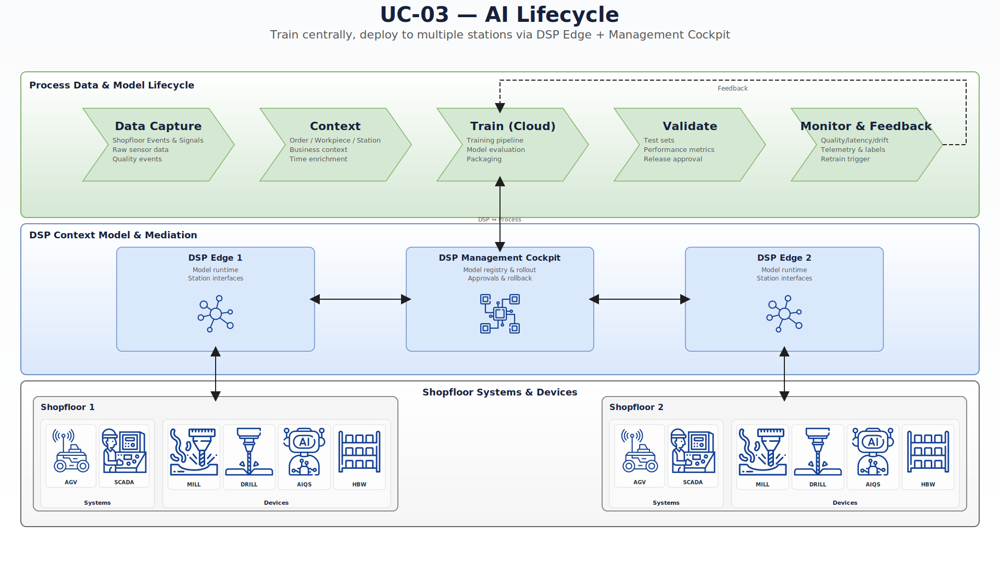
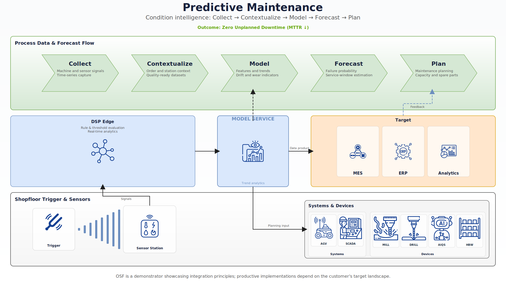

# Use-Case Inventory

**Zweck:** Übersicht aller animierten Use-Case-Diagramme mit Step 1 (erster Detail-Step) als Referenz. Unterstützt Anpassungen und die Vorbereitung neuer Use-Cases.

**Aktualisierung:** Manuell bei Änderungen an Steps oder neuer Use-Case-Implementierung. Struktur ermöglicht spätere Script-Generierung aus `steps.json`.

**Vollständige technische Doku:** [Use-Case Bibliothek](use-case-library.md)

---

## Grafische Übersicht (Overview / Step 0)

Die Use-Case-Diagramme werden zur Laufzeit generiert. Export per `node scripts/export-use-case-svgs.js`.

<table>
<tr>
<td style="vertical-align: top; padding: 12px; border: 1px solid #ddd; border-radius: 8px; width: 50%;">
<strong>UC-00: Interoperability (Event-to-Process)</strong><br/>
<br/>
<small>Overview (Step 0), EN</small>
</td>
<td style="vertical-align: top; padding: 12px; border: 1px solid #ddd; border-radius: 8px; width: 50%;">
<strong>UC-01: Track & Trace Genealogie</strong><br/>
<br/>
<small>Overview (Step 0), EN</small>
</td>
</tr>
<tr>
<td style="vertical-align: top; padding: 12px; border: 1px solid #ddd; border-radius: 8px;">
<strong>UC-02: Three Data Pools</strong><br/>
<br/>
<small>Overview (Step 0), EN</small>
</td>
<td style="vertical-align: top; padding: 12px; border: 1px solid #ddd; border-radius: 8px;">
<strong>UC-03: AI Lifecycle</strong><br/>
<br/>
<small>Overview (Step 0), EN</small>
</td>
</tr>
<tr>
<td style="vertical-align: top; padding: 12px; border: 1px solid #ddd; border-radius: 8px;">
<strong>UC-04: Closed Loop Quality</strong><br/>
<br/>
<small>Overview (Step 0), EN</small>
</td>
<td style="vertical-align: top; padding: 12px; border: 1px solid #ddd; border-radius: 8px;">
<strong>UC-05: Predictive Maintenance</strong><br/>
<br/>
<small>Overview (Step 0), EN</small>
</td>
</tr>
<tr>
<td style="vertical-align: top; padding: 12px; border: 1px solid #ddd; border-radius: 8px;">
<strong>UC-06: Process Optimization</strong><br/>
<br/>
<small>Overview (Step 0), EN</small>
</td>
<td></td>
</tr>
</table>

**Export:** `node scripts/export-use-case-svgs.js` – baut bei Bedarf, startet Server, exportiert mit Puppeteer.
Schreibt nach `osf/.../assets/svg/use-cases/` und kopiert nach `docs/assets/use-cases/uc-XX/` (Referenz für diese Übersicht).

**Hinweis:** UC-00 und UC-06 erscheinen erst nach einem Export. Falls die Bilder nicht angezeigt werden: `node scripts/export-use-case-svgs.js` ausführen.

**Voraussetzung:** Puppeteer benötigt Chrome. Falls Fehler „Could not find Chrome“:
```bash
npx puppeteer browsers install chrome
```

---

## Übersichtstabelle

| UC | Name | Route | Steps | Step 1 (erster Detail-Step) | Connection-IDs |
|----|------|-------|-------|-----------------------------|---------------|
| 00 | Interoperability | `interoperability` | 9 | Shopfloor events | – |
| 01 | Track & Trace Genealogie | `track-trace-genealogy` | 9 | Business Context | – |
| 02 | Three Data Pools | `three-data-pools` | 7 | Business data | – |
| 03 | AI Lifecycle | `ai-lifecycle` | 6 | Data Capture | uc-03-structure.config |
| 04 | Closed Loop Quality | `closed-loop-quality` | 7 | Source: Order & AIQS | uc-04-structure.config |
| 05 | Predictive Maintenance | `predictive-maintenance` | 7 | Trigger & Sensor | uc-05-structure.config |
| 06 | Process Optimization | `process-optimization` | 7 | Observe | uc-06-structure.config |

---

## UC-00: Interoperability (Event-to-Process)

- **Route:** `dsp/use-case/interoperability`
- **Ordner:** `interoperability/`
- **Steps:** 9

### Step 1: Shopfloor events

| Feld | Wert |
|------|------|
| **ID** | `uc00-01-sources-shopfloor` |
| **Titel (EN)** | Shopfloor events |
| **Beschreibung (EN)** | Events from machines, AGVs, quality checks, and sensors form the foundation for the process view. |
| **highlightIds** | `uc00_lane_machine_station`, `uc00_lane_agv_system`, `uc00_lane_quality_aiqs`, `uc00_lane_environment_sensors` |

### Besonderheiten

- Keine Connection-IDs

---

## UC-01: Track & Trace Genealogie

- **Route:** `dsp/use-case/track-trace-genealogy`
- **Ordner:** `track-trace-genealogy/`
- **Steps:** 9 (Index 0 = Overview)

### Step 1: Business Context

| Feld | Wert |
|------|------|
| **ID** | `uc01-01-business-context` |
| **Titel (EN)** | Business Context |
| **Titel (DE)** | Business Context |
| **Beschreibung (EN)** | PO, SO, CO and Production Order form the business context. |
| **highlightIds** | `uc01_lane_business`, `uc01_biz_po`, `uc01_biz_so`, `uc01_biz_co`, `uc01_biz_prod` |

### Besonderheiten

- Partiture-Diagramm mit Lanes
- Keine Connection-IDs (keine Verbindungslinien mit dim-conn)

---

## UC-02: Three Data Pools

- **Route:** `dsp/use-case/three-data-pools`
- **Ordner:** `three-data-pools/`
- **Steps:** 7
- **View-Modi:** Concept | Architecture Lanes (separate SVG-Generatoren)

### Step 1: Business data

| Feld | Wert |
|------|------|
| **ID** | `uc02-01-business-pool` |
| **Titel (EN)** | Business data |
| **Beschreibung (EN)** | ERP, orders, and material data provide the business context for KPIs. |
| **highlightIds** | `uc02_src_business`, `uc02_conn_business_norm`, … |

### Besonderheiten

- Zwei Ansichten über View-Toggle

---

## UC-03: AI Lifecycle

- **Route:** `dsp/use-case/ai-lifecycle`
- **Ordner:** `ai-lifecycle/`
- **Steps:** 6

### Step 1: Data Capture

| Feld | Wert |
|------|------|
| **ID** | `uc03-01-data-capture` |
| **Titel (EN)** | Data Capture |
| **Beschreibung (EN)** | Capture shopfloor events, signals and sensor data as the foundation for ML-ready pipelines. |
| **Connection-IDs** | `UC03_CONNECTION_IDS` in structure.config |

### Besonderheiten

- 3 Lanes: Process → DSP → Shopfloor
- Connection-IDs für dim-conn

---

## UC-04: Closed Loop Quality

- **Route:** `dsp/use-case/closed-loop-quality`
- **Ordner:** `closed-loop-quality/`
- **Steps:** 7

### Step 1: Source: Order & AIQS

| Feld | Wert |
|------|------|
| **ID** | `uc04-01-source` |
| **Titel (EN)** | Source: Order & AIQS |
| **Beschreibung (EN)** | Production order and AIQS station generate quality inspection events. Signals go to DSP Edge. |
| **Connection-IDs** | `UC04_CONNECTION_IDS` in structure.config |

---

## UC-05: Predictive Maintenance

- **Route:** `dsp/use-case/predictive-maintenance`
- **Ordner:** `predictive-maintenance/`
- **Steps:** 7

### Step 1: Trigger & Sensor

| Feld | Wert |
|------|------|
| **ID** | `uc05-01-trigger-sensor` |
| **Titel (EN)** | Trigger & Sensor |
| **Beschreibung (EN)** | Trigger active, signal triangle and vibration sensor capture data. Signals go to DSP Edge. Detect step highlighted. |
| **Connection-IDs** | `UC05_CONNECTION_IDS` in structure.config |

---

## UC-06: Process Optimization

- **Route:** `dsp/use-case/process-optimization`
- **Ordner:** `process-optimization/`
- **Steps:** 7

### Step 1: Observe

| Feld | Wert |
|------|------|
| **ID** | `uc06-01-observe` |
| **Titel (EN)** | Observe |
| **Beschreibung (EN)** | KPIs, cycle times and machine utilization from the 3 data pools meet the observation baseline. |
| **Connection-IDs** | `UC06_CONNECTION_IDS` in structure.config |

### Besonderheiten

- Prozess-Loop (Observe → Analyze → Recommend → Simulate → Execute → Feedback)
- Referenziert in A3 (KPI-to-Action)

---

## Anleitung: Neuen Use-Case hinzufügen (z.B. Process Optimization)

1. **Ordner anlegen:** `process-optimization/`
2. **Dateien:** Component, `uc-06-structure.config.ts`, `uc-06-svg-generator.service.ts`, `uc-06-i18n.service.ts`
3. **Steps:** `assets/use-cases/uc-06/uc-06-process-optimization.steps.json`
4. **Routing:** Route `process-optimization` in `use-case.routes.ts` und App-Routing
5. **Component:** `ProcessOptimizationUseCaseComponent` extends `BaseUseCaseComponent`
6. **DspUseCasesComponent:** `detailRoute: '/dsp/use-case/process-optimization'` für process-optimization-Karte
7. **UseCaseSelectorPageComponent:** Karte hinzufügen
8. **Inventory:** Zeile in Übersichtstabelle + Abschnitt „UC-06: Process Optimization“

Referenz: [Use-Case Bibliothek](use-case-library.md) § 3.1 Datei-Organisation, [UC-DIAGRAM-IMPLEMENTATION-GUIDE](../assets/use-cases/UC-DIAGRAM-IMPLEMENTATION-GUIDE.md)

---

*Erstellt: 18.02.2026*
