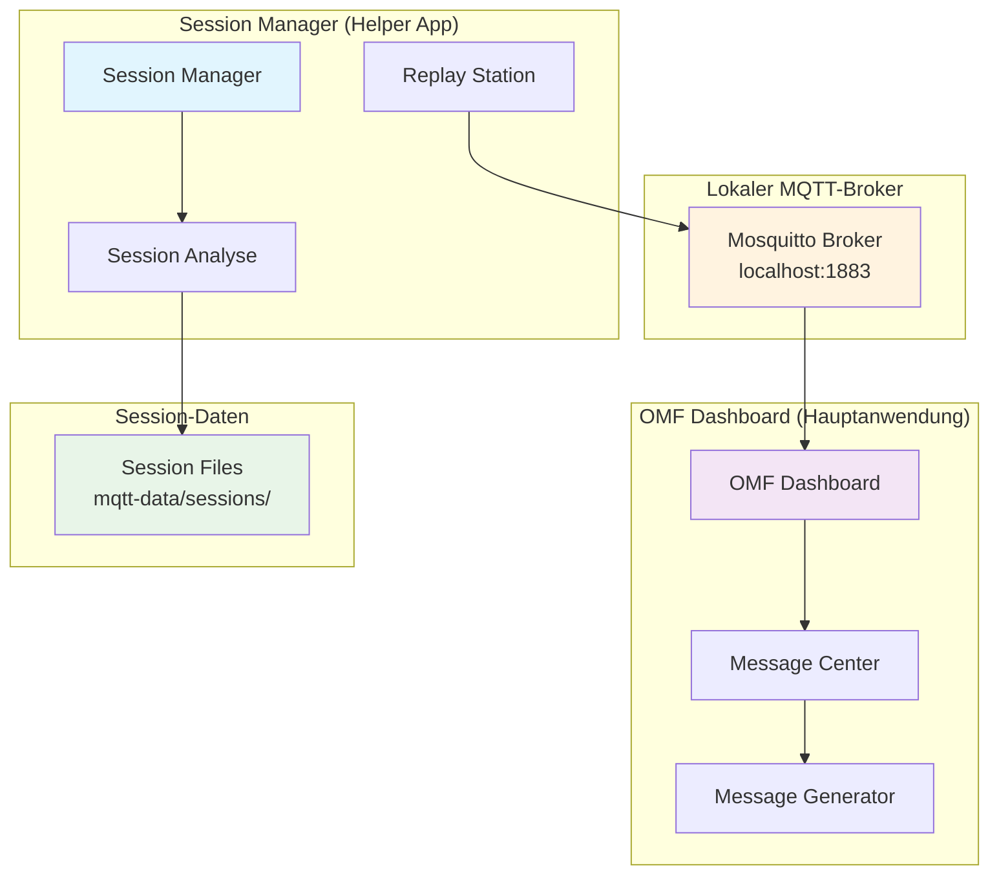

# MQTT Replay Pattern - Unabhängige Systeme

## 🎯 Übersicht

Das MQTT Replay Pattern beschreibt die **unabhängige Architektur** zwischen Session Manager, lokalem Mosquitto-Broker und OMF Dashboard für Replay-Funktionalität.

## 🏗️ System-Architektur



## 🔄 Replay-Workflow

### 1. **Session-Aufnahme** (Vergangenheit)
- **Session Manager** zeichnet MQTT-Nachrichten auf
- **Speicherung** in `mqtt-data/sessions/` als `.log` Dateien
- **Format**: JSON-basierte Logs mit Timestamp, Topic, Payload

### 2. **Session-Analyse** (Aktuell)
- **Session Manager** analysiert aufgenommene Sessions
- **Timeline-Visualisierung** der Nachrichten-Ströme
- **Topic-Filterung** und Kategorisierung
- **Vorfilter-System** für bessere Übersicht

### 3. **Replay-Simulation** (Zukunft)
- **Replay Station** lädt Session-Daten
- **Wiedergabe** über lokalen Mosquitto-Broker
- **OMF Dashboard** empfängt Nachrichten im Replay-Modus
- **Test** der Dashboard-Funktionalität ohne reale Hardware

## ⚡ Unabhängigkeit der Systeme

### **Session Manager - Unabhängig**
- **Zweck**: Analyse und Replay von Sessions
- **Keine direkte Kopplung** zum OMF Dashboard
- **Eigene Streamlit-App** (Port 8507)
- **Separate Entwicklung** und Wartung

### **OMF Dashboard - Unabhängig**
- **Zweck**: Hauptanwendung für Fabrik-Steuerung
- **Replay-Modus** über MQTT-Subscription
- **Eigene Streamlit-App** (Port 8503)
- **Separate Entwicklung** und Wartung

### **Lokaler MQTT-Broker - Verbindungselement**
- **Mosquitto Broker** auf `localhost:1883`
- **Standard MQTT-Port** (nicht Streamlit-Port)
- **Vermittler** zwischen Replay Station und Dashboard
- **Keine direkte Kopplung** zwischen den Anwendungen

## 🔧 Technische Details

### **MQTT-Kommunikation**
```python
# Replay Station sendet an lokalen Broker
mqtt_client.publish(topic, payload, qos=1)

# OMF Dashboard empfängt vom lokalen Broker
mqtt_client.subscribe(topic, qos=1)
```

### **Session-Datenformat**
```json
{
  "timestamp": "2025-08-26T16:38:54.183763+00:00",
  "topic": "ccu/order/request",
  "payload": "{\"orderId\":\"uuid-123\",\"workpieceType\":\"white\"}"
}
```

### **Replay-Timing**
- **Original-Timing**: Beibehaltung der ursprünglichen Zeitabstände
- **Beschleunigung**: Optionale Zeitraffung für Tests
- **Pause/Resume**: Kontrolle über Replay-Ablauf

## 🎯 Vorteile der Unabhängigkeit

### **1. Separate Entwicklung**
- **Session Manager** kann unabhängig weiterentwickelt werden
- **OMF Dashboard** bleibt unverändert
- **Keine Abhängigkeiten** zwischen den Systemen

### **2. Flexible Tests**
- **Replay** beliebiger Sessions möglich
- **Dashboard-Tests** ohne reale Hardware
- **Verschiedene Szenarien** testbar

### **3. Wartbarkeit**
- **Klare Trennung** der Verantwortlichkeiten
- **Einfache Debugging** bei Problemen
- **Modulare Architektur**

## 🚀 Verwendung

### **Session Manager starten**
```bash
streamlit run omf/helper_apps/session_manager/session_manager.py
```

### **OMF Dashboard starten**
```bash
streamlit run omf/omf/dashboard/omf_dashboard.py
```

### **Replay-Workflow**
1. **Session auswählen** im Session Manager
2. **Replay Station** starten
3. **OMF Dashboard** im Replay-Modus
4. **Nachrichten** werden über MQTT übertragen

## 📋 Wichtige Hinweise

- **Keine Integration**: Die Systeme sind vollständig unabhängig
- **MQTT als Verbindung**: Nur über lokalen Mosquitto-Broker
- **Separate Ports**: Session Manager (8507) vs OMF Dashboard (8503)
- **Replay-Zweck**: Nur für Tests, nicht für Produktion

## 🔗 Verwandte Dokumentation

- **[Session Manager README](../omf/helper_apps/session_manager/README.md)**
- **[OMF Dashboard README](../omf/omf/dashboard/README.md)**
- **[MQTT Integration Guide](./mqtt-integration-guide.md)**
- **[Project Overview](../PROJECT_OVERVIEW.md)**