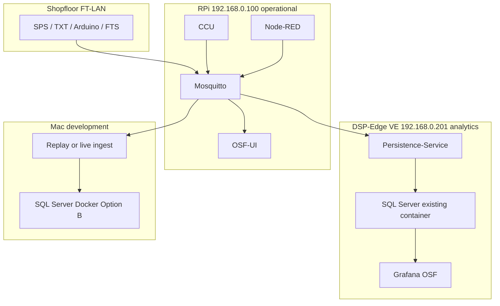

# DSP-Edge: wo läuft was (OSF Persistence + Grafana)

**Stand:** 25.08.2026 · **Bezug:** [DR-28](../../03-decision-records/28-edge-persistence-stack-and-metrics-model.md) · [Netzwerk-Topologie](../setup/orbis-shopfloor-network-topology.md) · [Live-Checkliste FT-LAN](./edge-persistence-live-ft-lan.md) · [Stack-Diagramme (Modi)](../../02-architecture/edge-persistence-stack-diagrams.md)

Shopfloor-Steuerung bleibt auf dem **APS-RPi**. Längere Historie (NFC-Spur, Sensorik, Soll/Ist) und **Grafana** gehören auf den **DSP-Edge** (Linux-VE `192.168.0.201`). OSF-UI verlinkt DSP-Edge (`dspEdgeUrl` → Proxmox `.200:8006`) und Analytics (`bpAnalyticsApplicationUrl` → `http://192.168.0.201:3000/dashboards`).

**Grafana:** eine Installation — **unsere** Dashboards ersetzen die bisherige Instanz auf `:3000` (alter Container gestoppt).  
**Datenbank (Ziel Prod):** **Microsoft SQL Server** auf dem **bestehenden** Container der VE — **neues** OSF-DB/Schema (nicht Postgres/Timescale auf `.201`).  
**Entwicklung:** zuerst **localhost / Docker** bis Anforderungen stabil; **Option B:** lokal ebenfalls SQL Server (gleicher Dialekt wie Prod), parallel kann der bestehende Postgres/Timescale-Stack für Replay weiterlaufen, bis die Portierung fertig ist.

Zugänge Proxmox / VE / SQL, siehe: [Netzwerk-Topologie – DSP Edge](../setup/orbis-shopfloor-network-topology.md#dsp-edge--proxmox--ve).

---

## Was wo läuft



| Host | Funktion | Dienste / Container (Stand 25.08.2026) |
|------|----------|----------------------------------------|
| **RPi `.100`** | Steuerung, Broker, Live-UI | Compose APS: CCU, Frontend `:80`, MQTT `:1883`/WS `:9001`, Node-RED `:1880`, OSF-UI `:8080`, Intake-Bridge live |
| **Proxmox `.200`** | Hypervisor DSP-Edge | UI **`:8006`** |
| **Linux-VE `.201`** | Analytics / DSP-Runtime | SQL Server Container **`rittal_sqlserver`** Host-Port **`:1433`**; Grafana-Ziel **`:3000`** (frei); Docker/Compose ok; DSP-Agent/DISI/EdgeRouter laufen |
| **local PC / Mac** | Dev bis Anforderungen stabil | `osf-edge-persistence/` Replay/`env.live`; Ziel-Dev-DB = SQL Server (Option B) |

Persistence **publiziert nicht** auf MQTT (nur Subscribe).

---

## Inventar VE `.201` (25.08.2026, SSH `pocadm`)

Selbst geprüft — DSP-Kollegen für Betriebsfreigabe/DB-Namen trotzdem kurz informieren.

| Thema | Ergebnis |
|-------|----------|
| OS | Ubuntu 24.04, amd64, ~97 GB Disk (~33 % belegt), RAM unkritisch |
| Docker | **29.3.0**, Compose **v5.1.0**, Socket aktiv |
| Rechte | `pocadm` in Gruppe **`docker`** (+ `sudo`) |
| Image-Pull | Outbound **docker.io** und **mcr.microsoft.com** erreichbar |
| SQL | Container **`rittal_sqlserver`** = `mcr.microsoft.com/mssql/server:2022-latest`, **Up**, Mapping **`0.0.0.0:1433→1433`** (nicht `:1443`) |
| Grafana | Container `grafana/grafana` vorhanden, **Exited** seit ~5 Monaten → **`:3000` frei** zum OSF-Replace |
| DSP | laufend u. a. `dsp-agent`, `dsp-edgerouter`, DISI/DISC (Images aus `acrdspmcprod01.azurecr.io`) — unberührt lassen |

### Name `rittal_sqlserver`

Der Container-Name klingt nach einer **Kunden-/Demo-Instanz (Rittal)**, nicht nach einer OSF-eigenen DB. Fachlich: **dieselbe SQL-Server-Instanz mitnutzen**, aber **eigene Datenbank/Schema für OSF** anlegen — keine Rittal-Tabellen anfassen. Ob der Name historisch ist oder wirklich Kundendaten enthält, kurz mit DSP klären (Inhalt/Backup), technisch aber: neuer DB-Name z. B. `osf_edge`.

**Hinweis Doku vs. Ist:** ältere Notizen nannten Host-Port **`:1443`** — Ist ist **`:1433`**. Von außen `:1443` = connection refused war deshalb erwartbar.

---

## Abgestimmte Zielarchitektur (OSF ↔ DSP, 25.08.2026)

1. Persistence-Service, Grafana und (nur lokal) ggf. Dev-SQL als **Docker** auf **`.201`** bzw. Mac.  
2. **Prod-DB = SQL Server** auf bestehendem Container **`:1433`**, **neues** OSF-DB/Schema.  
3. Dev zuerst **localhost/Docker** (Option B: lokal SQL Server), Deploy auf VE wenn Anforderungen stabil.  
4. Grafana **`:3000`** = eine OSF-Instanz (ersetzt Alt-Container).  
5. MQTT read-only von RPi **`.100:1883`**.

### Noch offen (nicht Inventar)

| Offen | Wer |
|-------|-----|
| Freigabe: OSF-DB auf Instanz `rittal_sqlserver` + Name/Owner der DB | DSP kurz bestätigen |
| App-User (nicht dauerhaft `sa`) für Persistence/Grafana | DSP / OSF gemeinsam |
| Compose-Deploy Persistence + Grafana auf `.201` (Images, Env, MQTT) | OSF |
| Schema-Portierung Postgres → T-SQL + Persistence-Treiber `mssql` | OSF (nach stabilem lokalen SQL-Server-Dev) |
| Inhalt/Zweck von `rittal_sqlserver` (nur Name vs. Kundendaten) | DSP |
| Mac-Live-Tunnel entfällt erst mit Persistence auf `.201` | — |

---

## Container: lokal heute vs. Ziel `.201`

**Lokal (aktueller Compose, Übergang):** Postgres/Timescale + Grafana + Persistence — funktioniert für Replay/Live-Mac.

**Lokal Option B (Dev, parallel):** SQL Server 2022 Container `osf-edge-mssql` (Compose-Profil `mssql`, Host **`:1433`**). Start:

```bash
cd osf-edge-persistence
# MSSQL_* in .env (siehe env.live)
docker compose --profile mssql up -d mssql
bash scripts/mssql-smoke.sh
```

Apple Silicon: Image `linux/amd64` (Rosetta). Schema: `bash scripts/mssql-init-schema.sh` → DB `osf_edge` (`db/mssql/`). Persistence-/Grafana-Anbindung folgen; Postgres-Stack bleibt bis dahin der Demo-Pfad.

**Ziel `.201`:**

| Container | Rolle | Port (Host) |
|-----------|-------|-------------|
| *(bestehend)* `rittal_sqlserver` | SQL Server 2022 | **1433** |
| `osf-edge-grafana` | Grafana OSF | **3000** |
| `osf-edge-persistence-service` | MQTT-Ingest → SQL Server | — |

Datenfluss Ziel: **MQTT `.100` → Persistence → SQL Server → Grafana**.

---

## Phasen

1. **Jetzt:** Mac localhost/Docker; Live FT-LAN optional via Tunnel; Postgres-Stack noch ok für Demo.  
2. **Option B (Dev):** lokaler SQL-Server-Container; Schema + Queries + Persistence auf MSSQL portieren.  
3. **`.201`:** Persistence + Grafana deployen; an bestehende SQL-Instanz `:1433` (OSF-DB); kein Mac-Tunnel mehr.
