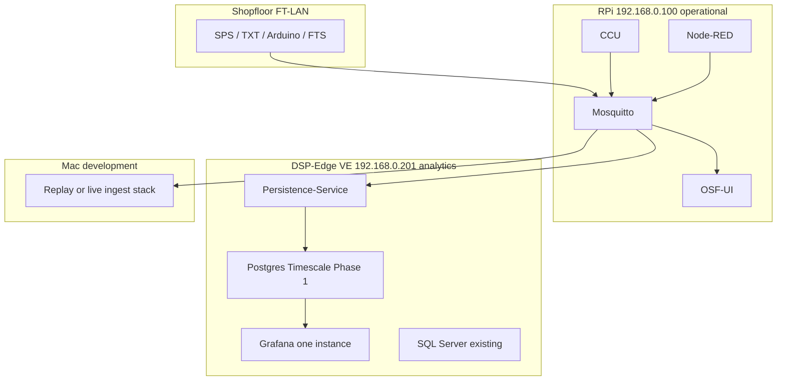

# DSP-Edge: wo läuft was (OSF Persistence + Grafana)

**Stand:** 24.08.2026 · **Bezug:** [DR-28](../../03-decision-records/28-edge-persistence-stack-and-metrics-model.md) · [Netzwerk-Topologie](../setup/orbis-shopfloor-network-topology.md) · [Live-Checkliste FT-LAN](./edge-persistence-live-ft-lan.md) · [Stack-Diagramme (Modi)](../../02-architecture/edge-persistence-stack-diagrams.md)

Shopfloor-Steuerung bleibt auf dem **APS-RPi**. Längere Historie (NFC-Spur, Sensorik, Soll/Ist) und **Grafana** gehören auf den **DSP-Edge** (Linux-VE `192.168.0.201`). OSF-UI verlinkt DSP-Edge (`dspEdgeUrl` → Proxmox `.200:8006`) und Analytics (`bpAnalyticsApplicationUrl` → `http://192.168.0.201:3000/dashboards`).

**Grafana:** eine Installation — **unsere** Dashboards ersetzen die bisherige Instanz auf `:3000`.  
**Datenbank:** zuerst **PostgreSQL + Timescale** (unabhängig). Perspektivisch Anbindung an den **vorhandenen SQL Server** `.201:1443` möglich.

Zugänge Proxmox / VE / SQL, die wir schon kennen: [Netzwerk-Topologie – DSP Edge](../setup/orbis-shopfloor-network-topology.md#dsp-edge--proxmox--ve) (nicht hier duplizieren).

---

## Was wo läuft

| Host | Funktion | Dienste / Container (Stand Repo) |
|------|----------|----------------------------------|
| **RPi `.100`** | Steuerung, Broker, Live-UI | Compose `integrations/APS-CCU/docker-compose-prod.yml`: `central-control-prod` (CCU), `central-control-frontend-prod` **`:80`**, `mqtt-broker-prod` **`:1883` / WS `:9001`**, `nodered-prod` **`:1880`**, `osf-ui-prod` **`:8080`**, optional `osf-workpiece-intake-bridge-prod` (Image vorbereitet, Deploy oft noch offen) |
| **Proxmox `.200`** | Hypervisor DSP-Edge | UI **`:8006`** — kein App-Stack |
| **Linux-VE `.201`** | Analytics / DSP-Runtime | **Bekannt:** SQL Server **`:1443`**. **Ziel:** Grafana **`:3000`** (eine Instanz, OSF) + Persistence + Postgres (Phase 1). **Unklar:** aktuelles `docker ps` / systemd — siehe [Fragen](#fragen-an-dsp-edge) |
| **Mac** | Replay + erster Live-Ingest im FT-LAN | `osf-edge-persistence/` gegen lokalen Broker (`env.replay`) oder `.100` (`env.live`) |

Persistence **publiziert nicht** auf MQTT (nur Subscribe). Die VE `.201` ist im FT-LAN; OSF-UI verlinkt sie bereits.

---

## Container des OSF-Persistence-Stacks (`osf-edge-persistence/`)

Gleicher Compose lokal und später auf `.201`:

| Container | Rolle | Port (Host) | Funktion |
|-----------|-------|-------------|----------|
| `osf-edge-postgres` | TimescaleDB pg16 | **5432** | Shopfloor-Events, Werkstücke, Sensor-Snapshots, MQTT-Roharchiv |
| `osf-edge-grafana` | Grafana | **3000** | Workpiece Trace, Systemstatus (MQTT Topics raw), Sensorik, Orders |
| `osf-edge-persistence-service` | eigener Build | — | Ingest read-only; Live: `MQTT_HOST=192.168.0.100` |

Datenfluss: **MQTT Broker → Persistence → Postgres → Grafana**. OSF-UI bleibt RAM-Track&Trace; lange NFC-Historie = Grafana.

RPi-MQTT für den Ingest: Host `.100`, Port `1883`, User/Pass laut APS-Compose `default` / `default` (siehe `docker-compose-prod.yml`).

Lokale Grafana-Defaults (Compose `.env`): User `admin` / Pass `admin`, plus anonyme Admin-Rolle für Demo. Auf `.201` eigene Secrets setzen.

---

## Was auf `.201` wir *nicht* aus dem Repo wissen

Die VE ist DSP-seitig betrieben. Im Repo stehen SSH-User und SQL-`sa` (Topologie), **kein** aktuelles Container-/systemd-Inventar. Grafana `:3000` war im Juli oft **connection refused** — Dienst nicht zwingend aktiv.

| Thema | Bekannt | Noch klären |
|-------|---------|-------------|
| Erreichbarkeit `.201` im FT-LAN | ja (OSF-Links, Ping-Historie in der Topologie) | — |
| SQL Server `:1443` | Container existiert, `sa` in der Topologie | ob der Port von außen offen ist; welcher User später für OSF |
| Grafana `:3000` | Ziel-URL in OSF-UI / Topologie | Prozess oder Container? dürfen wir ersetzen? |
| Docker / Compose auf der VE | nicht dokumentiert | installiert? Outbound-Pull? |
| SSH | `pocadm`, `dsp-agent` in der Topologie | gelten die noch? Docker-Rechte? Deploy-User? |
| Platte / RAM | — | grobe freie GB für 3 Container |

---

## Fragen an DSP-Edge

Für die Abstimmung (Inventar und Rechte — nicht die Erreichbarkeit von `.201`):

1. **Inventar `.201`:** Welche Container / Services laufen (`docker ps -a`, relevante systemd-Units)? Wer patcht die VE?
2. **SSH:** Gelten `pocadm` / `dsp-agent` noch, oder gibt es einen OSF-Deploy-User mit Docker-Rechten?
3. **Grafana `:3000`:** Läuft dort schon etwas? Wir ersetzen das durch **eine** OSF-Grafana-Instanz (Compose). Konflikt mit einem vorhandenen Container auf 3000?
4. **Docker:** Compose v2 vorhanden? Outbound-Pull (`docker.io` / ggf. GHCR) von der VE aus möglich?
5. **SQL Server `:1443`:** bleibt parallel; OSF schreibt Phase 1 **nicht** dorthin. Später: welcher DB-User (nicht unbedingt `sa`) für eine OSF-Datenbank?
6. **Platte / RAM:** grobe freie GB und ob 3 Container (Postgres + Grafana + Node-Ingest) unkritisch sind.

Kurzfassung zum Kopieren:

> Wir wollen denselben OSF-Stack (Grafana :3000, Postgres/Timescale, Persistence-Service, MQTT read-only vom RPi .100) auf der Linux-VE .201 betreiben. Eine Grafana-Instanz, ersetzt was ggf. auf :3000 liegt. Postgres neu und unabhängig; SQL Server :1443 bleibt, Anbindung später. Bitte Inventar (`docker ps -a` / systemd), ob Docker/Compose und Image-Pull gehen, ob :3000 frei bzw. ersetzbar ist, und welcher SSH-User Docker darf.

---

## Phasen

1. **Jetzt / FT-LAN:** Ingest auf dem **Mac** (`env.live`), Broker `.100`; optional OSF-UI-Update auf dem RPi.  
2. **DSP `.201`:** denselben Compose-Stack; Grafana übernimmt `:3000`; Postgres neu.  
3. **Später:** Persistenz auf SQL Server, wenn Schema/Rechte stehen; Grafana bleibt die eine OSF-Instanz.
