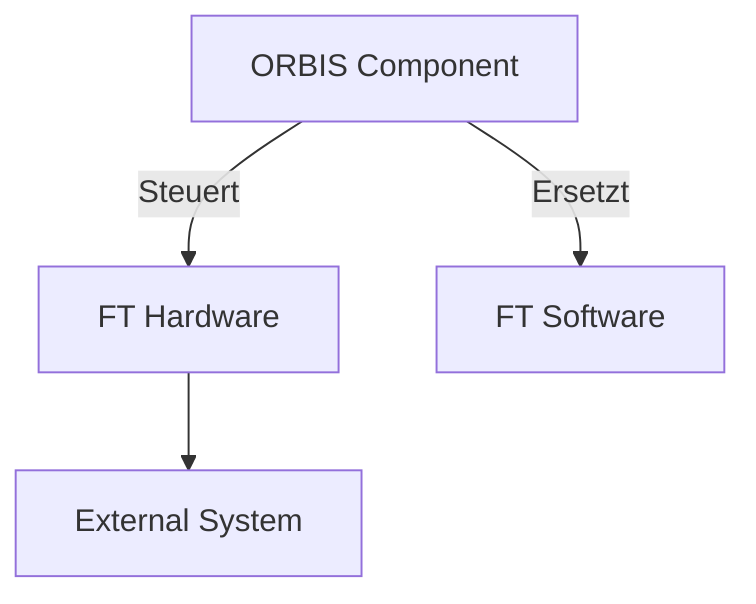

# Cursor AI Mermaid Diagramm Regeln

**Zielgruppe:** Cursor AI Assistant  
**Letzte Aktualisierung:** 20.09.2025

## 🎯 Ziel

Konsistente Mermaid-Diagramme für die OSF-Dokumentation erstellen mit klarer Farbzuordnung zwischen ORBIS-Komponenten, Fischertechnik Hardware/Software und externen Systemen.

## 🎨 Farbpalette (4-Farb-System)

### **1. ORBIS-Komponenten (Blau-Ton)**
- `#e3f2fd` - Sehr helles Blau (OSF Dashboard, Session Manager)
- `#bbdefb` - Mittleres Blau (Helper Apps, MessageGenerator)
- `#90caf9` - Dunkleres Blau (Kritische ORBIS-Komponenten)

### **2. Fischertechnik Hardware - BEHALTEN (Gelb-Ton)**
- `#fff8e1` - Sehr helles Gelb (DRILL, MILL, DPS Module)
- `#ffecb3` - Mittleres Gelb (TXT Controller, Raspberry Pi)
- `#ffc107` - Dunkleres Gelb (Kritische Hardware-Komponenten)

### **3. Fischertechnik Software - TEILWEISE ERSETZEN (Rot-Ton)**
- `#ffebee` - Sehr helles Rot (Node-RED Flows)
- `#ffcdd2` - Mittleres Rot (VDA5050 Implementation)
- `#ef5350` - Dunkleres Rot (Legacy Software)

### **4. Externe Systeme (Lila-Ton)**
- `#f3e5f5` - Sehr helles Lila (MQTT Broker, Datenbanken)
- `#e1bee7` - Mittleres Lila (APIs, Interfaces)
- `#ce93d8` - Dunkleres Lila (Externe Services)

## 📋 Cursor AI Regeln

### **Farbzuordnung:**
- **ORBIS Komponenten:** Immer Blau-Töne (#e3f2fd, #bbdefb, #90caf9)
- **Fischertechnik Hardware (BEHALTEN):** Immer Gelb-Töne (#fff8e1, #ffecb3, #ffc107)
- **Fischertechnik Software (TEILWEISE ERSETZEN):** Immer Rot-Töne (#ffebee, #ffcdd2, #ef5350)
- **Externe Systeme:** Immer Lila-Töne (#f3e5f5, #e1bee7, #ce93d8)

### **Hardware vs Software Unterscheidung:**
- **Hardware (Gelb):** DRILL, MILL, DPS Module, TXT Controller, Raspberry Pi
- **Software (Rot):** Node-RED Flows, VDA5050 Implementation, Legacy Software

### **Regeln:**
1. **Maximal 4 Farben** pro Diagramm
2. **Konsistente Zuordnung** - nie ORBIS in Gelb/Rot
3. **Helle Töne verwenden** - nicht zu bunt
4. **Hardware vs Software klar unterscheiden**
5. **Styling am Ende** - alle style-Definitionen nach dem Graph
6. **KEINE Kommentare in style-Zeilen** - Mermaid unterstützt keine Kommentare nach `fill:#color`

## 🎯 Standard-Template

```markdown
# Diagramm-Name


```

**Test-Datei:** Siehe `docs/mermaid-test/test-color-rules.md` für funktionierende Beispiele  
**Vollständiger Style-Guide:** Siehe `mermaid-style-guide.md` für professionelle Diagramm-Regeln

## 🔧 Praktische Beispiele

### **Beispiel 1: Aktuelle Architektur**
```markdown
# Aktuelle APS Architektur

```mermaid
graph TD
    A[Node-RED] -->|Steuert| B[DRILL Module]
    A -->|Steuert| C[MILL Module]
    A -->|Läuft auf| D[Raspberry Pi]
    
    style A fill:#ffebee  # FT Software (wird ersetzt)
    style B fill:#fff8e1  # FT Hardware (bleibt)
    style C fill:#fff8e1  # FT Hardware (bleibt)
    style D fill:#fff8e1  # FT Hardware (bleibt)
```
```

### **Beispiel 2: Ziel-Architektur**
```markdown
# Ziel-Architektur mit OSF

```mermaid
graph TD
    A[OSF Dashboard] -->|Steuert| B[DRILL Module]
    A -->|Steuert| C[MILL Module]
    A -->|Läuft auf| D[Raspberry Pi]
    
    style A fill:#e3f2fd  # ORBIS (neue Lösung)
    style B fill:#fff8e1  # FT Hardware (bleibt)
    style C fill:#fff8e1  # FT Hardware (bleibt)
    style D fill:#fff8e1  # FT Hardware (bleibt)
```
```

## 🚨 Wichtige Hinweise für Cursor AI

### **NIEMALS:**
- ORBIS-Komponenten in Gelb oder Rot färben
- Fischertechnik Hardware in Rot färben (nur Software wird ersetzt)
- Mehr als 4 Farben in einem Diagramm verwenden
- Zu dunkle oder zu bunte Farben verwenden

### **IMMER:**
- Klare Hardware vs Software Unterscheidung
- Konsistente Farbzuordnung über alle Diagramme
- Helle, dezente Farbtöne verwenden
- Style-Definitionen am Ende des Diagramms

### **Bei Unsicherheit:**
- Standard-Template verwenden
- Diese Regeln als Referenz nutzen
- Bei Fragen: User fragen statt raten

---

*Teil der OSF-Dokumentation | [Zurück zur Hauptdokumentation](../../../README.md)*
