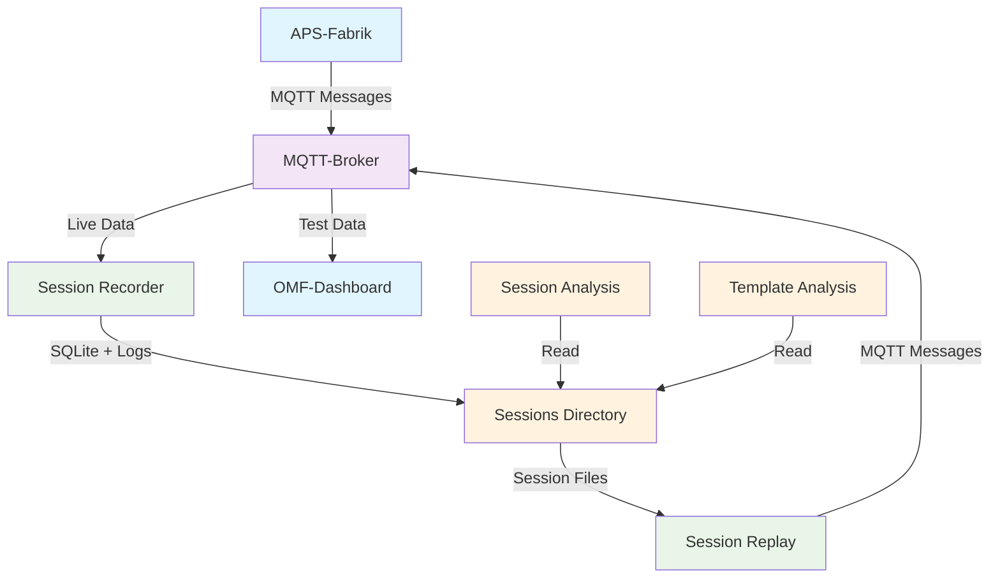

# Mermaid Cursor-Anweisungen

**Zielgruppe:** Cursor AI Assistant  
**Letzte Aktualisierung:** 20.09.2025

## 🎯 Ziel

Standardisierte Anweisungen für Cursor bei der Erstellung von Mermaid-Diagrammen im OMF-Projekt.

## 📋 Cursor-Anweisungen

### **Für Mermaid-Diagramm-Erstellung:**

1. **Dateistruktur verwenden:**
   - **Lokale Diagramme:** `docs/<section>/diagrams/`
   - **Shared Diagramme:** `docs/_shared/diagrams/`
   - **Markdown-Dateien:** `.md` mit Mermaid-Code-Blöcken

2. **Naming Convention:**
   - **Dateien:** `kebab-case.md`
   - **Beispiele:** `system-overview.md`, `message-flow.md`
   - **Versionierung:** `deployment_v2.md` oder `deployment_2025-09.md`

3. **OMF-Farbpalette verwenden:**
   ```mermaid
   graph TD
       A[OMF-Komponenten] -->|Action| B[MQTT-Broker]
       style A fill:#e1f5fe  # Blau
       style B fill:#f3e5f5  # Lila
   ```

4. **Standard-Farben:**
   - **OMF-Komponenten:** `#e1f5fe` (Blau)
   - **MQTT-Broker:** `#f3e5f5` (Lila)
   - **Session-Tools:** `#e8f5e8` (Grün)
   - **Data-Storage:** `#fff3e0` (Orange)
   - **Analysis-Tools:** `#fff3e0` (Orange)
   - **External Systems:** `#fce4ec` (Pink)

5. **Markdown-Template verwenden:**
   ```markdown
   # Diagramm-Name
   
   ```mermaid
   graph TD
       A[Start] --> B[Process]
       B --> C[End]
       
       style A fill:#e1f5fe
       style B fill:#e8f5e8
       style C fill:#fff3e0
   ```
   
   ## Usage
   
   ### In Markdown referenzieren:
   ```markdown
   
   ```
   
   ---
   
   *Teil der OMF-Dokumentation | [Zurück zur README](../../README.md)*
   ```

## 🔧 Workflow

### **1. Diagramm erstellen:**
- **Entscheiden:** Lokal oder Shared?
- **Datei erstellen:** In entsprechendem Verzeichnis
- **Markdown-Template** verwenden

### **2. Mermaid-Code schreiben:**
- **OMF-Farbpalette** verwenden
- **Konsistente Styling** anwenden
- **Klare Beschriftungen** verwenden

### **3. Testen:**
- **Markdown Preview** (`Strg+Shift+V`)
- **Farben überprüfen**
- **Layout optimieren**

### **4. Referenzieren:**
- **In anderen Markdown-Dateien** verlinken
- **Relative Pfade** verwenden
- **Konsistente Naming**

## 📋 Beispiele

### **System Overview:**


### **Simple Flow:**


## 🔗 Verweise

- **Hybrid-Modell:** `mermaid-setup.md`
- **Test-Diagramme:** `docs/mermaid-test/`
- **Shared Diagramme:** `docs/_shared/diagrams/`

---

*Teil der OMF-Dokumentation | [Zurück zur README](../../README.md)*
