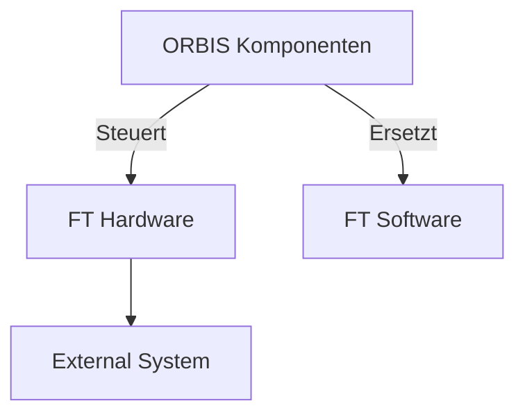
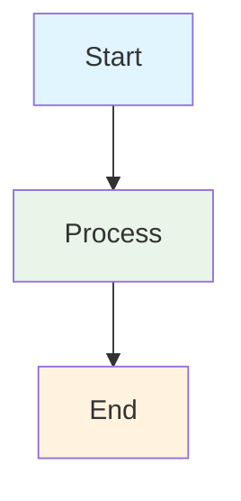
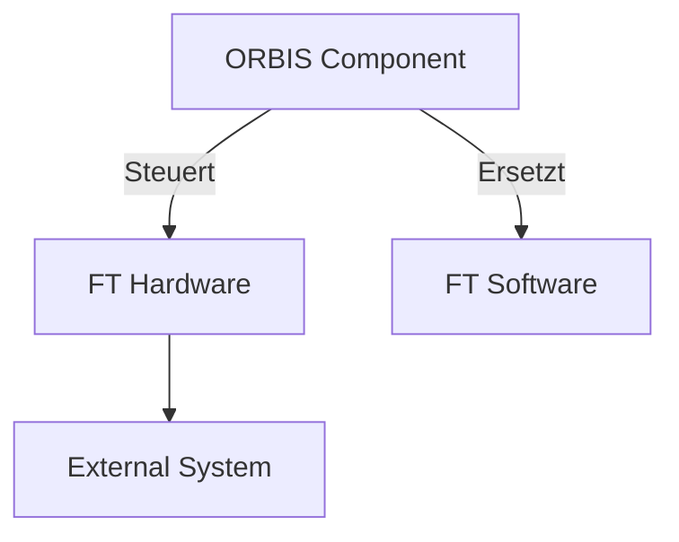

# Mermaid Setup Guide

**Zielgruppe:** Entwickler  
**Letzte Aktualisierung:** 20.09.2025

## 🎯 Ziel

Mermaid-Diagramme in separate `.mermaid` Dateien auslagern und IDE-Einrichtung für optimales Arbeiten mit Diagrammen.

## 🔧 VSCode Extensions

### **Empfohlene Extension:**

**"Markdown Preview Mermaid Support"** (`bierner.markdown-mermaid`)
- **Zweck:** Mermaid in Markdown-Dateien
- **Features:** 
  - ✅ Mermaid-Rendering in Markdown Preview
  - ✅ Syntax-Highlighting für Mermaid-Code-Blöcke
  - ✅ Live Preview mit Strg+Shift+V
  - ✅ Funktioniert zuverlässig
  - ✅ Keine CLI-Installation nötig

### **Installation:**
```bash
# Über VSCode Extensions Panel
# Suche nach: "Markdown Preview Mermaid Support"
# Installiere: bierner.markdown-mermaid
```

### **Hinweis:**
- **Separate .mermaid Dateien funktionieren nicht** zuverlässig in VSCode
- **Markdown-Dateien mit Mermaid-Code-Blöcken** sind die beste Lösung

## 📁 Dateistruktur (Einfaches Modell)

### **Mermaid-Dateien:**
```
docs/
├── 01-strategy/
│   ├── diagrams/              # Lokale Diagramme (Markdown)
│   └── strategy.md
├── 02-architecture/
│   ├── diagrams/              # Lokale Diagramme (Markdown)
│   └── architecture.md
├── 04-howto/
│   ├── diagrams/              # Lokale Diagramme (Markdown)
│   └── pairing.md
├── _shared/
│   └── diagrams/              # Shared Diagramme (Markdown)
└── 04-howto/development/
    └── mermaid-setup.md       # Diese Anleitung
```

### **Naming Convention:**
- **Dateien:** `kebab-case.md`
- **Beispiele:** `system-overview.md`, `message-flow.md`
- **Verzeichnisse:** `kebab-case/`

## 🎨 Styling-Standards

### **OSF-Farbpalette (4-Farb-System):**


### **Standard-Farben:**
- **ORBIS-Komponenten:** `#e3f2fd` (Sehr helles Blau) - OSF Dashboard, Session Manager
- **Fischertechnik Hardware (BEHALTEN):** `#fff8e1` (Sehr helles Gelb) - DRILL, MILL, DPS Module
- **Fischertechnik Software (ERSETZEN):** `#ffebee` (Sehr helles Rot) - Node-RED, VDA5050
- **Externe Systeme:** `#f3e5f5` (Sehr helles Lila) - MQTT Broker, Datenbanken

### **Hardware vs Software Unterscheidung:**
- **Hardware (Gelb):** DRILL, MILL, DPS Module, TXT Controller, Raspberry Pi
- **Software (Rot):** Node-RED Flows, VDA5050 Implementation, Legacy Software

## 🔄 Workflow

### **1. Diagramm erstellen:**
```bash
# Neue Markdown-Datei erstellen
touch docs/_shared/diagrams/system-overview.md
```

### **2. Mermaid-Code schreiben:**
```markdown
# System Overview


```

### **3. Preview testen:**
- **Strg+Shift+V** für Markdown Preview
- **Diagramm wird gerendert** ✅

### **4. In anderen Dateien referenzieren:**
```markdown

```

## 🧪 Testing

### **Test-Diagramme:**
- **Session Manager:** `docs/mermaid-test/test-hybrid.md`
- **Farben:** Alle Standard-Farben testen
- **Preview:** Strg+Shift+V testen

### **Cross-Platform Testing:**
- **macOS:** VSCode mit "Markdown Preview Mermaid Support"
- **Windows:** VSCode mit "Markdown Preview Mermaid Support"
- **Linux:** VSCode mit "Markdown Preview Mermaid Support"

## 📋 Cursor-Anweisungen

### **Für Mermaid-Diagramm-Erstellung:**

1. **Markdown-Datei erstellen:** `.md` Extension verwenden
2. **Mermaid-Code in Code-Block** schreiben
3. **Farben anwenden:** OSF-Farbpalette verwenden
4. **Styling:** Konsistent mit Standards
5. **Naming:** Kebab-case für Dateien

### **Standard-Template:**
```markdown
# Diagramm-Name


```

## 🔗 Verweise

- **Shared Diagramme:** `docs/_shared/diagrams/`
- **Lokale Diagramme:** `docs/<section>/diagrams/`
- **Node-RED Diagramme:** `docs/06-integrations/node-red/*.mermaid`
- **Styling-Standards:** Diese Datei
- **Vollständiger Style-Guide:** `mermaid-style-guide.md`
- **Cursor AI Regeln:** `cursor-ai-mermaid-rules.md`

---

*Teil der OSF-Dokumentation | [Zurück zur Hauptdokumentation](../../../README.md)*
