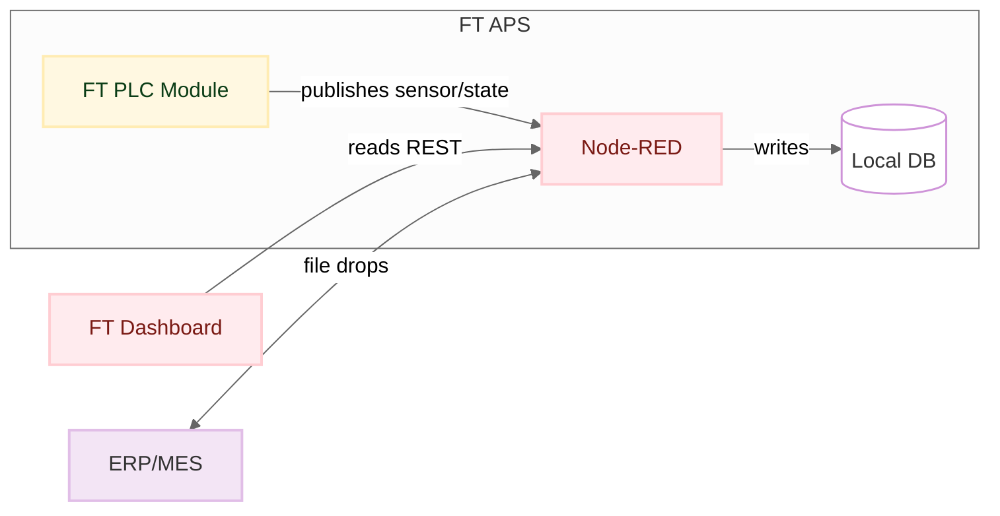
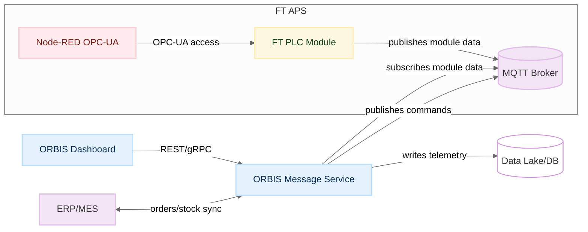
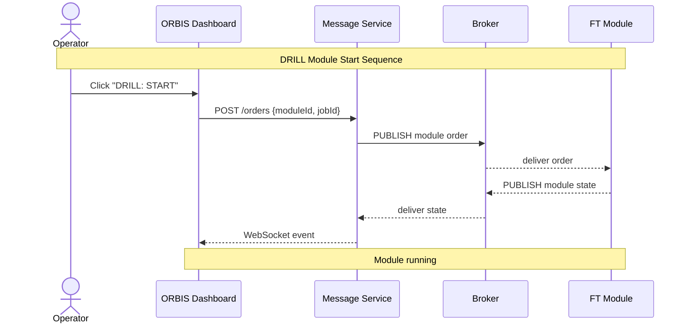
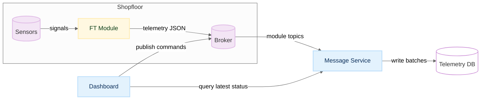

# Mermaid Style Guide - ORBIS Modellfabrik

**Zielgruppe:** Entwickler & Dokumentation  
**Letzte Aktualisierung:** 20.09.2025

> **Kurz & praxisnah** – kompakter Style-Guide für Diagramme (Mermaid-first), plus sofort nutzbare Snippets.

## 🎯 Prinzipien

* **Ein Gedanke pro Diagramm.** (Context ODER Container ODER Sequenz ODER DFD – nicht mischen.)
* **Konsistente visuelle Sprache.** Farben & Formen bedeuten immer dasselbe.
* **Leserichtung links→rechts.** Vermeidet Kreuzungen wo möglich; max. 7–10 primäre Elemente pro Bild (Ausnahmen erlaubt).
* **Legende & Datum.** Jede Grafik hat Legende, Stand (z. B. „2025-09"), Version.
* **As-Is ≠ To-Be.** Nie zwei Zustände in einem Bild „vermischen" – entweder getrennt oder mit klarer Änderungsnotation.

## 📊 Sichten (empfohlener Katalog)

* **C4-Kontext** (Wer spricht mit wem?): APS, ERP/MES, Edge, Cloud, Nutzerrollen.
* **C4-Container** (Systemblöcke/Deployable Artifacts): Broker, Services, Dashboards, PLCs/FT-Module.
* **Komponenten / Schnittstellen** (Detail in einem Container): Topics/REST/DB-Tabellen.
* **Sequenzdiagramme** (Abläufe): MQTT-Flows (PUBLISH/SUBSCRIBE/ACK), Zustandswechsel.
* **DFD / Datenflüsse** (Payload-Wege): Sensordaten, Zustände, Bestellungen, Lagerbestände.

## 🎨 Notation & Farben (konsequent!)

### **Formen:**
* Rechteck = Software/Service
* Zylinder = Datenablage  
* Rhombus = Entscheidung/Router
* Abgerundetes Rechteck = Akteur/Gerät

### **Farben (Color-blind-safe mit OMF-Farbpalette):**
* **Blau** = ORBIS-Komponenten (OMF Dashboard, Session Manager, Helper Apps)
* **Gelb** = Fischertechnik Hardware (DRILL, MILL, DPS Module, TXT Controller, RPi)
* **Rot** = Fischertechnik Software (Node-RED, VDA5050 - wird teilweise ersetzt)
* **Lila** = Externe Systeme (MQTT Broker, Datenbanken, APIs)

### **Linienstile:**
* MQTT-Topics = **dünn, grau**, Label `topic: …`
* Kommandos/Ereignisse = **mitteldick**
* Bulk/Sync = **dick**

### **Beschriftungen:** 
* Kanten als *Verb-Phrase* („publishes", „subscribes", „writes")
* Knoten als *Nomen*

## 🔄 As-Is vs To-Be (Zielarchitektur)

Wählt **eine** Methode:

1. **Zwei getrennte Diagramme**: `01-aps-as-is.mermaid` vs. `02-aps-to-be.mermaid`
2. **Change-Overlay** im To-Be:
   * **Blau** markiert neu (ORBIS), **Rot gestrichelt** markiert „entfällt" (FT Software), **Gelb** = verändert (FT Hardware)
   * Legende „Änderungen" unbedingt hinzufügen
3. **Migrationsstufen**: kleine Roadmap (Phase 1/2/3) mit farbigen Badges an Knoten

## 📡 MQTT-Spezifika im Diagramm

* Themen immer **präfixiert** zeigen (z. B. `module/v1/ff/{module_id}/state`)
* **Broker** als eigener Knoten; **Subscriptions** mit Pfeil **zum** Konsumenten (`MessageBus --> Consumer : subscribes topic`), **Publishes** **vom** Produzenten **zum** Bus
* **QoS** und **Retain** nur markieren, wo relevant (`[qos=1, retain=false]`)

## 🎨 Mermaid-Basis (einmalige Styles)

### **Style-Klassen im Diagramm (OMF-Farbpalette):**

```mermaid
%%{init: {'theme':'neutral'}}%%
flowchart LR
classDef orbis fill:#e3f2fd,stroke:#bbdefb,stroke-width:2px,color:#0b2e59;
classDef fthardware fill:#fff8e1,stroke:#ffecb3,stroke-width:2px,color:#0b3d16;
classDef ftsoftware fill:#ffebee,stroke:#ffcdd2,stroke-width:2px,color:#7a1a14;
classDef external fill:#f3e5f5,stroke:#e1bee7,stroke-width:2px,color:#333;
classDef datastore fill:#fff,stroke:#ce93d8,stroke-width:1.5px,color:#333;
classDef removed fill:#ffebee,stroke:#ef5350,stroke-dasharray: 5 3,color:#7a1a14;
```

### **Farbzuordnung:**
- **ORBIS (Blau):** OMF Dashboard, Session Manager, MessageGenerator, Helper Apps
- **FT Hardware (Gelb):** DRILL, MILL, DPS Module, TXT Controller, Raspberry Pi
- **FT Software (Rot):** Node-RED Flows, VDA5050 Implementation, Legacy Software (teilweise ersetzt)
- **External (Lila):** MQTT Broker, Datenbanken, APIs, ERP/MES
- **Removed (Rot gestrichelt):** Wird ersetzt/entfernt

## 📋 Beispiel: **C4-Container** (As-Is → To-Be)

### **As-Is (verkürzt)**


### **To-Be (ORBIS ersetzt FT Software)**


## 📋 Beispiel: **Sequenzdiagramm** (MQTT-Kommandokette)

**Hinweis:** Sequenzdiagramme verwenden standardmäßig eine einheitliche Farbe für alle Akteure. Für OMF-Diagramme können wir die Farben optional anpassen, aber das ist nicht Standard.



## 📋 Beispiel: **Datenfluss** (DFD)



## 📁 Dateinamen & Disziplin

* **Pro Sicht** eine Datei: `architecture-context-as-is.mermaid`, `architecture-container-to-be.mermaid`, …
* Generierte Artefakte daneben als `.svg`
* Jede `.mermaid` beginnt mit Kommentar-Header:

```
%% title: APS Container View (To-Be)
%% version: 2025-09, author: ORBIS
%% colors: orbis=blue, fthardware=yellow, ftsoftware=red, external=purple
```

## ✅ Review-Checkliste (kurz)

* Hat das Diagramm **genau eine Aussage**?
* Sind Farben/Formen konsistent mit Legende?
* Sind Kanten **verbal** („publishes", „subscribes" …)?
* Sind „neu/ersetzt/entfällt" klar markiert (blau/gelb/rot)?
* Steht Datum/Version in der Grafik?
* **Ausnahmen erlaubt:** Kreuzungen und >10 Komponenten bei komplexen Systemen

---

*Teil der OMF-Dokumentation | [Zurück zur Hauptdokumentation](../../../README.md)*
