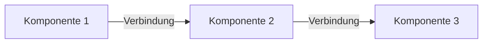
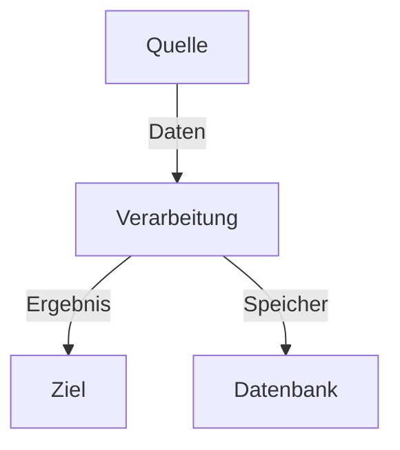
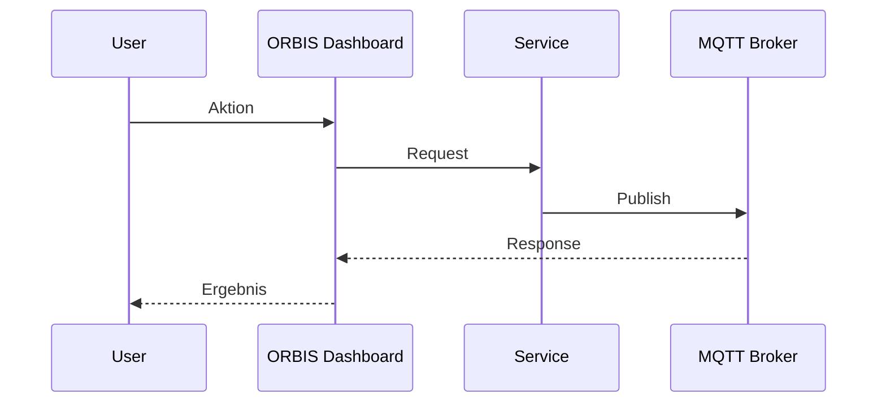

# 🎨 Mermaid Templates - OMF Standard-Templates

**Zielgruppe:** Entwickler & Cursor AI  
**Zweck:** Automatische Regel-Einhaltung durch vorgefertigte Templates

## 🎯 Template-System

### **Template 1: Einfache Architektur (3-4 Komponenten)**

```markdown
# [Komponente Name] - Architektur


```

**Verwendung:**
- **A (ORBIS):** OMF-Dashboard, Session Manager, Helper Apps
- **B (FT Hardware):** DRILL, MILL, DPS Module, TXT Controller, RPi
- **C (External/Neutral):** MQTT Broker, Datenbanken, APIs

### **Template 2: Datenfluss (4-6 Komponenten)**

```markdown
# [System Name] - Datenfluss


```

### **Template 3: Sequenz-Diagramm**

```markdown
# [Prozess Name] - Sequenz


```

### **Template 4: Komponenten-Übersicht mit Hierarchie**

```markdown
# [System Name] - Komponenten

```mermaid
graph TD
    A[Haupt-System] --> B[Komponente 1]
    A --> C[Komponente 2]
    A --> D[Komponente 3]
    
    B --> E[Sub-Komponente]
    C --> F[Sub-Komponente]
    
    style A fill:#90caf9,stroke:#1976d2,stroke-width:3px  # Zentrale Komponente (dunkelblau)
    style B fill:#bbdefb  # Kern-Komponenten (mittelblau)
    style C fill:#bbdefb  # Kern-Komponenten (mittelblau)
    style D fill:#bbdefb  # Kern-Komponenten (mittelblau)
    style E fill:#e3f2fd  # Sub-Komponenten (hellblau)
    style F fill:#e3f2fd  # Sub-Komponenten (hellblau)
```
```

**Farbnuancen für Hierarchie:**
- **Dunkelblau:** Zentrale/Haupt-Komponente
- **Mittelblau:** Kern-Komponenten (direkte Abhängigkeiten)
- **Hellblau:** Sub-Komponenten (weitere Abhängigkeiten)
- **Gelb/Lila:** Externe Komponenten (Hardware/External)

## 🎨 Farbzuordnung-Templates

### **ORBIS-Komponenten (Blau-Nuancen)**
```markdown
style [Zentrale Komponente] fill:#90caf9,stroke:#1976d2,stroke-width:3px  # Dunkelblau
style [Kern-Komponente] fill:#bbdefb  # Mittelblau
style [Standard-Komponente] fill:#e3f2fd  # Hellblau
```
- **Dunkelblau:** Zentrale/Haupt-Komponenten (Session Analysis, OMF Dashboard)
- **Mittelblau:** Kern-Komponenten (Timeline, Graph, Statistics)
- **Hellblau:** Standard-Komponenten (UI, Helper Apps, MessageGenerator)

### **Fischertechnik Hardware (Gelb)**
```markdown
style [Komponente] fill:#fff8e1  # FT Hardware Gelb
```
- DRILL Module
- MILL Module
- DPS Module
- TXT Controller
- Raspberry Pi

### **Fischertechnik Software (Rot)**
```markdown
style [Komponente] fill:#ffebee  # FT Software Rot
```
- Node-RED Flows
- VDA5050 Implementation
- Legacy Software (teilweise ersetzt)

### **Externe/Neutrale Systeme (Grau)**
```markdown
style [Komponente] fill:#f5f5f5  # External/Neutral Grau
```
- MQTT Broker
- Datenbanken
- APIs
- ERP/MES

## 🔧 Cursor AI Anweisungen

### **Template-Verwendung:**
1. **Passendes Template** auswählen
2. **Komponenten-Namen** ersetzen
3. **Verbindungen** anpassen
4. **Farben** nach OMF-Standards verwenden

### **Automatische Regel-Einhaltung:**
- **Maximal 4 Farben** pro Diagramm
- **Konsistente Zuordnung** - nie ORBIS in Gelb/Rot
- **Helle Töne** verwenden
- **Hardware vs Software** klar unterscheiden

### **Bei Unsicherheit:**
- **Template 1** für einfache Architekturen
- **Template 2** für Datenflüsse
- **Template 3** für Sequenzen
- **Template 4** für Komponenten-Übersichten

## 📋 Checkliste

- [ ] Passendes Template gewählt?
- [ ] Komponenten-Namen ersetzt?
- [ ] OMF-Farbpalette verwendet?
- [ ] Maximal 4 Farben?
- [ ] Hardware vs Software unterschieden?
- [ ] Keine Kommentare in style-Zeilen?

---

*Teil der OMF-Dokumentation | [Zurück zu Mermaid-Regeln](cursor-ai-mermaid-rules.md)*
