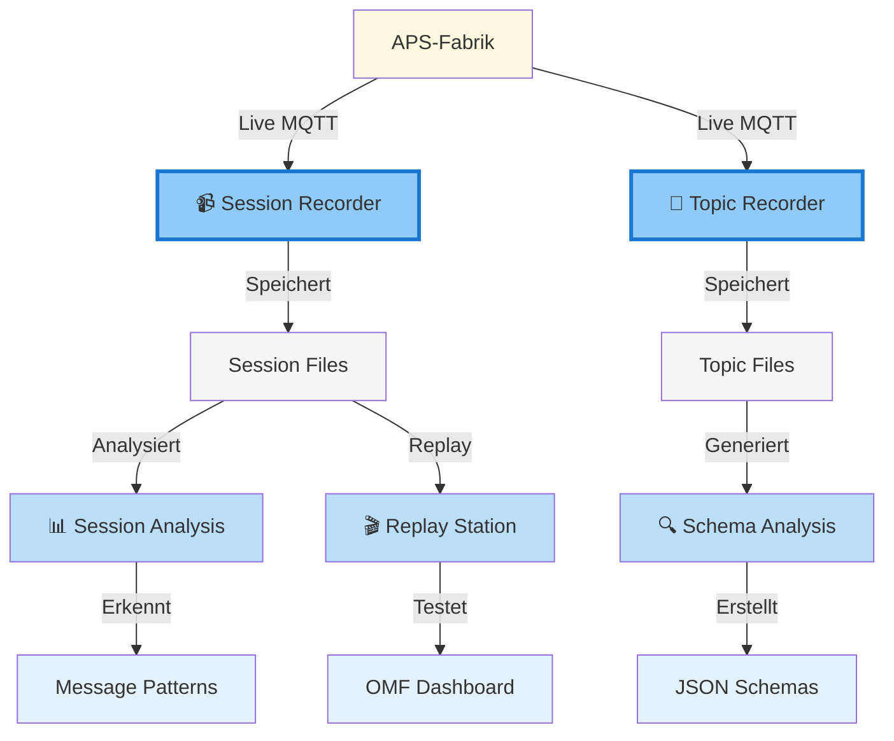

# 🎬 Session Manager - Helper App Dokumentation

## 📋 Übersicht

Der **Session Manager** ist eine unabhängige Helper App zur Analyse der APS Fischertechnik Miniatur-Fabrik. Er dient dem Verständnis der Nachrichten-Semantik und -Funktionsweise für die Entwicklung einer eigenen Steuerungsanwendung.

## 🎯 Zweck

- **📹 Aufnahme** von MQTT-Sessions der APS-Fabrik
- **🎬 Wiedergabe** von aufgezeichneten Sessions
- **📊 Analyse** der Nachrichten-Ströme und -Muster
- **📂 Topic-Recording** für individuelle Topic-Analyse
- **🔍 Schema-Integration** für automatische Payload-Validierung

## 🎯 Zweck-Diagramm



### **Farbnuancen-Erklärung:**
- **🔵 Dunkelblau (`#90caf9`):** Session Recorder, Topic Recorder - **Zentrale Komponenten** (Aufnahme)
- **🔵 Mittelblau (`#bbdefb`):** Session Analysis, Schema Analysis, Replay Station - **Kern-Funktionen**
- **🔵 Hellblau (`#e3f2fd`):** Message Patterns, JSON Schemas, OMF Dashboard - **Ergebnisse/Output**
- **🟡 Gelb (`#fff8e1`):** APS-Fabrik - **FT Hardware (Input)**
- **⚪ Grau (`#f5f5f5`):** Session Files, Topic Files - **Daten-Speicher**

## 🏗️ Architektur

## 📅 Sprint-Zuordnung

Die Session Manager Komponenten wurden in folgenden Sprints entwickelt:

| Komponente | Sprint | Zeitraum | Beschreibung |
|------------|--------|----------|--------------|
| **📹 Session Recorder** | Sprint 1 | 24.07 - 06.08.2025 | MQTT-Aufnahme, SQLite + Log-Dateien |
| **🎬 Replay Station** | Sprint 2 | 07.08 - 22.08.2025 | Session-Wiedergabe für Dashboard-Tests |
| **📊 Session Analysis** | Sprint 3 | 23.08 - 03.09.2025 | Timeline-Visualisierung, Template Analyser |
| **🔍 Template Analysis** | Sprint 4 | 04.09 - 17.09.2025 | Registry-Aufbau, Template-Integration |
| **📂 Topic Recorder** | Sprint 6 | 01.10 - 15.10.2025 | Individuelle Topic-Aufnahme, Schema-Integration |
| **⚡ Optimierungen** | Sprint 5 | 18.09 - 01.10.2025 | Performance, UI, Integration |

## 📚 Dokumentation

### 🎯 Tab-spezifische Anleitungen

| Tab | Beschreibung | Dokumentation |
|-----|-------------|---------------|
| 📂 **Topic Recorder** | Individuelle Topics aufnehmen | [topic-recorder.md](topic-recorder.md) |
| 📡 **Replay Station** | Sessions wiedergeben | [replay-station.md](replay-station.md) |
| 🎙️ **Session Recorder** | MQTT-Sessions aufnehmen | [session-recorder.md](session-recorder.md) |
| 📊 **Session Analysis** | Sessions analysieren | [session-analysis.md](session-analysis.md) |

### 🔧 Allgemeine Themen

- [**Troubleshooting**](troubleshooting.md) - Häufige Probleme und Lösungen

## 🚀 Schnellstart

```bash
# Session Manager starten
streamlit run omf/helper_apps/session_manager/session_manager.py
```

## 📈 Sprint-Zuordnung

- **Sprint 1-2:** Grundstruktur und Session Recorder
- **Sprint 3-4:** Replay Station und Session Analysis  
- **Sprint 5:** Template Analysis und Optimierungen

## 🔗 Verwandte Dokumentation

- [**OMF Dashboard**](../../development/dashboard-components.md) - Haupt-Dashboard
- [**MQTT Integration**](../../communication/mqtt/) - MQTT-Kommunikation
- [**Template System**](../../../02-architecture/message-template-system.md) - Message-Templates
- [**Mermaid Diagramm Regeln**](../../diagrams/cursor-ai-mermaid-rules.md) - Cursor AI Regeln für Diagramme
