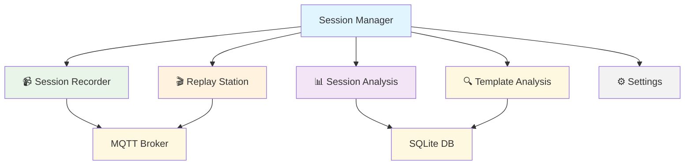

# 🎬 Session Manager - Helper App Dokumentation

## 📋 Übersicht

Der **Session Manager** ist eine unabhängige Helper App zur Analyse der APS Fischertechnik Miniatur-Fabrik. Er dient dem Verständnis der Nachrichten-Semantik und -Funktionsweise für die Entwicklung einer eigenen Steuerungsanwendung.

## 🎯 Zweck

- **📹 Aufnahme** von MQTT-Sessions der APS-Fabrik
- **🎬 Wiedergabe** von aufgezeichneten Sessions
- **📊 Analyse** der Nachrichten-Ströme und -Muster
- **🔍 Template-Erkennung** für MessageGenerator

## 🏗️ Architektur



## 📚 Dokumentation

### 🎯 Tab-spezifische Anleitungen

| Tab | Beschreibung | Dokumentation |
|-----|-------------|---------------|
| 📹 **Session Recorder** | MQTT-Sessions aufnehmen | [session-recorder.md](session-recorder.md) |
| 🎬 **Replay Station** | Sessions wiedergeben | [replay-station.md](replay-station.md) |
| 📊 **Session Analysis** | Sessions analysieren | [session-analysis.md](session-analysis.md) |
| 🔍 **Template Analysis** | Message-Templates erkennen | [template-analysis.md](template-analysis.md) |

### 🔧 Allgemeine Themen

- [**Troubleshooting**](troubleshooting.md) - Häufige Probleme und Lösungen

## 🚀 Schnellstart

```bash
# Session Manager starten
streamlit run omf/helper_apps/session_manager/session_manager.py
```

## 📈 Sprint-Zuordnung

- **Sprint 1-2:** Grundstruktur und Session Recorder
- **Sprint 3-4:** Replay Station und Session Analysis  
- **Sprint 5:** Template Analysis und Optimierungen

## 🔗 Verwandte Dokumentation

- [**OMF Dashboard**](../../development/dashboard-components.md) - Haupt-Dashboard
- [**MQTT Integration**](../../communication/mqtt/) - MQTT-Kommunikation
- [**Template System**](../../../02-architecture/message-template-system.md) - Message-Templates
