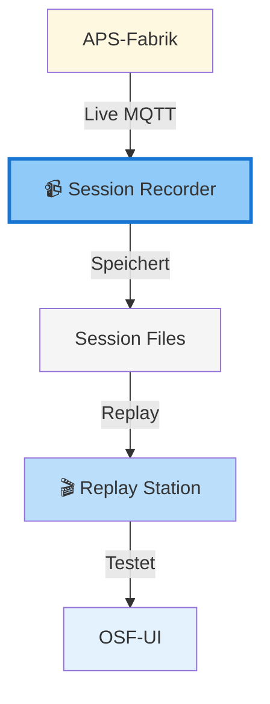

# 🎬 Session Manager - Helper App Dokumentation

## 📋 Übersicht

Der **Session Manager** ist eine unabhängige Helper App zur Analyse der APS Fischertechnik Miniatur-Fabrik. Er dient dem Verständnis der Nachrichten-Semantik und -Funktionsweise für die Entwicklung einer eigenen Steuerungsanwendung.

## 🎯 Zweck

- **📹 Aufnahme** von MQTT-Sessions der APS-Fabrik
- **🎬 Wiedergabe** von aufgezeichneten Sessions
- **📊 Analyse** der Nachrichten-Ströme und -Muster (primär extern / OSF; der frühere Tab **Session Analyse** ist aus der App entfernt, Stand v1.3.0)
- **🔍 Schema-Integration** für automatische Payload-Validierung

**Navigation (v1.3.0):** Sidebar nur noch **Replay Station**, **Session Recorder**, **Einstellungen** (inkl. **Logging & Diagnose**).

## 🎯 Zweck-Diagramm


```mermaid
graph TD
    A[APS-Fabrik] -->|Live MQTT| B[📹 Session Recorder]
    B -->|Speichert| C[Session Files]
    
    C -->|Replay| F[🎬 Replay Station]
    
    F -->|Testet| I[OSF-UI]
    
    style A fill:#fff8e1
    style B fill:#90caf9,stroke:#1976d2,stroke-width:3px
    style C fill:#f5f5f5
    style F fill:#bbdefb
    style I fill:#e3f2fd
```

### **Farbnuancen-Erklärung:**
- **🔵 Dunkelblau (`#90caf9`):** Session Recorder - **Zentrale Komponente** (Aufnahme)
- **🔵 Mittelblau (`#bbdefb`):** Replay Station - **Kern-Funktion**
- **🔵 Hellblau (`#e3f2fd`):** OSF-UI - **Ergebnis/Output**
- **🟡 Gelb (`#fff8e1`):** APS-Fabrik - **FT Hardware (Input)**
- **⚪ Grau (`#f5f5f5`):** Session Files - **Daten-Speicher**

## 🏗️ Architektur

## 📅 Sprint-Zuordnung

Die Session Manager Komponenten wurden in folgenden Sprints entwickelt:

| Komponente | Sprint | Zeitraum | Beschreibung |
|------------|--------|----------|--------------|
| **📹 Session Recorder** | Sprint 1 | 24.07 - 06.08.2025 | MQTT-Aufnahme, SQLite + Log-Dateien |
| **🎬 Replay Station** | Sprint 2 | 07.08 - 22.08.2025 | Session-Wiedergabe für Dashboard-Tests |
| **🔍 Template Analysis** | Sprint 4 | 04.09 - 17.09.2025 | Registry-Aufbau, Template-Integration |
| **⚡ Optimierungen** | Sprint 5 | 18.09 - 01.10.2025 | Performance, UI, Integration |

## 📚 Dokumentation

### 🎯 Tab-spezifische Anleitungen

| Tab / Bereich | Beschreibung | Dokumentation |
|---------------|-------------|---------------|
| 📡 **Replay Station** | Sessions wiedergeben | [replay-station.md](replay-station.md) |
| 🎙️ **Session Recorder** | MQTT-Sessions aufnehmen | [session-recorder.md](session-recorder.md) |
| ⚙️ **Einstellungen** | Replay-, Recorder-, Logging-Pfade und MQTT | (UI in der App; vgl. Recorder-/Replay-Doku) |
| 🔍 **Template Analysis** (Legacy) | Nicht mehr in der Sidebar; Doku historisch | [template-analysis.md](template-analysis.md) |

### 🔧 Allgemeine Themen

- [**Troubleshooting**](troubleshooting.md) - Häufige Probleme und Lösungen

## 🚀 Schnellstart

```bash
# Session Manager starten
streamlit run session_manager/app.py
```

## 📈 Sprint-Zuordnung

- **Sprint 1-2:** Grundstruktur und Session Recorder
- **Sprint 5:** Template Analysis und Optimierungen

## 🔗 Verwandte Dokumentation

- [**OSF-UI**](../../development/dashboard-components.md) - Haupt-Dashboard
- [**MQTT Integration**](../../communication/mqtt/) - MQTT-Kommunikation
- [**Template System**](../../../02-architecture/message-template-system.md) - Message-Templates
- [**Mermaid Diagramm Regeln**](../../diagrams/cursor-ai-mermaid-rules.md) - Cursor AI Regeln für Diagramme
