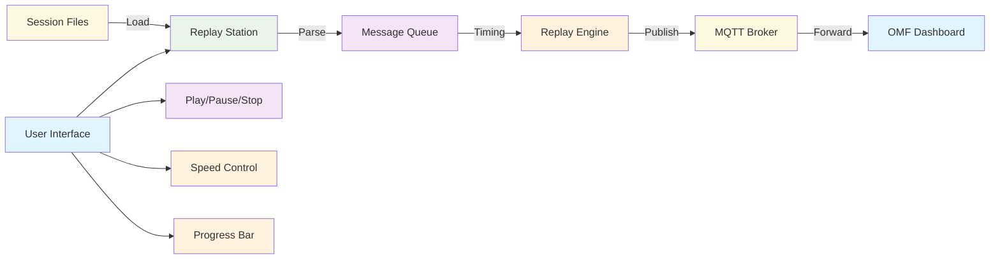
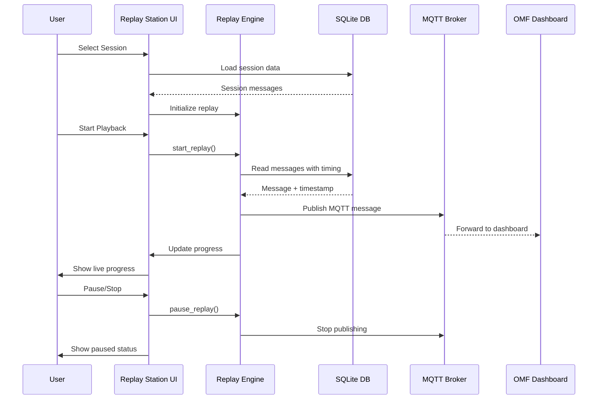

# 🎬 Replay Station - Tab Dokumentation

## 🎯 Zweck

Die **Replay Station** ermöglicht die Wiedergabe von aufgezeichneten MQTT-Sessions. Sessions werden mit originalem Timing und korrekten MQTT-Nachrichten an den lokalen Broker gesendet.

## 🏗️ Architektur

## 🎮 Bedienung

### 1. **Session-Auswahl**
- **Verzeichnis:** `data/omf-data/sessions/`
- **Filter:** Regex-basierte Session-Suche
- **Formate:** SQLite (.db) Dateien
- **Auswahl:** Dropdown mit gefilterten Sessions

### 2. **Replay-Kontrollen**
- **▶️ Play:** Session starten/fortsetzen
- **⏸️ Pause:** Session pausieren
- **⏹️ Stop:** Session stoppen
- **🔄 Reset:** Session zurücksetzen

### 3. **Geschwindigkeits-Kontrolle**
- **1x:** Original-Geschwindigkeit
- **2x:** Doppelte Geschwindigkeit
- **5x:** Fünffache Geschwindigkeit
- **10x:** Zehnfache Geschwindigkeit

### 4. **Fortschritts-Anzeige**
- **Progress Bar:** Visueller Fortschrittsbalken
- **Message Count:** Aktuelle/Gesamt Nachrichten
- **Status:** Aktiv/Pausiert/Beendet

## 📊 Datenfluss

## 🔧 Technische Details

### **Session-Format**
- **SQLite:** Strukturierte Nachrichten-Daten
- **Timestamps:** Originale Zeitstempel für Timing
- **Topics:** Vollständige MQTT-Topic-Struktur
- **Payloads:** JSON-Nachrichten-Inhalte

### **Replay-Engine**
- **Threading:** Background-Thread für non-blocking UI
- **Timing:** Präzise Zeitsteuerung basierend auf Original-Timestamps
- **Speed-Control:** Multiplikator für Replay-Geschwindigkeit
- **Error-Handling:** Graceful Fehlerbehandlung bei MQTT-Problemen

### **MQTT-Integration**
- **Broker:** localhost:1883 (Standard MQTT Port)
- **QoS:** Level 1 für zuverlässige Übertragung
- **Retain:** False (nur Live-Replay)
- **Timeout:** 5 Sekunden pro Nachricht

## 🎯 Sprint-Zuordnung

- **Sprint 2:** Grundstruktur und Session-Loading
- **Sprint 3:** Replay-Engine und Timing-Kontrolle
- **Sprint 4:** UI-Optimierung und Performance-Tuning

## 🔗 Verwandte Komponenten

- [**Session Recorder**](session-recorder.md) - Aufnahme der Sessions
- [**Session Analysis**](session-analysis.md) - Analyse der Session-Daten
- [**OMF Dashboard**](../../development/dashboard-components.md) - Empfänger der Replay-Nachrichten
