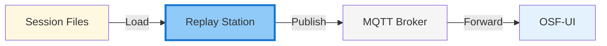
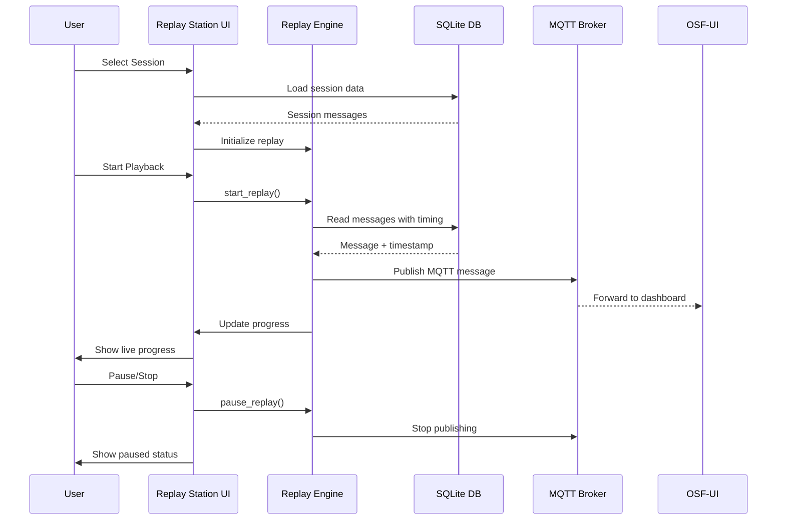

# 🎬 Replay Station - Tab Dokumentation

## 🎯 Zweck

Die **Replay Station** ermöglicht das Einspielen von aufgezeichneten MQTT-Sessions in das OSF-UI im Replay-Modus. Dies ermöglicht das Testen des OSF-UIs, wenn die APS-Fabrik nicht verfügbar ist.

**Vorteile:**
- **Definierte Abfolge** von Nachrichten
- **Reproduzierbare Tests** des OSF-UIs
- **Unabhängige Entwicklung** ohne APS-Verbindung
- **Kontrollierte Test-Szenarien**

## 🏗️ Architektur

### Datenfluss mit Symbolen

- **Session Recorder:** `📡 Quelle (abstrakt, i. d. R. live APS) -> 🔀 Broker -> 🎙️ Session Recorder -> 📁 Session-Log-Verzeichnis`
- **Replay Station:** `📁/🚀/🧪 Replay-Quelle -> 🛡️ Broker-Check -> 🔀 Broker -> 📥 Empfänger (OSF-UI)`


```mermaid
graph LR
    A[Session Files] -->|Load| B[Replay Station]
    B -->|Publish| C[MQTT Broker]
    C -->|Forward| D[OSF-UI]
    
    style A fill:#fff8e1
    style B fill:#90caf9,stroke:#1976d2,stroke-width:3px
    style C fill:#f5f5f5
    style D fill:#e3f2fd
```

## 🎮 Bedienung

### 1. **Replay-Quellen (UI-Optionen)**

Die Replay Station stellt die Quellen jetzt entlang der tatsächlichen UI-Optionen dar:

- **A) Session-Log**
- **B) Session-Log + Preload-Topics**
- **C) Test-Topics direkt**

**Einsatz:** primär für Test-/Entwicklungsfälle, wenn die Live-Umgebung nicht verfügbar ist.

### 2. **Session-Auswahl (für A/B)**
- **Verzeichnis:** `data/osf-data/sessions/`
- **Filter:** Regex-basierte Session-Suche
- **Formate:** JSON-Lines `.log` Dateien
- **Auswahl:** Dropdown mit gefilterten Sessions

### 3. **Test-Topic Management**

Die Replay Station bietet zwei Modi für das Senden von Test-Topics:

#### **🎯 Individuelle Test-Topics**
- **Verzeichnis:** `data/osf-data/test_topics/*.json`
- **Auswahl:** Multiselect für einzelne oder mehrere Test-Topics
- **Verwendung:** Integrationstests einzelner Topics
- **Button:** "📤 Ausgewählte jetzt senden"

**Anwendungsfall:**
- Testen verschiedener Payload-Varianten
- Reproduzieren spezifischer Szenarien
- Debugging von Message-Handling

#### **🚀 Automatischer Preload**
- **Verzeichnis:** `data/osf-data/test_topics/preloads/*.json`
- **Modus:** Alle Test-Topics werden automatisch gesendet
- **Verwendung:** Setup-Messages (z.B. Factsheets) vor Session-Replay
- **Optionen:**
  - **Checkbox:** "Test-Topics vor Session-Replay senden" (automatisch)
  - **Button:** "🚀 Preloads jetzt senden" (manuell)

**Anwendungsfall:**
- Module als "konfiguriert" markieren
- Initiale System-States setzen
- Reproduzierbare Test-Umgebungen

**Dateiformat:**
```json
{
  "topic": "module/v1/ff/SVR3QA0022/factsheet",
  "payload": "{...}",
  "qos": 0,
  "retain": false
}
```

> 📖 Siehe [Test-Topics README](../../../../data/osf-data/test_topics/README.md) für Details

### 4. **Replay-Kontrollen**
- **▶️ Play:** Session starten/fortsetzen
- **⏸️ Pause:** Session pausieren
- **⏹️ Stop:** Session stoppen
- **🔄 Reset:** Session zurücksetzen

### 5. **Geschwindigkeits-Kontrolle**
- **1x:** Original-Geschwindigkeit
- **2x:** Doppelte Geschwindigkeit
- **5x:** Fünffache Geschwindigkeit
- **10x:** Zehnfache Geschwindigkeit

### 6. **Fortschritts-Anzeige**
- **Progress Bar:** Visueller Fortschrittsbalken
- **Message Count:** Aktuelle/Gesamt Nachrichten
- **Status:** Aktiv/Pausiert/Beendet

## 📊 Datenfluss


```mermaid
sequenceDiagram
    participant U as User
    participant UI as Replay Station UI
    participant R as Replay Engine
    participant DB as SQLite DB
    participant M as MQTT Broker
    participant D as OSF-UI
    
    U->>UI: Select Session
    UI->>DB: Load session data
    DB-->>UI: Session messages
    UI->>R: Initialize replay
    
    U->>UI: Start Playback
    UI->>R: start_replay()
    R->>DB: Read messages with timing
    DB-->>R: Message + timestamp
    R->>M: Publish MQTT message
    M-->>D: Forward to dashboard
    R->>UI: Update progress
    UI->>U: Show live progress
    
    U->>UI: Pause/Stop
    UI->>R: pause_replay()
    R->>M: Stop publishing
    UI->>U: Show paused status
```

## 🔧 Technische Details

### **Session-Format**
- **JSON-Lines `.log`:** eine MQTT-Nachricht pro Zeile
- **Timestamps:** Originale Zeitstempel für Timing/Timeshift
- **Topics:** Vollständige MQTT-Topic-Struktur
- **Payloads:** JSON-Nachrichten-Inhalte

### **Replay-Engine**
- **Threading:** Background-Thread für non-blocking UI
- **Timing:** Präzise Zeitsteuerung basierend auf Original-Timestamps
- **Zeitanker:** Beim Laden wird die Session relativ zu **jetzt** verankert (keine historischen/futuristischen Zeitfenster in Grafana)
- **Payload-Timestamps:** Standardfelder `timestamp` und `ts` werden beim Replay auf die aktuelle Timeline verschoben
- **Speed-Control:** Multiplikator für Replay-Geschwindigkeit
- **Error-Handling:** Graceful Fehlerbehandlung bei MQTT-Problemen

### **MQTT-Integration**
- **Broker:** localhost:1883 (Standard MQTT Port)
- **QoS:** Level 1 für zuverlässige Übertragung
- **Retain:** False (nur Live-Replay)
- **Timeout:** 5 Sekunden pro Nachricht
- **Preflight-Guard (Singleton):** Vor allen Sendepfaden (`Verbindung testen`, `Play`, `Preloads`, `Test-Topics`, `Test-Messages`) blockiert die Replay Station bei doppelten lokalen Broker-Instanzen
- **Single-Broker-Regel:** Es darf lokal nur **eine** Broker-Instanz aktiv sein, die MQTT und optional WebSocket bedient

### **Broker-Check (CLI)**

Vor Replay-Smoke-Tests einmal lokal ausführen:

```bash
./scripts/mqtt-single-instance-check.sh
```

Erwartung:
- `OK` → genau eine Broker-Instanz bedient MQTT/WebSocket
- `ERROR` → doppelte Instanz zuerst beenden (typische Ursache für irreführende Replay-/Grafana-Fehler)

## 🎯 Sprint-Zuordnung

- **Sprint 2:** Grundstruktur und Session-Loading
- **Sprint 3:** Replay-Engine und Timing-Kontrolle
- **Sprint 4:** UI-Optimierung und Performance-Tuning

## 🔗 Verwandte Komponenten

- [**Session Recorder**](session-recorder.md) - Aufnahme der Sessions
- [**OSF-UI**](../../development/dashboard-components.md) - Empfänger der Replay-Nachrichten
