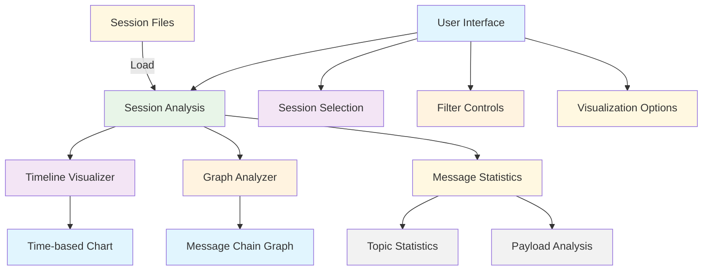
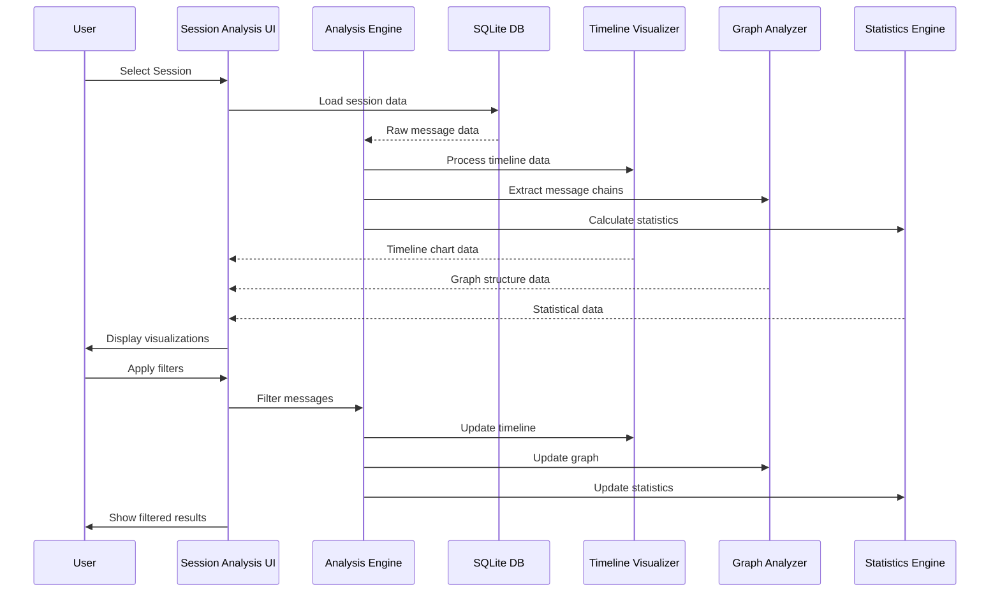

# 📊 Session Analysis - Tab Dokumentation

## 🎯 Zweck

Die **Session Analysis** ermöglicht die detaillierte Analyse von aufgezeichneten MQTT-Sessions. Sie bietet Timeline-Visualisierung, Message-Statistiken und Graph-basierte Darstellung von Message-Ketten.

## 🏗️ Architektur

## 🎮 Bedienung

### 1. **Session-Auswahl**
- **Verzeichnis:** `data/omf-data/sessions/`
- **Filter:** Regex-basierte Session-Suche
- **Formate:** SQLite (.db) Dateien
- **Auswahl:** Dropdown mit gefilterten Sessions

### 2. **Timeline-Visualisierung**
- **Zeitachse:** X-Achse zeigt Zeitverlauf
- **Topics:** Y-Achse zeigt verschiedene Topics
- **Message-Points:** Jeder Punkt = eine MQTT-Nachricht
- **Interaktiv:** Zoom, Pan, Hover für Details

### 3. **Graph-Visualisierung**
- **Message-Ketten:** Verbindungen zwischen Messages
- **Meta-Daten:** orderID, workpieceId, nfcCode
- **Komponenten:** Welche Komponenten beteiligt sind
- **Abläufe:** Reihenfolge der Message-Verarbeitung

### 4. **Statistiken**
- **Topic-Count:** Anzahl Nachrichten pro Topic
- **Payload-Size:** Größe der Nachrichten
- **Time-Span:** Dauer der Session
- **Component-Activity:** Aktivität der verschiedenen Komponenten

## 📊 Datenfluss

## 🔧 Technische Details

### **Timeline-Visualisierung**
- **Technologie:** Plotly für interaktive Charts
- **Daten:** Timestamp + Topic + Payload-Size
- **Performance:** Optimiert für große Sessions (10k+ Messages)
- **Interaktivität:** Zoom, Pan, Hover, Click für Details

### **Graph-Analyse**
- **Technologie:** NetworkX für Graph-Verarbeitung
- **Meta-Daten:** orderID, workpieceId, nfcCode, moduleId
- **Algorithmen:** Message-Chain-Erkennung und -Visualisierung
- **Layout:** Automatische Graph-Layout-Optimierung

### **Statistik-Engine**
- **Topics:** Häufigkeit und Verteilung
- **Payloads:** Größe und Struktur-Analyse
- **Timing:** Zeitliche Verteilung und Patterns
- **Components:** Aktivität der verschiedenen APS-Komponenten

## 🎯 Sprint-Zuordnung

- **Sprint 3:** Timeline-Visualisierung und Grundstatistiken
- **Sprint 4:** Graph-Analyse und Message-Chain-Erkennung
- **Sprint 5:** Performance-Optimierung und erweiterte Features

## 🔗 Verwandte Komponenten

- [**Template Analysis**](template-analysis.md) - Template-Erkennung basierend auf Session-Daten
- [**Session Recorder**](session-recorder.md) - Aufnahme der zu analysierenden Sessions
- [**Replay Station**](replay-station.md) - Wiedergabe der analysierten Sessions
