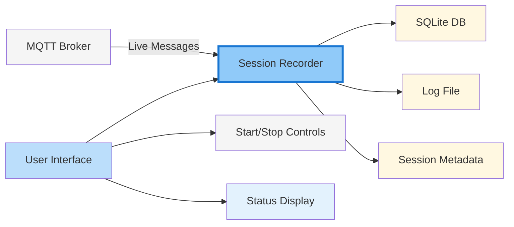
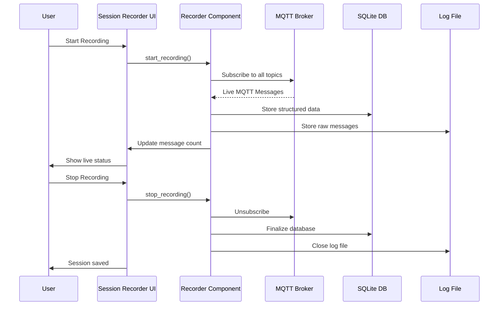

# 📹 Session Recorder - Tab Dokumentation

## 🎯 Zweck

Der **Session Recorder** ermöglicht die Aufnahme von MQTT-Sessions der APS-Fabrik für zwei Hauptzwecke:

1. **📊 Session Analysis** - Analyse der Nachrichten-Ströme und -Muster
2. **🔍 Template Generierung** - Automatische Erkennung von Message-Templates
3. **🎬 Replay Station** - Sessions für reproduzierbare Tests des OSF-UI

**Aufgenommene Sessions** werden als SQLite-Datenbank und Log-Datei gespeichert und dienen als Basis für alle weiteren Analysen und Tests.

## 🏗️ Architektur

## 🎮 Bedienung

### 1. **MQTT-Verbindung**
- **Broker:** localhost:1883 (Standard MQTT Port)
- **Status:** Verbunden/Nicht verbunden anzeigen
- **Test:** Verbindung testen vor Aufnahme starten

### 2. **Session-Aufnahme**
- **Start:** Aufnahme einer neuen Session beginnen
- **Stop:** Aufnahme beenden und Session speichern
- **Live-Monitoring:** Aktuelle Nachrichten-Anzahl anzeigen

### 3. **Session-Management**
- **Session-Name:** Automatisch generiert mit Timestamp
- **Speicherort:** `data/omf-data/sessions/`
- **Formate:** SQLite (.db) + Log (.log) Dateien

## 📊 Datenfluss

## 🔧 Technische Details

### **MQTT-Integration**
- **Protokoll:** paho-mqtt Python Client
- **Topics:** Alle verfügbaren Topics abonnieren
- **QoS:** Level 1 für zuverlässige Übertragung
- **Retain:** False (nur Live-Messages)

### **Daten-Speicherung**
- **SQLite:** Strukturierte Nachrichten-Daten
- **Log-File:** Rohe MQTT-Nachrichten für Debugging
- **Metadata:** Session-Info, Start/End-Zeit, Message-Count

### **Performance**
- **Threading:** Background-Thread für MQTT-Callbacks
- **Memory:** Streaming-Ansatz für große Sessions
- **Error-Handling:** Graceful Fehlerbehandlung

## 🎯 Sprint-Zuordnung

- **Sprint 1:** Grundstruktur und MQTT-Integration
- **Sprint 2:** SQLite-Speicherung und UI-Optimierung
- **Sprint 3:** Performance-Optimierung und Error-Handling

## 🔗 Verwandte Komponenten

- [**Replay Station**](replay-station.md) - Wiedergabe der aufgenommenen Sessions
- [**Session Analysis**](session-analysis.md) - Analyse der Session-Daten
- [**Settings**](../../development/dashboard-components.md) - MQTT-Konfiguration
