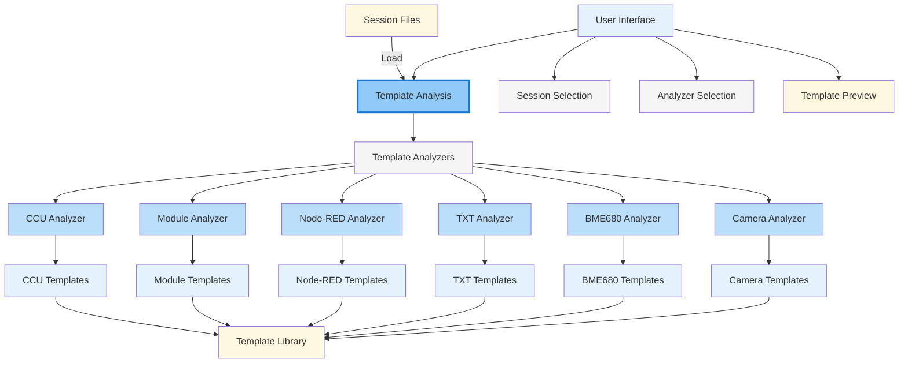

# 🔍 Template Analysis - Tab Dokumentation

## 🎯 Zweck

Die **Template Analysis** nutzt die bestehenden Template-Analyzer, um Message-Templates aus Session-Daten zu generieren und eine **OSF-Registry** aufzubauen.

**Zweck der Analyser:**
- **Aufbau einer Registry** mit standardisierten Message-Templates
- **Registry wird von OSF-UI-Komponenten genutzt** für:
  - **MessageGenerator** - Automatische Message-Generierung
  - **Steering Components** - Template-basierte Steuerung
  - **Message Center** - Template-Validierung und -Parsing

**Basis:** Automatische Erkennung von Message-Strukturen aus realen APS-Sessions

**Verwandte Dokumentation:**
- [**Registry Model**](../../../02-architecture/registry-model.md) - OSF-Registry System und 5 Kernprinzipien
- [**Message Template System**](../../../02-architecture/message-template-system.md) - Integration mit MessageGenerator

## 🏗️ Architektur

### **Farbnuancen-Erklärung:**
- **🔵 Dunkelblau (`#90caf9`):** Template Analysis - **Zentrale Komponente** (Hauptfunktion)
- **🔵 Mittelblau (`#bbdefb`):** Template Analyzer (CCU, Module, Node-RED, TXT, BME680, Camera) - **Kern-Analysen**
- **🔵 Hellblau (`#e3f2fd`):** Template-Ergebnisse und UI - **Output/Darstellung**
- **🟡 Gelb (`#fff8e1`):** Session Files, Template Library - **Input/Speicher**
- **⚪ Grau (`#f5f5f5`):** Template Analyzers Container, UI Controls - **Verarbeitung/Steuerung**

## 🎮 Bedienung

### 1. **Session-Auswahl**
- **Verzeichnis:** `data/omf-data/sessions/`
- **Filter:** Regex-basierte Session-Suche
- **Formate:** SQLite (.db) Dateien
- **Auswahl:** Dropdown mit gefilterten Sessions

### 2. **Analyzer-Auswahl**
- **CCU Analyzer:** CCU-Nachrichten analysieren
- **Module Analyzer:** Modul-Nachrichten analysieren
- **Node-RED Analyzer:** Node-RED Nachrichten analysieren
- **TXT Analyzer:** TXT-Nachrichten analysieren
- **BME680 Analyzer:** BME680-Sensor-Nachrichten analysieren
- **Camera Analyzer:** Kamera-Nachrichten analysieren

### 3. **Template-Generierung**
- **Analyse:** Automatische Template-Erkennung
- **Validierung:** Template-Struktur prüfen
- **Export:** YAML-Templates für MessageGenerator
- **Vorschau:** Template-Inhalt anzeigen

### 4. **Template-Bibliothek**
- **Verwaltung:** Generierte Templates verwalten
- **Suche:** Templates nach Komponente filtern
- **Bearbeitung:** Templates manuell anpassen
- **Integration:** Templates in MessageGenerator integrieren

## 📊 Datenfluss

## 🔧 Technische Details

### **Template-Analyzer**
- **CCU Analyzer:** `ccu_template_analyzer.py`
- **Module Analyzer:** `module_template_analyzer.py`
- **Node-RED Analyzer:** `nodered_template_analyzer.py`
- **TXT Analyzer:** `txt_template_analyzer.py`
- **BME680 Analyzer:** `bme680_template_analyzer.py`
- **Camera Analyzer:** `cam_template_analyzer.py`

### **Template-Format**
- **YAML-Struktur:** Standardisiertes Template-Format
- **Schema-Validation:** JSON-Schema für Template-Validierung
- **Meta-Daten:** Beschreibung, Version, Autor
- **Beispiele:** Sample-Messages für Testing

### **Integration**
- **MessageGenerator:** Templates für Message-Generierung
- **Registry:** Templates in Registry-System integrieren
- **Validation:** Template-Struktur und -Inhalt prüfen
- **Export:** Templates für externe Nutzung exportieren

## 🎯 Sprint-Zuordnung

- **Sprint 4:** Integration der bestehenden Template-Analyzer
- **Sprint 5:** Template-Bibliothek und UI-Optimierung
- **Sprint 6:** MessageGenerator-Integration und Testing

## 🔗 Verwandte Komponenten

- [**Session Analysis**](session-analysis.md) - Basis für Template-Analyse
- [**Session Recorder**](session-recorder.md) - Aufnahme der zu analysierenden Sessions
- [**OSF-UI**](../../development/dashboard-components.md) - Nutzer der Registry-Templates
- [**Registry Model**](../../../02-architecture/registry-model.md) - OSF-Registry System und Template-Speicherung
- [**Message Template System**](../../../02-architecture/message-template-system.md) - Integration mit MessageGenerator
