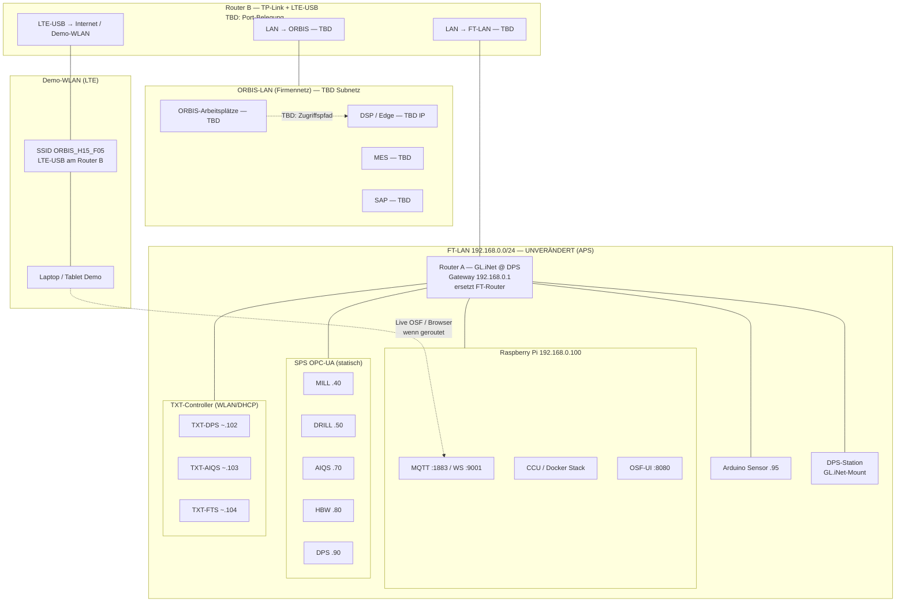

# ORBIS Shopfloor — Netzwerk-Topologie (FT-LAN + OSF-Erweiterung)

**Stand:** 14.07.2026 · **Status:** Entwurf mit Lücken (`TBD`) — zur Vervollständigung durch Netzwerk-/ORBIS-Kollegen  
**Bezug:** [Sprint 25 Router-Setup](../../sprints/sprint_25.md) · [FT Hardware-Architektur](../../06-integrations/00-REFERENCE/hardware-architecture.md)

---

## Kurz: Was bleibt, was neu ist

| Ebene | Status | Inhalt |
|-------|--------|--------|
| **FT-LAN (APS)** | **Unverändert** | Fischertechnik-Modellfabrik: `192.168.0.0/24`, RPi, SPS/OPC-UA, TXT, MQTT — siehe [hardware-architecture.md](../../06-integrations/00-REFERENCE/hardware-architecture.md) |
| **OSF-Erweiterung** | **Neu (Jul 2026)** | Zwei-Router-Setup: GL.iNet an DPS (FT-Router-Ersatz) + separater Router für **ORBIS-LAN**, **DSP**, **MES/SAP** und Demo-**WLAN** |
| **ORBIS-LAN** | **Zusätzlich** | Firmennetz ORBIS — **nicht** identisch mit FT-LAN; Zugriff auf DSP, MES, SAP |

**Wichtig:** `192.168.0.x` ist das **FT-LAN** der Modellfabrik. Die ORBIS-Firmenanbindung läuft über eine **eigene LAN-Verbindung** ins ORBIS-Netz (Subnetz/Adressen **TBD**).

---

## Rollen der zwei Router (Sprint 25/26)

### Router A — GL.iNet an der DPS-Station

| Feld | Wert / Hinweis |
|------|----------------|
| **Ort** | DPS-Station (Warenein- und -ausgang) |
| **Funktion** | Ersatz für den **originalen FT-Router** an der DPS |
| **Netz** | **FT-LAN** (`192.168.0.0/24`) |
| **Gateway (typ.)** | `192.168.0.1` (Legacy: TP-Link TL-WR902AC — durch GL.iNet abgelöst) |
| **Mount** | 3D-Druck-Halterung, Sprint 26 erledigt |
| **Admin-UI** | Am 14.07.2026 antwortet `http://192.168.0.1/` mit **GL.iNet Admin Panel** (`gl-ui`) |

### Router B — ORBIS-/Demo-Router (TP-Link + LTE-USB)

| Feld | Wert / Hinweis |
|------|----------------|
| **Funktion** | Anbindung **DSP**, **ORBIS-LAN** (MES/SAP), Demo-**WLAN** über **LTE-USB-Stick** |
| **WLAN (Demo)** | SSID **`ORBIS_H15_F05`**, PW **`49117837`** (Sprint 25) |
| **Phys. Anschlüsse** | **`TBD`** — welche Ports gehen auf FT-LAN, ORBIS-LAN, DSP? |
| **ORBIS-LAN** | **`TBD`** — Subnetz, Gateway, DNS, feste IPs für DSP/MES/SAP |
| **DSP-Erreichbarkeit** | **`TBD`** — Hostname/IP, Port, VPN ja/nein |

---

## Topologie-Diagramm (Entwurf)



---

## Verkabelung (Checkliste — bitte vervollständigen)

| # | Von | Nach | Medien | Status | Notiz |
|---|-----|------|--------|--------|-------|
| 1 | FT-Switch / Backbone | **GL.iNet (Router A)** @ DPS | Ethernet | **TBD** | Ersetzt alten FT-Router-Anschluss |
| 2 | **GL.iNet** | DPS-SPS `192.168.0.90` | Ethernet | **TBD** | OPC-UA wie in FT-Doku |
| 3 | FT-Switch | RPi `192.168.0.100` | Ethernet | **Bestehend** | Unverändert |
| 4 | FT-Switch | MILL/DRILL/HBW/AIQS SPS | Ethernet | **Bestehend** | Statische IPs siehe Hardware-Doku |
| 5 | **Router B** | **ORBIS-LAN** (Patch/Wand) | Ethernet | **TBD** | MES/SAP/DSP-Zugang |
| 6 | **Router B** | **FT-LAN** (Switch/GL.iNet) | Ethernet | **TBD** | Brücke FT ↔ ORBIS — genaue Topologie klären |
| 7 | **Router B** | **DSP** (Edge-Knoten) | Ethernet / via ORBIS | **TBD** | Direkt oder nur über ORBIS-LAN? |
| 8 | **Router B** | **LTE-USB-Stick** | USB | **Dokumentiert** | Demo-WLAN `ORBIS_H15_F05` |

---

## FT-LAN — Referenz (unverändert)

Kanonical: [hardware-architecture.md § Netzwerk-Architektur](../../06-integrations/00-REFERENCE/hardware-architecture.md#-netzwerk-architektur)

| Gerät | IP (typ.) | Protokoll |
|-------|-----------|-----------|
| Gateway (jetzt GL.iNet @ DPS) | `192.168.0.1` | — |
| Raspberry Pi (CCU, MQTT, OSF-UI) | `192.168.0.100` | MQTT 1883, WS 9001, HTTP 8080 |
| MILL / DRILL / AIQS / HBW / DPS SPS | `.40` / `.50` / `.70` / `.80` / `.90` | OPC-UA :4840 |
| Arduino Sensor-Station | `192.168.0.95` | MQTT |
| TXT-DPS / AIQS / FTS | DHCP ~`.102–.104` | MQTT via WLAN |

**OSF Live-Betrieb:** Browser/OSF verbindet MQTT auf **`192.168.0.100`** — siehe [runtime-modes-matrix.md](../helper_apps/session-manager/runtime-modes-matrix.md).

---

## Empirische Prüfung FT-LAN (14.07.2026)

Vom Entwicklungsrechner im erreichbaren Shopfloor-Netz bzw. vom RPi (`ff22@192.168.0.100`):

| Ziel | Ping (RPi) | Ping (Mac) | Anmerkung |
|------|------------|------------|-----------|
| `192.168.0.1` | OK | OK | GL.iNet Admin (`gl-ui`) |
| `192.168.0.100` | — | OK | RPi |
| `192.168.0.40–.50–.70–.80–.90–.95` | OK | `.90` OK | SPS + Arduino am FT-LAN |
| `192.168.0.102–.105` | FAIL | `.102` FAIL | TXT oft offline oder nur per WLAN erreichbar |
| `192.168.0.118` | REACHABLE (ARP) | OK | HTTP: **TXT Webserver** |
| MQTT/WS/OSF-UI auf `.100` | — | — | Ports **1883, 9001, 8080** offen (RPi-Check) |

**Nicht geprüft (TBD):** ORBIS-LAN-Subnetz, Routing FT→ORBIS, DSP-IP, MES/SAP-Pfade, LTE-only Clients auf `ORBIS_H15_F05`.

---

## Lücken für Kollegen (Vervollständigung)

Bitte eintragen (Pull Request oder direkt in dieser Datei):

- [ ] **ORBIS-LAN:** Subnetz, Gateway, DNS
- [ ] **Router B:** Modell, Management-IP, physische Port-Belegung (WAN/LAN1/LAN2)
- [ ] **DSP:** IP/Hostname, erreichbar von FT-LAN ja/nein, nur via ORBIS-LAN?
- [ ] **MES / SAP:** Endpunkte, Latenzpfad (relevant für LOM-Day-Follow-up)
- [ ] **Brücke FT-LAN ↔ ORBIS-LAN:** Router B — ein Port oder zwei? NAT/Firewall-Regeln?
- [ ] **Demo-WLAN `ORBIS_H15_F05`:** Nur Internet/LTE oder auch Route ins FT-LAN (`192.168.0.100`)?
- [ ] **Skizze/Foto** der Verkabelung an Router B (optional, unter `docs/assets/` ablegen)

---

## Betriebsmodi (OSF)

| Modus | Broker / Netz | Doku |
|-------|---------------|------|
| **Live (Modus B/C)** | MQTT **`192.168.0.100`** (FT-LAN) | [runtime-modes-matrix.md](../helper_apps/session-manager/runtime-modes-matrix.md) |
| **Replay (Modus A)** | `localhost` oder externer Broker | nicht FT-LAN |
| **MES/SAP/DSP** | ORBIS-LAN | **`TBD`** — Latenz, Ports, VPN |

---

## Änderungshistorie

| Datum | Änderung |
|-------|----------|
| 14.07.2026 | Erstversion: Trennung FT-LAN vs. ORBIS-LAN, Zwei-Router-Rollen, Mermaid + TBD-Checkliste, Ping-Snapshot FT-LAN |

---

## HTML-Export (für Kollegen)

Standalone-HTML (Tabellen + Mermaid-Diagramm, Browser):

```bash
bash scripts/export-network-topology-html.sh
```

Erzeugt: `docs/04-howto/setup/orbis-shopfloor-network-topology.html` — per E-Mail/Teams teilen oder lokal im Browser öffnen. **Mermaid** lädt einmalig von CDN (Internet nötig beim ersten Öffnen).
