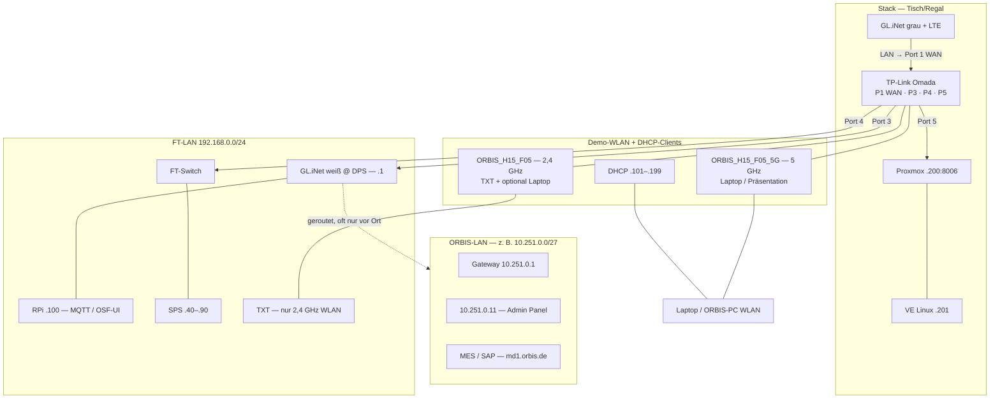

# ORBIS Shopfloor — Netzwerk-Topologie (FT-LAN + OSF-Erweiterung)

**Stand:** 21.07.2026 · **Status:** Omada-Port-Pinout + Verkabelung (Fotos) dokumentiert; ORBIS-LAN-Adressliste / MES-Pfad noch **TBD**  
**Bezug:** [Sprint 26](../../sprints/sprint_26.md) · [Sprint 25 Router-Setup](../../sprints/sprint_25.md) · [FT Hardware-Architektur](../../06-integrations/00-REFERENCE/hardware-architecture.md)

> **Zugangsdaten:** Im Repo absichtlich mitgeführt (Shopfloor-Betrieb, Team). Repo-Zugriff entsprechend schützen.

---

## Kurz: Was bleibt, was neu ist

| Ebene | Status | Inhalt |
|-------|--------|--------|
| **FT-LAN (APS)** | **Unverändert** | Fischertechnik-Modellfabrik: `192.168.0.0/24`, RPi, SPS/OPC-UA, TXT, MQTT — siehe [hardware-architecture.md](../../06-integrations/00-REFERENCE/hardware-architecture.md) |
| **OSF-Erweiterung** | **Dokumentiert (Jul 2026)** | Weißer GL.iNet @ DPS (FT-Router-Ersatz) + **TP-Link Omada** (Router B) + **grauer GL.iNet + LTE** als WAN-Zubringer; Demo-WLAN; DSP/Proxmox am Omada |
| **DSP Edge** | **Dokumentiert** | Kleiner PC (~20×20×5 cm) mit **Proxmox** `.200` + Linux-VE `.201` (SQL, Grafana-Ziel, SSH) |
| **ORBIS-LAN** | **Teilweise** | Firmennetz ORBIS — **≠ FT-LAN**; u. a. `10.251.0.0/27` (routed) — vollständige Adressliste **TBD** |

**Wichtig:** `192.168.0.x` ist das **FT-LAN** der Modellfabrik (Ethernet + Demo-WLAN in dasselbe Subnetz). MES/SAP (`md1.orbis.de`) brauchen zusätzlich **ORBIS-Firmennetz/VPN**.

---

## Adressierung FT-LAN `192.168.0.0/24`

### Statische Geräte (Ethernet / feste IPs)

Nur diese Hosts fest dokumentieren:

| Bereich / Gerät | IP | Anmerkung |
|-----------------|-----|-----------|
| Gateway | `192.168.0.1` | **Weißer GL.iNet** @ DPS (ersetzt FT-Router an der Station) |
| SPS OPC-UA | `.40` / `.50` / `.70` / `.80` / `.90` | MILL, DRILL, AIQS, HBW, DPS |
| Arduino Sensor | `192.168.0.95` | MQTT |
| **Raspberry Pi** (CCU, MQTT, OSF-UI) | **`192.168.0.100`** | statisch, Ethernet |
| **Proxmox** (DSP-Edge-Hardware) | **`192.168.0.200`** | Hypervisor-UI `https://192.168.0.200:8006` — siehe [DSP Edge](#dsp-edge--proxmox--ve) |
| **Linux-VE auf Proxmox** (DSP-Runtime) | **`192.168.0.201`** | SSH, SQL-Container, Grafana-Ziel |

### DHCP-Clients (dynamisch) — **keine Fix-IPs in der Doku**

DHCP-Pool: **`192.168.0.101` – `192.168.0.199`**.

| Client-Typ | Anbindung | IP |
|------------|-----------|-----|
| **ORBIS-Arbeitsplatz** (Laptop/PC) | Ethernet am FT-/GL.iNet-Pfad **oder** WLAN | **DHCP** — wechselt |
| **TXT-Module** | nur **WLAN 2,4 GHz** (`ORBIS_H15_F05`) | **DHCP** |
| Laptop / Präsentation | bevorzugt **WLAN 5 GHz** (`ORBIS_H15_F05_5G`), alternativ 2,4 GHz oder LAN | **DHCP** |

**Nicht dokumentieren:** einzelne Adressen wie „`.191` = ORBIS-PC“ — das war nur ein Momentaufnahme-Ping, **kein** fester Host.

**RPi `.100`:** fest per Ethernet (außerhalb bzw. reserviert gegenüber dem Client-Pool `.101–.199`).

### Demo-WLAN — zwei SSIDs, ein Subnetz

Beide SSIDs speisen Clients in **`192.168.0.0/24`** (DHCP **`.101–.199`**). So koppeln **FT-LAN (Ethernet)** und **Demo-WLAN**.

| SSID | Band | Nutzung |
|------|------|---------|
| **`ORBIS_H15_F05`** | **2,4 GHz** | **TXT-Module** (nur 2,4 GHz); auch Laptops möglich |
| **`ORBIS_H15_F05_5G`** | **5 GHz** | **Laptops / Präsentation**; **nicht** für TXT |

---

## DSP Edge — Proxmox + VE

Kleiner PC ohne Monitor (~20×20×5 cm). Darauf läuft die DSP-Edge-Komponente.

### Host: Proxmox `192.168.0.200`

| Feld | Wert |
|------|------|
| **URL** | `https://192.168.0.200:8006` |
| **User** | `root` |
| **Passwort** | `AFF` |
| **Rolle** | Hypervisor / Einstieg „DSP Edge“ in Bookmarks & OSF `dspEdgeUrl` |
| **Kabel** | Omada **Port 5** (LAN) |

### VE: Linux auf Proxmox (`Proxmox2026`) `192.168.0.201`

| Feld | Wert |
|------|------|
| **SSH** | `pocadm` / `$ompv$` · `dsp-agent` / `sibro01` |
| **SQL Server (Container)** | `192.168.0.201:1443` · User `sa` · PW `5KpcDHa9GEoR*3osiE` |
| **Grafana (Ziel)** | `http://192.168.0.201:3000/…` (Dienst ggf. noch starten — Stand 15.07./21.07. oft refused) |

**OSF External Link:** `dspEdgeUrl` = Proxmox-UI (`.200:8006`). Analytics/Grafana weiter `.201:3000`.

---

## Rollen der Router / Geräte

Drei physische Netzwerk-Boxen + FT-Switch — nicht verwechseln:

| Gerät | Farbe / Ort | Rolle |
|-------|-------------|--------|
| **GL.iNet weiß** | DPS-Station | **FT-Router-Ersatz**, Gateway **`192.168.0.1`** |
| **TP-Link Omada** | Stack Mitte (Tisch/Regal) | **Router B**: Demo-WLAN, FT-LAN-Verteilung, Port-Hub für Proxmox / FT / GL.iNet |
| **GL.iNet grau** | Stack oben | **LTE-Zubringer** (USB-Stick) → Omada **WAN Port 1** |
| **FT-Switch** | Fischertechnik-Rahmen | Shopfloor-Ethernet (SPS, …); Uplink Omada **Port 4** |
| **Proxmox-PC** | Stack unten | DSP Edge `.200` / VE `.201` |

### Router A — GL.iNet an der DPS-Station (weiß)

| Feld | Wert / Hinweis |
|------|----------------|
| **Ort** | DPS-Station (Warenein- und -ausgang), 3D-gedruckter Mount |
| **Funktion** | Ersatz für den **originalen FT-Router** an der DPS |
| **Netz** | **FT-LAN** Gateway `192.168.0.1` |
| **Admin-UI** | `http://192.168.0.1/` |
| **Kabel** | **WAN** ← Omada **Port 3** (Label am Gerät: `WAN PORT 3 TPLINK`) |
| **Inventory** | `ITSINV-68893` (Barcode am Gerät) |
| **Routing** | Route ins **ORBIS-LAN** `10.251.0.0/27` (empirisch 15.07.2026; von FT-LAN-Client 21.07. oft **nicht** erreichbar) |

Foto: [glinet-white-dps-wan-port3.png](../../assets/setup/network/glinet-white-dps-wan-port3.png)

### Router B — TP-Link Omada (+ LTE über grauen GL.iNet)

| Feld | Wert / Hinweis |
|------|----------------|
| **Funktion** | Demo-**WLAN** (2,4 + 5 GHz), Port-Verteiler FT-LAN ↔ DSP; Internet über LTE (grauer GL.iNet) |
| **DHCP** | Vergibt **`192.168.0.101–199`** an WLAN- und typische LAN-Clients |
| **Phys. Stack** | Oben grau GL.iNet + LTE · Mitte Omada · unten Proxmox |

Foto Stack: [stack-glinet-grey-omada-proxmox.png](../../assets/setup/network/stack-glinet-grey-omada-proxmox.png)

### Omada-Port-Pinout (21.07.2026, vor Ort)

| Port | Typ (Aufdruck) | Belegt | Ziel |
|------|----------------|--------|------|
| **1** | WAN | ja | **Grauer GL.iNet** (LAN-Seite; LTE-Stick als Internet-Uplink) |
| **2** | WAN/LAN | **frei** | — |
| **3** | LAN / WAN-LAN | ja | **Weißer GL.iNet WAN** @ DPS |
| **4** | LAN | ja | **FT-Switch** (Label `FT PORT 4 TPLINK`) |
| **5** | LAN/WAN | ja | **Proxmox** FT-LAN |

Foto FT-Switch: [ft-switch-port4-tplink.png](../../assets/setup/network/ft-switch-port4-tplink.png)

### Grauer GL.iNet (LTE)

| Feld | Wert / Hinweis |
|------|----------------|
| **Funktion** | Cellular WAN für Router B (nicht FT-Gateway) |
| **USB** | LTE-Stick gesteckt |
| **Kabel** | LAN → Omada **Port 1 (WAN)** |

---

## Wie FT-LAN und Demo-WLAN zusammenhängen

```text
LTE-Stick ── grauer GL.iNet ──LAN──► Omada Port 1 (WAN)
                                         │
                    WLAN 2,4 / 5 GHz ─────┤  DHCP .101–.199
                                         │
              ┌── Omada Port 3 ──WAN── weißer GL.iNet .1 @ DPS ── FT-LAN (RPi, …)
              ├── Omada Port 4 ──────── FT-Switch ── SPS / FT-Ethernet
              └── Omada Port 5 ──────── Proxmox .200 / VE .201
```

**Kurz:** Demo-WLAN und LAN-Clients (außer festen Kern-Hosts) teilen das **FT-LAN**-Subnetz per **DHCP**. TXT nur 2,4 GHz; Präsentation bevorzugt 5 GHz-SSID. Ein ORBIS-Arbeitsplatz ist **kein** fester `.19x`-Eintrag.

---

## Topologie-Diagramm



---

## Erreichbarkeit (empirisch)

### FT-LAN — Ping / Dienste (21.07.2026, Mac `192.168.0.189` Ethernet)

| Ziel | Ping | Dienste / HTTP | Anmerkung |
|------|------|----------------|-----------|
| `192.168.0.1` | ✅ | Admin **HTTP 200** | Gateway weiß |
| `192.168.0.100` | ✅ | MQTT **1883**; OSF-UI **:8080** 200 | RPi / OSF-UI v1.1.9 |
| `192.168.0.95` | ✅ | — | Arduino |
| `192.168.0.200` | ✅ | Proxmox **:8006** 200 | DSP-Edge-Hardware |
| `192.168.0.201` | ✅ | Ping OK; Grafana **:3000** refused; SQL **:1443** geschlossen (Stand Test) | Linux-VE |
| DHCP `.101–.199` | variabel | — | Laptops, TXT — **keine** Fix-Tabelle |

### ORBIS-LAN `10.251.0.0/27`

| Ziel | 15.07.2026 | 21.07.2026 (von FT-LAN) | Anmerkung |
|------|------------|-------------------------|-----------|
| `10.251.0.1` | ✅ | ❌ Timeout | TP-Link Admin — **vermutlich nur mit ORBIS-VPN / Firmennetz** (nicht vom reinen FT-LAN-Mac) |
| `10.251.0.11` | ✅ | nicht erneut | nginx Admin Panel |
| weitere | **TBD** | — | mit Netzwerk-Kollegen |

**Hinweis (21.07.2026):** Erreichbarkeit von `10.251.0.x` und MES (`md1.orbis.de`) ist **kein** FT-LAN-Kabeltest. Ohne **ORBIS-VPN** (bzw. Anbindung an ORBIS-LAN) ist Timeout vom Mac im FT-LAN **erwartbar** — kein Widerspruch zum Omada-Pinout.

### Cloud / Firmen-Dienste

| Ziel | Ergebnis |
|------|----------|
| **`https://md1.orbis.de/`** | oft **Firmennetz/VPN** nötig — Demo-WLAN allein reicht nicht immer |
| Internet | ✅ über LTE (grauer GL.iNet → Omada WAN) |

### External Links (OSF-UI)

| Key | URL | Hinweis |
|-----|-----|---------|
| `dspEdgeUrl` | `https://192.168.0.200:8006` | Proxmox — auf RPi mit OSF-UI **v1.1.9** deployed |
| `bpAnalyticsApplicationUrl` | `http://192.168.0.201:3000/dashboards` | Grafana auf VE |

---

## Verkabelung (Checkliste)

| # | Von | Nach | Status | Notiz |
|---|-----|------|--------|-------|
| 1 | Grauer GL.iNet LAN | Omada **Port 1 WAN** | **Dokumentiert** | LTE-Uplink |
| 2 | Omada **Port 3** | Weißer GL.iNet **WAN** @ DPS | **Dokumentiert** | Label `WAN PORT 3 TPLINK` |
| 3 | Omada **Port 4** | FT-Switch | **Dokumentiert** | Label `FT PORT 4 TPLINK` |
| 4 | Omada **Port 5** | Proxmox | **Dokumentiert** | FT-LAN `.200` |
| 5 | Omada **Port 2** | — | frei | — |
| 6 | FT-Switch | SPS / FT-Ethernet | **Bestehend** | Shopfloor |
| 7 | Weißer GL.iNet / FT-Pfad | RPi `.100` | **Bestehend** | statisch |
| 8 | Omada WLAN | TXT / Laptops | **Dokumentiert** | Dual-SSID |
| 9 | Weißer GL.iNet | ORBIS-LAN `10.251.0.0/27` | **Teilweise** | Route empirisch; Erreichbarkeit variabel |

---

## FT-LAN — Referenz (statische Kern-Hosts)

Kanonical: [hardware-architecture.md § Netzwerk-Architektur](../../06-integrations/00-REFERENCE/hardware-architecture.md#-netzwerk-architektur)

**OSF Live:** MQTT/WebSocket **`192.168.0.100`** — [runtime-modes-matrix.md](../helper_apps/session-manager/runtime-modes-matrix.md).

---

## Noch offen (nicht abgehakt)

- [x] **Omada-Port-Pinout** (P1/P3/P4/P5) + Fotos *(21.07.2026)*
- [ ] **ORBIS-LAN:** vollständige Adressliste, DNS, stabiler MES/SAP-Pfad zur Demo (mit Netzwerk-Kollegen) — **Tests nur mit ORBIS-VPN / Firmennetz**, nicht vom reinen FT-LAN-Mac
- [ ] **Grafana auf `.201`:** Dienst dauerhaft starten/öffentlichen (Persistence-Stack); SQL **:1443** bei Bedarf prüfen
- [ ] Omada **Management-IP / Admin-UI-URL** und exaktes Modell notieren (Aufkleber/UI)
- [x] HTML-Export nach Doc-Update: `bash scripts/export-network-topology-html.sh` *(21.07.2026)*
- ~~Warum `10.251.0.1` von FT-LAN oft timeout~~ → **erwartbar ohne ORBIS-VPN** (kein Pinout-Fehler)

---

## Betriebsmodi (OSF)

| Modus | Broker / Netz | Doku |
|-------|---------------|------|
| **Live (Modus B/C)** | MQTT **`192.168.0.100`** (FT-LAN) | [runtime-modes-matrix.md](../helper_apps/session-manager/runtime-modes-matrix.md) |
| **Replay (Modus A)** | `localhost` | nicht FT-LAN |
| **MES/SAP** | ORBIS-LAN + ggf. VPN | `md1.orbis.de` |
| **DSP Edge** | Proxmox `.200:8006` / VE `.201` | dieses Dokument |

---

## Änderungshistorie

| Datum | Änderung |
|-------|----------|
| 14.07.2026 | Erstversion: Zwei-Router-Rollen, Mermaid, Ping-Snapshot FT-LAN |
| 15.07.2026 | DHCP-Pool dokumentiert; Erreichbarkeit `.200`/`.201`; ORBIS-LAN `10.251.0.0/27` |
| 17.07.2026 | Proxmox `.200:8006` + VE `.201`; Dual-SSID; Zugangsdaten; **kein** Fix-IP für ORBIS-Arbeitsplatz (DHCP `.101–.199`, LAN oder WLAN) |
| 21.07.2026 | Omada-Pinout P1/P3/P4/P5; grau LTE vs. weiß DPS; Fotos unter `docs/assets/setup/network/`; Ping-Retest FT-LAN OK, `10.251.0.1` timeout |

---

## HTML-Export (für Kollegen)

```bash
bash scripts/export-network-topology-html.sh
```

Erzeugt: `docs/04-howto/setup/orbis-shopfloor-network-topology.html`
