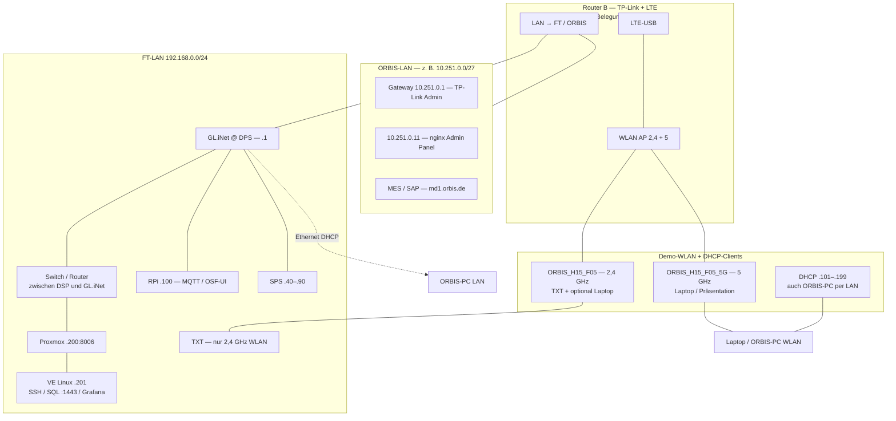

# ORBIS Shopfloor — Netzwerk-Topologie (FT-LAN + OSF-Erweiterung)

**Stand:** 17.07.2026 · **Status:** FT-LAN / DSP-Edge / Demo-WLAN erklärbar; Router-B-Port-Pinout und ORBIS-LAN-Details noch **TBD**  
**Bezug:** [Sprint 26](../../sprints/sprint_26.md) · [Sprint 25 Router-Setup](../../sprints/sprint_25.md) · [FT Hardware-Architektur](../../06-integrations/00-REFERENCE/hardware-architecture.md)

> **Zugangsdaten:** Im Repo absichtlich mitgeführt (Shopfloor-Betrieb, Team). Repo-Zugriff entsprechend schützen.

---

## Kurz: Was bleibt, was neu ist

| Ebene | Status | Inhalt |
|-------|--------|--------|
| **FT-LAN (APS)** | **Unverändert** | Fischertechnik-Modellfabrik: `192.168.0.0/24`, RPi, SPS/OPC-UA, TXT, MQTT — siehe [hardware-architecture.md](../../06-integrations/00-REFERENCE/hardware-architecture.md) |
| **OSF-Erweiterung** | **Dokumentiert (Jul 2026)** | GL.iNet an DPS (FT-Router-Ersatz) + separater Router (TP-Link + LTE) für **ORBIS-LAN**, Demo-**WLAN**, Anbindung **DSP/Proxmox** |
| **DSP Edge** | **Dokumentiert** | Kleiner PC (~20×20×5 cm) mit **Proxmox** `.200` + Linux-VE `.201` (SQL, Grafana-Ziel, SSH) |
| **ORBIS-LAN** | **Teilweise** | Firmennetz ORBIS — **≠ FT-LAN**; u. a. `10.251.0.0/27` (routed) — Port-Details Router B **TBD** |

**Wichtig:** `192.168.0.x` ist das **FT-LAN** der Modellfabrik (Ethernet + Demo-WLAN in dasselbe Subnetz). MES/SAP (`md1.orbis.de`) brauchen zusätzlich **ORBIS-Firmennetz/VPN**.

---

## Adressierung FT-LAN `192.168.0.0/24`

### Statische Geräte (Ethernet / feste IPs)

Nur diese Hosts fest dokumentieren:

| Bereich / Gerät | IP | Anmerkung |
|-----------------|-----|-----------|
| Gateway | `192.168.0.1` | **GL.iNet** @ DPS (ersetzt FT-Router an der Station) |
| SPS OPC-UA | `.40` / `.50` / `.70` / `.80` / `.90` | MILL, DRILL, AIQS, HBW, DPS |
| Arduino Sensor | `192.168.0.95` | MQTT |
| **Raspberry Pi** (CCU, MQTT, OSF-UI) | **`192.168.0.100`** | statisch, Ethernet |
| **Proxmox** (DSP-Edge-Hardware) | **`192.168.0.200`** | Hypervisor-UI `https://192.168.0.200:8006` — siehe [DSP Edge](#dsp-edge--proxmox--ve) |
| **Linux-VE auf Proxmox** (DSP-Runtime) | **`192.168.0.201`** | SSH, SQL-Container, Grafana-Ziel |

### DHCP-Clients (dynamisch) — **keine Fix-IPs in der Doku**

DHCP-Pool: **`192.168.0.101` – `192.168.0.199`**.

| Client-Typ | Anbindung | IP |
|------------|-----------|-----|
| **ORBIS-Arbeitsplatz** (Laptop/PC) | Ethernet am FT-/GL.iNet-Pfad **oder** WLAN | **DHCP** — wechselt |
| **TXT-Module** | nur **WLAN 2,4 GHz** (`ORBIS_H15_F05`) | **DHCP** |
| Laptop / Präsentation | bevorzugt **WLAN 5 GHz** (`ORBIS_H15_F05_5G`), alternativ 2,4 GHz oder LAN | **DHCP** |

**Nicht dokumentieren:** einzelne Adressen wie „`.191` = ORBIS-PC“ — das war nur ein Momentaufnahme-Ping, **kein** fester Host.

**RPi `.100`:** fest per Ethernet (außerhalb bzw. reserviert gegenüber dem Client-Pool `.101–.199`).

### Demo-WLAN — zwei SSIDs, ein Subnetz

Beide SSIDs speisen Clients in **`192.168.0.0/24`** (DHCP **`.101–.199`**). So koppeln **FT-LAN (Ethernet)** und **Demo-WLAN**.

| SSID | Band | Nutzung |
|------|------|---------|
| **`ORBIS_H15_F05`** | **2,4 GHz** | **TXT-Module** (nur 2,4 GHz); auch Laptops möglich |
| **`ORBIS_H15_F05_5G`** | **5 GHz** | **Laptops / Präsentation**; **nicht** für TXT |

---

## DSP Edge — Proxmox + VE

Kleiner PC ohne Monitor (~20×20×5 cm). Darauf läuft die DSP-Edge-Komponente.

### Host: Proxmox `192.168.0.200`

| Feld | Wert |
|------|------|
| **URL** | `https://192.168.0.200:8006` |
| **User** | `root` |
| **Passwort** | `AFF` |
| **Rolle** | Hypervisor / Einstieg „DSP Edge“ in Bookmarks & OSF `dspEdgeUrl` |

### VE: Linux auf Proxmox (`Proxmox2026`) `192.168.0.201`

| Feld | Wert |
|------|------|
| **SSH** | `pocadm` / `$ompv$` · `dsp-agent` / `sibro01` |
| **SQL Server (Container)** | `192.168.0.201:1443` · User `sa` · PW `5KpcDHa9GEoR*3osiE` |
| **Grafana (Ziel)** | `http://192.168.0.201:3000/…` (Dienst ggf. noch starten — Stand 15.07. oft refused) |

**OSF External Link:** `dspEdgeUrl` = Proxmox-UI (`.200:8006`). Analytics/Grafana weiter `.201:3000`.

---

## Rollen der Router

### Router A — GL.iNet an der DPS-Station (weiß)

| Feld | Wert / Hinweis |
|------|----------------|
| **Ort** | DPS-Station (Warenein- und -ausgang) |
| **Funktion** | Ersatz für den **originalen FT-Router** an der DPS |
| **Netz** | **FT-LAN** Gateway `192.168.0.1` |
| **Admin-UI** | `http://192.168.0.1/` |
| **Routing** | Route ins **ORBIS-LAN** `10.251.0.0/27` (empirisch 15.07.2026) |

### Router B — ORBIS-/Demo-Router (TP-Link + LTE-USB)

| Feld | Wert / Hinweis |
|------|----------------|
| **Funktion** | Demo-**WLAN** (2,4 + 5 GHz), LTE, Brücke Richtung **ORBIS-LAN** / Anbindung Richtung DSP |
| **DHCP** | Vergibt **`192.168.0.101–199`** an WLAN- und typische LAN-Clients |
| **Phys. Anschlüsse** | **TBD** — exakte Port-Belegung |

### Zwischen-Router / Switch (DSP ↔ GL.iNet)

| Feld | Wert / Hinweis |
|------|----------------|
| **Funktion** | Proxmox-PC per LAN angebunden; dieser Switch/Router ist **mit dem weißen GL.iNet** verbunden; GL.iNet wiederum mit dem **FT-Backbone / FT-Router-Pfad** |
| **Wirkung** | DSP-Edge (`.200`/`.201`) sitzt im **FT-LAN**, erreichbar von Demo-WLAN und Ethernet-Shopfloor |

---

## Wie FT-LAN und Demo-WLAN zusammenhängen

```text
TXT (2,4 GHz) ──┐
                ├── SSID ORBIS_H15_F05 (2,4) ──┐
Laptop/Präsi ───┤                              │
 / ORBIS-PC     ├── SSID ORBIS_H15_F05_5G (5) ──┼── Router B (DHCP .101–.199)
                │                              │
 ORBIS-PC LAN ──┴── Ethernet FT/GL.iNet ───────┘
                                               ▼
                                    gleiches Subnetz 192.168.0.0/24
                                               │
        FT Ethernet (SPS, RPi, …) ── GL.iNet .1 ◄── Switch/Router ◄── Proxmox .200 / VE .201
                                               │
                                               └── (geroutet) ORBIS-LAN 10.251.0.0/27 …
```

**Kurz:** Demo-WLAN und LAN-Clients (außer festen Kern-Hosts) teilen das **FT-LAN**-Subnetz per **DHCP**. TXT nur 2,4 GHz; Präsentation bevorzugt 5 GHz-SSID. Ein ORBIS-Arbeitsplatz ist **kein** fester `.19x`-Eintrag.

---

## Topologie-Diagramm



---

## Erreichbarkeit (empirisch)

### FT-LAN — Ping / Dienste (14.–17.07.2026)

| Ziel | Ping | Dienste / HTTP | Anmerkung |
|------|------|----------------|-----------|
| `192.168.0.1` | ✅ | GL.iNet Admin | Gateway |
| `192.168.0.100` | ✅ | **1883**, **9001**, **8080** | RPi / OSF-UI |
| SPS `.40–.90`, Arduino `.95` | ✅ | OPC-UA **4840** | statisch Ethernet |
| `192.168.0.200` | ✅ | **HTTPS :8006** Proxmox; SSH | DSP-Edge-Hardware |
| `192.168.0.201` | ✅ | SSH; SQL **:1443**; Grafana **:3000** oft refused | Linux-VE |
| DHCP `.101–.199` | variabel | — | Laptops, TXT, ORBIS-PCs — **keine** Fix-Tabelle |

### ORBIS-LAN `10.251.0.0/27` (15.07.2026)

| Ziel | Ping | Anmerkung |
|------|------|-----------|
| `10.251.0.1` | ✅ | TP-Link Router Admin |
| `10.251.0.11` | ✅ | nginx „Admin Panel“, LuCI :8080 |
| weitere | **TBD** | mit Netzwerk-Kollegen |

### Cloud / Firmen-Dienste

| Ziel | Ergebnis |
|------|----------|
| **`https://md1.orbis.de/`** | oft **Firmennetz/VPN** nötig — Demo-WLAN allein reicht nicht immer |
| Internet | ✅ über LTE (Router B) |

### External Links (OSF-UI)

| Key | URL | Hinweis |
|-----|-----|---------|
| `dspEdgeUrl` | `https://192.168.0.200:8006` | Proxmox — in Repo gesetzt; **RPi-Deploy** separat (Sprint 26) |
| `bpAnalyticsApplicationUrl` | `http://192.168.0.201:3000/dashboards` | Grafana auf VE |

---

## Verkabelung (Checkliste)

| # | Von | Nach | Status | Notiz |
|---|-----|------|--------|-------|
| 1 | FT-Backbone | **GL.iNet** @ DPS | **Dokumentiert** | FT-Router-Ersatz an der Station |
| 2 | FT-Switch / Backbone | RPi `192.168.0.100` | **Bestehend** | statisch |
| 3 | FT-Switch / Backbone | SPS `.40–.90` | **Bestehend** | statisch |
| 4 | **Proxmox-PC** | **Switch/Router** (Mitte) | **Dokumentiert** | LAN |
| 5 | **Switch/Router** (Mitte) | **GL.iNet** (weiß) | **Dokumentiert** | Kette DSP ↔ FT-LAN |
| 6 | **GL.iNet** | **FT-Router-/Backbone-Pfad** | **Dokumentiert** | Anbindung Modellfabrik |
| 7 | **Router B** | **ORBIS-LAN** | **TBD** | Port-Pinout |
| 8 | **Router B** | **FT-LAN** / GL.iNet | **TBD** | exakte Ports |
| 9 | **Router B** | **LTE-USB** + WLAN AP | **Dokumentiert** | SSIDs 2,4 + 5 GHz |

---

## FT-LAN — Referenz (statische Kern-Hosts)

Kanonical: [hardware-architecture.md § Netzwerk-Architektur](../../06-integrations/00-REFERENCE/hardware-architecture.md#-netzwerk-architektur)

**OSF Live:** MQTT/WebSocket **`192.168.0.100`** — [runtime-modes-matrix.md](../helper_apps/session-manager/runtime-modes-matrix.md).

---

## Noch offen (nicht abgehakt)

- [ ] **Router B:** Modell, Management-IP, physische Port-Belegung (WAN/LAN1/LAN2) — Foto/Skizze optional
- [ ] **ORBIS-LAN:** vollständige Adressliste, DNS, stabiler MES/SAP-Pfad zur Demo
- [ ] **Grafana auf `.201`:** Dienst dauerhaft starten/öffentlichen (Persistence-Stack)
- [ ] **OSF External Links auf RPi deployen** — siehe Sprint-26-Task (Repo bereits aktualisiert)

---

## Betriebsmodi (OSF)

| Modus | Broker / Netz | Doku |
|-------|---------------|------|
| **Live (Modus B/C)** | MQTT **`192.168.0.100`** (FT-LAN) | [runtime-modes-matrix.md](../helper_apps/session-manager/runtime-modes-matrix.md) |
| **Replay (Modus A)** | `localhost` | nicht FT-LAN |
| **MES/SAP** | ORBIS-LAN + ggf. VPN | `md1.orbis.de` |
| **DSP Edge** | Proxmox `.200:8006` / VE `.201` | dieses Dokument |

---

## Änderungshistorie

| Datum | Änderung |
|-------|----------|
| 14.07.2026 | Erstversion: Zwei-Router-Rollen, Mermaid, Ping-Snapshot FT-LAN |
| 15.07.2026 | DHCP-Pool dokumentiert; Erreichbarkeit `.200`/`.201`; ORBIS-LAN `10.251.0.0/27` |
| 17.07.2026 | Proxmox `.200:8006` + VE `.201`; Dual-SSID; Zugangsdaten; **kein** Fix-IP für ORBIS-Arbeitsplatz (DHCP `.101–.199`, LAN oder WLAN) |

---

## HTML-Export (für Kollegen)

```bash
bash scripts/export-network-topology-html.sh
```

Erzeugt: `docs/04-howto/setup/orbis-shopfloor-network-topology.html`
