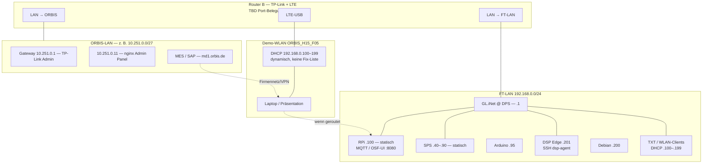

# ORBIS Shopfloor — Netzwerk-Topologie (FT-LAN + OSF-Erweiterung)

**Stand:** 15.07.2026 · **Status:** Entwurf — FT-LAN und Erreichbarkeit weitgehend verifiziert; Router-B-Ports und ORBIS-LAN-Details **TBD**  
**Bezug:** [Sprint 25 Router-Setup](../../sprints/sprint_25.md) · [FT Hardware-Architektur](../../06-integrations/00-REFERENCE/hardware-architecture.md)

---

## Kurz: Was bleibt, was neu ist

| Ebene | Status | Inhalt |
|-------|--------|--------|
| **FT-LAN (APS)** | **Unverändert** | Fischertechnik-Modellfabrik: `192.168.0.0/24`, RPi, SPS/OPC-UA, TXT, MQTT — siehe [hardware-architecture.md](../../06-integrations/00-REFERENCE/hardware-architecture.md) |
| **OSF-Erweiterung** | **Neu (Jul 2026)** | Zwei-Router-Setup: GL.iNet an DPS (FT-Router-Ersatz) + separater Router für **ORBIS-LAN**, **DSP**, **MES/SAP** und Demo-**WLAN** |
| **ORBIS-LAN** | **Teilweise bekannt** | Firmennetz ORBIS — **≠ FT-LAN**; Subnetz u. a. `10.251.0.0/27` (routed, siehe unten) |

**Wichtig:** `192.168.0.x` ist das **FT-LAN** der Modellfabrik. MES/SAP (`md1.orbis.de`) laufen über **ORBIS-Firmennetz**, nicht über reines Demo-WLAN.

---

## Adressierung FT-LAN `192.168.0.0/24`

### Statische Geräte (Ethernet / feste IPs)

| Bereich / Gerät | IP | Anmerkung |
|-----------------|-----|-----------|
| Gateway | `192.168.0.1` | GL.iNet @ DPS (ersetzt FT-Router) |
| SPS OPC-UA | `.40` / `.50` / `.70` / `.80` / `.90` | MILL, DRILL, AIQS, HBW, DPS — siehe Hardware-Doku |
| Arduino Sensor | `192.168.0.95` | MQTT |
| **Raspberry Pi** (CCU, MQTT, OSF-UI) | **`192.168.0.100`** | statisch, Ethernet — **nicht** „irgendein DHCP-Client“ |
| **DSP Edge** (Persistence/Grafana-Host) | **`192.168.0.201`** | SSH `dsp-agent@192.168.0.201`; HTTP/Grafana siehe Erreichbarkeit |
| Debian (Edge-Umfeld) | `192.168.0.200` | SSH erreichbar (15.07.2026) |
| ORBIS-Arbeitsplatz | `192.168.0.191` | Ping OK, HTTP gefiltert |

### Demo-WLAN **`ORBIS_H15_F05`** — DHCP (dynamisch)

| Feld | Wert |
|------|------|
| **SSID** | `ORBIS_H15_F05` (PW siehe Sprint 25) |
| **DHCP-Pool** | **`192.168.0.100` – `192.168.0.199`** |
| **Regel für Doku** | **Keine** feste Zuordnung „`.101` = Gerät X“ — Adressen **wechseln** pro Client und Session |

Alle Clients, die sich am **Demo-WLAN** anmelden (Laptop, Tablet, TXT per WLAN, …), erhalten eine **dynamische** Adresse aus diesem Pool.

**Nicht dokumentieren:** Einzelne `.10x`-Einträge für WLAN-Geräte (z. B. „TXT-DPS = .102“) — das war Legacy-DHCP-Gewohnheit und ist **für ORBIS_H15_F05 nicht verbindlich**.

**RPi `.100`:** liegt im numerischen Pool-Bereich, ist aber **fest per Ethernet** am FT-Switch — typisch **Reservierung/Static**, nicht „irgendein WLAN-Client“.

---

## Rollen der zwei Router (Sprint 25/26)

### Router A — GL.iNet an der DPS-Station

| Feld | Wert / Hinweis |
|------|----------------|
| **Ort** | DPS-Station (Warenein- und -ausgang) |
| **Funktion** | Ersatz für den **originalen FT-Router** an der DPS |
| **Netz** | **FT-LAN** (`192.168.0.0/24`) |
| **Gateway** | `192.168.0.1` |
| **Admin-UI** | `http://192.168.0.1/` — GL.iNet Admin Panel |
| **Routing** | Route ins **ORBIS-LAN** `10.251.0.0/27` (empirisch 15.07.2026) |

### Router B — ORBIS-/Demo-Router (TP-Link + LTE-USB)

| Feld | Wert / Hinweis |
|------|----------------|
| **Funktion** | **ORBIS-LAN** (MES/SAP), Demo-**WLAN** `ORBIS_H15_F05`, LTE |
| **DHCP** | Vergibt **`192.168.0.100–199`** an WLAN-Clients (siehe oben) |
| **Phys. Anschlüsse** | **`TBD`** — Ports FT-LAN / ORBIS-LAN / DSP |
| **ORBIS-LAN** | Geroutet u. a. **`10.251.0.0/27`** — Details **TBD** |

---

## Topologie-Diagramm (Entwurf)



---

## Erreichbarkeit (empirisch)

### FT-LAN — Ping / Dienste (14.–15.07.2026)

Quelle: RPi `ff22@192.168.0.100` und Mac im Shopfloor-/Demo-WLAN.

| Ziel | Ping | Dienste / HTTP | Anmerkung |
|------|------|----------------|-----------|
| `192.168.0.1` | ✅ | GL.iNet Admin | Gateway |
| `192.168.0.100` | ✅ | **1883**, **9001**, **8080** | RPi / OSF-UI |
| SPS `.40–.90`, Arduino `.95` | ✅ | OPC-UA **4840** | statisch Ethernet |
| `192.168.0.200` | ✅ | SSH **22** | Debian |
| `192.168.0.201` | ✅ | SSH **22** (`dsp-agent`); **Grafana :3000 refused** | DSP Edge; `dspEdgeUrl` **TBD** |
| `192.168.0.191` | ✅ | HTTP **gefiltert** | ORBIS-PC |
| WLAN-Pool `.100–.199` | variabel | — | **keine** Fix-Tabelle pro `.10x` |

### ORBIS-LAN `10.251.0.0/27` (15.07.2026, via GL.iNet geroutet)

| Ziel | Ping | Anmerkung |
|------|------|-----------|
| `10.251.0.1` | ✅ | TP-Link Router Admin |
| `10.251.0.11` | ✅ | nginx „Admin Panel“, LuCI :8080 |
| weitere `.10x` | **TBD** | mit Netzwerk-Kollegen vervollständigen |

### Cloud / Firmen-Dienste (von Demo-WLAN)

| Ziel | Ergebnis (15.07.2026) |
|------|------------------------|
| **`https://md1.orbis.de/`** (MES, PT, Supervisor) | **HTTP 502** — **Firmennetz/VPN nötig**, Demo-WLAN allein reicht nicht |
| Internet (allgemein) | ✅ über LTE |

### External Links auf RPi (Stand nach Deploy **v1.1.8**, 15.07.2026)

In `external-links.json` im Container — u. a. MD1-URLs, Grafana `http://192.168.0.201:3000/dashboards`, **`dspEdgeUrl`: leer** bis HTTP-UI auf `.201` geklärt.

---

## Verkabelung (Checkliste — bitte vervollständigen)

| # | Von | Nach | Status | Notiz |
|---|-----|------|--------|-------|
| 1 | FT-Backbone | **GL.iNet** @ DPS | **TBD** | FT-Router-Ersatz |
| 2 | FT-Switch | RPi `192.168.0.100` | **Bestehend** | statisch |
| 3 | FT-Switch | SPS `.40–.90` | **Bestehend** | statisch |
| 4 | **Router B** | **ORBIS-LAN** | **TBD** | MES/SAP |
| 5 | **Router B** | **FT-LAN** / GL.iNet | **TBD** | Brücke + DHCP 100–199 |
| 6 | **Router B** | **DSP** / Edge `.201` | **Teilweise** | Host bekannt, Port-Belegung **TBD** |
| 7 | **Router B** | **LTE-USB** | **Dokumentiert** | WLAN `ORBIS_H15_F05` |

---

## FT-LAN — Referenz (statische Kern-Hosts)

Kanonical: [hardware-architecture.md § Netzwerk-Architektur](../../06-integrations/00-REFERENCE/hardware-architecture.md#-netzwerk-architektur)

**OSF Live:** MQTT/WebSocket **`192.168.0.100`** — [runtime-modes-matrix.md](../helper_apps/session-manager/runtime-modes-matrix.md).

**WLAN-Clients (TXT, Laptops):** nur **DHCP-Pool** `192.168.0.100–199` am SSID **`ORBIS_H15_F05`** — aktuelle IP per Router-DHCP-Liste oder Scan ermitteln, **nicht** in Repo-Docs fest verdrahten.

---

## Lücken für Kollegen (Vervollständigung)

- [ ] **Router B:** Modell, Management-IP, physische Port-Belegung (WAN/LAN1/LAN2)
- [ ] **ORBIS-LAN:** Vollständige Adressliste, DNS, MES/SAP-Pfad zur Demo
- [ ] **DSP Edge `.201`:** HTTP-UI für **`dspEdgeUrl`** (Port/Pfad); Grafana `:3000` starten/öffentlichen?
- [ ] **Demo-WLAN:** Routing-Regeln FT-LAN ↔ ORBIS-LAN ↔ Internet (Latenz MES)
- [ ] **Skizze/Foto** Verkabelung Router B (optional `docs/assets/`)

---

## Betriebsmodi (OSF)

| Modus | Broker / Netz | Doku |
|-------|---------------|------|
| **Live (Modus B/C)** | MQTT **`192.168.0.100`** (FT-LAN) | [runtime-modes-matrix.md](../helper_apps/session-manager/runtime-modes-matrix.md) |
| **Replay (Modus A)** | `localhost` | nicht FT-LAN |
| **MES/SAP/DSP** | ORBIS-LAN + ggf. VPN | `md1.orbis.de` nicht nur über Demo-WLAN |

---

## Änderungshistorie

| Datum | Änderung |
|-------|----------|
| 14.07.2026 | Erstversion: Zwei-Router-Rollen, Mermaid, Ping-Snapshot FT-LAN |
| 15.07.2026 | DHCP-Pool **100–199** für `ORBIS_H15_F05`; keine Fix-`.10x`-Liste; Erreichbarkeit `.200`/`.201`/`.191`, ORBIS-LAN `10.251.0.0/27`, md1/Grafana; External Links v1.1.8 |

---

## HTML-Export (für Kollegen)

```bash
bash scripts/export-network-topology-html.sh
```

Erzeugt: `docs/04-howto/setup/orbis-shopfloor-network-topology.html`
