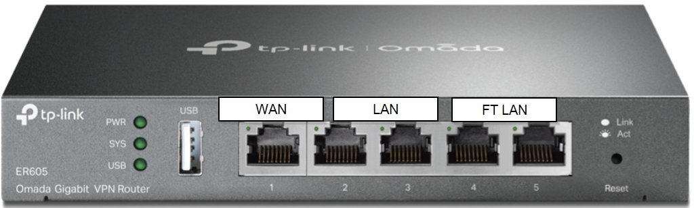
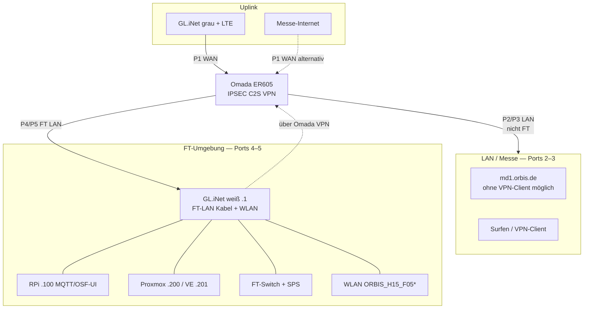
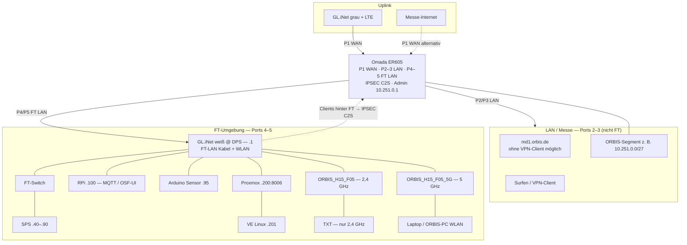

# ORBIS Shopfloor — Netzwerk-Topologie (FT-LAN + OSF-Erweiterung)

**Stand:** 04.09.2026 · **Status:** Topologie mit IT (Dominik) abgestimmt — zwei getrennte Bereiche **LAN/Messe** vs **FT-LAN**; Omada-Portbild kanonisch  
**Bezug:** [Sprint 30](../../sprints/sprint_30.md) · [Sprint 26](../../sprints/sprint_26.md) · [FT Hardware-Architektur](../../06-integrations/00-REFERENCE/hardware-architecture.md)

> **Zugangsdaten:** Im Repo absichtlich mitgeführt (Shopfloor-Betrieb, Team). Repo-Zugriff entsprechend schützen.

---

## Kurz: Was bleibt, was neu ist

| Ebene | Status | Inhalt |
|-------|--------|--------|
| **FT-LAN (APS)** | **Unverändert** | Fischertechnik-Modellfabrik: `192.168.0.0/24`, RPi, SPS/OPC-UA, TXT, MQTT — siehe [hardware-architecture.md](../../06-integrations/00-REFERENCE/hardware-architecture.md) |
| **OSF-Erweiterung** | **Dokumentiert (Jul/Sep 2026)** | Weißer GL.iNet @ DPS + **TP-Link Omada** + **grauer GL.iNet + LTE**; WLAN `ORBIS_H15_F05*`; DSP/Proxmox; DHCP/SSID **bestätigt** |
| **DSP Edge** | **Dokumentiert** | Kleiner PC (~20×20×5 cm) mit **Proxmox** `.200` + Linux-VE `.201` (SQL, Grafana-Ziel, SSH) |
| **ORBIS / Messe-LAN** | **Abgestimmt (IT 04.09.2026)** | Omada **Ports 2–3**; kleines Messe-/ORBIS-Netz; **md1** ohne VPN-Client möglich; **nicht** FT |
| **FT-LAN** | **Abgestimmt** | Omada **Ports 4–5** → weißer GL.iNet → FT Ethernet/WLAN; Clients hinter FT nutzen Omada **IPSEC C2S VPN** |

**Wichtig:** Zwei **getrennte** flexible Bereiche (IT). `192.168.0.x` = nur **FT-Umgebung**. MES/`md1`: über **LAN/Messe** (Ports 2–3) oder VPN; nicht FT-Ports 4–5 zweckentfremden.

---

## Adressierung FT-LAN `192.168.0.0/24`

### Statische Geräte (Ethernet / feste IPs)

Nur diese Hosts fest dokumentieren:

| Bereich / Gerät | IP | Anmerkung |
|-----------------|-----|-----------|
| Gateway | `192.168.0.1` | **Weißer GL.iNet** @ DPS (ersetzt FT-Router an der Station) |
| SPS OPC-UA | `.40` / `.50` / `.70` / `.80` / `.90` | MILL, DRILL, AIQS, HBW, DPS |
| Arduino Sensor | `192.168.0.95` | MQTT |
| **Raspberry Pi** (CCU, MQTT, OSF-UI) | **`192.168.0.100`** | statisch, Ethernet |
| **Proxmox** (DSP-Edge-Hardware) | **`192.168.0.200`** | Hypervisor-UI `https://192.168.0.200:8006` — siehe [DSP Edge](#dsp-edge--proxmox--ve) |
| **Linux-VE auf Proxmox** (DSP-Runtime) | **`192.168.0.201`** | SSH, SQL-Container, Grafana-Ziel |

### DHCP-Clients (dynamisch) — **keine Fix-IPs in der Doku**

DHCP-Pool: **`192.168.0.101` – `192.168.0.199`**.

| Client-Typ | Anbindung | IP |
|------------|-----------|-----|
| **ORBIS-Arbeitsplatz** (Laptop/PC) | Ethernet am FT-/GL.iNet-Pfad **oder** WLAN | **DHCP** — wechselt |
| **TXT-Module** | nur **WLAN 2,4 GHz** (`ORBIS_H15_F05`) | **DHCP** |
| Laptop / Präsentation | bevorzugt **WLAN 5 GHz** (`ORBIS_H15_F05_5G`), alternativ 2,4 GHz oder LAN | **DHCP** |

**Nicht dokumentieren:** einzelne Adressen wie „`.191` = ORBIS-PC“ — das war nur ein Momentaufnahme-Ping, **kein** fester Host.

**RPi `.100`:** fest per Ethernet (außerhalb bzw. reserviert gegenüber dem Client-Pool `.101–.199`).

### Shopfloor-WLAN — zwei SSIDs (`ORBIS_H15_F05*`), ein Subnetz

Beide SSIDs (`ORBIS_H15_F05` / `_5G`) speisen Clients in **`192.168.0.0/24`** (DHCP **`.101–.199`**). So koppeln **FT-LAN (Ethernet)** und Shopfloor-WLAN (`ORBIS_H15_F05*`).

| SSID | Band | Nutzung |
|------|------|---------|
| **`ORBIS_H15_F05`** | **2,4 GHz** | **TXT-Module** (nur 2,4 GHz); auch Laptops möglich |
| **`ORBIS_H15_F05_5G`** | **5 GHz** | **Laptops / Präsentation**; **nicht** für TXT |

---

## DSP Edge — Proxmox + VE

Kleiner PC ohne Monitor (~20×20×5 cm). Darauf läuft die DSP-Edge-Komponente.

### Host: Proxmox `192.168.0.200`

| Feld | Wert |
|------|------|
| **URL** | `https://192.168.0.200:8006` |
| **User** | `root` |
| **Passwort** | `AFF` |
| **Rolle** | Hypervisor / Einstieg „DSP Edge“ in Bookmarks & OSF `dspEdgeUrl` |
| **Kabel** | Omada **Port 4 oder 5 (FT LAN)** |

### VE: Linux auf Proxmox (`Proxmox2026`) `192.168.0.201`

| Feld | Wert |
|------|------|
| **SSH** | `pocadm` / `$ompv$` · `dsp-agent` / `sibro01` |
| **SQL Server (Container)** | Name `rittal_sqlserver` · Host **`192.168.0.201:1433`** (nicht 1443) · Image `mssql/server:2022` · User `sa` · PW `5KpcDHa9GEoR*3osiE` · OSF: **eigene DB/Schema**, Instanz mit DSP abstimmen |
| **Grafana (Ziel)** | `http://192.168.0.201:3000/…` — Alt-Container gestoppt (25.08.2026); Port frei für OSF-Grafana |

**OSF External Link:** `dspEdgeUrl` = Proxmox-UI (`.200:8006`). Analytics/Grafana weiter `.201:3000`.

Was auf RPi vs. `.201` vs. Mac läuft (OSF Persistence/Grafana, Inventar-Lücken): [DSP-Edge: wo läuft was](../deployment/dsp-edge-osf-persistence.md).

---

## Rollen der Router / Geräte

Drei physische Netzwerk-Boxen + FT-Switch — nicht verwechseln:

| Gerät | Farbe / Ort | Rolle |
|-------|-------------|--------|
| **GL.iNet weiß** | DPS-Station | **FT-Router-Ersatz**, Gateway **`192.168.0.1`** |
| **TP-Link Omada ER605** | ORBIS-Tower | Zentrale: **WAN** / **LAN (Messe)** / **FT LAN**; **IPSEC C2S VPN** |
| **GL.iNet grau** | Tower oben | **LTE-Zubringer** → Omada **Port 1 WAN** (alternativ Messe: WAN direkt Messe-Internet) |
| **FT-Switch** | Fischertechnik-Rahmen | Shopfloor-Ethernet (SPS, …); im **FT-LAN** hinter weißem GL.iNet / Ports 4–5 |
| **Proxmox-PC** | Stack unten | DSP Edge `.200` / VE `.201` |

### Router A — GL.iNet an der DPS-Station (weiß)

| Feld | Wert / Hinweis |
|------|----------------|
| **Ort** | DPS-Station (Warenein- und -ausgang), 3D-gedruckter Mount |
| **Funktion** | Ersatz für den **originalen FT-Router** an der DPS |
| **Netz** | **FT-LAN** Gateway `192.168.0.1` |
| **Admin-UI** | `http://192.168.0.1/` |
| **Kabel** | im **FT-LAN**-Pfad (Omada **Ports 4–5 FT LAN**); Label am Gerät historisch `WAN PORT 3 TPLINK` — **Soll laut IT: FT-Seite**, nicht Messe-LAN |
| **Inventory** | `ITSINV-68893` (Barcode am Gerät) |
| **FT-Verteilung** | stellt FT-LAN per **Kabel und WLAN** bereit (IT 04.09.2026) |
| **VPN** | Clients hinter FT-LAN → über Omada (**IPSEC C2S**) |

Foto: [glinet-white-dps-wan-port3.png](../../assets/setup/network/glinet-white-dps-wan-port3.png)

### Router B — TP-Link Omada ER605 (IT-Soll 04.09.2026)

| Feld | Wert / Hinweis |
|------|----------------|
| **Modell** | **Omada ER605** — Gigabit VPN Gateway · HW **UN/2.30** · S/N **22610PH003533** · MAC **AC-A7-F1-8E-48-E8** |
| **Inventar-Aufkleber** | `c2s_internal_mg` · `10.251.0.0/27` |
| **Management-UI** | **`https://10.251.0.1/`** — Credentials **bei IT** |
| **Default-URL Werk** | `https://omadaer.net` — **nicht nutzen** (FortiGuard blockiert) |
| **VPN** | Omada baut **IPSEC C2S** auf; Clients hinter FT-LAN gehen darüber |
| **Phys. Stack** | Oben grau GL.iNet + LTE · Mitte **ER605** · unten Proxmox |

**Kanonisches Portbild (IT):**



### Omada-Port-Pinout (Soll laut IT Dominik, 04.09.2026)

| Port | Rolle | Anbindung / Nutzung |
|------|--------|---------------------|
| **1** | **WAN** | **Grauer GL.iNet** + LTE-Stick **oder** (Messe) direkt **Messe-Internet** |
| **2** | **LAN** | **Messe-Netz** — Surfen, VPN; **md1** auch **ohne** VPN-Client. **Nicht** für FT-Umgebung |
| **3** | **LAN** | wie Port 2 (LAN/Messe-Bereich). **Nicht** für FT-Umgebung |
| **4** | **FT LAN** | **nur FT-Umgebung** — u. a. **weißer GL.iNet** (FT-LAN Kabel + WLAN) |
| **5** | **FT LAN** | **nur FT-Umgebung** — z. B. Proxmox / FT-Pfad |

Ziel: **zwei völlig getrennte, flexible Netzbereiche** (LAN/Messe vs. FT).

Weitere Fotos: [omada-er605-underside-label.jpg](../../assets/setup/network/omada-er605-underside-label.jpg) · [tower-proxmox-glinet-omada-overview.jpg](../../assets/setup/network/tower-proxmox-glinet-omada-overview.jpg) · FT-Switch: [ft-switch-port4-tplink.png](../../assets/setup/network/ft-switch-port4-tplink.png)

### Grauer GL.iNet (LTE) — ORBIS-Tower oben

| Feld | Wert / Hinweis |
|------|----------------|
| **Funktion** | Cellular WAN für Omada (nicht FT-Gateway `.1`) |
| **USB** | **ZTE** LTE-Stick gesteckt (Status-LEDs aktiv) |
| **2,5G WAN** | leer — Internet über USB-LTE |
| **Kabel** | **LAN** → Omada **WAN** (Label am Gerät: **`WAN PORT TPLINK`**) |
| **Power** | USB-C `5V=3A` |

Foto: [glinet-grey-lte-wan-port-tplink.jpg](../../assets/setup/network/glinet-grey-lte-wan-port-tplink.jpg)  
Älteres Stack-Foto: [stack-glinet-grey-omada-proxmox.png](../../assets/setup/network/stack-glinet-grey-omada-proxmox.png)

---

## Wie FT-LAN und Shopfloor-WLAN (`ORBIS_H15_F05*`) zusammenhängen

```text
LTE (grau GL.iNet) ──► Omada P1 WAN ── oder Messe-Internet
                              │
         ┌── P2/P3 LAN ───────► Messe-/ORBIS-Netz (Surfen, VPN, md1 ohne Client)
         └── P4/P5 FT LAN ────► weißer GL.iNet ──► FT-LAN Kabel/WLAN (RPi, SPS, Proxmox, …)
                                      └── Clients hinter FT → Omada IPSEC C2S VPN
```

**Kurz:** FT-WLAN `ORBIS_H15_F05*` gehört zur **FT-Umgebung** (hinter weißem GL.iNet / FT-LAN). Messe-LAN (Ports 2–3) davon **getrennt**.

---

## Topologie-Übersicht (wesentlich)

IT-Soll (Dominik, 04.09.2026) — zwei getrennte Bereiche.

**Versand / Bilder:**
- Portfoto (IT): [omada-er605-ports-wan-lan-ftlan.png](../../assets/setup/network/omada-er605-ports-wan-lan-ftlan.png)
- Gerendertes Diagramm: [orbis-shopfloor-topology-overview.png](../../assets/setup/network/orbis-shopfloor-topology-overview.png) · [SVG](../../assets/setup/network/orbis-shopfloor-topology-overview.svg) · [HTML](orbis-shopfloor-topology-overview.html)


```mermaid
flowchart TB
    subgraph WAN_SIDE["Uplink"]
        LTE["GL.iNet grau + LTE"]
        MESSE_INET["Messe-Internet"]
    end

    OMADA["Omada ER605<br/>IPSEC C2S VPN"]

    subgraph MESSE["LAN / Messe — Ports 2–3"]
        MD1["md1.orbis.de<br/>ohne VPN-Client möglich"]
        SURF["Surfen / VPN-Client"]
    end

    subgraph FT["FT-Umgebung — Ports 4–5"]
        WHITE["GL.iNet weiß .1<br/>FT-LAN Kabel + WLAN"]
        RPI["RPi .100 MQTT/OSF-UI"]
        PROX["Proxmox .200 / VE .201"]
        SPS["FT-Switch + SPS"]
        SSID["WLAN ORBIS_H15_F05*"]
    end

    LTE -->|"P1 WAN"| OMADA
    MESSE_INET -.->|"P1 WAN alternativ"| OMADA
    OMADA -->|"P2/P3 LAN<br/>nicht FT"| MESSE
    OMADA -->|"P4/P5 FT LAN"| WHITE
    WHITE --- RPI
    WHITE --- PROX
    WHITE --- SPS
    WHITE --- SSID
    WHITE -.->|"über Omada VPN"| OMADA
```

---

## Topologie-Diagramm (Detail, IT-Soll 04.09.2026)


```mermaid
flowchart TB
    subgraph UPLINK["Uplink"]
        GREY["GL.iNet grau + LTE"]
        MESSE_INET["Messe-Internet"]
    end

    OMADA["Omada ER605<br/>P1 WAN · P2–3 LAN · P4–5 FT LAN<br/>IPSEC C2S · Admin 10.251.0.1"]

    subgraph MESSE["LAN / Messe — Ports 2–3 (nicht FT)"]
        MD1["md1.orbis.de<br/>ohne VPN-Client möglich"]
        SURF["Surfen / VPN-Client"]
        ORBIS_LAN["ORBIS-Segment z. B. 10.251.0.0/27"]
    end

    subgraph FT["FT-Umgebung — Ports 4–5"]
        GLINET["GL.iNet weiß @ DPS — .1<br/>FT-LAN Kabel + WLAN"]
        FTSW["FT-Switch"]
        RPI["RPi .100 — MQTT / OSF-UI"]
        ARDUINO["Arduino Sensor .95"]
        SPS["SPS .40–.90"]
        PROX["Proxmox .200:8006"]
        VE["VE Linux .201"]
        SSID24["ORBIS_H15_F05 — 2,4 GHz"]
        SSID5["ORBIS_H15_F05_5G — 5 GHz"]
        TXT["TXT — nur 2,4 GHz"]
        LAPTOP["Laptop / ORBIS-PC WLAN"]
    end

    GREY -->|"P1 WAN"| OMADA
    MESSE_INET -.->|"P1 WAN alternativ"| OMADA
    OMADA -->|"P2/P3 LAN"| MESSE
    OMADA -->|"P4/P5 FT LAN"| GLINET
    GLINET --- FTSW
    GLINET --- RPI
    GLINET --- ARDUINO
    GLINET --- PROX
    GLINET --- SSID24
    GLINET --- SSID5
    FTSW --- SPS
    PROX --- VE
    SSID24 --- TXT
    SSID5 --- LAPTOP
    GLINET -.->|"Clients hinter FT → IPSEC C2S"| OMADA
    OMADA --- ORBIS_LAN
    MESSE --- MD1
    MESSE --- SURF
```

---

## Erreichbarkeit (empirisch)

### FT-LAN — Ping / Dienste (03.09.2026, Mac `192.168.0.159` Ethernet)

| Ziel | Ping | Dienste / HTTP | Anmerkung |
|------|------|----------------|-----------|
| `192.168.0.1` | ✅ | Admin **HTTP 200** | Gateway weiß |
| `192.168.0.40` / `.50` / `.70` / `.80` / `.90` | ✅ | — | SPS MILL/DRILL/AIQS/HBW/DPS |
| `192.168.0.95` | ✅ | — | Arduino Sensor |
| `192.168.0.100` | ✅ | MQTT **1883**; OSF-UI **:8080** 302 | RPi |
| `192.168.0.200` | ✅ | Proxmox **:8006** 200 | DSP-Edge-Hardware |
| `192.168.0.201` | ✅ | Grafana **:3000** 200 (+ `/api/health`); SQL **:1433**; SSH **:22** | Linux-VE · OSF Persistenz/Grafana live |
| DHCP `.101–.199` | variabel | — | Laptops, TXT — **keine** Fix-Tabelle |

*Früherer Snapshot 21.07.2026 (Mac `.189`): FT-Kern ebenfalls OK; Grafana damals oft refused (Container gestoppt) — überholt durch Deploy Sprint 29.*

### ORBIS-LAN `10.251.0.0/27`

| Ziel | 15.07.2026 | vom FT-LAN `192.168.0.x` | am Omada-LAN (03.09.2026) | Anmerkung |
|------|------------|-------------------------|---------------------------|-----------|
| `10.251.0.1` | ✅ | ❌ Timeout | ✅ Admin **HTTP/HTTPS 200** | **= Omada ER605** (MAC `AC-A7-F1-8E-48-E8`) |
| `10.251.0.11` | ✅ | ❌ Timeout | — | nginx Admin Panel (früher) |
| weitere | **TBD** | — | — | mit Netzwerk-Kollegen |

**Wichtig:** Omada-Management liegt im **ORBIS-Segment** `10.251.0.0/27`, nicht im FT-LAN. Vom FT-LAN-Client (`192.168.0.x`) ist `10.251.0.1` erwartbar unerreichbar, solange keine Route/VPN.  
**Nicht** `https://omadaer.net` verwenden (Fortinet/FortiGuard blockiert).

### Cloud / Firmen-Dienste

| Ziel | 03.09.2026 | Anmerkung |
|------|------------|-----------|
| **`https://md1.orbis.de/`** | ❌ vom FT-LAN-Client | **Soll:** Messe-LAN (Omada Ports 2–3) auch **ohne** VPN-Client; FT-Clients über Omada **IPSEC C2S**. Vom reinen FT-Client erwartbar oft unerreichbar |
| **`https://omadaer.net/`** | ❌ FortiGuard | Durch **https://10.251.0.1/** ersetzen |
| Internet | ✅ | über LTE (grauer GL.iNet → Omada WAN) |

### External Links (OSF-UI)

| Key | URL | Hinweis |
|-----|-----|---------|
| `dspEdgeUrl` | `https://192.168.0.200:8006` | Proxmox |
| `bpAnalyticsApplicationUrl` | `http://192.168.0.201:3000/dashboards` | Grafana auf VE — **live OK** 03.09.2026 |

---

## Verkabelung (Checkliste) — Soll IT 04.09.2026

| # | Von | Nach | Status | Notiz |
|---|-----|------|--------|-------|
| 1 | Grauer GL.iNet LAN | Omada **Port 1 WAN** | **Soll** | LTE-Uplink · Label `WAN PORT TPLINK`; Messe: WAN direkt Messe-Internet |
| 2 | Omada **Ports 2–3 LAN** | Messe-/ORBIS-Netz | **Soll** | Surfen, VPN, **md1 ohne VPN-Client** — **nicht** FT |
| 3 | Omada **Ports 4–5 FT LAN** | Weißer GL.iNet @ DPS | **Soll** | Label am weißen Gerät historisch `WAN PORT 3 TPLINK` — physisch **FT-Seite** |
| 4 | Omada **Port 4 oder 5 FT LAN** | Proxmox (`FT LAN`) | **Soll** | → VE `.201` |
| 5 | Weißer GL.iNet / FT-Pfad | FT-Switch · RPi `.100` · SPS | **Bestehend** | FT-Ethernet |
| 6 | Weißer GL.iNet | WLAN `ORBIS_H15_F05*` | **Soll / bestätigt** | FT-LAN per Kabel **und** WLAN (IT); DHCP `.101–.199` |
| 7 | Clients hinter FT-LAN | Internet / ORBIS via Omada | **Soll** | **IPSEC C2S** am Omada (nicht Messe-Ports zweckentfremden) |

---

## FT-LAN — Referenz (statische Kern-Hosts)

Kanonical: [hardware-architecture.md § Netzwerk-Architektur](../../06-integrations/00-REFERENCE/hardware-architecture.md#-netzwerk-architektur)

**OSF Live:** MQTT/WebSocket **`192.168.0.100`** — [runtime-modes-matrix.md](../helper_apps/session-manager/runtime-modes-matrix.md).

---

## Noch offen (nicht abgehakt)

- [x] **Omada-Port-Pinout Soll (IT 04.09.2026):** P1 WAN · P2–3 LAN/Messe · P4–5 FT LAN — Bild [omada-er605-ports-wan-lan-ftlan.png](../../assets/setup/network/omada-er605-ports-wan-lan-ftlan.png)
- [x] **Zwei getrennte Bereiche** LAN/Messe vs FT (IT)
- [x] **md1:** über Messe-LAN (Port 2) auch **ohne** VPN-Client; FT-Clients über Omada **IPSEC C2S**
- [x] DHCP/SSID FT `ORBIS_H15_F05*` · Omada Admin `https://10.251.0.1/` · Credentials bei IT
- [x] HTML-Export / Overview-PNG neu gerendert (04.09.2026)
- [ ] **Ist-Verkabelung vor Ort (nächste Woche):** Weißer GL.iNet am Omada — Port **4/5 FT LAN** oder noch **Port 3** (Label `PORT 3 TPLINK`)? Bei Bedarf umstecken + Labels; Sprint-30-Task. Rückfrage Dominik per Mail 04.09.2026.

### IT-Antwort (Dominik, 04.09.2026) — übernommen

Kurzfassung: Port **1 = WAN** (grau GL.iNet+LTE oder Messe-Uplink); Ports **2–3 = LAN/Messe** (Surfen, VPN, **md1** ohne Client — **nicht** FT); Ports **4–5 = FT LAN** (weißer GL.iNet → FT Kabel/WLAN; VPN über Omada IPSEC C2S). Zwei völlig getrennte flexible Netzbereiche.

Mail-Screenshot (intern): [it-reply-dominik-topology-2026-09-04.png](../../assets/setup/network/it-reply-dominik-topology-2026-09-04.png)

---

## Betriebsmodi (OSF)

| Modus | Broker / Netz | Doku |
|-------|---------------|------|
| **Live (Modus B/C)** | MQTT **`192.168.0.100`** (FT-LAN) | [runtime-modes-matrix.md](../helper_apps/session-manager/runtime-modes-matrix.md) |
| **Replay (Modus A)** | `localhost` | nicht FT-LAN |
| **MES/SAP** | ORBIS-LAN + ggf. VPN | `md1.orbis.de` |
| **DSP Edge** | Proxmox `.200:8006` / VE `.201` | dieses Dokument |

---

## Änderungshistorie

| Datum | Änderung |
|-------|----------|
| 14.07.2026 | Erstversion: Zwei-Router-Rollen, Mermaid, Ping-Snapshot FT-LAN |
| 15.07.2026 | DHCP-Pool dokumentiert; Erreichbarkeit `.200`/`.201`; ORBIS-LAN `10.251.0.0/27` |
| 17.07.2026 | Proxmox `.200:8006` + VE `.201`; Dual-SSID; Zugangsdaten; **kein** Fix-IP für ORBIS-Arbeitsplatz (DHCP `.101–.199`, LAN oder WLAN) |
| 21.07.2026 | Omada-Pinout P1/P3/P4/P5; grau LTE vs. weiß DPS; Fotos unter `docs/assets/setup/network/`; Ping-Retest FT-LAN OK, `10.251.0.1` timeout |
| 03.09.2026 | Omada ER605 / `10.251.0.1`; IT-Anfrage Topologie |
| 04.09.2026 | IT Dominik: Port-Soll WAN/LAN/FT LAN; zwei Netze; md1 ohne Client am Messe-LAN; IPSEC C2S; kanonisches Portbild; Detail-Mermaid + Verkabelung an Soll angeglichen; Overview-PNG neu |

---

## HTML-Export (für Kollegen)

```bash
bash scripts/export-network-topology-html.sh
```

Erzeugt: `docs/04-howto/setup/orbis-shopfloor-network-topology.html`

**Nur Übersicht (E-Mail):** PNG/SVG unter `docs/assets/setup/network/orbis-shopfloor-topology-overview.*` — neu rendern:

```bash
npx -y @mermaid-js/mermaid-cli -i /tmp/topology-overview.mmd -o docs/assets/setup/network/orbis-shopfloor-topology-overview.png -b white
```
