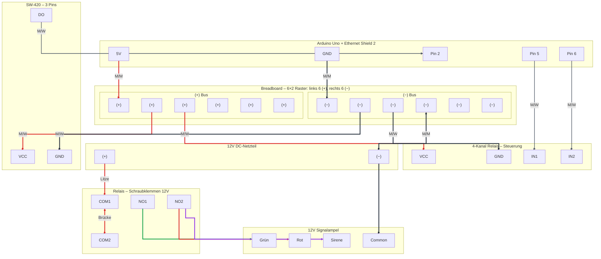

# Vibrationsüberwachung APS-Modellfabrik

Arduino, Ethernet Shield 2, SW-420 und 12V-Signalampel zur Detektion von Vibrationen.

**Voraussetzung:** [Arduino IDE Setup](../04-howto/setup/arduino-ide-setup.md) – zuerst Blink-Test durchführen.

---

## 1. Hardware & Verdrahtung

**Komponenten:** Arduino Uno, Ethernet Shield 2, SW-420 (ohne Potentiometer), 4-Kanal-Relais, 12V-Ampel, Jumperkabel.

### Verdrahtungsdiagramm

Quelldatei: [arduino-vibrationssensor-verdrahtung.mermaid](arduino-vibrationssensor-verdrahtung.mermaid)

### Sensor (SW-420)

| Anschluss   | Verbindung                   |
|-------------|------------------------------|
| VCC         | Breadboard (+)               |
| GND         | Breadboard (−)               |
| DO (Signal) | Pin 2 am Arduino             |

### Relais (erprobtes Setup)

Beide Relais High-Level (HIGH = AN): Pin 5 → Grün, Pin 6 → Rot+Sirene.

| Anschluss      | Verbindung                                   |
|----------------|-----------------------------------------------|
| VCC            | Breadboard (+)                               |
| GND            | Breadboard (−)                               |
| Relais 1 (Grün)| Pin **5** → Grün an NO (Ruhezustand)         |
| Relais 2 (Rot) | Pin **6** → Rot+Lila an NO (Alarm)           |

### Ampel (12V)

| Kabel  | Anschluss                               |
|--------|-----------------------------------------|
| Grau   | Common → DC-Adapter (−)                  |
| Grün   | Relais 1, NO                            |
| Rot+Lila | Relais 2, NO (gemeinsam)              |

**Common Ground:** Breadboard (−) mit DC-Adapter (−) verbinden.

---

## 2. Sketch & Verhalten

**Sketch:** `integrations/Arduino/Vibrationssensor_SW420/Vibrationssensor_SW420.ino`

- Ruhe: Grün an. Bei Vibration: Rot+Sirene für 2 s, dann zurück zu Grün.
- Serial Monitor (9600 Baud): `!!! VIBRATION ERKANNT !!!` bei Auslösung.

---

## 3. Netzwerk & osf-ui

**MQTT (USE_MQTT = 1):** Arduino IP 192.168.0.95, Broker 192.168.0.100.

| Topic | Inhalt |
|-------|--------|
| `osf/arduino/vibration/sw420-1/state` | `{"ampel":"GRUEN"\|"ROT","impulseCount":n}` |
| `osf/arduino/vibration/sw420-1/connection` | LWT, Online-Status |

**osf-ui:** Das Topic `osf/#` ist abonniert. Im Message Monitor Filter „OSF Topics“ wählen. Vibrations-Kachel im Sensor-Tab zeigt Ampel (Grün/Rot) und Impulse.

**Status:** Mock und Replay positiv getestet. Live-Umgebung (Arduino → Broker → osf-ui) noch ausstehend.

### OSF-Topics testen (ohne Arduino/Broker)

Zum Testen der Message-Monitor-Erweiterung ohne laufenden Arduino oder MQTT-Broker:

**Option A – Replay-Preload (echter MQTT-Broker):**

1. MQTT-Broker starten (z. B. Mosquitto mit WebSocket-Port 9001).
2. **Session Manager** starten → Tab „Replay Station“ → MQTT-Broker verbinden.
3. „Preloads jetzt senden“ klicken. Die Dateien in `data/omf-data/test_topics/preloads/` werden an den Broker gesendet:
   - `osf_arduino_vibration_sw420-1_connection.json` – Online-Status
   - `osf_arduino_vibration_sw420-1_state.json` – Ruhezustand (GRUEN)
   - `osf_arduino_vibration_sw420-1_state_alarm.json` – Alarm (ROT)
4. **osf-ui** im Replay-Modus starten und mit dem Broker verbinden.
5. Message Monitor öffnen → Filter „OSF Topics“ – Topics `osf/arduino/vibration/sw420-1/*` sollten erscheinen.

**Option B – Mock-Fixture (ohne Broker):**

1. **osf-ui** im Mock-Modus starten.
2. **Sensor-Tab** öffnen (lädt `sensor-startup` inkl. Vibrations-Fixture).
3. Message Monitor öffnen → Filter „OSF Topics“ – Topics `osf/arduino/vibration/sw420-1/*` sollten erscheinen.
4. **Vibrations-Kachel:** Buttons „Ruhe senden“ und „Alarm senden“ (nur Mock) injizieren Test-Nachrichten und aktualisieren die Ampel-Anzeige.

**Hinweis:** Fixture-Buttons und Vibrations-Steuerung erscheinen nur, wenn Environment = **Mock** gewählt ist.

---

## 4. Troubleshooting

**Alarm löst nicht aus:** Serial Monitor prüfen – erscheint „VIBRATION ERKANNT“? Wenn ja: Relais/12V prüfen. Wenn nein: `SENSOR_ACTIVE_HIGH` im Sketch umstellen (0/1), Verdrahtung DO → Pin 2 prüfen.

**Relais-LED leuchtet, Ampel bleibt aus:** 12V-Stromkreis prüfen – COM mit Plus, Ampel-Kabel in **NO** (nicht NC), Grau (Common) an Minus.

---

## 5. Ausblick – Erweiterung auf MPU-6050

Die gewünschte Änderung des Setups: Ersatz des SW-420 durch den MPU-6050 (Beschleunigungssensor & Gyroskop) für präzisere Messung. Das Modul ist im Sensor-Kit enthalten.

### Warum das Upgrade?

- **Frequenzanalyse:** Unterscheidung z.B. zwischen Motoren-Rumpeln und Stimmgabel-Surren
- **Höhere Sensibilität:** Erfassung schwacher Vibrationen, die der SW-420 nicht auslöst
- **Condition Monitoring:** Erkennung von Verschleiß durch Veränderung des Vibrationsmusters

### Geplante Hardware-Änderungen

- **Schnittstelle:** Digital-Pin → I2C-Bus (SDA, SCL – typisch A4/A5 oder dedizierte Pins oberhalb Pin 13)
- **Verkabelung:** VCC, GND, SDA, SCL (4 Leitungen)
- **Stromversorgung:** Weiterhin 5V über Breadboard

### Geplante Software-Änderungen

- **Bibliotheken:** `Wire.h` (I2C) + MPU-6050-Library
- **Auswertung:** Gleitender Mittelwert oder FFT
- **Ampel-Logik:** Schwellenwerte basieren auf Amplitude/Frequenz statt Impulsanzahl

### Fazit

Arduino, Ethernet Shield, Relais und 12V-Ampel bleiben unverändert. Nur der Sensor wird ausgetauscht.
