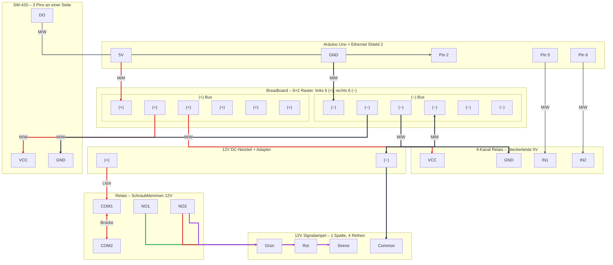

# Projektplan: Vibrationsüberwachung APS-Modellfabrik

Dieses Dokument beschreibt den Aufbau eines Überwachungssystems mit Arduino, Ethernet Shield 2 und einer 12V-Signalampel zur Detektion von Vibrationen (z. B. mittels Stimmgabel).

## Voraussetzung: Arduino IDE

Zum Programmieren des Arduinos wird die **Arduino IDE** benötigt. Die Einrichtung (Installation, Board, Port) ist in einem eigenen How-To beschrieben:

- **[Arduino IDE Setup](../04-howto/setup/arduino-ide-setup.md)** – Installation und Konfiguration der Entwicklungsumgebung

Sobald die IDE installiert ist, führe den **Systemtest (Blink-Test)** durch – erst dann beginnt die Projektverkabelung.

---

## Systemtest (Hardware-Software-Check)

Bevor die eigentliche Projektverkabelung beginnt, muss sichergestellt werden, dass der Computer den Mikrocontroller korrekt anspricht. Dies geschieht über den sogenannten **Blink-Test**.

### 1. Verbindung herstellen

Verbinde den Arduino Uno über das USB-Typ-B-Kabel mit dem Computer.

Die grüne „ON“-LED auf dem Board muss leuchten.

### 2. Port- und Board-Konfiguration

Öffne die Arduino IDE (z. B. 2.3.x).

- Wähle im oberen Dropdown-Menü das Board **Arduino Uno** aus.
- Stelle sicher, dass der zugehörige Port (z. B. `COM3` unter Windows oder `/dev/cu.usbmodem...` unter macOS) mit einem Häkchen markiert ist.

### 3. Laden des Beispiel-Sketches

Navigiere zu: **Datei → Beispiele → 01.Basics → Blink**.

Es öffnet sich ein neues Fenster mit dem fertigen Test-Code.

### 4. Kompilieren und Hochladen

1. Klicke auf das **Häkchen-Symbol** (Verify), um den Code zu kompilieren. In der Statuszeile muss „Done compiling“ erscheinen.
2. Klicke auf den **Pfeil nach rechts** (Upload). Der Code wird auf den Arduino geschrieben. Währenddessen blinken die TX/RX-LEDs auf dem Board.

### 5. Erfolgskontrolle

Der Test ist erfolgreich abgeschlossen, wenn:

- die Statuszeile der IDE „Done uploading“ anzeigt;
- die auf dem Arduino fest verbaute **orangerote LED** (markiert mit „L“) im Rhythmus von einer Sekunde blinkt.

Damit ist nachgewiesen, dass die Entwicklungsumgebung einsatzbereit ist.

---

## 1. Vorbereitung & Hardware-Check

Bevor du startest, stelle sicher, dass folgende Komponenten bereitliegen:

* [ ] Arduino Uno & Ethernet Shield 2
* [ ] SW-420 Vibrationssensor
* [ ] 4-Kanal Relais Modul (5V)
* [ ] 12V Signalampel & 12V Netzteil
* [ ] Jumperkabel (M/M, M/F) & USB-Kabel
* [ ] DC-Adapter für das Netzteil

---

## 2. Schritt-für-Schritt Aufbau

Hier ist deine Master-Anleitung für den kompletten Aufbau. Dieses Dokument führt dich von der ersten Steckverbindung bis zur 12V-Hochspannung der Ampel.

### Verdrahtungsdiagramm (Übersicht)

Das folgende Diagramm zeigt die Komponenten und Kabelverbindungen. L-förmige Kanten, Kabel-Farben (Rot, Schwarz, Grün, Lila) entsprechen der realen Verdrahtung. Quelldatei: [arduino-vibrationssensor-verdrahtung.mermaid](arduino-vibrationssensor-verdrahtung.mermaid)



### Aufbauanleitung: APS-Vibrationswächter

#### Vorbereitung

Lege dir alle Teile bereit. Wir trennen strikt zwischen der 5V-Logik (Arduino/Sensor) und der 12V-Last (Ampel).

#### Schritt 1: Das „Gehirn“ vorbereiten

1. Setze das Arduino Ethernet Shield 2 vorsichtig auf den Arduino Uno.
2. Drücke es fest, bis die Pins komplett in den Buchsen des Uno verschwinden.
3. Verbinde den Arduino noch nicht mit dem PC.

#### Schritt 2: Die 5V-Stromverteilung (Breadboard)

Da wir mehrere Module mit Strom versorgen müssen, nutzen wir das Breadboard als Verteiler:

- **GND verbinden:** Nimm ein schwarzes M/M-Jumperkabel. Stecke ein Ende in einen GND-Pin des Arduinos und das andere Ende in die blaue Leiste (−) am Rand des Breadboards.
- **5V verbinden:** Nimm ein rotes M/M-Jumperkabel. Stecke es in den 5V-Pin des Arduinos und das andere Ende in die rote Leiste (+) des Breadboards.

#### Schritt 3: Sensor & Relais anschließen (Logik)

**A. Vibrationssensor (SW-420)**

Verwende M/W-Jumperkabel:

| Anschluss   | Verbindung                      |
|-------------|----------------------------------|
| VCC (Sensor)| Rote Leiste (+) am Breadboard    |
| GND (Sensor)| Blaue Leiste (−) am Breadboard   |
| DO (Signal) | Digitaler Pin 2 am Arduino       |

**B. Relais-Modul (Eingangsseite)**

Verwende M/W-Jumperkabel:

| Anschluss      | Verbindung                                  |
|----------------|----------------------------------------------|
| VCC (Relais)   | Rote Leiste (+) am Breadboard                |
| GND (Relais)   | Blaue Leiste (−) am Breadboard               |
| IN1 (Steuerung)| Digitaler Pin 5 am Arduino (für Grün)        |
| IN2 (Steuerung)| Digitaler Pin 6 am Arduino (für Rot/Sirene)   |

#### Schritt 4: Die 12V-Leistung (Ampel & Netzteil)

**A. Den DC-Adapter (Weiblich) vorbereiten**

- Nimm deine rote Litze. Schraube ein Ende in den Plus-Pol (+) des Adapters.
- Nimm deine schwarze Litze. Schraube ein Ende in den Minus-Pol (−) des Adapters.

**B. Das Relais „brücken“ (Die COM-Kette)**

Damit alle Lampen Strom bekommen, müssen wir die mittleren Kontakte (COM) der Relais verbinden:

1. Führe das rote Kabel vom DC-Adapter (+) zum COM-Anschluss von Relais 1.
2. Nimm ein kurzes Stück rote Litze („Brücke“) und verbinde damit COM 1 mit COM 2.
3. Schraube beide Enden fest zu (bei COM 1 liegen also zwei Kabelenden in einer Klemme).

**C. Ampel anschließen**

- **Minus-Pol:** Verbinde das graue (oder lila) gemeinsame Kabel der Ampel mit dem schwarzen Kabel vom DC-Adapter (−). (Nutze eine Wago- oder Lüsterklemme.)
- **Grünes Licht:** Stecke das grüne Kabel der Ampel in den NO-Anschluss von Relais 1.
- **Rotes Licht & Sirene:** Stecke das rote Kabel UND das lila Kabel der Ampel zusammen in den NO-Anschluss von Relais 2.

#### Schritt 5: Common Ground (WICHTIG!)

Damit die Signale sauber fließen, müssen die Minuspole (Massen) beider Systeme verbunden werden:

1. Nimm ein schwarzes M/M-Jumperkabel.
2. Stecke ein Ende in die blaue Leiste (−) am Breadboard (5V-Welt).
3. Stecke das andere Ende mit in die Minus-Schraubklemme (−) deines 12V-DC-Adapters (oder in die Lüsterklemme der Ampel-Masse).

#### Zusammenfassung der Farblogik

| Farbe      | Bedeutung                                         |
|------------|---------------------------------------------------|
| **Rot**    | Überall dort, wo Strom fließt (+5V oder +12V).    |
| **Schwarz**| Überall dort, wo die Masse zurückfließt (GND / −).|
| **Andere** | Nur für Daten-Signale (Sensor, Relais-Steuerung).  |

#### Nächste Schritte

1. Prüfe alle Schraubklemmen auf festen Sitz (kurz am Kabel ziehen).
2. Schließe das USB-Kabel an den PC an.
3. Stecke erst ganz zum Schluss das 12V-Netzteil in die Steckdose.


---

## 3. Test-Software (Basis-Logik)

Dieser Code prüft den Sensor und schaltet die Ampel bei Vibration von Grün auf Rot/Alarm um.

**Quellcode:** Der vollständige Sketch liegt in `integrations/Arduino/Vibrationssensor_SW420/`. Arduino IDE mit Sketchbook = `integrations/Arduino` öffnen und `Vibrationssensor_SW420` auswählen.

```cpp
/*
 * Projekt: Vibrationsüberwachung APS-Modellfabrik
 * Hardware: Arduino Uno, Ethernet Shield 2, SW-420, 4-Ch Relais, 12V Ampel
 */

// Pin Definitionen
const int SENSOR_PIN = 2;   // SW-420 Digital Out
const int RELAY_GRUEN = 5;  // Relais für grüne Lampe
const int RELAY_ROT = 6;    // Relais für rote Lampe + Sirene

// Einstellungen
int alarmDauer = 2000;      // Wie lange der Alarm nach Erschütterung aktiv bleibt (ms)

void setup() {
  Serial.begin(9600);
  
  // Pin Modi festlegen
  pinMode(SENSOR_PIN, INPUT);
  pinMode(RELAY_GRUEN, OUTPUT);
  pinMode(RELAY_ROT, OUTPUT);

  // Initialzustand: Grün an, Rot aus
  // Hinweis: Viele Relais-Module sind "Low-Level Triggered" (LOW = AN)
  digitalWrite(RELAY_GRUEN, LOW); 
  digitalWrite(RELAY_ROT, HIGH);
  
  Serial.println("System bereit. Warte auf Vibration...");
}

void loop() {
  // Sensor auslesen
  int vibration = digitalRead(SENSOR_PIN);

  if (vibration == HIGH) {
    Serial.println("!!! VIBRATION ERKANNT !!!");
    
    // Ampel umschalten
    digitalWrite(RELAY_GRUEN, HIGH); // Grün AUS
    digitalWrite(RELAY_ROT, LOW);    // Rot/Alarm AN
    
    delay(alarmDauer);               // Alarmzeit abwarten
    
    // Zurück in Normalzustand
    digitalWrite(RELAY_GRUEN, LOW);  // Grün AN
    digitalWrite(RELAY_ROT, HIGH);   // Rot/Alarm AUS
    Serial.println("System beruhigt. Überwachung läuft...");
  }
}
```

---

## 4. Nächste Schritte nach dem Hardware-Test

1. **Serial Monitor:** Arduino IDE → Lupen-Symbol (Serial Monitor) → 9600 Baud. Bei Vibration erscheint `!!! VIBRATION ERKANNT !!!` – ideal zur Kontrolle vor der MQTT-Integration.
2. **Kalibrierung:** Drehe am blauen Potentiometer des SW-420, bis die Status-LED gerade so erlischt. Teste die Empfindlichkeit mit der Stimmgabel.
3. **Netzwerk-Einbindung:** Sobald die lokale Logik läuft, ergänzen wir den Code um Ethernet und MQTT ([arduino-mqtt-ethernet-setup.md](arduino-mqtt-ethernet-setup.md)), um die Alarme per LAN zu senden.
4. **Integration:** Mechanische Befestigung des Sensors an den fischertechnik-U-Profilen der Modellfabrik.

---

## 5. Ausblick – Erweiterung auf MPU-6050 (Präzisionsmessung)

Sollte die Schwellenwert-Messung mit dem mechanischen SW-420 Sensor für die Analyse feinerer Schwingungen der APS-Modellfabrik nicht ausreichen, ist ein Upgrade auf den MPU-6050 (Beschleunigungssensor & Gyroskop) vorgesehen. Dieses Modul ist bereits in deinem Sensor-Kit enthalten.

### 5.1 Warum das Upgrade?

Während der SW-420 lediglich „Ereignisse“ zählt, liefert der MPU-6050 echte physikalische Beschleunigungswerte für drei Achsen. Dies ermöglicht:

- **Echte Frequenzanalyse:** Unterscheidung zwischen einem dumpfen Rumpeln (Motoren) und einem hellen Surren (Stimmgabel).
- **Höhere Sensibilität:** Erfassung von Vibrationen, die zu schwach sind, um die mechanische Feder im SW-420 auszulösen.
- **Zustandsüberwachung (Condition Monitoring):** Erkennung von beginnendem Verschleiß an den fischertechnik-Motoren durch Veränderung des Vibrationsmusters.

### 5.2 Geplante Änderungen an der Hardware

- **Schnittstelle:** Der Anschluss wechselt von einem einfachen Digital-Pin auf den I2C-Bus des Arduinos.
- **Verkabelung:** Der Sensor benötigt vier Verbindungen (VCC, GND sowie die Datenleitungen SDA und SCL). Beim Ethernet Shield 2 liegen diese Pins meist an den dedizierten Anschlüssen oberhalb von Pin 13 oder an A4/A5.
- **Stromversorgung:** Der MPU-6050 wird ebenfalls über die 5V-Schiene des Breadboards versorgt.

### 5.3 Geplante Änderungen an der Software

- **Bibliotheken:** Einbindung der `Wire.h` (für I2C) und einer MPU-6050 Library zur Rohdaten-Auslesung.
- **Mathematik:** Implementierung einer einfachen gleitenden Durchschnittsberechnung oder einer schnellen Fourier-Transformation (FFT) im Code.
- **Ampel-Logik:** Die Schwellenwerte für Grün, Gelb und Rot basieren dann nicht mehr auf der Anzahl der Impulse, sondern auf der gemessenen Amplitude (Stärke) oder einer spezifischen Ziel-Frequenz.

### 5.4 Fazit

Die bestehende Infrastruktur (Arduino, Ethernet Shield, Relais-Modul und 12V-Signalampel) bleibt komplett identisch. Lediglich das „Auge“ des Systems (der Sensor) wird durch ein präziseres Modul ersetzt, was das Projekt auf ein industrielles Niveau der Qualitätsüberwachung hebt.
