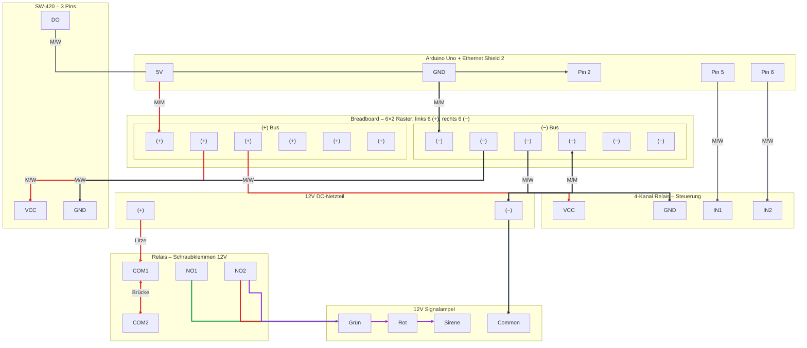

# Vibrationsüberwachung APS-Modellfabrik

Arduino, Ethernet Shield 2, Sensor und 12V-Signalampel zur Detektion von Vibrationen.

| Phase | Sensor | Stromversorgung |
|-------|--------|------------------|
| **Aktuell** | SW-420 | Eigenes 12V-Netzteil für Ampel |
| **Messe (geplant)** | MPU-6050 | 24V-Kaskade → LM2596S → 12V-Ampel, ordentliche Montage im Shopfloor-Layout |

**Voraussetzung:** [Arduino IDE Setup](../04-howto/setup/arduino-ide-setup.md) – zuerst Blink-Test durchführen.

---

## 1. Hardware & Verdrahtung (aktuell: SW-420)

**Komponenten:** Arduino Uno, Ethernet Shield 2, SW-420 (ohne Potentiometer), 4-Kanal-Relais, 12V-Ampel, externes 12V-Netzteil, Jumperkabel.

### Verdrahtungsdiagramm

Quelldatei: [arduino-vibrationssensor-verdrahtung.mermaid](arduino-vibrationssensor-verdrahtung.mermaid)

```mermaid
%%{init: {'flowchart': {'curve': 'stepBefore'}}}%%
flowchart TB
    subgraph ARDUINO["Arduino Uno + Ethernet Shield 2"]
        direction TB
        A_5V["5V"]
        A_GND["GND"]
        A_P2["Pin 2"]
        A_P5["Pin 5"]
        A_P6["Pin 6"]
    end

    subgraph BREADBOARD["Breadboard – 6×2 Raster: links 6 (+), rechts 6 (−)"]
        direction LR
        subgraph BB_PLUS["(+) Bus"]
            direction TB
            BB_P1["(+)"]; BB_P2["(+)"]; BB_P3["(+)"]; BB_P4["(+)"]; BB_P5["(+)"]; BB_P6["(+)"]
        end
        subgraph BB_MINUS["(−) Bus"]
            direction TB
            BB_M1["(−)"]; BB_M2["(−)"]; BB_M3["(−)"]; BB_M4["(−)"]; BB_M5["(−)"]; BB_M6["(−)"]
        end
    end

    subgraph SW420["SW-420 – 3 Pins"]
        direction LR
        S_VCC["VCC"]
        S_GND["GND"]
        S_DO["DO"]
    end

    subgraph RELAIS_IN["4-Kanal Relais – Steuerung"]
        direction TB
        R_VCC["VCC"]
        R_GND["GND"]
        R_IN1["IN1"]
        R_IN2["IN2"]
    end

    subgraph RELAIS_OUT["Relais – Schraubklemmen 12V"]
        direction LR
        R_COM1["COM1"]
        R_COM2["COM2"]
        R_NO1["NO1"]
        R_NO2["NO2"]
    end

    subgraph DC["12V DC-Netzteil"]
        direction TB
        DC_PLUS["(+)"]
        DC_MINUS["(−)"]
    end

    subgraph AMPEL["12V Signalampel"]
        direction TB
        AMP_SIRENE["Sirene"]
        AMP_ROT["Rot"]
        AMP_GRUEN["Grün"]
        AMP_COMMON["Common"]
    end

    A_5V -->|"M/M"| BB_P1
    A_GND -->|"M/M"| BB_M1
    BB_P2 -->|"M/W"| S_VCC
    BB_M2 -->|"M/W"| S_GND
    S_DO -->|"M/W"| A_P2
    BB_P3 -->|"M/W"| R_VCC
    BB_M3 -->|"M/W"| R_GND
    A_P5 -->|"M/W"| R_IN1
    A_P6 -->|"M/W"| R_IN2
    DC_PLUS -->|"Litze"| R_COM1
    R_COM1 <-->|"Brücke"| R_COM2
    DC_MINUS --> AMP_COMMON
    R_NO1 --> AMP_GRUEN
    R_NO2 --> AMP_ROT
    R_NO2 --> AMP_SIRENE
    BB_M4 <-->|"M/M"| DC_MINUS

    linkStyle 0 stroke:#dc2626,stroke-width:3px
    linkStyle 1 stroke:#1f2937,stroke-width:3px
    linkStyle 2 stroke:#dc2626,stroke-width:3px
    linkStyle 3 stroke:#1f2937,stroke-width:3px
    linkStyle 4 stroke:#4b5563,stroke-width:2px
    linkStyle 5 stroke:#dc2626,stroke-width:3px
    linkStyle 6 stroke:#1f2937,stroke-width:3px
    linkStyle 7 stroke:#4b5563,stroke-width:2px
    linkStyle 8 stroke:#4b5563,stroke-width:2px
    linkStyle 9 stroke:#dc2626,stroke-width:3px
    linkStyle 10 stroke:#dc2626,stroke-width:3px
    linkStyle 11 stroke:#1f2937,stroke-width:3px
    linkStyle 12 stroke:#16a34a,stroke-width:3px
    linkStyle 13 stroke:#dc2626,stroke-width:3px
    linkStyle 14 stroke:#9333ea,stroke-width:3px
    linkStyle 15 stroke:#1f2937,stroke-width:3px
```

### Sensor (SW-420)

| Anschluss   | Verbindung                   |
|-------------|------------------------------|
| VCC         | Breadboard (+)               |
| GND         | Breadboard (−)               |
| DO (Signal) | Pin 2 am Arduino             |

### Relais (erprobtes Setup)

Beide Relais High-Level (HIGH = AN): Pin 5 → Grün, Pin 6 → Rot+Sirene.

| Anschluss      | Verbindung                                   |
|----------------|-----------------------------------------------|
| VCC            | Breadboard (+)                               |
| GND            | Breadboard (−)                               |
| Relais 1 (Grün)| Pin **5** → Grün an NO (Ruhezustand)         |
| Relais 2 (Rot) | Pin **6** → Rot+Lila an NO (Alarm)           |

### Ampel (12V)

| Kabel  | Anschluss                               |
|--------|-----------------------------------------|
| Grau   | Common → DC-Adapter (−)                  |
| Grün   | Relais 1, NO                            |
| Rot+Lila | Relais 2, NO (gemeinsam)              |

**Common Ground:** Breadboard (−) mit DC-Adapter (−) verbinden.

---

## 2. Sketch & Verhalten

**Sketch:** `integrations/Arduino/Vibrationssensor_SW420/Vibrationssensor_SW420.ino`

- Ruhe: Grün an. Bei Vibration: Rot+Sirene für 2 s, dann zurück zu Grün.
- Serial Monitor (9600 Baud): `!!! VIBRATION ERKANNT !!!` bei Auslösung.

---

## 3. Netzwerk & osf-ui

**Arduino MQTT-Konfiguration (richtig einstellen, dann funktioniert alles):**

| Einstellung | Wert |
|-------------|------|
| `USE_MQTT` | 1 |
| `MQTT_BROKER` | 192.168.0.100 |
| `MQTT_USER` / `MQTT_PASS` | default / default ([credentials.md](../credentials.md)) |
| Arduino IP | 192.168.0.95 |

Sketch muss `mqttClient.connect(id, MQTT_USER, MQTT_PASS, willTopic, ...)` nutzen – Broker verlangt Authentifizierung.

| Topic | Inhalt |
|-------|--------|
| `osf/arduino/vibration/sw420-1/state` | `{"vibrationDetected":false\|true,"impulseCount":n}` (SW-420-Signal, UI mappt auf Ampel) |
| `osf/arduino/vibration/sw420-1/connection` | LWT, Online-Status |

**osf-ui:** Das Topic `osf/#` ist abonniert. Im Message Monitor Filter „OSF Topics“ wählen. Vibrations-Kachel im Sensor-Tab zeigt Ampel (Grün/Rot) und Impulse.

**Status:** Mock, Replay und Live getestet. Arduino publiziert `osf/*`-Topics, osf-ui stellt sie im Sensor-Tab dar.

### OSF-Topics testen (ohne Arduino/Broker)

Zum Testen der Message-Monitor-Erweiterung ohne laufenden Arduino oder MQTT-Broker:

**Option A – Replay-Preload (echter MQTT-Broker):**

1. MQTT-Broker starten (z. B. Mosquitto mit WebSocket-Port 9001).
2. **Session Manager** starten → Tab „Replay Station“ → MQTT-Broker verbinden.
3. „Preloads jetzt senden“ klicken. Die Dateien in `data/osf-data/test_topics/preloads/` werden an den Broker gesendet:
   - `osf_arduino_vibration_sw420-1_connection.json` – Online-Status
   - `osf_arduino_vibration_sw420-1_state.json` – Idle (vibrationDetected: false)
   - `osf_arduino_vibration_sw420-1_state_alarm.json` – Alarm (vibrationDetected: true)
   - Connection: `connectionState` (ONLINE/OFFLINE), Will-Message bei ungraceful disconnect
4. **osf-ui** im Replay-Modus starten und mit dem Broker verbinden.
5. Message Monitor öffnen → Filter „OSF Topics“ – Topics `osf/arduino/vibration/sw420-1/*` sollten erscheinen.

**Option B – Mock-Fixture (ohne Broker):**

1. **osf-ui** im Mock-Modus starten.
2. **Sensor-Tab** öffnen (lädt `sensor-startup` inkl. Vibrations-Fixture).
3. Message Monitor öffnen → Filter „OSF Topics“ – Topics `osf/arduino/vibration/sw420-1/*` sollten erscheinen.
4. **Vibrations-Kachel:** Buttons „Ruhe senden“ und „Alarm senden“ (nur Mock) injizieren Test-Nachrichten und aktualisieren die Ampel-Anzeige.

**Hinweis:** Fixture-Buttons und Vibrations-Steuerung erscheinen nur, wenn Environment = **Mock** gewählt ist.

---

## 4. Troubleshooting

**Alarm löst nicht aus:** Serial Monitor prüfen – erscheint „VIBRATION ERKANNT“? Wenn ja: Relais/12V prüfen. Wenn nein: `SENSOR_ACTIVE_HIGH` im Sketch umstellen (0/1), Verdrahtung DO → Pin 2 prüfen.

**Relais-LED leuchtet, Ampel bleibt aus:** 12V-Stromkreis prüfen – COM mit Plus, Ampel-Kabel in **NO** (nicht NC), Grau (Common) an Minus.

---

## 5. Messe-Setup (geplant): MPU-6050 + optimierte Stromversorgung

Erweiterung für Messe/LogiMAT: MPU-6050 statt SW-420, Ampel aus APS-24V, ordentliche Montage im Shopfloor-Layout.

### 5.1 Sensor: MPU-6050

- **Schnittstelle:** I2C (SDA, SCL – A4/A5 am Arduino Uno)
- **Verkabelung:** VCC, GND, SDA, SCL (4 Leitungen) → [Verdrahtungsdiagramm](arduino-vibrationssensor-mpu6050-verdrahtung.mermaid)
- **Vorteil:** Präzisere Erfassung, Frequenzanalyse, höhere Sensibilität

### 5.2 Stromversorgung

**Arduino:** 5V über USB (unverändert).

**Ampel (12V):** Abgriff aus der APS-24V-Kaskade.

| Stufe | Komponente | Anschluss |
|-------|------------|-----------|
| 1 | APS 24V-Kaskade | Abgriff nach Drilling Station (letzte Station) |
| 2 | Inline-Sicherung | Jeder neue Zweig abgesichert |
| 3 | LM2596S DC/DC | 24V → 12V |
| 4 | TB42-3T/W-J DC12V | Ampel (Grün, Gelb, Rot, Lila/Sirene, GND) |

**LM2596S Inbetriebnahme:** Ohne Last einschalten, Ausgang auf 12,0 V einstellen, Last anschließen, unter Belastung prüfen.

**Wichtige Hinweise:** 12V-Geräte nie direkt an 24V. Pins an Mini-Fit-Jr-Steckern vor Anschluss messen – keine Annahmen. Referenz: APS „Agile Production Simulation 24V“ (DE-02-2025, PDF).

**Benötigt:** Molex Stecker (Mini-Fit Jr, passend zur Ampel TB42-3T/W-J), Kabel, ggf. Kabelfüße.

**Test-Vorgehen:** Die .ino-Sketches können zunächst mit dem alten Stromversorgungsmuster (externes 12V-Netzteil, §1) getestet werden. 24V-Kaskade und LM2596S erst bei finaler Montage im Shopfloor-Layout.

### 5.3 Ampel-Anschluss (analog bestehendem Schema)

Ampel TB42-3T/W-J über Relais ansteuern. Verdrahtung analog §1. **Verdrahtungsdiagramm:** [arduino-vibrationssensor-mpu6050-verdrahtung.mermaid](arduino-vibrationssensor-mpu6050-verdrahtung.mermaid) (Relais Pin 5/6, NO-Anschlüsse). Alle vier Kanäle (Grün, Gelb, Rot, Lila/Sirene) nutzbar für 4-stufige Zustandslogik.

### 5.4 Software

- **Bibliotheken:** `Wire.h` (I2C) + MPU-6050-Library
- **Auswertung:** Gleitender Mittelwert oder FFT
- **Zustände:** Normal → Grün, Vibration → Gelb, stark → Rot, Alarm → Lila/Sirene
