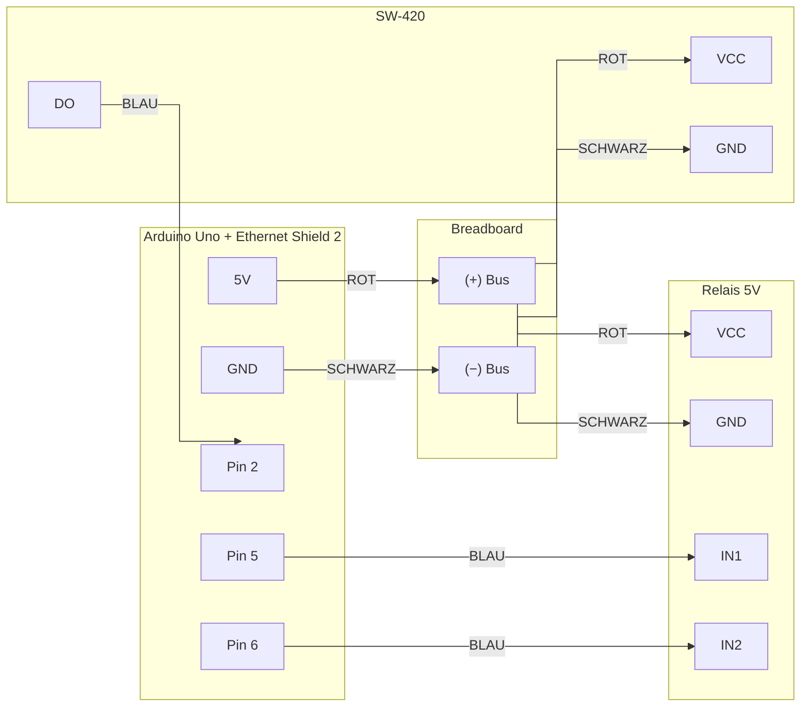
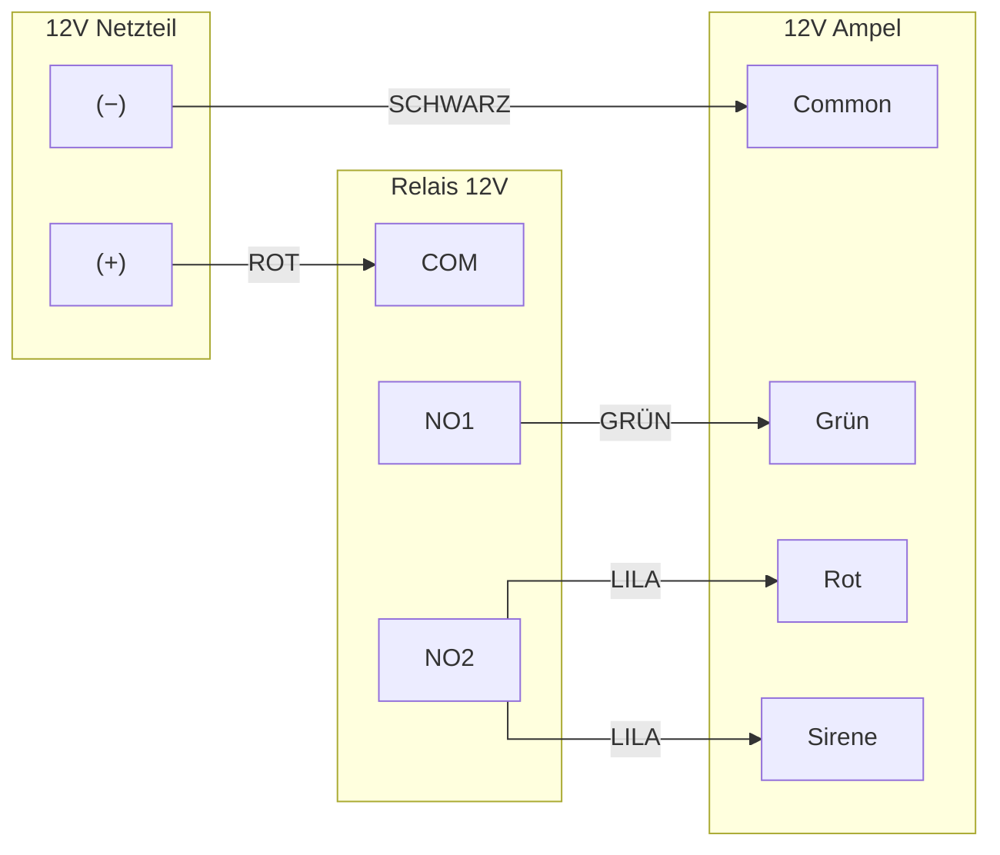

# Vibrationsüberwachung APS-Modellfabrik

Arduino, Ethernet Shield 2, Sensor und 12V-Signalampel zur Detektion von Vibrationen.

| Phase | Sensor | Stromversorgung |
|-------|--------|------------------|
| **Aktuell** | SW-420 | Eigenes 12V-Netzteil für Ampel |
| **Messe (geplant)** | MPU-6050 | 24V-Kaskade → LM2596S → 12V-Ampel, ordentliche Montage im Shopfloor-Layout |

**Voraussetzung:** [Arduino IDE Setup](../04-howto/setup/arduino-ide-setup.md) – zuerst Blink-Test durchführen.

---

## 1. Hardware & Verdrahtung (aktuell: SW-420)

**Komponenten:** Arduino Uno, Ethernet Shield 2, SW-420 (ohne Potentiometer), 4-Kanal-Relais, 12V-Ampel, externes 12V-Netzteil, Jumperkabel.

### Verdrahtungsdiagramm

Zwei Teildiagramme – Verbindungen laufen nicht durch andere Knoten. Quelldateien: [5V](arduino-vibrationssensor-verdrahtung-5v.mermaid) · [12V](arduino-vibrationssensor-verdrahtung-12v.mermaid) · **Farbig im Browser:** [arduino-vibrationssensor-verdrahtung.html](arduino-vibrationssensor-verdrahtung.html)

**5V & Signal (Arduino, Breadboard, Sensor, Relais-Steuerung):**

```mermaid
%%{init: {'flowchart': {'curve': 'stepBefore'}}}%%
flowchart LR
    subgraph ARDUINO["Arduino Uno + Ethernet Shield 2"]
        direction TB
        A_5V["5V"]
        A_GND["GND"]
        A_P2["Pin 2"]
        A_P5["Pin 5"]
        A_P6["Pin 6"]
    end

    subgraph BB["Breadboard"]
        direction TB
        BB_P["(+) Bus"]
        BB_M["(−) Bus"]
    end

    subgraph SENSOR["SW-420"]
        direction TB
        S_VCC["VCC"]
        S_GND["GND"]
        S_DO["DO"]
    end

    subgraph RELAIS["Relais 5V"]
        direction TB
        R_VCC["VCC"]
        R_GND["GND"]
        R_IN1["IN1"]
        R_IN2["IN2"]
    end

    A_5V -->|"ROT"| BB_P
    A_GND -->|"SCHWARZ"| BB_M
    BB_P -->|"ROT"| S_VCC
    BB_M -->|"SCHWARZ"| S_GND
    S_DO -->|"BLAU"| A_P2
    BB_P -->|"ROT"| R_VCC
    BB_M -->|"SCHWARZ"| R_GND
    A_P5 -->|"BLAU"| R_IN1
    A_P6 -->|"BLAU"| R_IN2
```

**12V & Ampel (Netzteil, Relais, Ampel):**

```mermaid
%%{init: {'flowchart': {'curve': 'stepBefore'}}}%%
flowchart LR
    subgraph DC["12V Netzteil"]
        direction TB
        DC_P["(+)"]
        DC_M["(−)"]
    end

    subgraph RELAIS["Relais 12V"]
        direction TB
        R_COM["COM"]
        R_NO1["NO1"]
        R_NO2["NO2"]
    end

    subgraph AMPEL["12V Ampel"]
        direction TB
        AMP_C["Common"]
        AMP_G["Grün"]
        AMP_R["Rot"]
        AMP_S["Sirene"]
    end

    DC_P -->|"ROT"| R_COM
    DC_M -->|"SCHWARZ"| AMP_C
    R_NO1 -->|"GRÜN"| AMP_G
    R_NO2 -->|"LILA"| AMP_R
    R_NO2 -->|"LILA"| AMP_S
```

**Common Ground:** Breadboard (−) mit DC-Adapter (−) verbinden (M/M-Kabel).

### Sensor (SW-420)

| Anschluss   | Verbindung                   |
|-------------|------------------------------|
| VCC         | Breadboard (+)               |
| GND         | Breadboard (−)               |
| DO (Signal) | Pin 2 am Arduino             |

### Relais (erprobtes Setup)

**Relais aktiv-niedrig:** LOW = Relais ein, HIGH = aus (gleiche Logik wie MPU-6050 §5). Ruhe = Grün an = Pin 5 LOW.

| Anschluss      | Verbindung                                   |
|----------------|-----------------------------------------------|
| VCC            | Breadboard (+)                               |
| GND            | Breadboard (−)                               |
| Relais 1 (Grün)| Pin **5** → **IN1** → NO1 → Grün (Ruhezustand) |
| Relais 2 (Rot) | Pin **6** → **IN2** → NO2 → Rot+Lila (Alarm)  |

**Schritt-für-Schritt Anschluss** (siehe §1.1).

### Ampel (12V)

| Kabel  | Anschluss                               |
|--------|-----------------------------------------|
| Grau   | Common → DC-Adapter (−)                  |
| Grün   | Relais 1, NO                            |
| Rot+Lila | Relais 2, NO (gemeinsam)              |

**Common Ground:** Breadboard (−) mit DC-Adapter (−) verbinden.

### 1.1 Schritt-für-Schritt: Kabel verbinden (SW-420)

*Gleiche Logik wie MPU-6050 §5.3.1 (Relais aktiv-niedrig, gleiches Modul). SW-420 nutzt 2 Kanäle (Grün, Rot+Sirene), kein Gelb.*

**Voraussetzung:** Arduino mit USB verbunden, SW-420 und Relais 5V-Seite bereits angeschlossen (VCC, GND, IN1–IN2 vom Breadboard). 12V-Netzteil **ausgeschaltet**.

---

#### A. Relais-Steuerung (5V, Arduino → Relais)

| Schritt | Von | Nach | Kabel |
|--------|-----|------|-------|
| A1 | Arduino **D5** | Relais **IN1** | Jumper (z.B. blau) |
| A2 | Arduino **D6** | Relais **IN2** | Jumper |

*Prüfung:* Beim Upload des Sketches sollte **Grün** in Ruhe leuchten (D5 LOW = IN1 ein).

---

#### B. 12V-Netzteil vorbereiten

| Schritt | Aktion |
|---------|--------|
| B1 | 12V-Adapter **nicht** einstecken |
| B2 | Netzteil-Ausgang prüfen: (+) und (−) identifizieren |

---

#### C. Common Ground (wichtig – vor dem 12V-Einschalten)

| Schritt | Von | Nach | Kabel |
|---------|-----|------|-------|
| C1 | Breadboard **(−) Bus** | 12V-Adapter **(−)** | M/M-Kabel (schwarz) |

---

#### D. 12V-plus an Relais

| Schritt | Von | Nach | Kabel |
|---------|-----|------|-------|
| D1 | 12V-Adapter **(+)** | Relais **COM1** | Litze/Adapterkabel |
| D2 | **COM1** | **COM2** | Brücke |

*Falls nur eine COM-Klemme:* Direkt verwenden.

---

#### E. Ampel-Kabel an Relais NO-Klemmen

Ampel: Grün, Rot, Lila (Sirene), Common (Grau). Rot und Sirene teilen sich NO2.

| Schritt | Von (Relais) | Nach (Ampel) | Kabel |
|---------|--------------|--------------|-------|
| E1 | **NO1** | Ampel **Grün** | Grünes Kabel |
| E2 | **NO2** | Ampel **Rot** | Rotes Kabel |
| E3 | **NO2** (gleiche Klemme wie E2) | Ampel **Lila/Sirene** | Lilafarbenes Kabel |

---

#### F. Ampel Common an 12V-Minus

| Schritt | Von | Nach | Kabel |
|---------|-----|------|-------|
| F1 | 12V-Adapter **(−)** | Ampel **Common** (Grau) | Kabel |

---

#### G. Abschluss und Test

| Schritt | Aktion |
|---------|--------|
| G1 | Alle Schraubklemmen auf festen Sitz prüfen |
| G2 | 12V-Netzteil einstecken und einschalten |
| G3 | Sketch starten – **Grün** sollte leuchten (Ruhezustand) |
| G4 | Auf Tisch klopfen / Stimmgabel → **Rot + Sirene** für 2 s, dann zurück zu Grün |

**Verdrahtungsdiagramm:** [arduino-vibrationssensor-verdrahtung.mermaid](arduino-vibrationssensor-verdrahtung.mermaid) (5V) · [12V](arduino-vibrationssensor-verdrahtung-12v.mermaid)

---

## 2. Sketch & Verhalten

**Sketch:** `integrations/Arduino/Vibrationssensor_SW420/Vibrationssensor_SW420.ino`

- Ruhe: Grün an. Bei Vibration: Rot+Sirene für 2 s, dann zurück zu Grün.
- Serial Monitor (9600 Baud): `!!! VIBRATION ERKANNT !!!` bei Auslösung.

---

## 3. Netzwerk & osf-ui

**Arduino MQTT-Konfiguration (richtig einstellen, dann funktioniert alles):**

| Einstellung | Wert |
|-------------|------|
| `USE_MQTT` | 1 |
| `MQTT_BROKER` | 192.168.0.100 |
| `MQTT_USER` / `MQTT_PASS` | default / default ([credentials.md](../credentials.md)) |
| Arduino IP | 192.168.0.95 |

Sketch muss `mqttClient.connect(id, MQTT_USER, MQTT_PASS, willTopic, ...)` nutzen – Broker verlangt Authentifizierung.

| Topic | Inhalt |
|-------|--------|
| `osf/arduino/vibration/sw420-1/state` | `{"vibrationDetected":false\|true,"impulseCount":n}` (SW-420-Signal, UI mappt auf Ampel) |
| `osf/arduino/vibration/sw420-1/connection` | LWT, Online-Status |

**osf-ui:** Das Topic `osf/#` ist abonniert. Im Message Monitor Filter „OSF Topics“ wählen. Vibrations-Kachel im Sensor-Tab zeigt Ampel (Grün/Rot) und Impulse.

**Status (5. März 2026):** Mock, Replay und Live getestet. Arduino publiziert `osf/*`-Topics, osf-ui stellt sie im Sensor-Tab dar.

### OSF-Topics testen (ohne Arduino/Broker)

Zum Testen der Message-Monitor-Erweiterung ohne laufenden Arduino oder MQTT-Broker:

**Option A – Replay-Preload (echter MQTT-Broker):**

1. MQTT-Broker starten (z. B. Mosquitto mit WebSocket-Port 9001).
2. **Session Manager** starten → Tab „Replay Station“ → MQTT-Broker verbinden.
3. „Preloads jetzt senden“ klicken. Die Dateien in `data/osf-data/test_topics/preloads/` werden an den Broker gesendet:
   - `osf_arduino_vibration_sw420-1_connection.json` – Online-Status
   - `osf_arduino_vibration_sw420-1_state.json` – Idle (vibrationDetected: false)
   - `osf_arduino_vibration_sw420-1_state_alarm.json` – Alarm (vibrationDetected: true)
   - Connection: `connectionState` (ONLINE/OFFLINE), Will-Message bei ungraceful disconnect
4. **osf-ui** im Replay-Modus starten und mit dem Broker verbinden.
5. Message Monitor öffnen → Filter „OSF Topics“ – Topics `osf/arduino/vibration/sw420-1/*` sollten erscheinen.

**Option B – Mock-Fixture (ohne Broker):**

1. **osf-ui** im Mock-Modus starten.
2. **Sensor-Tab** öffnen (lädt `sensor-startup` inkl. Vibrations-Fixture).
3. Message Monitor öffnen → Filter „OSF Topics“ – Topics `osf/arduino/vibration/sw420-1/*` sollten erscheinen.
4. **Vibrations-Kachel:** Buttons „Ruhe senden“ und „Alarm senden“ (nur Mock) injizieren Test-Nachrichten und aktualisieren die Ampel-Anzeige.

**Hinweis:** Fixture-Buttons und Vibrations-Steuerung erscheinen nur, wenn Environment = **Mock** gewählt ist.

---

## 4. Troubleshooting

**Alarm löst nicht aus:** Serial Monitor prüfen – erscheint „VIBRATION ERKANNT“? Wenn ja: Relais/12V prüfen. Wenn nein: `SENSOR_ACTIVE_HIGH` im Sketch umstellen (0/1), Verdrahtung DO → Pin 2 prüfen.

**Relais-LED leuchtet, Ampel bleibt aus:** 12V-Stromkreis prüfen – COM mit Plus, Ampel-Kabel in **NO** (nicht NC), Grau (Common) an Minus.

**Ampel schaltet invertiert (Ruhe = Rot, Alarm = Grün):** Relais-Modul prüfen – manche Module haben Jumper für High-/Low-Trigger. Beide Sketches (SW-420, MPU-6050) nutzen aktiv-niedrig (LOW = ein). Bei High-Trigger-Modul: Logik im Sketch invertieren.

**Ethernet IP 0.0.0.0 (MPU-6050):** W5500 antwortet nicht über SPI. Prüfen: Shield fest aufgesteckt, LAN-Kabel, externes 5V (USB reicht evtl. nicht), SD-Karte aus dem Shield entfernen. Alternative: `USE_OFFICIAL_ETH 1` im Sketch, „Ethernet“ (Arduino, 2.x) über Library Manager installieren.

### 4.1 Live MQTT schlägt fehl (Ethernet Shield verdächtig)

**Hintergrund:** Live funktionierte am 5. März 2026. Danach qualmte das Ethernet Shield bei einem Test. Seither MQTT-Verbindung (state -2) trotz funktionierendem Broker.

**Durchgeführte Tests (ohne Erfolg):**

| Test | Ergebnis |
|------|----------|
| Sketch-Vergleich funktionierender Stand (5. März 2026) vs. aktuell | MQTT/Ethernet-Code identisch, nur Relais-Logik geändert |
| RPi: `ss -tn` auf Port 1883 (20 s während Arduino-Reset) | Keine SYN-Pakete vom Arduino sichtbar |
| Mac-Broker statt RPi (192.168.0.105) | `tcpdump` zeigt SYN vom Arduino; Mac antwortet mit RST (Mosquitto-Config: `listener 1883 0.0.0.0` nötig) |
| Mosquitto auf Mac (local-simple, 0.0.0.0) | `mosquitto_pub` von Mac → OK; `lsof` zeigte ESTABLISHED von 192.168.0.95; Serial Monitor weiter „MQTT fehlgeschlagen" |
| Power-Cycle, sauberer Reconnect | Kein Durchbruch |

**Fazit:** Warten auf Ersatz-Ethernet Shield 2. Alternativ: Arduino R4 mit WiFi statt Ethernet Shield.

---

## 5. MPU-6050-Setup (Entwicklung → Messe)

**Vorgehen:** Zunächst MPU-6050 mit 12V-Stromversorgung wie SW-420 (§1) entwickeln und testen. Danach Erweiterung auf 24V-Kaskade für Messe/LogiMAT.

### Verdrahtungsdiagramm MPU-6050

Quelldatei: [arduino-vibrationssensor-mpu6050-verdrahtung.mermaid](arduino-vibrationssensor-mpu6050-verdrahtung.mermaid) · **Farbig im Browser:** [arduino-vibrationssensor-mpu6050-verdrahtung.html](arduino-vibrationssensor-mpu6050-verdrahtung.html)

Siehe [arduino-vibrationssensor-mpu6050-verdrahtung.mermaid](arduino-vibrationssensor-mpu6050-verdrahtung.mermaid) – D7=IN1 (Grün), D8=IN2 (Gelb), D9=IN3 (Rot+Sirene).

### 5.1 Sensor: MPU-6050

- **Schnittstelle:** I2C (SDA, SCL – A4/A5 am Arduino Uno)
- **Verkabelung:** VCC, GND, SDA, SCL (4 Leitungen) – siehe Verdrahtungsdiagramm oben
- **Vorteil:** Präzisere Erfassung, Frequenzanalyse, höhere Sensibilität

### 5.2 Stromversorgung

**Arduino:** 5V über USB (unverändert).

**Ampel (12V):** Abgriff aus der APS-24V-Kaskade.

| Stufe | Komponente | Anschluss |
|-------|------------|-----------|
| 1 | APS 24V-Kaskade | Abgriff nach Drilling Station (letzte Station) |
| 2 | Inline-Sicherung | Jeder neue Zweig abgesichert |
| 3 | LM2596S DC/DC | 24V → 12V |
| 4 | TB42-3T/W-J DC12V | Ampel (Grün, Gelb, Rot, Lila/Sirene, GND) |

**LM2596S Inbetriebnahme:** Ohne Last einschalten, Ausgang auf 12,0 V einstellen, Last anschließen, unter Belastung prüfen.

**Wichtige Hinweise:** 12V-Geräte nie direkt an 24V. Pins an Mini-Fit-Jr-Steckern vor Anschluss messen – keine Annahmen. Referenz: APS „Agile Production Simulation 24V“ (DE-02-2025, PDF).

**Benötigt:** Molex Stecker (Mini-Fit Jr, passend zur Ampel TB42-3T/W-J), Kabel, ggf. Kabelfüße.

**Test-Vorgehen:** Die .ino-Sketches können zunächst mit dem alten Stromversorgungsmuster (externes 12V-Netzteil, §1) getestet werden. 24V-Kaskade und LM2596S erst bei finaler Montage im Shopfloor-Layout.

### 5.3 Ampel-Anschluss (3 Stufen: Grün, Gelb, Rot+Sirene)

Ampel TB42-3T/W-J über 3 Relais-Kanäle: IN1=Grün, IN2=Gelb, IN3=Rot+Sirene. Arduino Pins: D7→IN1, D8→IN2, D9→IN3.

**Relais aktiv-niedrig:** Wie SW-420 (§1, §1.1) – LOW = Relais ein, HIGH = aus (gleiches Modul). Ruhe = Grün ein = D7 LOW.

**Schritt-für-Schritt Anschluss** (siehe §5.3.1 – Struktur analog §1.1).

### 5.3.1 Schritt-für-Schritt: Kabel verbinden

**Voraussetzung:** Arduino mit USB verbunden, MPU-6050 und Relais 5V-Seite bereits angeschlossen (VCC, GND, IN1–IN3 vom Breadboard). 12V-Netzteil **ausgeschaltet**.

---

#### A. Relais-Steuerung (5V, Arduino → Relais-„Steckerleiste“)

| Schritt | Von | Nach | Kabel |
|--------|-----|------|-------|
| A1 | Arduino **D7** | Relais **IN1** | Jumper (z.B. blau) |
| A2 | Arduino **D8** | Relais **IN2** | Jumper |
| A3 | Arduino **D9** | Relais **IN3** | Jumper |

*Prüfung:* Beim Upload des Sketches sollten die Relais beim Start kurz klicken.

---

#### B. 12V-Netzteil vorbereiten

| Schritt | Aktion |
|---------|--------|
| B1 | 12V-Adapter **nicht** einstecken |
| B2 | Netzteil-Ausgang prüfen: (+) und (−) identifizieren (meist rot/schwarz oder beschriftet) |

---

#### C. Common Ground (wichtig – vor dem 12V-Einschalten)

| Schritt | Von | Nach | Kabel |
|---------|-----|------|-------|
| C1 | Breadboard **(−) Bus** | 12V-Adapter **(−)** | M/M-Kabel (schwarz) |

*Wichtig:* Ohne diese Verbindung liegen Arduino und 12V-Kreis nicht auf gleichem Potential – kann zu Störungen oder Schäden führen.

---

#### D. 12V-plus an Relais

| Schritt | Von | Nach | Kabel |
|---------|-----|------|-------|
| D1 | 12V-Adapter **(+)** | Relais **COM1** | Litze/Adapterkabel |
| D2 | **COM1** | **COM2** | Brücke (Kurzschluss) |
| D3 | **COM2** | **COM3** | Brücke (für Kanal 3) |

*Falls nur eine COM-Klemme:* Direkt verwenden. *Falls 4 getrennte COMs:* COM1, COM2, COM3 miteinander verbinden.

---

#### E. Ampel-Kabel an Relais NO-Klemmen

Ampel hat typisch: Grün, Gelb, Rot, Lila (Sirene), Common (Grau). Common bleibt für Schritt F.

| Schritt | Von (Relais) | Nach (Ampel) | Kabel |
|---------|--------------|--------------|-------|
| E1 | **NO1** | Ampel **Grün** | Grünes Kabel |
| E2 | **NO2** | Ampel **Gelb** | Gelbes Kabel |
| E3 | **NO3** | Ampel **Rot** | Rotes Kabel |
| E4 | **NO3** (gleiche Klemme wie E3) | Ampel **Lila/Sirene** | Lilafarbenes Kabel |

*Hinweis:* Rot und Sirene teilen sich NO3 – beide Kabel in dieselbe Schraubklemme NO3 stecken (oder verlöten/verzweigen).

---

#### F. Ampel Common an 12V-Minus

| Schritt | Von | Nach | Kabel |
|---------|-----|------|-------|
| F1 | 12V-Adapter **(−)** | Ampel **Common** (Grau) | Kabel |

Oder: 12V (−) → Breadboard (−) (bereits in C1), Breadboard (−) mit Ampel Common verbinden.

---

#### G. Abschluss und Test

| Schritt | Aktion |
|---------|--------|
| G1 | Alle Schraubklemmen auf festen Sitz prüfen |
| G2 | 12V-Netzteil einstecken und einschalten |
| G3 | Sketch starten – **Grün** sollte leuchten (Ruhezustand) |
| G4 | Leicht auf Tisch klopfen → **Gelb** |
| G5 | Stärker klopfen / Sensor antippen → **Rot + Sirene** |

**Verdrahtungsdiagramm:** [arduino-vibrationssensor-mpu6050-verdrahtung.mermaid](arduino-vibrationssensor-mpu6050-verdrahtung.mermaid)

### 5.4 Software & MQTT

- **Bibliotheken:** `Wire.h` (I2C), MPU-6050 (ElectronicCats), Ethernet2, NTPClient (Library Manager)
- **Zustände:** Grün (Ruhe), Gelb (leicht), Rot+Sirene (stark)
- **Topics:** `osf/arduino/vibration/mpu6050-1/state`, `.../connection` ([DR-18](../03-decision-records/18-osf-extensions-ip-and-mqtt-topics.md))

**state-Payload (MPU-6050):**

| Feld | Typ | Beschreibung |
|------|-----|--------------|
| `vibrationLevel` | `"green"` \| `"yellow"` \| `"red"` | Ampel-Zustand |
| `vibrationDetected` | boolean | true bei gelb oder rot |
| `impulseCount` | number | Kumulierte Vibrationen |
| `magnitude` | number | Beschleunigungs-Magnitude (~16k Ruhe) |
| `timestamp` | string | ISO 8601 (analog Fischertechnik/DSP). Bei USE_MQTT 1 + NTP-Sync: echte Zeit; sonst `""` |

**NTP:** Bei `USE_MQTT 1` wird NTPClient genutzt (pool.ntp.org, UTC). Bibliothek: **NTPClient** (Library Manager → „NTPClient“ by arduino-libraries, nicht NTPClient_Generic). Ohne Sync bleibt `timestamp` leer.

**Publish-Frequenz:** Bei Zustandsänderung sofort; bei Grün stabil alle 15 s (Heartbeat).

**OSF-UI:** Sensor-Tab zeigt MPU-6050 oder SW-420 (MPU bevorzugt). 3-Stufen-Ampel (Grün/Gelb/Rot).

---

## 6. Sensor-Erweiterungen (Roadmap)

**Voraussetzung:** MPU-6050 + Ampel laufen mit 12V und publizieren per MQTT.  
**Ziel:** Zusätzliche Umwelt-/Kontextsensorik für Mehrwert-Demos, verteilt auf R3 (Ethernet) und R4 (Wi-Fi).

### 6.1 Topic-Schema (unverändert)

Wir behalten das bestehende Pattern ([DR-18](../03-decision-records/18-osf-extensions-ip-and-mqtt-topics.md)):

| Topic | Zweck |
|-------|-------|
| `osf/arduino/<sensorTyp>/<deviceId>/state` | Messwerte, Zustand |
| `osf/arduino/<sensorTyp>/<deviceId>/connection` | LWT, Health, Online-Status |
| `osf/arduino/derived/<signal>/state` | Abgeleitete Zustände (Korrelation, optional) |

**Beispiele:** `osf/arduino/temperature/dht11-1/state`, `osf/arduino/motion/pir-1/state`, `osf/arduino/vibration/mpu6050-1/state`.

### 6.2 Rollenmodell (R3 vs. R4)

| Node | Anbindung | Rolle |
|------|-----------|-------|
| **R3 + Ethernet Shield** | Kabel, stabil | Dauerhaft laufende Sensorik, deterministisch |
| **R4 WiFi** | WLAN, flexibel | Experimentelle/Showcase-Sensoren, ggf. mobil |

**R3:** DHT11, DS18B20, LDR, MQ-2, PIR, HC-SR04, DS3231 (optional).  
**R4:** SW-420 (anderer Messpunkt; Bestand: 1× MPU-6050, 1× SW-420), Flammensensor (für Alert-Auslösung), Sound-Sensor.

Bestand: [inventory-electronics.md](inventory-electronics.md).

### 6.3 Architekturprinzipien

1. **One responsibility per node** – R3: Backbone, R4: Aux/Showcase
2. **Non-blocking loop** – Sensor-Reads entkoppelt (Poll-Schedule), Publish nicht blockierend
3. **Rate limiting** – IMU: Feature-Extraktion on-device (RMS/Peak), keine Rohdaten-Flut; DHT11: wenige Werte/Minute
4. **Device identity** – eindeutige `deviceId` je Node, `sensorId` je Kanal

### 6.4 Ausbau-Phasen

| Phase | Ziel |
|-------|------|
| **A** | R3 + R4 als MQTT-Publisher standardisieren (gleiches Message-Envelope, Health, unique clientId) |
| **B** | Umwelt-Daten (DHT11, LDR, PIR) publizieren, in osf-ui visualisieren |
| **C** | Korrelations-Demo (z. B. Vibration + PIR → „Operator activity“) – `osf/arduino/derived/*` |
| **D** | Optional: R4 mobil, 433 MHz, erweiterte Ampel-Patterns – Backlog |

### 6.5 Definition of Done (Erweiterung)

- [ ] R3 + R4 publizieren parallel stabil über MQTT
- [ ] Sensorwerte normalisiert (Einheiten, Timestamp)
- [ ] Health/Connection-Topic pro Node
- [ ] Mindestens 1 UI-Verbraucher nutzt neue Topics
- [ ] Doku: inventory, Verdrahtung, Topic-Liste aktualisiert
