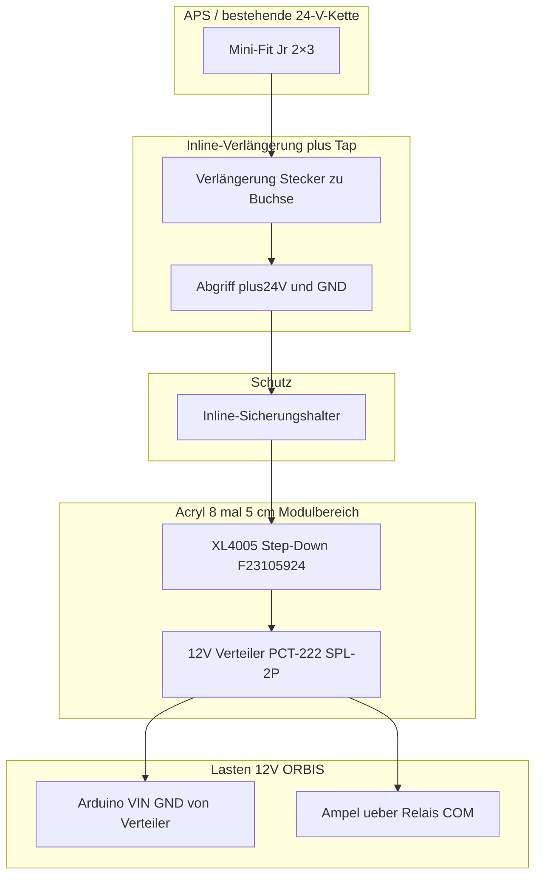

# 24V-Sensorstation — Stromversorgung (ohne Löten) · Funduino/Molex

**Kontext:** Arduino **Uno R4 WiFi** auf Acryl-Grundplatte **25×15 cm**; vor dem Arduino bleibt ein Freiraum ca. **8×5 cm** für Stromführung (kein Löten, Schraub-/Hebelklemmen/Crimp).

**Ziel:** Gleiche Sensorstation **auf der Fabrik** an **24 V APS** und **zu Hause** an **12 V Netzadapter** betreiben — **ohne** zwei 12 V-Quellen parallelzuschalten. Fabrik: **Molex** → Sicherung → **DC/DC 24→12 V** → gemeinsame **12 V-Schiene** (Ampel/Relais-Last **und** Arduino **VIN/GND**). Zu Hause: Arduino mit **USB‑C** (Strom + Flashen), Ampel-Pfad mit **12 V-Steckernetzteil** über vorhandenen **Barrel** auf dieselbe **12 V-Verteilung** (nur **eine** 12 V-Quelle aktiv). Details: **Abschnitt 2**.

**Nicht Gegenstand dieses Dokuments:** MQTT, Sensor-Pinbelegung, Relais-Logik — siehe [arduino-r4-multisensor.md](arduino-r4-multisensor.md).

---

## 1. Prinzipschaltung (Variante A, empfohlen)

| Block | Funktion |
|--------|----------|
| Mini-Fit Jr | Steckbarer Abgriff aus der 24-V-Kaskade (kein Eingriff in fest verkabelte APS-Leitung, rückbaubar) |
| **Tap** +24 V / GND | Abgriff **nur** auf die für eure Anwendung definierten Adern (Pinout prüfen, messen) |
| **Inline-Sicherung** | Im **+24 V**-Zweig **direkt nach dem Tap** — schützt Abzweig und Platinenbereich |
| **XL4005** (F23105924) | DC/DC 24 V → **12,0 V** einstellen (Schraubklemmen), **vor** dem ersten Einschalten **Ausgang messen** |
| **12 V-Verteilung** | z. B. SPL-2P / PCT-222 (siehe [inventory-electronics.md](inventory-electronics.md)) — **eine** Bus-Schiene für Fabrik-DC/DC **oder** Tisch-Netzteil (siehe §2) |
| **VIN / GND** | Arduino **direkt** an 12 V‑Bus (**VIN** = +12 V, **GND** = Masse) — **oder** optional Hohlstecker/Buchse; elektrisch gleichwertig |
| Barrel 5,5×2,1 (Bestand) | **Alternative** **12 V-Einspeisung** der **Ampel-/Relais‑Schiene** (Tischbetrieb): Steckernetzteil in Buchse → auf Verteiler. **Nicht** DC/DC-Ausgang und Netzteil **gleichzeitig** ohne Umschalter |
| Ampel 12 V | Wie in bestehender Doku über Relais/NO-COM — **12 V+** und **Common** |

**Wichtig:** Step-Down-Einstellung **ohne Last** auf **12,0 V** prüfen; Common Ground zwischen **12 V-GND**, Arduino-GND und Breadboard-GND wie in der Arduino-Doku beibehalten.

---

## 2. Betriebsmodi: DAHEIM und ORBIS

### 2.1 Übersicht

| Modus | Arduino-Versorgung | 12 V Ampel / Relais-COM (Lastpfad) | USB‑C | 24 V / APS |
|--------|-------------------|--------------------------------------|--------|------------|
| **DAHEIM** (`WIFI_MODE_DAHEIM` im Sketch) | **USB‑C** (Strom + Upload vom PC) | **Eigenes 12 V‑Steckernetzteil** → vorhandener **Barrel** / DC‑Pfad auf **12 V‑Verteiler** | angesteckt | **nicht** verbunden |
| **ORBIS** (Fabrik) | **12 V** von **DC/DC** auf **VIN + GND** | dieselbe **12 V‑Schiene** (Abgriff Verteiler → Relais‑COM‑Kette) | nur zum **Flashen/Debug** ans Laptop — **24 V müssen nicht getrennt werden** | **Molex‑Tap** → Sicherung → XL4005 |

### 2.2 DAHEIM — USB + 12 V Ampel

- **Arduino Uno R4:** Strom und Sketch-Upload über **USB‑C** vom PC / USB‑Netzteil mit Daten.
- **Ampel/Relais-Last:** **12 V** über **Mean‑Well o. ä.** (oder vorhandenes Steckernetzteil) in die **12 V‑Verteilung** (z. B. über **Barrel‑Buchse/Adapter** wie im [Inventar](inventory-electronics.md) — **Pfad** wie bisher an **COM‑Kette**).
- **Relais-Module (Spulen):** weiter **5 V** / GND vom **Breadboard** (Arduino **5V**‑Pin → Breadboard **+**, **GND** → **−**), siehe [arduino-r4-multisensor.md](arduino-r4-multisensor.md).
- **Pflicht:** **GND** des **12 V‑Netzteils** mit **Arduino‑GND** verbinden (**Common Ground**), sonst schaltet die Relais-Logik nicht zuverlässig.
- **VIN:** In diesem Modus typischerweise **frei** (nur USB speist den R4) — vermeidet „USB + VIN“-Diskussion für Tischtests.

### 2.3 ORBIS — 24 V / eine 12 V‑Schiene

- **24 V** (Molex) → Sicherung → **XL4005** → **12 V‑Verteiler**.
- Von dort: **ein** Strang zu **Arduino VIN + GND**, **ein** Strang zur **Relais‑COM‑/Ampel‑12 V‑Logik** (wie §3 in der Multisensor‑Doku).
- **USB‑C** zum Laptop: **Upload/Debug während 24 V/12 V anliegen** ist beim **Original Arduino Uno R4 WiFi** üblich — **kein** separates Abschalten der **24 V** nur wegen USB nötig. Bei **Drittanbieter‑Boards** Herstellerhinweise prüfen.

### 2.4 Zwei 12 V-Quellen — was verboten ist

**Niemals** den **Ausgang** des **DC/DC (12 V)** und ein **parallel** angeschlossenes **12 V‑Steckernetzteil** auf **dieselbe** Verteiler-Schiene legen (Rückspeisung, Beschädigung).

**Erlaubt:**

- Entweder **nur** Fabrikpfad **oder** nur Tisch‑Netzteil (manuelle Disziplin: unterwegs kein zweites Netzteil einstecken),  
- oder **Umschalter** („Fabrik 12 V“ / „Tisch 12 V“) auf **eine** Busleitung,  
- oder **Diode‑OR** (Planung nach Strom/Datenblatt, Spannungsabfall).

### 2.5 USB + VIN beim R4 (nur zur Einordnung)

- **DAHEIM** i. d. R. nur **USB** fürs Board → eindeutig.
- **ORBIS:** **VIN** von 12 V‑Schiene **und** USB am Laptop = **normales** Entwickeln; das ist **kein** Ersatz für die Regel in §2.4 (zwei **12 V‑Erzeuger** parallel).

---

## 3. Verdrahtungsschema (Option: Inline-Verlängerung + Abzweig)

Das folgende Diagramm beschreibt die **logische** Stromführung (Polarität/Bezeichnung vor Inbetriebnahme mit eurem echten **Pinout** abgleichen).

**DAHEIM:** Zweig **APS / DC/DC** weglassen; **12 V‑Verteiler** stattdessen vom **Steckernetzteil** (z. B. Barrel); Arduino nur **USB**, Verteiler **GND** trotzdem mit **Arduino‑GND**.

**GND:** Alle GND der 12 V-Seite (Verteiler, Ampel-Common, Arduino GND, Breadboard **−**) **zusammenführen** (siehe [arduino-r4-multisensor.md](arduino-r4-multisensor.md) § Common Ground).

---

## 4. Funduino-BOM (direkt bestellbar — Zusammenfassung Chat/BOM-Diskussion 03/2026)

**Bereits im Projektbestand (nicht nachbestellen für diesen Pfad):** DC-Steckadapter/Cables 5,5×2,1 mm — F23106646, F23106616, F23107593, F23106148; Hebelklemmen F23109036. Siehe [inventory-electronics.md §6](inventory-electronics.md).

| Priorität | Funduino-Artikel | Bezeichnung (kurz) | Menge | Hinweis |
|:---:|---|---:|---|
| **1** | **F23105924** | Konstantstrom/spannung Step-Down **XL4005** 5 A, 4,5–30 V Eingang, Ausgang einstellbar (Schraubklemmen); ca. **61,5×27,2×22 mm**, **M3-Montage** | 1 | Auf **12,0 V** trimmen nach Datenblatt/Anleitung |
| 2 | *(Sortiment)* | **M3** Abstandshalter / Schrauben / Muttern (z. B. Nylon-Set 180-teilig) | 1 | Montage XL4005 + Zugentlastung |
| 3 | *(optional)* | Schrumpfschlauch-Set | 1 | Tap/Abzweig isolieren, Zugentlastung |
| 4 | F23109087 | Glassicherungen 5×20 mm Sortiment | 1 | **Nur** wenn Halter für **5×20** verwendet wird |

**Inline-Sicherungshalter:** Häufig **nicht** als passender KFZ-Inline-Artikel bei Funduino gelistet — **Fremdposten** (z. B. KFZ-Flachsicherungs-Inline-Halter 12/24 V, ggf. kompakte 30 A-Belastbarkeit am Halter). Die **eingesteckte Sicherung** bestimmt den Schutz; **25 A/30 A** am Halter sind zulässige Leitungs-/Halter-Belastbarkeit, **nicht** der empfohlene Schutz für die Sig-Station.

**Sicherungswert (empfohlen):** Start **2 A** träge (Ampel + Sirene kurzzeitig); bei stabilem Betrieb ggf. **1 A** testen. Handelsübliche Sets nur **3–30 A** sind für diesen Zweck typisch **zu groß** — kleine Ampere-Werte separat besorgen.

*Projektstand:* **2 A Inline-Sicherung** ist bereits besorgt (außerhalb Funduino-BOM).

---

## 5. Molex Mini-Fit Jr (Crimp, nicht Funduino — Referenz)

Für steckbaren **2×3**-Pfad (Housing + Kontakte), passend zu **LIYY 4×0,75 mm²** und Crimp **24–18 AWG**:

| Teil | Molex / Hinweis | Rolle |
|------|-----------------|--------|
| Gehäuse Buchse | 39-01-2060 — Receptacle 2×3 | z. B. Kabelende A |
| Gehäuse Stecker | 39-01-2061 — Plug 2×3 | z. B. Kabelende B |
| Kontakt Buchse | 39-00-0060 — Female, 24–18 AWG | laut Bestand/Reichelt vorhanden |
| Kontakt Stecker | 39-00-0040 — Male, 24–18 AWG | für die Gegenseite nachbestellen |

**Option „Inline-Verlängerung + Tap“:** Im Verlängerungsstück zwei Adern für +24 V/GND zu Step-Down/Sicherung abzweigen; übrige Pole **1:1 durchschleifen**. Crimpqualität ist kritisch (Übergangswiderstand, Erwärmung).

---

## 6. Pin-Mapping Vorlage (2×3, vor Inbetriebnahme ausfüllen)

| Pinposition (2×3) | Funktion (Beispiel — **ersetzen**) | Farbe / Ader |
|---------------------|--------------------------------------|----------------|
| | | |
| | | |

*Befüllen, wenn das **konkrete** APS-/Verdrahtungs-Pinout der bestehenden Leitung dokumentiert oder gemessen ist.*

---

## 7. Variante B (nur zur Einordnung — meist schlechterer „Value“)

- Zusätzlich **24 V→5 V** mit USB (z. B. F23108225 / F23108224) für Arduino **und** separat noch 12 V für die Ampel ⇒ **zwei** Wandlerstufen. Für „eine Versorgungsidee + Barrel“ ist **Variante A** (ein XL4005, 12 V für Ampel + VIN) vorzuziehen.

---

## 8. Checkliste Inbetriebnahme

**ORBIS**

1. Mini-Fit-Tap **nur** auf verifizierten +24 V/GND-Adern.
2. Sicherung **nah am Tap** im **+24 V**-Pfad.
3. XL4005 **ohne** teure Last einstellen, **12 V** messen, dann Last schalten.
4. **Common Ground** 12 V / Arduino / Breadboard wie Arduino-Doku.
5. Ampel/Relais wie [arduino-r4-multisensor.md §3](arduino-r4-multisensor.md).
6. USB‑C für Upload: **24 V** normal **nicht** abklemmen (Original R4); kein zweites 12 V‑Netzteil parallel zum DC/DC.

**DAHEIM**

1. **Kein** Molex/24 V an Station, wenn mit Tisch‑12 V gearbeitet wird.
2. **Nur eine** Quelle auf 12 V‑Bus (Netzteil **oder** — nach Rückbau — DC/DC).
3. **GND** Netzteil ↔ Arduino; USB am R4 für Strom/Flash.
4. Breadboard **5 V** vom Arduino **5V**‑Pin.

---

## 9. Referenzen

- [arduino-r4-multisensor.md](arduino-r4-multisensor.md) — 5 V-Sensoren, Relais, Ampel, MQTT  
- [inventory-electronics.md](inventory-electronics.md) — DC-Adapter, Klemmen  
- [arduino-r4-multisensor-verdrahtung.mermaid](arduino-r4-multisensor-verdrahtung.mermaid) — Signal-/Relais-Diagramm (bestehend)
</think>

<｜tool▁calls▁begin｜><｜tool▁call▁begin｜>
StrReplace