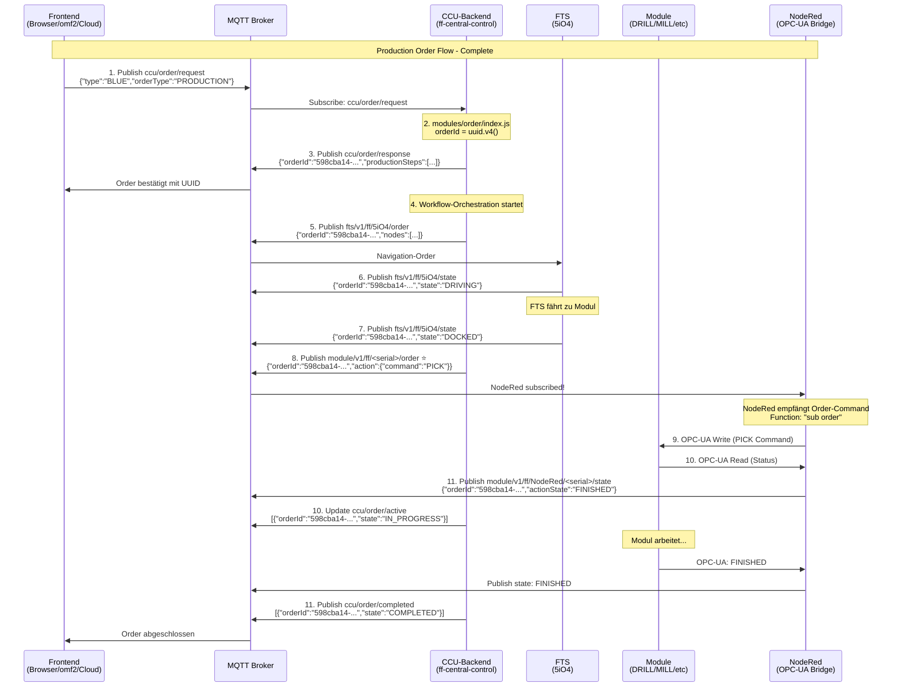

# 🎯 CCU-Backend MQTT-Orchestration - Complete Analysis

**Source:** Fischertechnik CCU-Backend (compiled JavaScript)  
**Location:** `integrations/APS-CCU/ff-central-control-unit/central-control/src/`  
**Date:** 2025-10-08

## 📡 CCU-Backend Published Topics

### 1. **Order-Management Topics**

| Topic | File | Function | Zweck |
|-------|------|----------|-------|
| `ccu/order/response` | `modules/order/index.js` (Zeile 80) | `sendResponse()` | Bestätigt Order mit UUID |
| `ccu/order/active` | `modules/order/management/order-management.js` | `publishActiveOrders()` | Aktive Orders (QoS 2, retain) |
| `ccu/order/completed` | `modules/order/management/order-management.js` | `publishCompletedOrders()` | Abgeschlossene Orders (QoS 2, retain) |

### 2. **FTS-Topics**

| Topic | File | Function | Zweck |
|-------|------|----------|-------|
| `fts/v1/ff/<serial>/order` | `modules/fts/navigation/navigation.js` (Zeile 238) | `sendNavigationRequest()` | Navigation-Order an FTS (QoS 2) |
| `fts/v1/ff/<serial>/order` | `modules/fts/charge.js` | `sendChargeRequest()` | Charge-Order an FTS |

### 3. **Module-Topics**

| Topic | File | Function | Zweck |
|-------|------|----------|-------|
| `module/v1/ff/<serial>/instantAction` | `modules/production/production.js` | `sendCancelStorageOrder()` | InstantAction an Module |
| `module/v1/ff/<serial>/instantAction` | `modules/pairing/index.js` | `setStatusLED()` | Status-LED setzen (QoS 2) |

### 4. **State/Config Topics**

| Topic | File | Function | Zweck |
|-------|------|----------|-------|
| `ccu/pairing/state` | `modules/pairing/index.js` | `publishPairingState()` | Gepaarte Module (retain) |
| `ccu/state/stock` | `modules/production/cloud-stock.js` | `publishStock()` | HBW Stock-Status (retain) |
| `ccu/state/flows` | `modules/order/flow/order-flow-service.js` | `publishFlows()` | Production-Workflows (QoS 1, retain) |

## 🔄 Complete Order-Flow (CCU-Backend)

### Phase 1: Order-Request empfangen

**Datei:** `modules/order/index.js`

```javascript
// Zeile 83: Subscribe Topic
exports.TOPICS = [CcuTopic.ORDER_REQUEST];  // "ccu/order/request"

// Zeile 127-158: Handler
const handleMessage = async (message) => {
    // 1. UUID generieren
    const orderId = uuid.v4();
    
    // 2. Request parsen
    const orderRequest = JSON.parse(message);
    
    // 3. Production Definition laden
    const isProductionOrder = orderRequest.orderType === 'PRODUCTION';
    let productionDef;
    
    if (isProductionOrder) {
        // PRODUCTION Order
        productionDef = OrderFlowService.getProductionDefinition(orderRequest.type);
        // Werkstück reservieren
        StockManagementService.reserveWorkpiece(orderId, orderRequest.type);
    } else {
        // STORAGE Order
        productionDef = OrderFlowService.getStorageProductionDefinition();
        // HBW Bay reservieren
        validateStorageOrderRequestAndReserveBay(productionDef, orderId, orderRequest);
    }
    
    // 4. Response senden
    await sendResponse(orderRequest, orderId, productionDef);
    
    // 5. Stock veröffentlichen
    await publishStock();
};
```

### Phase 2: Order-Response senden

**Datei:** `modules/order/index.js`

```javascript
// Zeile 62-81: sendResponse()
const sendResponse = async (orderRequest, orderId, productionDefinition) => {
    // 1. Production Steps generieren
    const productionSteps = generateOrderStepList(productionDefinition);
    
    // 2. Response-Objekt erstellen
    const response = {
        orderType: orderRequest.orderType,
        type: orderRequest.type,
        timestamp: orderRequest.timestamp,
        orderId,  // ← UUID hier!
        productionSteps: productionSteps,
        receivedAt: new Date(),
        state: OrderState.ENQUEUED,
        workpieceId: orderRequest.workpieceId,
        simulationId: orderRequest.simulationId,
    };
    
    // 3. Order cachen
    await OrderManagement.getInstance().cacheOrder(response);
    
    // 4. MQTT publish
    const mqtt = getMqttClient();
    return mqtt.publish(CcuTopic.ORDER_RESPONSE, JSON.stringify(response));
};
```

### Phase 3: FTS-Navigation-Order senden

**Datei:** `modules/fts/navigation/navigation.js`

```javascript
// Zeile 205-250: sendNavigationRequest()
const sendNavigationRequest = async (
    navigationStep, 
    orderId, 
    orderUpdatedId, 
    workpiece, 
    workpieceId, 
    fts, 
    targetSerial
) => {
    const serialNumber = fts.serialNumber;  // z.B. "5iO4"
    const startPosition = fts.lastModuleSerialNumber;
    const targetPosition = targetSerial;
    
    // 1. FTS-Order erstellen
    const newOrder = NavigatorService.getFTSOrder(
        startPosition, 
        targetPosition, 
        orderId,  // ← UUID hier!
        orderUpdatedId, 
        serialNumber, 
        navigationStep.id
    );
    
    // 2. Docking-Metadata hinzufügen
    addDockingMetadataToOrder(newOrder, ftsPairingStates, serialNumber, dockingMetadata);
    
    // 3. FTS auf BUSY setzen
    await ftsPairingStates.updateAvailability(serialNumber, AvailableState.BUSY, orderId, ...);
    
    // 4. Target-Modul für Order reservieren
    await pairingStates.updateAvailability(targetPosition, AvailableState.READY, orderId);
    
    // 5. MQTT publish an FTS
    await mqtt.publish(
        getFtsTopic(serialNumber, FtsTopic.ORDER),  // "fts/v1/ff/5iO4/order"
        JSON.stringify(newOrder),
        { qos: 2 }
    );
};
```

### Phase 4: Module-InstantActions senden

**Datei:** `modules/production/production.js`

```javascript
// sendCancelStorageOrder()
const sendCancelStorageOrder = async (serialNumber) => {
    const instantAction = {
        serialNumber,
        timestamp: new Date(),
        actions: [{
            actionId: randomUUID(),
            actionType: 'cancelStorageOrder',
            metadata: {}
        }]
    };
    
    return mqtt.publish(
        getModuleTopic(serialNumber, ModuleTopic.INSTANT_ACTION),  // "module/v1/ff/<serial>/instantAction"
        JSON.stringify(instantAction)
    );
};
```

**Datei:** `modules/pairing/index.js`

```javascript
// setStatusLED()
const topic = getModuleTopic(serialNumber, ModuleTopic.INSTANT_ACTION);
await mqtt.publish(topic, JSON.stringify(ledInstantAction), { qos: 2 });
```

## 🎯 CCU-Backend als Orchestrator

### ✅ **JA - CCU-Backend sendet an ALLE:**

1. **FTS:**
   - `fts/v1/ff/<serial>/order` (Navigation & Charging)

2. **Module:**
   - `module/v1/ff/<serial>/instantAction` (Commands wie cancelStorageOrder, setStatusLED)

3. **Broadcast (CCU Topics):**
   - `ccu/order/response` (Order-Bestätigung)
   - `ccu/order/active` (Aktive Orders)
   - `ccu/order/completed` (Abgeschlossene Orders)
   - `ccu/pairing/state` (Gepaarte Module)
   - `ccu/state/stock` (HBW Stock)
   - `ccu/state/flows` (Production-Workflows)

## 📊 Complete Order-Flow-Diagramm



**Text-Version:**
```
1. Frontend → ccu/order/request → {"type":"BLUE","orderType":"PRODUCTION"}
2. CCU-Backend empfängt (modules/order/index.js)
3. CCU-Backend generiert UUID (uuid.v4())
4. CCU-Backend published → ccu/order/response → {"orderId":"<uuid>", "productionSteps":[...]}
5. CCU-Backend startet Workflow-Orchestration
6. CCU-Backend published → fts/v1/ff/5iO4/order → Navigation-Order
7. FTS fährt zu Target-Modul
8. CCU-Backend published → module/v1/ff/<serial>/order ⭐ → Production Command
9. NodeRed subscribed → empfängt Order (Function: "sub order")
10. NodeRed → OPC-UA Write → SPS-Modul (Command)
11. SPS-Modul arbeitet, NodeRed pollt via OPC-UA Read
12. NodeRed published → module/v1/ff/NodeRed/<serial>/state (enriched)
13. CCU-Backend updated → ccu/order/active
14. Bei Completion → ccu/order/completed

⭐ KORRIGIERT: CCU published module/.../order, NodeRed subscribed + übersetzt zu OPC-UA
```

## 🔑 Wichtige Erkenntnisse

### 1. **CCU-Backend = Zentraler Orchestrator**
- ✅ Empfängt Order-Requests
- ✅ Generiert UUIDs
- ✅ Verwaltet Order-Queue
- ✅ Sendet an FTS
- ✅ Sendet InstantActions an Module
- ✅ Published State-Updates

### 2. **NodeRed = OPC-UA Bridge (bidirektional)** ⭐ KORRIGIERT
- ✅ **Subscribed zu:** `module/v1/ff/<serial>/order` (Production Commands)
- ✅ **Übersetzt MQTT → OPC-UA:** Commands an ALLE Module (HBW, MILL, DRILL, DPS, AIQS)
- ✅ **Übersetzt OPC-UA → MQTT:** State-Updates mit orderId-Enrichment
- ❌ **NICHT:** Order-Management, UUID-Generierung

### 3. **Alle Production-Module empfangen via NodeRed:** ⭐ KORRIGIERT
- ✅ **Alle Commands:** CCU → MQTT (`module/.../order`) → NodeRed → OPC-UA → SPS
- ✅ **Gilt für:** HBW, MILL, DRILL, DPS, AIQS (ALLE!)
- ✅ **NodeRed ist ZWINGEND** für SPS-Ansteuerung
- ✅ **TXT-Controller:** NUR für Sensoren/Kamera (NICHT Production Commands)

### 4. **FTS bekommt ALLE Navigation-Orders:**
- CCU-Backend orchestriert FTS-Routen
- Sendet `fts/v1/ff/<serial>/order` für jeden Navigation-Step
- FTS führt aus und reported via `fts/v1/ff/<serial>/state`

---

**Status:** Vollständige CCU-Backend Orchestration dokumentiert 🚀
