# 🏭 APS Komponenten-Übersicht - Complete

**Alle Komponenten der Fischertechnik APS-Modellfabrik**  
**Datum:** 2025-10-08  
**Status:** Single Source of Truth

---

## 🗺️ Komponenten-Architektur

```mermaid
graph TB
    subgraph "Control Layer - Raspberry Pi Docker"
        CCU["CCU-Backend<br/>ff-central-control<br/>Order-Management<br/>UUID-Generator"]
        NODERED["NodeRed<br/>OPC-UA ↔ MQTT<br/>State-Enrichment"]
        MQTT["MQTT Broker<br/>Mosquitto<br/>172.18.0.4:1883"]
        DASH["Dashboard<br/>Angular PWA<br/>User Interface"]
    end
    
    subgraph "TXT-Controller Layer - MQTT-fähig"
        TXT_FTS["TXT-FTS<br/>5iO4<br/>AGV Navigation<br/>192.168.0.104"]
        TXT_DPS["TXT-DPS<br/>SVR4H73275<br/>Roboter-Arm<br/>192.168.0.102"]
        TXT_AIQS["TXT-AIQS<br/>SVR4H76530<br/>AI Camera<br/>192.168.0.103"]
    end
    
    subgraph "Production Layer - OPC-UA Module"
        HBW["HBW<br/>SVR3QA0022<br/>Hochregal-Lager<br/>192.168.0.80"]
        DRILL["DRILL<br/>SVR4H76449<br/>Bohrstation<br/>192.168.0.50"]
        MILL["MILL<br/>SVR3QA2098<br/>Frässtation<br/>192.168.0.40"]
        DPS_SPS["DPS SPS<br/>SVR4H73275<br/>SPS-Steuerung<br/>192.168.0.90"]
        AIQS_SPS["AIQS SPS<br/>SVR4H76530<br/>SPS-Steuerung<br/>192.168.0.70"]
    end
    
    CCU <-->|MQTT| MQTT
    NODERED <-->|MQTT| MQTT
    DASH <-->|MQTT| MQTT
    TXT_FTS <-->|MQTT| MQTT
    TXT_DPS <-->|MQTT| MQTT
    TXT_AIQS <-->|MQTT| MQTT
    
    NODERED <-->|OPC-UA| HBW
    NODERED <-->|OPC-UA| DRILL
    NODERED <-->|OPC-UA| MILL
    NODERED <-->|OPC-UA| DPS_SPS
    NODERED <-->|OPC-UA| AIQS_SPS
    
    classDef control fill:#e3f2fd,stroke:#1976d2,stroke-width:3px
    classDef txt fill:#fff8e1,stroke:#f57c00,stroke-width:2px
    classDef sps fill:#f5f5f5,stroke:#757575,stroke-width:2px
    
    class CCU,NODERED,MQTT,DASH control
    class TXT_FTS,TXT_DPS,TXT_AIQS txt
    class HBW,DRILL,MILL,DPS_SPS,AIQS_SPS sps
```



---

## 📋 Komponenten-Liste (Komplett)

### 1. CCU-Backend (ff-central-control)

**Rolle:** Zentraler Orchestrator & Order-Manager

| Eigenschaft | Wert |
|-------------|------|
| **Location** | Raspberry Pi Docker |
| **IP** | 172.18.0.4 (Docker) |
| **Sprache** | JavaScript (TypeScript kompiliert) |
| **Source** | `integrations/APS-CCU/ff-central-control-unit/` |
| **Hauptfunktion** | Order-Management, UUID-Generation, FTS-Orchestration |

**Subscribes:**
- `ccu/order/request`

**Publishes:**
- `ccu/order/response`, `ccu/order/active`, `ccu/order/completed`
- `fts/v1/ff/<serial>/order`
- `module/v1/ff/<serial>/instantAction`
- `ccu/pairing/state`, `ccu/state/stock`, `ccu/state/flows`

**Code-Referenz:**
- Order-Management: `modules/order/index.js`
- FTS-Navigation: `modules/fts/navigation/navigation.js`
- UUID-Generation: Zeile 128 in `modules/order/index.js`

---

### 2. NodeRed

**Rolle:** OPC-UA ↔ MQTT Bridge & State-Enrichment

| Eigenschaft | Wert |
|-------------|------|
| **Location** | Raspberry Pi Docker |
| **IP** | 172.18.0.4 (Docker) |
| **Port** | 1880 (Admin API) |
| **Instances** | 2 (SUB + PUB) |
| **Hauptfunktion** | OPC-UA zu MQTT Übersetzung für MILL/DRILL/HBW |

**Client-IDs:**
- `nodered_abe9e421b6fe3efd` (SUB - Monitoring)
- `nodered_94dca81c69366ec4` (PUB - Publishing)

**Flows:**
- Source: `integrations/APS-NodeRED/backups/*/flows.json`
- Module-Flows: MILL, DRILL, HBW, AIQS, DPS (je 5 Tabs)

**NICHT beteiligt an:**
- ❌ Order-Management
- ❌ UUID-Generation
- ❌ FTS-Steuerung

---

### 3. MQTT Broker (Mosquitto)

**Rolle:** Zentrale Message-Routing-Infrastruktur

| Eigenschaft | Wert |
|-------------|------|
| **Location** | Raspberry Pi Docker |
| **IP** | 172.18.0.4:1883 |
| **Config** | `integrations/mosquitto/config/mosquitto.conf` |
| **Security** | Keine (unencrypted) |

---

### 4. Dashboard Frontend

**Rolle:** User Interface

| Eigenschaft | Wert |
|-------------|------|
| **Location** | Raspberry Pi Docker |
| **IP** | 172.18.0.5:80 (Docker) |
| **External** | 192.168.0.100:80 |
| **Framework** | Angular PWA |
| **Client-ID** | `mqttjs_bba12050` |
| **Source** | `integrations/APS-CCU/ff-central-control-unit/aps-dashboard-source/` |

---

### 5. TXT-FTS (Fahrerloses Transportsystem)

**Rolle:** AGV-Navigation nach VDA 5050

| Eigenschaft | Wert |
|-------------|------|
| **Serial** | 5iO4 |
| **Hardware** | TXT 4.0 Controller |
| **IP** | 192.168.0.104 (DHCP) |
| **Client-ID** | `auto-F6DFC829` |
| **MQTT** | ✅ Ja |
| **OPC-UA** | ❌ Nein |
| **Will Topic** | `fts/v1/ff/5iO4/connection` |

**Topics:**
- Empfängt: `fts/v1/ff/5iO4/order` (von CCU-Backend)
- Sendet: `fts/v1/ff/5iO4/state`, `fts/v1/ff/5iO4/connection`, `fts/v1/ff/5iO4/factsheet`

**Source:**
- `integrations/TXT-FTS/fts_main.py`

---

### 6. TXT-DPS (Delivery & Pickup Station)

**Rolle:** Warenein-/ausgang mit Roboter-Arm

| Eigenschaft | Wert |
|-------------|------|
| **Serial** | SVR4H73275 |
| **Hardware** | TXT 4.0 + Siemens S7-1200 |
| **IP (TXT)** | 192.168.0.102 (DHCP) |
| **IP (SPS)** | 192.168.0.90:4840 (OPC-UA) |
| **Client-ID** | `auto-AC941349` |
| **MQTT** | ✅ Ja (TXT) |
| **OPC-UA** | ✅ Ja (SPS) |
| **Will Topic** | `module/v1/ff/NodeRed/SVR4H73275/connection` |

**Topics (TXT direkt):**
- Sendet: `module/v1/ff/SVR4H73275/state`, `/j1/txt/1/i/cam` (Kamera), `/j1/txt/1/f/i/stock`

**Topics (via NodeRed):**
- Enriched: `module/v1/ff/NodeRed/SVR4H73275/state` (mit orderId)

**Source:**
- TXT: `integrations/TXT-DPS/FF_DPS_24V.py`
- NodeRed: Flow-Tab "DPS"

---

### 7. TXT-AIQS (AI Quality System)

**Rolle:** Qualitätskontrolle mit AI-Bilderkennung

| Eigenschaft | Wert |
|-------------|------|
| **Serial** | SVR4H76530 |
| **Hardware** | TXT 4.0 + Siemens S7-1200 |
| **IP (TXT)** | 192.168.0.103 (DHCP) |
| **IP (SPS)** | 192.168.0.70:4840 (OPC-UA) |
| **Client-ID** | `auto-B9109AD9` |
| **MQTT** | ✅ Ja (TXT) |
| **OPC-UA** | ✅ Ja (SPS) |
| **Will Topic** | `module/v1/ff/NodeRed/SVR4H76530/connection` |

**Topics (TXT direkt):**
- Sendet: `module/v1/ff/SVR4H76530/state`, `/j1/txt/1/i/bme680` (Umwelt-Sensor)

**Topics (via NodeRed):**
- Enriched: `module/v1/ff/NodeRed/SVR4H76530/state` (mit orderId)

**Source:**
- TXT: `integrations/TXT-AIQS/FF_AI_24V.py`
- NodeRed: Flow-Tab "AIQS #1-5"

---

### 8. HBW (High Bay Warehouse)

**Rolle:** Hochregal-Lager für Werkstücke

| Eigenschaft | Wert |
|-------------|------|
| **Serial** | SVR3QA0022 |
| **Hardware** | Siemens S7-1200 SPS |
| **IP** | 192.168.0.80:4840 (OPC-UA) |
| **MQTT** | ❌ Nein |
| **OPC-UA** | ✅ Ja |
| **Version** | 1.3.0 |
| **Firmware** | MOD-FF22+HBW+24V |

**Topics (via NodeRed):**
- `module/v1/ff/SVR3QA0022/order`
- `module/v1/ff/SVR3QA0022/state`
- `module/v1/ff/SVR3QA0022/connection`
- `module/v1/ff/SVR3QA0022/factsheet`

**NodeRed:** Flow-Tab "HBW #1-3"

---

### 9. DRILL (Bohrstation)

**Rolle:** Bohren von Werkstücken

| Eigenschaft | Wert |
|-------------|------|
| **Serial** | SVR4H76449 |
| **Hardware** | Siemens S7-1200 SPS |
| **IP** | 192.168.0.50:4840 (OPC-UA) |
| **MQTT** | ❌ Nein |
| **OPC-UA** | ✅ Ja |
| **Version** | 1.3.0 |
| **Production Duration** | 5 Sekunden |

**Topics (via NodeRed):**
- `module/v1/ff/SVR4H76449/order`
- `module/v1/ff/SVR4H76449/state`
- `module/v1/ff/SVR4H76449/connection`
- `module/v1/ff/SVR4H76449/factsheet`

**NodeRed:** Flow-Tab "DRILL #1-5"

---

### 10. MILL (Frässtation)

**Rolle:** Fräsen von Werkstücken

| Eigenschaft | Wert |
|-------------|------|
| **Serial** | SVR3QA2098 |
| **Hardware** | Siemens S7-1200 SPS |
| **IP** | 192.168.0.40:4840 (OPC-UA) |
| **MQTT** | ❌ Nein |
| **OPC-UA** | ✅ Ja |
| **Version** | 1.3.0 |
| **Production Duration** | 5 Sekunden |

**Topics (via NodeRed):**
- `module/v1/ff/SVR3QA2098/order`
- `module/v1/ff/SVR3QA2098/state`
- `module/v1/ff/SVR3QA2098/connection`
- `module/v1/ff/SVR3QA2098/factsheet`

**NodeRed:** Flow-Tab "MILL #1-5"

---

## 📊 Komponenten-Matrix

| Komponente | Location | Protokoll | Rolle | Subscribes | Publishes |
|------------|----------|-----------|-------|------------|-----------|
| **CCU-Backend** | Docker | MQTT | Orchestrator | `ccu/order/request` | 8 Topic-Typen |
| **NodeRed** | Docker | MQTT + OPC-UA | Bridge | Module-Topics | Module-States (enriched) |
| **MQTT Broker** | Docker | MQTT | Router | - | - |
| **Dashboard** | Docker | MQTT | UI | Status-Topics | `ccu/order/request` |
| **TXT-FTS** | Hardware | MQTT | AGV | `fts/.../order` | `fts/.../state` |
| **TXT-DPS** | Hardware | MQTT | Roboter | - | `/j1/txt/.../cam` |
| **TXT-AIQS** | Hardware | MQTT | AI-QS | - | `/j1/txt/.../bme680` |
| **HBW** | Hardware | OPC-UA | Lager | (via NodeRed) | (via NodeRed) |
| **DRILL** | Hardware | OPC-UA | Bohren | (via NodeRed) | (via NodeRed) |
| **MILL** | Hardware | OPC-UA | Fräsen | (via NodeRed) | (via NodeRed) |

---

## 🎯 Komponenten nach Funktion

### Order-Management:
- **CCU-Backend** - UUID-Generation, Workflow-Orchestration

### Transport:
- **TXT-FTS** - VDA 5050 AGV-Navigation

### Warehousing:
- **HBW** - Hochregal-Lager (Ein-/Auslagerung)
- **TXT-DPS** - Warenein-/ausgang (Roboter-Arm)

### Production:
- **DRILL** - Bohrstation (5s)
- **MILL** - Frässtation (5s)

### Quality Control:
- **TXT-AIQS** - AI-Bilderkennung, Umwelt-Sensoren

### Communication:
- **MQTT Broker** - Message-Routing
- **NodeRed** - OPC-UA Bridge

### User Interface:
- **Dashboard** - Angular PWA

---

## 🔌 Protokoll-Übersicht

### MQTT-Clients (8 Komponenten):
1. CCU-Backend (Order-Management)
2. NodeRed SUB (Monitoring)
3. NodeRed PUB (Publishing)
4. Dashboard (UI)
5. TXT-FTS (AGV)
6. TXT-DPS (Roboter)
7. TXT-AIQS (AI-QS)

### OPC-UA Servers (5 SPS-Module):
1. HBW (SVR3QA0022)
2. DRILL (SVR4H76449)
3. MILL (SVR3QA2098)
4. DPS SPS (SVR4H73275)
5. AIQS SPS (SVR4H76530)

### OPC-UA Clients (1 Komponente):
1. NodeRed (zu allen 5 SPS-Modulen)

---

## 📡 Kommunikations-Patterns

### Pattern 1: Frontend → CCU-Backend
```
Dashboard → ccu/order/request → MQTT → CCU-Backend
CCU-Backend → ccu/order/response → MQTT → Dashboard
```

### Pattern 2: CCU-Backend → FTS
```
CCU-Backend → fts/v1/ff/5iO4/order → MQTT → TXT-FTS
TXT-FTS → fts/v1/ff/5iO4/state → MQTT → CCU-Backend
```

### Pattern 3: CCU-Backend → Module (via NodeRed)
```
CCU-Backend → module/v1/ff/<serial>/instantAction → MQTT → NodeRed
NodeRed → OPC-UA Command → SPS-Modul
SPS-Modul → OPC-UA Status → NodeRed
NodeRed → module/v1/ff/<serial>/state → MQTT → CCU-Backend
```

### Pattern 4: TXT direkt → Dashboard
```
TXT-DPS → /j1/txt/1/i/cam → MQTT → Dashboard (Kamera-Stream)
TXT-AIQS → /j1/txt/1/i/bme680 → MQTT → Dashboard (Sensoren)
```

---

## 🔍 Quick-Lookup

### "Wer generiert UUIDs?"
→ **CCU-Backend** (`modules/order/index.js`)

### "Wer steuert das FTS?"
→ **CCU-Backend** (`modules/fts/navigation/navigation.js`)

### "Wer übersetzt OPC-UA zu MQTT?"
→ **NodeRed** (für MILL, DRILL, HBW)

### "Welches Modul hat Serial SVR4H73275?"
→ **DPS** (Delivery & Pickup Station)

### "Hat FTS einen OPC-UA Server?"
→ **Nein**, nur TXT-Controller mit MQTT

### "Warum gibt es zwei State-Topics für DPS?"
→ TXT sendet RAW, NodeRed sendet ENRICHED (mit orderId)

---

## 🔗 Siehe auch

- [Module Serial Mapping](module-serial-mapping.md) - Serial-Numbers & IPs
- [Hardware Architecture](hardware-architecture.md) - Netzwerk-Details
- [CCU-Backend Orchestration](ccu-backend-orchestration.md) - Order-Flow
- [MQTT Topic Conventions](mqtt-topic-conventions.md) - Topic-Patterns

---

**Status:** Vollständige Komponenten-Übersicht ✅

